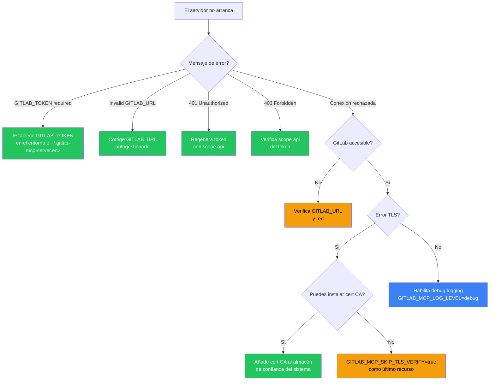

import { Tabs, TabItem, Steps } from "@astrojs/starlight/components";
import FAQ from "../../../../components/FAQ.astro";
import stats from "../../../../data/stats.json";

## Conexión y autenticación


```mermaid
flowchart TD
    A[El servidor no arranca] --> B{Mensaje de error?}
    B -->|GITLAB_TOKEN required| C[Establece GITLAB_TOKEN<br/>en el entorno o ~/.gitlab-mcp-server.env]
    B -->|Invalid GITLAB_URL| D[Corrige GITLAB_URL<br/>autogestionado]
    B -->|401 Unauthorized| E[Regenera token<br/>con scope api]
    B -->|403 Forbidden| F[Verifica scope api<br/>del token]
    B -->|Conexión rechazada| G{GitLab accesible?}
    G -->|No| H[Verifica GITLAB_URL<br/>y red]
    G -->|Sí| I{Error TLS?}
    I -->|Sí| J{Puedes instalar cert CA?}
    J -->|Sí| J1[Añade cert CA al almacén<br/>de confianza del sistema]
    J -->|No| J2[GITLAB_MCP_SKIP_TLS_VERIFY=true<br/>como último recurso]
    I -->|No| K[Habilita debug logging<br/>GITLAB_MCP_LOG_LEVEL=debug]

    style C fill:#22c55e,color:#fff
    style D fill:#22c55e,color:#fff
    style E fill:#22c55e,color:#fff
    style F fill:#22c55e,color:#fff
    style H fill:#f59e0b,color:#000
    style J1 fill:#22c55e,color:#fff
    style J2 fill:#f59e0b,color:#000
    style K fill:#3b82f6,color:#fff
```

| Síntoma                                                                                                                                                                                                                        | Causa                                                                                                                                                                                                                                                                                                           | Solución                                                                                                                                                                                                                                                                                    |
| ------------------------------------------------------------------------------------------------------------------------------------------------------------------------------------------------------------------------------ | --------------------------------------------------------------------------------------------------------------------------------------------------------------------------------------------------------------------------------------------------------------------------------------------------------------- | ------------------------------------------------------------------------------------------------------------------------------------------------------------------------------------------------------------------------------------------------------------------------------------------- |
| `GITLAB_TOKEN is required` al inicio                                                                                                                                                                                           | Token no establecido                                                                                                                                                                                                                                                                                            | Establece `GITLAB_TOKEN` en el entorno o en `~/.gitlab-mcp-server.env`; un `.env` en el directorio de trabajo no se lee, y si existe se nombra a nivel `WARN` al arrancar                                                                                                                   |
| `GITLAB_URL is not a valid URL` al inicio                                                                                                                                                                                      | La URL tiene sintaxis inválida                                                                                                                                                                                                                                                                                  | Corrige `GITLAB_URL` u omítela para usar `https://gitlab.com` en modo stdio                                                                                                                                                                                                                 |
| stdio sale con 1: `a flag withholding part of what this server serves was passed to a stdio server`                                                                                                                            | Los `args` del cliente llevan `--read-only`, `--safe-mode` o `--exclude-tools`, que solo lee el modo HTTP                                                                                                                                                                                                       | Pasa el ajuste al bloque `env` del cliente con la variable que nombra el campo `set_instead` (`GITLAB_MCP_READ_ONLY=true` y similares) y quita el flag; el flag se rechaza aunque esa variable ya esté definida                                                                             |
| stdio sale con 1: `--gitlab-url names no instance this stdio server connects to`                                                                                                                                               | Los `args` del cliente llevan `--gitlab-url`, que solo lee el modo HTTP, y `GITLAB_URL` nombra otra instancia o ninguna, que significa `https://gitlab.com`                                                                                                                                                     | Fija `GITLAB_URL` a la instancia en el bloque `env` del cliente y quita el flag, para que el token vaya adonde dice la configuración                                                                                                                                                        |
| stdio: toda petición `tools/list`, `tools/call`, de recursos y de prompts falla con JSON-RPC `-40300`, `GitLab accepted the token this server was started with, which carries neither the read_api nor the api scope`          | El token de `GITLAB_TOKEN` es auténtico y está por debajo del mínimo: solo lleva `read_user`, o solo scopes ajenos a la API como `read_repository` o `self_rotate`. El servidor sigue respondiendo al handshake y registra el veredicto una vez, en ERROR, con los scopes del token cuando GitLab los describió | Crea un token con `read_api`, o con `api` para escribir también, y reinicia el servidor con él: los scopes de un token no se pueden cambiar después de crearlo. `GITLAB_MCP_IGNORE_SCOPES` no levanta el mínimo                                                                             |
| HTTP, modo legacy: `403 Forbidden`, JSON-RPC `-40300`, `GitLab accepted this token, which carries neither the read_api nor the api scope`                                                                                      | El mismo token enviado a un servidor HTTP en modo legacy; con `--auth-mode=oauth` se rechaza con `403` y un desafío `insufficient_scope`                                                                                                                                                                        | Envía un token con `read_api` o `api`. El rechazo no se carga al presupuesto de fallos de la dirección y se recuerda durante cinco minutos, así que reintentar con el mismo token no cambia nada                                                                                            |
| stdio o HTTP sale con 1: `... is no longer read (removed in 3.1.0) ... will not be started under a capability it did not ask for`                                                                                              | El entorno, o un fichero dotenv que carga el servidor, aún define `GITLAB_READ_ONLY`, `GITLAB_SAFE_MODE` o `EXCLUDE_TOOLS`, grafías que la 3.1.0 dejó de leer, así que ignorar una serviría lo que retiraba                                                                                                     | Renómbrala a la variable que nombra la línea (`GITLAB_MCP_EXCLUDE_TOOLS` y similares). Si un `EXCLUDE_TOOLS` sin prefijo pertenece a otra herramienta, quítalo del entorno en que arranca este servidor (`env -u EXCLUDE_TOOLS`): vacío sigue definido y se sigue rechazando                |
| `401 Unauthorized` de la API de GitLab                                                                                                                                                                                         | PAT inválido o expirado, o un permiso denegado que GitLab responde con 401                                                                                                                                                                                                                                      | Si otras llamadas con el mismo token funcionan, revisa el rol que la acción necesita (aprobar tu propia merge request, fusionar sin acceso de push); si no, genera un nuevo token con scope `api` en tu avatar > **Edit profile** > **Access** > **Personal access tokens** de la instancia |
| Las llamadas a herramientas fallan después de conectar, con `authentication failed: GitLab rejected the token (GITLAB_TOKEN) itself as invalid, expired, revoked or without the api or read_api scope, so renew or replace it` | El token caducó o se revocó después de que el servidor lo admitiera: el `401` de GitLab señaló la credencial misma y no un permiso que falta                                                                                                                                                                    | Comprueba la fecha de caducidad del token y que lleve `api`, o `read_api` para un uso de solo lectura, y sustitúyelo: reinicia un servidor stdio con el nuevo `GITLAB_TOKEN`, o envía el token nuevo desde el cliente HTTP                                                                  |
| `403 Forbidden` en operaciones específicas                                                                                                                                                                                     | Al token le falta un scope que la operación necesita, tu rol en el proyecto o el grupo no basta (algunas operaciones necesitan Maintainer u Owner), los ajustes de la instancia restringen la función, o la concesión de un token de grano fino no incluye el permiso que la operación necesita                 | Una escritura necesita un token con `api`, no solo `read_api`; si no es eso, pide el rol que la operación necesita. Para un token de grano fino, consulta [Tokens de grano fino](#tokens-de-grano-fino)                                                                                     |
| Conexión rechazada o timeout                                                                                                                                                                                                   | Instancia de GitLab inaccesible                                                                                                                                                                                                                                                                                 | Verifica que `GITLAB_URL` es accesible: `curl -s $GITLAB_URL/api/v4/version`                                                                                                                                                                                                                |

## TLS y certificados

| Síntoma                                         | Causa                    | Solución                                                                                                                                                                                                                                                                                                                                                               |
| ----------------------------------------------- | ------------------------ | ---------------------------------------------------------------------------------------------------------------------------------------------------------------------------------------------------------------------------------------------------------------------------------------------------------------------------------------------------------------------- |
| `x509: certificate signed by unknown authority` | Certificado autofirmado  | Primero intenta añadir el certificado CA al almacén de confianza del sistema. Si no es posible, establece `GITLAB_MCP_SKIP_TLS_VERIFY=true` en el entorno o en `~/.gitlab-mcp-server.env`, o `--skip-tls-verify` en modo HTTP; `--auth-mode=oauth` lo rechaza para una instancia que no sea loopback, así que ahí instala la CA (o apunta `SSL_CERT_FILE` a un bundle) |
| `x509: certificate has expired`                 | Certificado TLS expirado | Renueva el certificado en el servidor de GitLab. `GITLAB_MCP_SKIP_TLS_VERIFY=true` lo sortea temporalmente; `--auth-mode=oauth` solo lo acepta para una instancia loopback                                                                                                                                                                                             |

:::caution
`GITLAB_MCP_SKIP_TLS_VERIFY=true` desactiva la verificación TLS completamente. Úsalo solo para instancias auto-alojadas con certificados autofirmados, y nunca en entornos de producción con instancias de GitLab públicas.
:::

## Red y proxy

### Resolución DNS

Si el servidor no puede resolver el hostname de tu GitLab:

```bash
# Verificar DNS desde la máquina que ejecuta el servidor MCP
nslookup gitlab.example.com
# o
dig gitlab.example.com +short
```

En contenedores Docker, asegúrate de que tu fichero compose o el comando `docker run` use `--dns` o una red personalizada con configuración DNS adecuada. Dentro de Kubernetes, revisa los logs de CoreDNS y `resolv.conf` en el pod.

### Proxies corporativos

El `net/http` de Go respeta las variables de entorno de proxy estándar. Establécelas antes de lanzar el servidor:

```bash
export HTTPS_PROXY=http://proxy.corp.example.com:8080
export HTTP_PROXY=http://proxy.corp.example.com:8080
export NO_PROXY=localhost,127.0.0.1,.internal.corp
```

| Síntoma                                              | Causa                                                 | Solución                                                                                                                               |
| ---------------------------------------------------- | ----------------------------------------------------- | -------------------------------------------------------------------------------------------------------------------------------------- |
| Timeout de conexión detrás de red corporativa        | Proxy no configurado                                  | Establece `HTTPS_PROXY` / `HTTP_PROXY`                                                                                                 |
| El proxy funciona con `curl` pero no con el servidor | Vars de entorno no exportadas al proceso del servidor | Pásalas en el bloque `env` del cliente, en `~/.gitlab-mcp-server.env`, en `environment:` de Docker, o en los secretos de tu plataforma |
| GitLab interno enrutado a través de proxy externo    | Falta `NO_PROXY`                                      | Añade tu hostname de GitLab a `NO_PROXY`                                                                                               |

### Proxy inverso (modo HTTP)

Cuando se ejecuta el servidor MCP detrás de nginx, Caddy, o un balanceador cloud:

| Síntoma                                                                | Causa                                                                                                         | Solución                                                                                                                                                                                                                                     |
| ---------------------------------------------------------------------- | ------------------------------------------------------------------------------------------------------------- | -------------------------------------------------------------------------------------------------------------------------------------------------------------------------------------------------------------------------------------------- |
| `429` tras unos pocos inicios de sesión fallidos de personas distintas | El límite de fallos de autenticación (10 por dirección y minuto) ve la dirección del proxy, no la del cliente | Establece `--trusted-proxy-header` a la cabecera que tu proxy establece (ej. `X-Forwarded-For`, `CF-Connecting-IP`) y `--trusted-proxies` a la dirección del proxy; el limitador de tasa por llamada se indexa por token y no se ve afectado |
| Stream SSE desconectado                                                | Timeout de lectura o de inactividad del proxy más corto que el silencio del stream                            | Sube el timeout de lectura del proxy; el keep-alive SSE de 25 segundos del servidor mantiene abierto un stream inactivo frente al valor por defecto de 60 segundos de nginx, así que lo corta un edge más estricto                           |
| `502 Bad Gateway`                                                      | El servidor aún no está escuchando                                                                            | Añade un startup probe o reintento; el servidor necesita unos segundos para inicializarse en la primera petición                                                                                                                             |

## Descubrimiento de herramientas

| Síntoma                                                                                   | Causa                                                                                                                                                   | Solución                                                                                                                                                                                                                                                                                                                                                                                                                                                                                                                                |
| ----------------------------------------------------------------------------------------- | ------------------------------------------------------------------------------------------------------------------------------------------------------- | --------------------------------------------------------------------------------------------------------------------------------------------------------------------------------------------------------------------------------------------------------------------------------------------------------------------------------------------------------------------------------------------------------------------------------------------------------------------------------------------------------------------------------------- |
| Solo aparecen dos herramientas: `gitlab_find_action` y `gitlab_execute_action`            | Es lo esperado: `dynamic` es la superficie predeterminada                                                                                               | No es un fallo: esas dos alcanzan todo el catálogo. `gitlab_find_action` devuelve el ID canónico `domain.action` que coincide, con su esquema exacto, y `gitlab_execute_action` lo ejecuta, así que pide lo que necesites en lenguaje natural. Si prefieres una lista de herramientas navegable, usa `GITLAB_MCP_TOOL_SURFACE=meta` o `GITLAB_MCP_TOOL_SURFACE=individual`. Consulta [Conjunto de herramientas dinámico](/gitlab-mcp-server/es/tools/dynamic-tools/)                                                                    |
| El cliente MCP muestra cientos de herramientas individuales en lugar de {stats.meta.base} | Superficie individual seleccionada                                                                                                                      | Establece `GITLAB_MCP_TOOL_SURFACE=meta` para consolidar en meta-herramientas de dominio: {stats.meta.base} en Free, y las cifras de Premium y Ultimate están en [Meta-herramientas](/gitlab-mcp-server/es/tools/meta-tools/#modo-enterprise)                                                                                                                                                                                                                                                                                           |
| Herramienta no encontrada en `tools/list`                                                 | Desajuste de la superficie de herramientas: cada superficie nombra sus herramientas de otra forma                                                       | Revisa `GITLAB_MCP_TOOL_SURFACE`. `dynamic`, la predeterminada, registra solo `gitlab_find_action` y `gitlab_execute_action`; `meta` registra meta-herramientas de dominio, así que crear un issue es `gitlab_issue` con `action: create`; `individual` registra una herramienta por operación, como `gitlab_issue_create`. Es el único selector: `META_TOOLS`, con cualquiera de sus dos grafías, se eliminó en 3.0.0. Consulta [Configuración](/gitlab-mcp-server/es/configuration/)                                                  |
| `unknown action` en llamada a meta-herramienta                                            | El valor de `action` no nombra ninguna acción de esa meta-herramienta                                                                                   | El error enumera las válidas (`gitlab_issue: unknown action "x". Valid actions: ...` en la superficie meta): elige una de ellas, o consulta [Meta-herramientas](/gitlab-mcp-server/es/tools/meta-tools/)                                                                                                                                                                                                                                                                                                                                |
| `json: unknown field "<nombre>"` desde una meta-herramienta                               | Parámetro mal escrito u obsoleto en `params`                                                                                                            | Las meta-herramientas decodifican `params` de forma estricta y rechazan claves desconocidas. Usa los nombres exactos de la `action` elegida (p. ej. `merge_request_iid`, `issue_iid`, `epic_iid`, `work_item_iid`, `snippet_id`); [Meta-herramientas](/gitlab-mcp-server/es/tools/meta-tools/#cómo-descubro-los-parámetros-por-acción) explica dónde leerlos                                                                                                                                                                            |
| Las lecturas funcionan pero faltan todas las acciones de crear, actualizar y borrar       | El token lleva `read_api` y no `api`, así que el servidor le sirve una superficie de solo lectura: una vez al arrancar en stdio, por token en modo HTTP | Funciona según lo previsto, y no se activó `--read-only`. Usa un token con `api`, o en modo OAuth vuelve a autorizar con `api`, para tener la superficie completa. La línea de log `token cannot write; serving a read-only tool surface for it` lo confirma, y en la superficie dinámica `gitlab_execute_action` responde a una escritura con `... exists but is not available to this session: the credential in use does not carry a GitLab scope that covers it ...`. En modo HTTP el token `api` de otro cliente no se ve afectado |
| Herramientas enterprise faltantes                                                         | Catálogo enterprise desactivado                                                                                                                         | En modo stdio, establece `GITLAB_MCP_TIER=premium` o `GITLAB_MCP_TIER=ultimate`. En modo HTTP, configura `--tier=premium`/`--tier=ultimate` para forzar el catálogo o deja que la detección lo habilite cuando la licencia de la instancia, o un namespace que administra el token, esté en un plan Premium o Ultimate. `GITLAB_ENTERPRISE` se eliminó en 3.0.0 y se ignora; no existe ningún flag `--enterprise`, usa `--tier`                                                                                                         |

## Instalaciones con npm / npx

| Síntoma                                                             | Causa                                                                                                                                                                                                                                                                                                                                | Solución                                                                                                                                                                                                                                                                 |
| ------------------------------------------------------------------- | ------------------------------------------------------------------------------------------------------------------------------------------------------------------------------------------------------------------------------------------------------------------------------------------------------------------------------------ | ------------------------------------------------------------------------------------------------------------------------------------------------------------------------------------------------------------------------------------------------------------------------ |
| `the @jmrp.io/gitlab-mcp-server-linux-x64 package is not installed` | En Alpine es intencionado: los paquetes de Linux declaran `libc: glibc` y los binarios publicados necesitan el cargador dinámico de glibc, así que npm los omite sobre musl. En una distribución con glibc significa que la instalación omitió las dependencias opcionales (`--no-optional`, o un lockfile resuelto en otro sistema) | Sobre musl, usa la imagen de contenedor `ghcr.io/jmrplens/gitlab-mcp-server` (compilada contra musl) o compila desde el código fuente: la publicación no está rota. Sobre glibc, reinstala sin `--no-optional`, o borra `node_modules` y el lockfile y vuelve a instalar |
| Las actualizaciones nunca llegan al ejecutar con `npx`              | El servidor no se actualiza a sí mismo, y el binario lo gestiona npm                                                                                                                                                                                                                                                                 | Es lo esperado. Actualiza con npm, o añade `@latest` a la spec de `npx` para que resuelva de nuevo en lugar de reutilizar su caché                                                                                                                                       |

## Actualizar

El servidor no se actualiza a sí mismo, así que actualizar es lo que haga tu canal de instalación más un reinicio.

| Síntoma                                               | Causa                                            | Solución                                                                                                |
| ----------------------------------------------------- | ------------------------------------------------ | ------------------------------------------------------------------------------------------------------- |
| Sigue ejecutando la versión antigua tras actualizar   | El proceso antiguo no se reinició                | Reinicia el servidor, o ejecuta `gitlab-mcp-server --shutdown` para terminar antes todas las instancias |
| No se puede reemplazar el binario (archivo bloqueado) | Las instancias en ejecución mantienen el archivo | Ejecuta `gitlab-mcp-server --shutdown` para terminar todas las instancias y después reemplázalo         |

## Transporte stdio

| Síntoma                                                                                        | Causa                                                                                                                                                                                                           | Solución                                                                                                                                                                                                                                                                                                                                                                                                                                                                                                                                                                                                                                                                                                                                  |
| ---------------------------------------------------------------------------------------------- | --------------------------------------------------------------------------------------------------------------------------------------------------------------------------------------------------------------- | ----------------------------------------------------------------------------------------------------------------------------------------------------------------------------------------------------------------------------------------------------------------------------------------------------------------------------------------------------------------------------------------------------------------------------------------------------------------------------------------------------------------------------------------------------------------------------------------------------------------------------------------------------------------------------------------------------------------------------------------- |
| El servidor no produce ninguna salida                                                          | El cliente no envía JSON-RPC por la stdin del servidor                                                                                                                                                          | Comprueba que el cliente esté configurado para el transporte stdio y que envíe `initialize` como primer mensaje. El servidor escribe JSON-RPC en stdout y sus logs en stderr                                                                                                                                                                                                                                                                                                                                                                                                                                                                                                                                                              |
| El servidor termina en cuanto arranca                                                          | Se cerró su stdin                                                                                                                                                                                               | El servidor termina cuando el cliente cierra la tubería, así que asegúrate de que el cliente la mantenga abierta                                                                                                                                                                                                                                                                                                                                                                                                                                                                                                                                                                                                                          |
| VS Code espera a `initialize` y los logs de Docker muestran `starting MCP server in HTTP mode` | El contenedor no recibió stdin, así que la imagen, cuyo comando es `--transport auto`, dedujo HTTP. Una imagen publicada antes de que `--transport auto` fuera su comando sirve HTTP reciba la stdin que reciba | Añade `-i` a los argumentos de `docker run` para que el contenedor reciba una tubería por la que hablar y deduzca stdio (JSON-RPC por stdin y stdout, sin necesidad de puerto), y ejecuta `docker pull ghcr.io/jmrplens/gitlab-mcp-server:latest` si la imagen es anterior a esa versión. Para quedarte en HTTP, dale al contenedor una instancia a la que servir (`docker run --rm -p 8080:8080 -e GITLAB_URL=https://gitlab.com ghcr.io/jmrplens/gitlab-mcp-server:latest`, ya que el modo HTTP termina con `--gitlab-url is required in HTTP mode` si no se nombra ninguna) y configura el cliente como HTTP apuntando a `http://host:8080/mcp`, lo que solo funciona mientras ese contenedor esté en marcha y su puerto sea accesible |

Un servidor stdio que se niega a arrancar (un flag que solo lee el modo HTTP, una variable retirada) y uno arrancado con un token por debajo del mínimo `read_api` están en [Conexión y autenticación](#conexión-y-autenticación).

## Modo servidor HTTP

| Síntoma                                                                                                                                                                                | Causa                                                                                                                                                                                                                                                                                                                                                                                                                    | Solución                                                                                                                                                                                                                                                                                                                                                                                                                                                                                                                                                                                 |
| -------------------------------------------------------------------------------------------------------------------------------------------------------------------------------------- | ------------------------------------------------------------------------------------------------------------------------------------------------------------------------------------------------------------------------------------------------------------------------------------------------------------------------------------------------------------------------------------------------------------------------ | ---------------------------------------------------------------------------------------------------------------------------------------------------------------------------------------------------------------------------------------------------------------------------------------------------------------------------------------------------------------------------------------------------------------------------------------------------------------------------------------------------------------------------------------------------------------------------------------- |
| `401 Unauthorized` con `WWW-Authenticate: Bearer`                                                                                                                                      | Cabecera de token faltante o vacía                                                                                                                                                                                                                                                                                                                                                                                       | Envía la cabecera `PRIVATE-TOKEN` o `Authorization: Bearer <token>` con cada solicitud; en modo legacy el cuerpo JSON nombra las dos cabeceras aceptadas, y `--auth-mode=oauth` solo lee `Authorization: Bearer`                                                                                                                                                                                                                                                                                                                                                                         |
| `401 Unauthorized`: `GitLab rejected this token. Check that it is valid, unexpired, and issued by the target instance.`                                                                | GitLab rechazó el token cuando el servidor lo comprobó con `GET /api/v4/user` antes de construirle una sesión                                                                                                                                                                                                                                                                                                            | Comprueba que el token sea válido, no haya caducado y lo haya emitido la instancia que nombra la solicitud. La comprobación se hace cuando el servidor construye una sesión para un token, no en cada solicitud, y el rechazo se carga al presupuesto de fallos de la dirección                                                                                                                                                                                                                                                                                                          |
| `400 Bad Request` con `no server available` en texto plano                                                                                                                             | Una versión anterior a la 2.6.6 recibió una solicitud sin token, con una cabecera `GITLAB-URL` no analizable, o con un backend que no pudo alcanzar                                                                                                                                                                                                                                                                      | No es una caída ni lo emite este proyecto: viene del SDK de MCP (`go-sdk/mcp/streamable.go`) cuando la selección de servidor no encuentra ninguno. Actualiza: esos casos ahora son `401`, `400`, `429` y `503` con cuerpo JSON-RPC                                                                                                                                                                                                                                                                                                                                                       |
| `400 Bad Request` que menciona `GITLAB-URL`                                                                                                                                            | La cabecera `GITLAB-URL` de la solicitud no es una URL analizable                                                                                                                                                                                                                                                                                                                                                        | Envía una URL absoluta como `https://gitlab.example.com`, u omite la cabecera si el servidor arranca con `--gitlab-url`                                                                                                                                                                                                                                                                                                                                                                                                                                                                  |
| `400`/`403` indicando que el despliegue no sirve esa instancia de GitLab                                                                                                               | `--gitlab-url` nombra más de una instancia, así que publica una lista de instancias permitidas                                                                                                                                                                                                                                                                                                                           | Envía en `GITLAB-URL` una de las instancias que publica el servidor; omitir la cabecera también se rechaza (`400`), nunca se resuelve a la primera instancia. En modo OAuth el error las enumera (es la misma lista que su metadata RFC 9728 ya sirve sin autenticar) y responde `403` antes de usar el token en ningún sitio. El modo legacy responde `400` y **no** las nombra: no publica documento de metadata y llega a este rechazo antes de validar la credencial, así que pregunta al operador                                                                                   |
| `429 Too Many Requests` con `Retry-After`: `Too many failed authentication attempts from this address. Retry later with a valid token.`                                                | 10 autenticaciones fallidas desde una misma dirección en un minuto, o 50 credenciales distintas rechazadas en 10 minutos (los valores por defecto), para una credencial que este despliegue no tiene ya                                                                                                                                                                                                                  | Espera lo que indica `Retry-After` y reintenta con un token válido. Un token que el servidor ya tiene (una sesión del pool en modo legacy, una identidad en caché con una sesión del pool en modo OAuth) sigue funcionando desde una dirección bloqueada, así que quien prueba tokens tras una dirección compartida no deja sin servicio a sus vecinos; lo que sigue rechazado es toda credencial que el servidor no tenga ya. Tras un proxy inverso, configura `--trusted-proxy-header` y `--trusted-proxies` para que el límite cuente las IP reales de los clientes y no la del proxy |
| `503 Service Unavailable`: `Could not initialize a GitLab session for this token. The instance may be unreachable; retry shortly.`                                                     | El servidor no pudo construir una sesión para el token: no quedó libre ningún hueco de comprobación de credenciales en cinco segundos (16 a la vez en todo el proceso), el servidor se estaba apagando, o falló la construcción de la sesión. Una instancia que no responde no es la causa: el token se admite entonces, y son las propias llamadas a herramientas las que informan de que la instancia no es alcanzable | Reintenta en breve; el rechazo no se carga al presupuesto de fallos de la dirección. La línea de log `failed to create server for token` lleva el error, `credential verification is saturated, retry shortly` cuando no quedó ningún hueco libre. Cuando las llamadas a herramientas informan `GitLab server is unreachable (connection refused)`, revisa `GITLAB-URL` / `--gitlab-url` y el camino de red desde el servidor                                                                                                                                                            |
| "This server is busy. Retry later." (un `503` con `Retry-After`, o un error de herramienta)                                                                                            | Todos los huecos que permite el límite de descriptores están ocupados en el proceso, normalmente por llamadas esperando a GitLab o a un pipeline (192 bajo un límite duro de 1024; el `held_requests_per_process` de la línea de arranque dice cuántos)                                                                                                                                                                  | Reintenta tras la espera indicada. El techo cuenta todas las credenciales juntas y ninguna opción lo mueve; la línea de log `request refused: too many requests held across the process` lo confirma. Un despliegue que necesite más llamadas en curso a la vez sube su límite duro de descriptores o usa más réplicas tras un balanceador. Consulta [Modo servidor HTTP](/gitlab-mcp-server/es/operations/http-server/) para ver cómo se dimensiona el techo                                                                                                                            |
| "This server is busy. Retry later." en `initialize`, con `--stateless=false`                                                                                                           | Todas las plazas de sesión con estado del proceso están ocupadas, a menudo por sesiones que ningún cliente borró, que con `--session-timeout=0` nunca caducan (96 bajo un límite duro de 1024; el `stateful_sessions_per_process` de la línea de arranque dice cuántas)                                                                                                                                                  | La línea de log `request refused: too many stateful sessions across the process` lo confirma. Haz que los clientes borren sus sesiones al terminar, acorta `--session-timeout`, sube el límite duro de descriptores o pasa los clientes al transporte sin estado por defecto, que no mantiene sesiones. Consulta [Modo servidor HTTP](/gitlab-mcp-server/es/operations/http-server/) para ver cómo se dimensiona el techo                                                                                                                                                                |
| `403 Forbidden`: `Cross-origin request refused: the Origin header names an origin this deployment does not trust.`                                                                     | Un navegador envió un `Origin` en el que este despliegue no confía, o declaró `Sec-Fetch-Site: cross-site`, y la solicitud se rechazó antes del tratamiento MCP                                                                                                                                                                                                                                                          | Permite el origen con `--trusted-origins=https://app.example.com` (`*` acepta cualquier origen y desactiva la protección); el origen de `--public-url` es de confianza por sí mismo. Los clientes que no envían `Origin` no se ven afectados. Consulta [Protección cross-origin](/gitlab-mcp-server/es/operations/security/#protección-cross-origin)                                                                                                                                                                                                                                     |
| Un cliente de navegador sigue fallando después de configurar `--trusted-origins`                                                                                                       | Las versiones hasta la 2.7.4 rechazaban el `OPTIONS` de preflight, así que el navegador nunca enviaba la solicitud real                                                                                                                                                                                                                                                                                                  | Actualiza: un preflight desde un origen de confianza recibe ahora `204` con las cabeceras CORS. En una versión anterior, pon delante un proxy inverso que responda él mismo a `OPTIONS`                                                                                                                                                                                                                                                                                                                                                                                                  |
| Desalojo del pool demasiado frecuente                                                                                                                                                  | Demasiados tokens únicos                                                                                                                                                                                                                                                                                                                                                                                                 | Aumenta `--max-http-clients` (por defecto: 100)                                                                                                                                                                                                                                                                                                                                                                                                                                                                                                                                          |
| Sesiones expirando inesperadamente                                                                                                                                                     | Timeout de inactividad MCP muy corto                                                                                                                                                                                                                                                                                                                                                                                     | Aumenta `--session-timeout` (por defecto: 30m); solo se aplica con `--stateless=false`, el transporte sin estado por defecto no tiene sesión que expirar                                                                                                                                                                                                                                                                                                                                                                                                                                 |
| Las sesiones MCP caen cada ~2 min (las versiones antiguas también registraban `keepalive ping failed; closing session`; el ping del SDK está ahora desactivado para las sesiones HTTP) | Un `--http-idle-timeout` bajo (o un timeout del proxy) está cerrando streams SSE de larga duración                                                                                                                                                                                                                                                                                                                       | Por defecto `--http-idle-timeout=0` desactiva el cierre por inactividad de la capa HTTP; si has puesto un valor bajo, súbelo o usa `0`. Detrás de un proxy inverso, sube también sus timeouts de lectura e inactividad a varios minutos como mínimo, muy por encima del keep-alive SSE de 25 segundos del servidor                                                                                                                                                                                                                                                                       |

Consulta [Modo servidor HTTP](/gitlab-mcp-server/es/operations/http-server/) para la arquitectura, todos los códigos de estado y la configuración. Cada flag, con su valor por defecto y sus límites, está en la [referencia de la CLI](/gitlab-mcp-server/es/reference/cli/), y la variable a la que recurre cada uno, en la [referencia de variables de entorno](/gitlab-mcp-server/es/reference/environment/).

## Modo OAuth (`--auth-mode=oauth`)

| Síntoma                                                                                                                                                                                          | Causa                                                                                                                                                                                                                                                                                                                                                                                                                                                                                           | Solución                                                                                                                                                                                                                                                                                                                                                                                                                                                                                                                                                                                                                                                                                                                                                                                                                                             |
| ------------------------------------------------------------------------------------------------------------------------------------------------------------------------------------------------ | ----------------------------------------------------------------------------------------------------------------------------------------------------------------------------------------------------------------------------------------------------------------------------------------------------------------------------------------------------------------------------------------------------------------------------------------------------------------------------------------------- | ---------------------------------------------------------------------------------------------------------------------------------------------------------------------------------------------------------------------------------------------------------------------------------------------------------------------------------------------------------------------------------------------------------------------------------------------------------------------------------------------------------------------------------------------------------------------------------------------------------------------------------------------------------------------------------------------------------------------------------------------------------------------------------------------------------------------------------------------------- |
| `401 Unauthorized` en todas las solicitudes: `GitLab rejected this token. Check that it is valid, unexpired, and issued by the target instance.`                                                 | GitLab rechazó el token cuando el servidor lo verificó con `GET /api/v4/user`; el desafío lleva `error="invalid_token"`                                                                                                                                                                                                                                                                                                                                                                         | Comprueba el token fuera del servidor: `curl -H "Authorization: Bearer $TOKEN" $GITLAB_URL/api/v4/user`. Un token OAuth lo renueva el refresco del cliente, o una nueva autorización por el flujo OAuth; verifica que la aplicación OAuth de GitLab siga activa                                                                                                                                                                                                                                                                                                                                                                                                                                                                                                                                                                                      |
| `401` después de funcionar un tiempo                                                                                                                                                             | El token caducó o se revocó. La primera llamada que GitLab rechaza termina la entrada del token en el pool, y desde la siguiente solicitud GitLab rechaza la comprobación propia del servidor con `GET /api/v4/user`, así que la solicitud se responde con `401` aunque la identidad verificada siga en caché hasta que pasan `--oauth-cache-ttl` o la caducidad del propio token                                                                                                               | Es lo esperado con los tokens OAuth de dos horas de GitLab en un cliente que no los refresca: vuelve a autorizar. Un token de acceso personal hay que sustituirlo. Consulta [la caché de identidades del servidor](/gitlab-mcp-server/es/operations/oauth-app/#la-caché-de-identidades-del-servidor)                                                                                                                                                                                                                                                                                                                                                                                                                                                                                                                                                 |
| Alta latencia en la primera solicitud, o en la primera tras expirar la caché                                                                                                                     | Un fallo de caché: el token se verifica contra la API de GitLab                                                                                                                                                                                                                                                                                                                                                                                                                                 | Es lo esperado. Las solicitudes dentro de `--oauth-cache-ttl` (por defecto `15m`, de `1m` a `2h`) se responden desde la caché                                                                                                                                                                                                                                                                                                                                                                                                                                                                                                                                                                                                                                                                                                                        |
| Re-verificaciones frecuentes pese a la caché                                                                                                                                                     | `--oauth-cache-ttl` con un valor bajo, o más de 10.000 credenciales distintas en rotación                                                                                                                                                                                                                                                                                                                                                                                                       | Sube `--oauth-cache-ttl` (como mucho `2h`). La caché de identidades guarda como mucho 10.000 (no es configurable) y, llena, descarta una caducada o, si no la hay, la usada hace más tiempo, así que cerca de ese tamaño cada credencial nueva expulsa a la que lleva más tiempo sin usarse                                                                                                                                                                                                                                                                                                                                                                                                                                                                                                                                                          |
| `503` con `Retry-After` en un token nuevo: `GitLab could not verify this token right now ... The token itself has not been rejected.`                                                            | GitLab limitó o no pudo responder a la verificación, o todos los huecos de verificación siguieron ocupados durante cinco segundos                                                                                                                                                                                                                                                                                                                                                               | El token **no** ha sido rechazado, así que no vuelvas a autorizar: reintenta tras la espera. El log del servidor dice cuál: `token verification unavailable` o `token verification failed` es GitLab (si persiste, la instancia no es alcanzable desde el servidor), mientras que `token verification refused: every verification slot stayed busy` significa que ya había 16 verificaciones de tokens nuevos en curso, normalmente una avalancha de tokens inventados. Las credenciales que el servidor ya tiene nunca esperan un hueco, mientras el proceso tenga descriptores y memoria libres para las peticiones que esperan junto a ellas. Una nueva solo se atiende si queda un hueco libre en sus cinco segundos, así que durante una avalancha puede necesitar varios reintentos, y todo token nuevo se atiende en cuanto la avalancha cesa |
| `404` en `/.well-known/oauth-protected-resource`                                                                                                                                                 | Modo OAuth no habilitado, o `--public-url` lleva una ruta                                                                                                                                                                                                                                                                                                                                                                                                                                       | Inicia el servidor con `--auth-mode=oauth`: el documento solo se sirve en modo OAuth. Cuando `--public-url` tiene una ruta, el segmento well-known va entre el host y esa ruta, así que `--public-url=https://mcp.example.com/gitlab` publica su documento en `https://mcp.example.com/.well-known/oauth-protected-resource/gitlab`, en la raíz del host, y la ruta escueta responde `404` a propósito                                                                                                                                                                                                                                                                                                                                                                                                                                               |
| El cliente no inicia el flujo OAuth                                                                                                                                                              | El cliente no implementa el descubrimiento RFC 9728, o no tiene un Application ID con el que autorizar                                                                                                                                                                                                                                                                                                                                                                                          | Configura el Application ID de la aplicación OAuth de GitLab como `clientId` del cliente ([Paso 4 de Aplicación OAuth](/gitlab-mcp-server/es/operations/oauth-app/#paso-4-configurar-los-clientes)). Un cliente sin soporte OAuth puede enviar un token de acceso personal como `Authorization: Bearer <glpat-...>`, que se verifica igual, salvo que el despliegue use `--oauth-client-uid`                                                                                                                                                                                                                                                                                                                                                                                                                                                         |
| `401` al enviar `PRIVATE-TOKEN` en modo OAuth                                                                                                                                                    | El modo OAuth es solo Bearer, por diseño                                                                                                                                                                                                                                                                                                                                                                                                                                                        | Mueve el token a `Authorization: Bearer <token>`; `PRIVATE-TOKEN` solo se acepta en `--auth-mode=legacy`                                                                                                                                                                                                                                                                                                                                                                                                                                                                                                                                                                                                                                                                                                                                             |
| `403 Forbidden` con `error="insufficient_scope"`, con un cuerpo que nombra los scopes que lleva el token o que empieza por `GitLab rejected this token for lacking the scope this request needs` | El token es auténtico pero no lleva ni `read_api` ni `api`: solo `read_user`, solo scopes ajenos a la API como `read_repository`, o el scope `mcp` propio de GitLab, que recibe un cliente que se registró a sí mismo mediante Dynamic Client Registration. Un token de grano fino sin User: Read recibe un desafío con el mismo `error="insufficient_scope"` y `scope="read_api"`, pero con su propio `error_description` y su propio cuerpo, en [Tokens de grano fino](#tokens-de-grano-fino) | Vuelve a autorizar con el scope que nombra el parámetro `scope` del desafío, `read_api`, lo mínimo que necesita cualquier acción: un token `read_api` recibe la superficie de solo lectura, y uno `api` la completa. Un cliente que se registró a sí mismo necesita el `clientId` de una aplicación OAuth con `api` o `read_api` ([Registro dinámico de clientes y el scope `mcp`](/gitlab-mcp-server/es/operations/oauth-app/#registro-dinámico-de-clientes-y-el-scope-mcp)). Un token de acceso personal no se puede reautorizar: crea uno con cualquiera de los dos scopes. El rechazo no se carga al presupuesto de fallos de la dirección                                                                                                                                                                                                       |
| El mismo token sigue recibiendo `401` después de corregirlo en GitLab                                                                                                                            | Un rechazo se recuerda durante cinco minutos, para que las repeticiones no lleguen a GitLab                                                                                                                                                                                                                                                                                                                                                                                                     | Espera a que caduque la entrada, o reinicia el servidor. Solo se recuerdan los rechazos definitivos, nunca una verificación limitada o sin respuesta, y un rechazo solo vale para la instancia que lo emitió                                                                                                                                                                                                                                                                                                                                                                                                                                                                                                                                                                                                                                         |

Los errores que devuelve GitLab al autorizar (`redirect_uri_mismatch`, `invalid_client`, `invalid_scope`, `access_denied`) y un `401` con `error_uri` de un despliegue que usa `--oauth-client-uid` están en [Aplicación OAuth](/gitlab-mcp-server/es/operations/oauth-app/#solución-de-problemas). Un `429` es el mismo presupuesto que en [Modo servidor HTTP](#modo-servidor-http).

## Tokens de grano fino

La concesión de un token de grano fino se fija al crear el token, así que cada salida de un permiso que falta, abajo, es un token nuevo, nunca una edición. Consulta [Tokens de grano fino](/gitlab-mcp-server/es/operations/fine-grained-tokens/) para saber qué conceder.

**Los rechazos propios de GitLab.** GitLab rechaza un token de grano fino con cuatro textos, todos de un mismo servicio (`Authz::Tokens::AuthorizeGranularScopesService` en 19.4.1). Por REST los tres primeros son el `error_description` de un `403` cuyo código es `insufficient_granular_scope`, y el cuarto se convierte en el `404 Not Found` ordinario de GitLab; por GraphQL, una mutación fuera de la concesión responde `200` con el campo a `null` y el texto como una entrada de `errors[]`. Una mutación GraphQL que no declara ningún permiso de grano fino se rechaza en cambio con el error genérico de acceso de GitLab, `The resource that you are attempting to access does not exist or you don't have permission to perform this action`, que no viene de ese servicio y es el mismo texto que recibe un token clásico cuando le falta un permiso. El servidor cita los textos del servicio y antepone lo que significa cada uno:

| Texto de GitLab                                                                                                                        | Qué significa                                                                                                                                                                                                                                          | Qué hacer                                                                                        |
| -------------------------------------------------------------------------------------------------------------------------------------- | ------------------------------------------------------------------------------------------------------------------------------------------------------------------------------------------------------------------------------------------------------ | ------------------------------------------------------------------------------------------------ |
| `Access denied: This operation requires a fine-grained personal access token with the following project permissions: [Project: Read].` | La llamada necesita los permisos listados, en el ámbito nombrado (proyecto, grupo, usuario, instancia o proyectos personales), y el token no los tiene concedidos. Un token clásico recibe el mismo texto bajo un grupo que exige tokens de grano fino | Crea un token de grano fino que los conceda, o usa un token clásico donde el grupo no lo rechace |
| `Access denied: This operation doesn't support fine-grained personal access tokens.`                                                   | GitLab no declara ningún permiso de grano fino para la operación, así que ningún token de grano fino puede invocarla en esta instancia                                                                                                                 | Usa un token clásico                                                                             |
| `Access denied: Fine-grained personal access tokens are not yet supported.`                                                            | Los tokens de grano fino no están habilitados para el usuario del token (el feature flag `granular_personal_access_tokens` de GitLab), así que se rechaza cada llamada que haga el token                                                               | Usa un token clásico, o pide al administrador de la instancia que los habilite                   |
| `404 Not Found`, como entrada `errors[]` de GraphQL (por REST, un `404` simple)                                                        | Lo que nombra la llamada no se encontró, o queda fuera de lo que el token puede ver                                                                                                                                                                    | Comprueba el ID o la ruta, y que la concesión cubra su proyecto o grupo                          |

Una lista puede nombrar un permiso que la página de creación de tokens no ofrece: para dieciséis permisos en bruto, la búsqueda de GitLab prefiere la etiqueta de una definición obsoleta (`[Webhook: Test]` donde la página ofrece Webhook: Trigger). Eso se ha leído en el código fuente de GitLab y aún no se ha visto en una instancia en marcha ([fila 85 de upstream-bugs](https://github.com/jmrplens/gitlab-mcp-server/blob/main/docs/development/upstream-bugs.md#the-fine-grained-refusal-can-name-a-deprecated-permissions-label)). La [referencia de permisos de grano fino](https://github.com/jmrplens/gitlab-mcp-server/blob/main/docs/reference/fine-grained-permissions.md) nombra el permiso que ofrece la página para cada acción que ejecuta este servidor.

**Las respuestas del propio servidor.**

| Síntoma                                                                                                                                                                 | Causa                                                                                                                                                                                              | Solución                                                                                                                                                 |
| ----------------------------------------------------------------------------------------------------------------------------------------------------------------------- | -------------------------------------------------------------------------------------------------------------------------------------------------------------------------------------------------- | -------------------------------------------------------------------------------------------------------------------------------------------------------- |
| El modo HTTP responde `403`: `GitLab accepted this token and refused it the permission to read its own user.`                                                           | Al token le falta User: Read, que necesita el `GET /api/v4/user` de la puerta. No se carga al presupuesto de fallos de la dirección, y el mismo token se responde de memoria durante cinco minutos | Crea un token que también conceda User: Read, o usa un token clásico con `read_api` o `api`                                                              |
| stdio registra una vez, en `WARN`: `GitLab refused this token GET /api/v4/version, which a fine-grained personal access token reads only when it grants Metadata: Read` | Al token le falta Metadata: Read, así que el servidor funciona sin la versión ni la edición de la instancia, y la concesión no se evalúa                                                           | Crea un token que también conceda Metadata: Read; mientras tanto, establece `GITLAB_MCP_TIER` si la instancia tiene licencia y el tier aparece como Free |
| Una llamada responde `action "..." exists but this fine-grained personal access token was not granted what it needs: ...`                                               | La concesión no alcanza la acción, según lo leyó el servidor antes de enviar nada                                                                                                                  | Crea un token que conceda los permisos que nombra la respuesta, o usa un token clásico                                                                   |
| Una llamada responde `action "..." exists but is not available to a fine-grained personal access token: ...`                                                            | Ningún token de grano fino alcanza la acción en la versión de GitLab que nombra la respuesta, o la concesión no se evaluó y la respuesta dice por qué                                              | Usa un token clásico, o concede lo que la respuesta dice que necesita el servidor para leer la concesión                                                 |
| Falta en `tools/list` o en `gitlab_find_action` una acción que esperabas                                                                                                | A una sesión de grano fino se le lista lo que alcanza su concesión                                                                                                                                 | Lee `gitlab://tools/{id}` de la acción: su bloque `withheld` dice por qué, y su bloque `fine_grained` lo que necesita                                    |
| Una lectura GraphQL responde null, no encontrado o una lista vacía sin error                                                                                            | GitLab responde así a la parte que la concesión no alcanza; la respuesta lleva una nota que lo dice                                                                                                | Lee la nota; un token que conceda lo que nombra, o un token clásico, lee el resto                                                                        |
| En gitlab-mcp-server 3.1.0 y anteriores faltaban todas las escrituras para un token de grano fino                                                                       | Esas versiones leían el único scope del token, `granular`, como uno que no puede escribir, y servían la superficie de solo lectura                                                                 | Actualiza; el token se lee ahora como autoridad desconocida y decide su concesión                                                                        |

## Paginación

La línea de paginación de una lista y su objeto `pagination` se describen campo a campo en [Formato de salida](/gitlab-mcp-server/es/reference/output-format/).

| Síntoma                                                                       | Causa                                                                                                                              | Solución                                                                                            |
| ----------------------------------------------------------------------------- | ---------------------------------------------------------------------------------------------------------------------------------- | --------------------------------------------------------------------------------------------------- |
| Resultados de listas truncados                                                | Límite predeterminado de `per_page`                                                                                                | Pasa los parámetros `per_page` (máx 100) y `page` para paginar                                      |
| `next_page` vale `0` y `has_more` vale `false`                                | Última página alcanzada                                                                                                            | No hay más resultados: este es el comportamiento esperado                                           |
| Una lista responde con `has_next_page` y `end_cursor` en lugar de `next_page` | La acción lee GitLab por GraphQL, que pagina por cursor                                                                            | Pasa `end_cursor` como `after` para la página siguiente; `first` fija el tamaño de página (máx 100) |
| `total_items` y `total_pages` valen `0` en una lista que tiene filas          | GitLab no envió total para esta lista                                                                                              | Pagina con `has_more` y `next_page`, que no dependen del total                                      |
| Una búsqueda indica un `total_items` no mayor que la página                   | La API de búsqueda de GitLab no envía totales, así que se deducen de la página que llegó, como cota inferior                       | Pagina con `has_more` y `next_page`                                                                 |
| `has_more` vale `false` en una lista pedida con `pagination: "keyset"`        | La continuación que envía GitLab todavía no se transmite ([issue 1165](https://github.com/jmrplens/gitlab-mcp-server/issues/1165)) | Deja `pagination` en su valor por defecto y pagina con `page`                                       |

## Suscripciones a recursos

Una suscripción que "tuvo éxito" pero nunca avisa suele ser una que se rechazó. **Cuando no llega ninguna notificación**, comprueba por orden:

- El servidor usa `GITLAB_MCP_CAPABILITY_SURFACE=full`, el valor por defecto: `minimal` no anuncia `resources.subscribe`.
- La URI nombra un único objeto, no una colección: `gitlab://project/42/pipeline/99` se puede vigilar, `gitlab://project/42/issues` se rechaza.
- En modo HTTP con el `--stateless=true` por defecto, el `resources/subscribe` heredado se rechaza directamente, y ahí solo funciona `subscriptions/listen` (protocolo 2026-07-28).
- En el protocolo 2026-07-28 puede que un rechazo nunca llegue al cliente: el cliente del SDK de Go (v1.8.0) envía `subscriptions/listen` sin esperar su respuesta.

**Cuando las notificaciones llegan despacio**, dos ralentizaciones distintas se parecen vistas desde fuera. Un recurso asentado, un pipeline terminado o un issue cerrado, se consulta cada 60 segundos a propósito, cuatro veces el intervalo de 15 segundos por defecto. Por otro lado, una vigilancia cuya sesión lleva 30 minutos sin ninguna solicitud baja a una consulta cada 10 minutos, y cualquier llamada a herramienta o lectura de recurso en esa sesión le devuelve la velocidad completa. La entrada `io.github.jmrplens/watch` del `_meta` de cada notificación informa del estado de la vigilancia y de su intervalo de consulta actual.

**Cuando una vigilancia se detiene sola**, la respuesta que la termina dice por qué. Los motivos, los límites que hay detrás y qué hacer con cada uno están en [Suscripciones a recursos](/gitlab-mcp-server/es/capabilities/subscriptions/#por-qué-terminó-una-suscripción).

## Formato de salida

Lo que lleva cada parte de un resultado de herramienta, y qué cliente lee qué parte, está en [Formato de salida](/gitlab-mcp-server/es/reference/output-format/).

| Síntoma                                                     | Causa                                                                                                                               | Solución                                                                                                                                                                                                   |
| ----------------------------------------------------------- | ----------------------------------------------------------------------------------------------------------------------------------- | ---------------------------------------------------------------------------------------------------------------------------------------------------------------------------------------------------------- |
| Los enlaces no se pueden pulsar en el IDE                   | El cliente no renderiza los enlaces Markdown de los resultados de herramientas                                                      | Los enlaces están en el Markdown del resultado, y un resultado de lista pide al asistente que los conserve como enlaces `[texto](url)` al presentar los resultados, así que pide el enlace al asistente    |
| Se muestra Markdown en bruto junto a la salida formateada   | El cliente muestra a la vez `content` y `structuredContent`                                                                         | Un resultado de herramienta marca su Markdown con `audience: ["assistant"]`, así que un cliente que respeta las anotaciones no se lo muestra al usuario; actualiza el cliente a su última versión          |
| No hay `next_steps` en el resultado estructurado            | El tipo de salida de la acción no declara el campo `next_steps`, o la acción no tiene un siguiente paso que sugerir                 | Las sugerencias están en el Markdown bajo su encabezado **Next steps**, en todas las superficies; el resultado estructurado lleva `next_steps` solo donde el tipo de salida lo declara                     |
| Un resultado get muestra el objeto dos veces, una como JSON | El resultado incrusta el recurso canónico `gitlab://` del objeto como un segundo bloque de contenido, que algunos clientes muestran | Fija `GITLAB_MCP_EMBEDDED_RESOURCES=false`, o pasa `--embedded-resources=false` en modo HTTP                                                                                                               |
| El mensaje de error no sugiere ninguna solución             | No todos los errores tienen una acción correctiva conocida                                                                          | Un error con una solución conocida lleva `Suggestion:` seguido de la acción que hay que tomar, nombrada por su ID canónico. Consulta [Manejo de errores](/gitlab-mcp-server/es/operations/error-handling/) |

## Problemas específicos del IDE

<Tabs>
  <TabItem label="VS Code / GitHub Copilot">
| Síntoma                                                          | Causa                                                                    | Solución                                                                                                                                  |
| ---------------------------------------------------------------- | ------------------------------------------------------------------------ | ----------------------------------------------------------------------------------------------------------------------------------------- |
| "Tool not found" en Copilot Chat                                 | El servidor no arrancó, o la configuración MCP es incorrecta             | Revisa el panel de Salida → **MCP Logs** en busca de errores, y que `.vscode/mcp.json` tenga la ruta correcta en `command`                |
| El servidor no aparece en el estado MCP                          | La configuración no se cargó                                             | Ejecuta `Ctrl+Shift+P` → **MCP: List Servers** para verificarla, y comprueba que la ruta del binario sea absoluta y que el archivo exista |
| "Permission denied" al inicio (Linux/macOS)                      | El binario no es ejecutable                                              | Ejecuta `chmod +x /ruta/al/gitlab-mcp-server`                                                                                             |
| No aparece la petición del token                                 | `${input:...}` está mal configurado                                      | Pon el array `inputs` en el nivel superior de `mcp.json`, no dentro de `servers`                                                          |
| El servidor se reinicia repetidamente                            | Termina al arrancar, casi siempre porque `GITLAB_TOKEN` no está definido | Busca en **MCP Logs** `GITLAB_TOKEN is required` u otro error de arranque                                                                 |
| Espera indefinidamente a `initialize` y Docker muestra modo HTTP | El contenedor no recibió stdin, así que la imagen dedujo HTTP            | Añade `-i` a los argumentos de `docker run`; el resto está en [Transporte stdio](#transporte-stdio)                                       |
  </TabItem>
  <TabItem label="Cursor">
| Síntoma                       | Causa                                      | Solución                                                                                                 |
| ----------------------------- | ------------------------------------------ | -------------------------------------------------------------------------------------------------------- |
| Las herramientas no se listan | No se encontró el archivo de configuración | Comprueba que `.cursor/mcp.json` exista y use la clave `mcpServers` (no `servers`)                       |
| `${input:...}` no funciona    | Cursor no lo admite                        | Usa variables de entorno del sistema, o escribe el token en el bloque `env` del archivo de configuración |
  </TabItem>
</Tabs>

### Consejos generales para el IDE

- **Ver los logs del servidor.** La mayoría de los clientes MCP muestran en un panel de logs lo que el servidor escribe en stderr. En VS Code: `Ctrl+Shift+P` → **MCP: List Servers**, selecciona el servidor y después **Show Output**.
- **Reiniciar tras un cambio de configuración.** Reinicia el servidor MCP desde el IDE; en VS Code, `Ctrl+Shift+P` → **MCP: Restart Server**.
- **El servidor arranca pero las herramientas fallan.** Probablemente la URL de GitLab o el token sean incorrectos; consulta [Conexión y autenticación](#conexión-y-autenticación).

## Modo de depuración

Habilita el registro detallado para diagnosticar problemas:

<Steps>

1. **Establece el nivel de log** a `debug`:

   ```bash
   # Modo stdio
   GITLAB_MCP_LOG_LEVEL=debug ./gitlab-mcp-server 2>debug.log

   # Modo HTTP (logs mezclados con la salida del servidor)
   GITLAB_MCP_LOG_LEVEL=debug ./gitlab-mcp-server --http --gitlab-url=https://gitlab.com 2>debug.log
   ```

2. **Reproduce el problema** ejecutando la misma operación que falló.

3. **Examina los logs** — los logs de depuración incluyen:
   - Cada llamada a herramienta con el nombre de la herramienta, su duración y su error, nunca sus argumentos
   - La detección del nivel de licencia, las confirmaciones de acciones destructivas y las decisiones de grano fino
   - Eventos de validación de token (solo los últimos 4 caracteres)
   - Operaciones del pool de sesiones (modo HTTP)

   Las peticiones y respuestas de la API de GitLab no se registran.

</Steps>

:::tip
Los logs van a **stderr**, los mensajes JSON-RPC van a **stdout**. Siempre redirige stderr al capturar logs de depuración para evitar mezclar con mensajes del protocolo MCP.
:::

`--log-level` fija lo mismo que `GITLAB_MCP_LOG_LEVEL` en cualquiera de los dos transportes; la [referencia de la CLI](/gitlab-mcp-server/es/reference/cli/) y la [referencia de variables de entorno](/gitlab-mcp-server/es/reference/environment/) enumeran los demás ajustes que conviene revisar mientras depuras.

## Comandos de diagnóstico

Comprueba la conexión con GitLab y el token, y después maneja a mano un servidor HTTP. Arranca cada servidor en una terminal y ejecuta sus líneas `curl` en otra:

```bash
# GitLab responde, y el token funciona
curl -s --header "PRIVATE-TOKEN: $GITLAB_TOKEN" "$GITLAB_URL/api/v4/version"

# Modo HTTP, autenticación legacy
./gitlab-mcp-server --http --http-addr=localhost:8080 --gitlab-url=$GITLAB_URL
curl -X POST http://localhost:8080/mcp \
  -H "Content-Type: application/json" \
  -H "Accept: application/json, text/event-stream" \
  -H "PRIVATE-TOKEN: $GITLAB_TOKEN" \
  -d '{"jsonrpc":"2.0","method":"tools/list","id":1}'

# Modo HTTP, OAuth (un GITLAB_URL https; http solo se acepta para una instancia loopback)
./gitlab-mcp-server --http --http-addr=localhost:8080 --gitlab-url=$GITLAB_URL --auth-mode=oauth --public-url=http://localhost:8080
curl -s http://localhost:8080/.well-known/oauth-protected-resource | jq .
curl -X POST http://localhost:8080/mcp \
  -H "Content-Type: application/json" \
  -H "Accept: application/json, text/event-stream" \
  -H "Authorization: Bearer $GITLAB_TOKEN" \
  -d '{"jsonrpc":"2.0","method":"tools/list","id":1}'
```

### Leer un desafío 401

En modo OAuth, una solicitud que no lleva credencial recibe un desafío RFC 6750 que le dice al cliente adónde ir. Pide solo las cabeceras:

```bash
curl -si -X POST https://mcp.example.com/mcp \
  -H 'Content-Type: application/json' \
  -d '{"jsonrpc":"2.0","method":"tools/list","id":1}' | head -20
```

La cabecera `WWW-Authenticate: Bearer` lleva una URL `resource_metadata`. Pídela tal como está escrita; para un despliegue arrancado con `--public-url=https://mcp.example.com/mcp` es:

```bash
curl -s https://mcp.example.com/.well-known/oauth-protected-resource/mcp | jq .
```

Lee los campos en lugar de fijarlos a mano: `resource` es el identificador con el que se conoce este despliegue, `authorization_servers` nombra las instancias de GitLab ante las que autorizar, `scopes_supported` nombra el único scope que un cliente debe pedir (`api`, o `read_api` en un despliegue arrancado con `--read-only` o `--safe-mode`), y `resource_documentation` enlaza una página sobre el despliegue (la página de servidor HTTP de este proyecto, salvo que el operador use `--resource-documentation`). Un cliente que nunca pide ese documento no implementa el descubrimiento RFC 9728: envíale en su lugar un token de acceso personal como `Authorization: Bearer glpat-...`, que se verifica igual. [El desafío 401](/gitlab-mcp-server/es/operations/oauth-app/#el-desafío-401) explica el parámetro `scope` que lleva el desafío.

La instancia pública en `https://mcp.jmrp.io/gitlab` responde exactamente así, de modo que sirve de referencia que funciona para comparar un despliegue; sus metadatos están en `https://mcp.jmrp.io/.well-known/oauth-protected-resource/gitlab`.

## Obtener ayuda

Si no puedes resolver un problema:

<Steps>

1. **Habilita el registro de depuración** (`GITLAB_MCP_LOG_LEVEL=debug`) y captura la salida
2. **Revisa las [GitHub Issues](https://github.com/jmrplens/gitlab-mcp-server/issues)** para problemas conocidos
3. **Abre una nueva issue** con:
   - Versión del servidor (`gitlab-mcp-server --version` o revisa los logs de inicio)
   - Sistema operativo y arquitectura
   - Nombre y versión del cliente MCP
   - Logs de depuración redactados (elimina cualquier token o dato sensible)
   - Pasos para reproducir el problema

</Steps>

<FAQ />

## Referencia de la fuente

:::note[Documentación para desarrolladores]
Para la referencia técnica completa, consulta [`docs/guides/troubleshooting.md`](https://github.com/jmrplens/gitlab-mcp-server/blob/main/docs/guides/troubleshooting.md) en el repositorio.
:::
