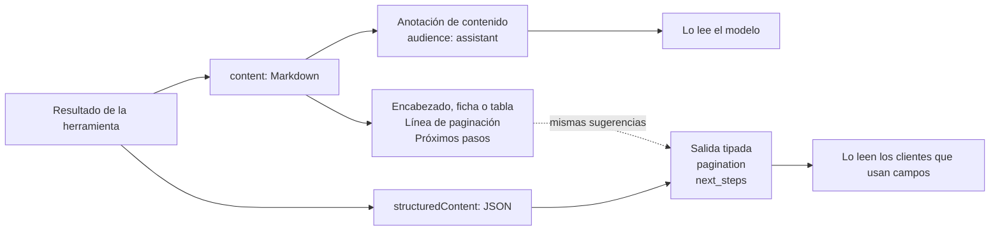

Una llamada a una herramienta que tiene éxito responde con el mismo resultado dos veces: como Markdown escrito para el modelo y como JSON para un cliente que lee campos. Esta página describe ambos, lo que lleva cada uno, cómo los marca el servidor para el cliente y lo que añaden un resultado get, un rechazo y una sesión de grano fino. Vale para todas las superficies de herramientas (dinámica, meta e individual), porque las tres terminan un resultado con el mismo código.

## Qué lleva un resultado

| Parte                           | Qué contiene                                                                                                                                                           | Escrito para                                     |
| ------------------------------- | ---------------------------------------------------------------------------------------------------------------------------------------------------------------------- | ------------------------------------------------ |
| `content`, un bloque de texto   | El Markdown: un encabezado, una ficha o una tabla, la línea de paginación de una lista y los próximos pasos                                                            | El modelo (`audience: ["assistant"]`)            |
| `structuredContent`             | La salida tipada de la acción en JSON: los campos de GitLab, `pagination` en una lista y `next_steps` donde el tipo de salida lo declara                               | Un cliente que lee campos                        |
| `content`, un bloque de imagen  | La imagen de una subida o de una visualización, para un cliente que pueda mostrarla                                                                                    | El usuario (`audience: ["user"]`)                |
| `content`, un bloque de recurso | La URI canónica `gitlab://` del objeto que devolvió un get, con el mismo JSON, en las 22 acciones get que declaran una ([Recursos incrustados](#recursos-incrustados)) | El modelo y un cliente que sigue URI de recursos |
| `isError`                       | `true` en un rechazo, una respuesta de no encontrado o una llamada fallida; un resultado así lleva su texto y ningún `structuredContent`                               | El modelo y el cliente                           |



## El Markdown

### Fichas y tablas

Un resultado sobre **un solo** objeto es una ficha: un encabezado H2, después una fila `- **Label**: value` por cada campo que envió GitLab, después su texto largo y sus objetos anidados, y los próximos pasos al final. Un campo que GitLab no envió no escribe fila, así que una ficha nunca muestra una etiqueta sin nada detrás. Un resultado sobre **varios** objetos es una tabla bajo un encabezado `## Title (N)`. Un único escritor produce todas las fichas, y una fila escrita a mano no supera la comprobación de escapado del repositorio ([el contrato de la ficha](https://github.com/jmrplens/gitlab-mcp-server/blob/main/docs/development/markdown-card.md)).

El número del encabezado de una lista es lo que la respuesta puede garantizar:

| Encabezado                               | Cuándo                                                                                              |
| ---------------------------------------- | --------------------------------------------------------------------------------------------------- |
| `## Branches (45)`                       | GitLab envió un total                                                                               |
| `## Branches (20 shown, more available)` | GitLab no envió total y quedan más páginas (omite el total en una lista de más de 10.000 elementos) |
| `## Branches (3)`                        | En otro caso: el número de filas mostradas                                                          |

Cuando GitLab informa de más de una página, una línea de resumen sigue al encabezado: `Showing 20 of 45 results (page 1 of 3)`, o `Showing 20 results (page 1 of 3)` cuando envió un número de páginas y ningún total de elementos. Una lista vacía es una frase sin encabezado: `No branches found.`

### Enlaces pulsables

Donde GitLab envió una URL web, la celda o la fila enlaza a ella: el IID de una merge request en una lista, el nombre de una rama a su árbol, el número de un pipeline al pipeline y la fila `URL` de una ficha a la propia dirección.

```markdown
| IID | Title | State | Author | Project | Source -> Target |
| --- | --- | --- | --- | --- | --- |
| [!243](https://gitlab.example.com/group/project/-/merge_requests/243) | Fix login bug | 🟢 opened | @alice | group/project | feature/fix-login -> main |
```

Las dos mitades de un enlace se escapan, así que un título no puede cerrar el enlace ni abrir uno propio, y una dirección que no es `http` ni `https` se muestra como código en lugar de enlazarse. Una lista cuya tabla lleva enlaces abre sus próximos pasos con una línea más, escrita para el modelo:

```text
When presenting these results, always include the clickable [text](url) links from the table so the user can navigate to GitLab
```

### Próximos pasos

Un resultado que tiene algo que sugerir termina con una sección de orientación: una regla horizontal, el encabezado y una viñeta por sugerencia.

```markdown
---
💡 **Next steps:**
- Use action 'branch.get' to see one branch in full
- Use action 'branch.create' to create a new branch
- Use action 'branch.protect' to protect a branch
```

Una sugerencia nombra otra acción por su ID canónico, que `gitlab_execute_action` ejecuta tal cual y que las superficies meta e individual traducen a la herramienta que registran para ella; `gitlab://tools/{id}` da la forma de la llamada en la superficie actual ([Recursos y prompts](/gitlab-mcp-server/es/tools/resources-prompts/)). Las mismas viñetas se copian en `next_steps` dentro de `structuredContent` cuando el tipo de salida de la acción declara ese campo; una acción cuyo tipo no lo declara las lleva solo en el Markdown.

La sección solo se vuelve a leer donde la escribe el servidor, al principio o al final de la respuesta. Un encabezado `💡 **Next steps:**` dentro de un texto que devolvió GitLab, como un README, un log de job o una descripción, se reescribe como `&#128161; **Next steps:**`, que se ve igual y nunca puede llegar a `next_steps` ([Contenido escrito por otras personas](/gitlab-mcp-server/es/operations/security/#contenido-escrito-por-otras-personas)).

### Fechas

Una marca de tiempo se muestra en UTC como `15 Jan 2025 10:30 UTC`, y una fecha que GitLab envía sin hora como `15 Jan 2025`. Un valor que no es ninguna de las dos se muestra tal como lo envió GitLab, escapado. `structuredContent` conserva la forma de máquina que usa GitLab (`2025-01-15T10:30:00Z`, o `2025-01-15` para una fecha), que un cliente puede analizar.

### Marcadores de estado

| Marcador             | Dónde                                                                            | Significado                                                                                                                                                            |
| -------------------- | -------------------------------------------------------------------------------- | ---------------------------------------------------------------------------------------------------------------------------------------------------------------------- |
| ✅ ❌                  | Un campo de sí o no (`Protected`, `Default`, `Merged`)                           | Sí, no                                                                                                                                                                 |
| ⚠️                   | Una condición que merece aviso (`Has conflicts`, `Discussion locked`, revocado)  | La condición se cumple                                                                                                                                                 |
| 🟢 🟣 🔴                | El estado de una merge request o de un issue                                     | `opened`, `merged`, `closed`                                                                                                                                           |
| ✅ ❌ 🔵 🟡 ⛔ ⏭️ 🆕 ✋ 📅 🔄 | El estado de un pipeline o de un job                                             | `success`, `failed`, `running`, `pending`, `canceled` o `canceling`, `skipped`, `created`, `manual`, `scheduled`, `preparing` o uno de los dos estados `waiting_for_*` |
| 🔴 🟠 🟡 🔵 ℹ️           | La gravedad de una vulnerabilidad o de un hallazgo, junto al nivel en mayúsculas | `CRITICAL`, `HIGH`, `MEDIUM`, `LOW`, `INFO`                                                                                                                            |
| 📝 🔒                  | El título o el encabezado de una merge request o de un issue                     | Borrador, confidencial                                                                                                                                                 |
| ❓                    | En lugar de cualquiera de los estados anteriores                                 | Un estado que el servidor no conoce                                                                                                                                    |

### La línea de paginación

Una lista cierra su tabla con una línea que dice lo que GitLab contó al servidor sobre las páginas, y solo eso:

```text
Page 1 of 3 | 45 items total | 20 per page
Page 1 | 20 per page | more pages available
Page 1 | 20 per page | no more pages
Showing 20 items | next page cursor: `eyJpZCI6IjQyIn0`
Showing 20 items | no more pages
```

- La primera línea es paginación por desplazamiento con total.
- La segunda y la tercera no tienen total, que es lo que envía GitLab para una lista de más de 10.000 elementos, y dicen si queda otra página.
- Las dos últimas son una lista leída por GraphQL, que pagina por cursor; una lista que además pagina hacia atrás añade `prev page cursor: ...`.

Una paginación que no dice nada (ni página, ni total, ni tamaño de página) no escribe ninguna línea.

## El JSON estructurado

`structuredContent` es el tipo de salida de la acción serializado como JSON: el mismo tipo en todas las superficies, con los nombres de campo de GitLab. Empieza por `next_steps` cuando el tipo lo declara. Una lista lleva un objeto `pagination`, con una de dos formas.

Una lista leída por REST:

| Campo         | Significado                                                      |
| ------------- | ---------------------------------------------------------------- |
| `page`        | La página devuelta, contando desde 1                             |
| `per_page`    | Elementos por página                                             |
| `total_items` | Elementos en todas las páginas, `0` cuando GitLab no envió total |
| `total_pages` | Páginas en total, `0` cuando GitLab no envió total               |
| `next_page`   | La página que pedir a continuación, `0` en la última             |
| `prev_page`   | La página anterior a esta, `0` en la primera                     |
| `has_more`    | `true` cuando queda otra página                                  |

Los siete campos están siempre presentes. Para seguir leyendo, llama a la misma acción con `page` igual a `next_page`; `per_page` admite como máximo 100.

La búsqueda es la excepción al `0`: la API de búsqueda de GitLab no envía totales, así que allí `total_items` es el número de elementos de esta página y `total_pages` es `next_page`, o `page` en la última. Los dos son una cota inferior deducida de lo que llegó, no una cuenta del resultado completo.

Una lista pedida con `pagination: "keyset"` no se puede seguir más allá de su primera página por ahora: GitLab la responde con un enlace a la página siguiente que el bloque no lleva, así que `has_more` vale `false` aunque queden más ([issue 1165](https://github.com/jmrplens/gitlab-mcp-server/issues/1165)). Deja `pagination` en su valor por defecto para leer una lista larga página a página.

Una lista leída por GraphQL:

| Campo               | Significado                                                                     |
| ------------------- | ------------------------------------------------------------------------------- |
| `has_next_page`     | `true` cuando queda otra página                                                 |
| `end_cursor`        | El cursor que pasar como `after` para la página siguiente                       |
| `has_previous_page` | `true` cuando hay una página antes de esta, en una lista que pagina hacia atrás |
| `start_cursor`      | El cursor que pasar como `before`, en una lista que pagina hacia atrás          |

Una lista así acepta `first` (20 por defecto, como máximo 100) y `after`, y `last` y `before` donde pagina hacia atrás.

## Cómo consumen un resultado los clientes

El servidor envía las dos partes en cada llamada con éxito y deja la elección al cliente. MCP exige que un cliente ignore lo que no entiende, así que no se le niega a un cliente nada que se dé a otro ([Compatibilidad](/gitlab-mcp-server/es/compatibility/)). Lo que recibe un cliente depende de lo que lee:

| Un cliente que lee          | Recibe                                                                            | Recibe los próximos pasos como                 |
| --------------------------- | --------------------------------------------------------------------------------- | ---------------------------------------------- |
| Solo `content`              | El Markdown: encabezado, ficha o tabla, línea de paginación                       | La sección `💡 Next steps`                      |
| Solo `structuredContent`    | El JSON tipado, con `pagination` en una lista                                     | `next_steps`, donde el tipo de salida lo tiene |
| Ambos, y respeta `audience` | Ambos, con el Markdown reservado al modelo y fuera de la vista del usuario        | Ambos                                          |
| Ambos, e ignora `audience`  | Ambos, con el Markdown mostrado como texto en bruto junto a los datos formateados | Ambos                                          |

Los próximos pasos se escriben en las dos partes para que un cliente que lea cualquiera de ellas los reciba. Hay dos comportamientos de cliente conocidos y resueltos:

- Cuando un resultado lleva `structuredContent`, Codex entrega a su modelo solo ese JSON y descarta el Markdown ([openai/codex#10334](https://github.com/openai/codex/issues/10334)), que es un motivo más para que los próximos pasos estén también en el JSON ([OpenAI Codex](/gitlab-mcp-server/es/install/clients/#openai-codex)).
- Las compilaciones de Codex que incluye ChatGPT.app rechazan una `priority` fraccionaria, así que para una sesión que se identifica como Codex el servidor redondea cada prioridad a `0` o `1`; `GITLAB_MCP_CLIENT_COMPAT=off` lo desactiva.

## Anotaciones de contenido

Cada bloque de texto que anota el servidor lleva dos [anotaciones de MCP](https://modelcontextprotocol.io/specification/2025-11-25/server/utilities/annotations): `audience`, para quién es el bloque, y `priority`, de 0 a 1, cuánto importa frente al resto del resultado.

| Anotación               | Audiencia   | Prioridad | La lleva                                                                                                                                                  |
| ----------------------- | ----------- | --------- | --------------------------------------------------------------------------------------------------------------------------------------------------------- |
| `ContentList`           | `assistant` | 0.4       | El texto de una acción que declara el tipo de contenido `list`                                                                                            |
| `ContentDetail`         | `assistant` | 0.6       | El texto de una acción que declara `detail`, y toda respuesta de no encontrado                                                                            |
| `ContentMutate`         | `assistant` | 0.8       | El texto de una acción que declara `mutate`, y los rechazos que escribe el propio servidor, como una acción retenida o un parámetro obligatorio que falta |
| `ContentAssistant`      | `assistant` | 0.7       | El texto de cualquier otra acción: una que declara `assistant` o `image`, o ningún tipo                                                                   |
| `ContentUser`           | `user`      | 0.8       | El bloque de imagen de una subida o de una visualización                                                                                                  |
| `ResourceMachineDetail` | `assistant` | 0.6       | El bloque de recurso que incrusta un get                                                                                                                  |

La anotación del texto de un resultado con éxito la decide la acción, no su formateador: la entrada de una acción en el catálogo puede declarar un tipo de contenido (`list`, `detail`, `mutate`, `assistant` o `image`), y todos los despachadores anotan el texto con el preajuste de ese tipo. Hoy pocas acciones declaran uno, y una acción que no declara ninguno lleva `ContentAssistant`. Un resultado de error conserva la anotación con la que se escribió.

### Qué significa `audience: ["assistant"]`

El Markdown es para que el modelo razone sobre él, no para mostrarlo. Un cliente que muestra los resultados de herramientas y respeta la anotación lo deja fuera de la vista del usuario, así que los mismos datos no se muestran dos veces, una como Markdown y otra desde `structuredContent`, mientras el modelo sigue leyéndolo. Todo bloque de texto es para el asistente; solo el bloque de imagen de una subida o de una visualización se marca para el usuario.

### Qué significa la prioridad

`priority` dice cuánto importa un bloque frente a los demás bloques del mismo resultado, y un valor más alto significa más. Los preajustes ordenan los tipos de respuesta, un rechazo o el resultado de una acción declarada `mutate` a 0.8 por encima de una lista a 0.4, y un cliente puede usar el valor o ignorarlo.

## Anotaciones de herramienta

Las anotaciones de contenido describen un bloque de un resultado. Las anotaciones de herramienta describen qué hace llamar a una herramienta, y cada herramienta publica las cuatro pistas que define MCP:

| Pista             | Valor            | Significado                                                                                                                          |
| ----------------- | ---------------- | ------------------------------------------------------------------------------------------------------------------------------------ |
| `readOnlyHint`    | `true` o `false` | La herramienta solo lee; no cambia nada en GitLab                                                                                    |
| `destructiveHint` | `true` o `false` | La herramienta puede hacer algo que su opuesta no deshace: un borrado, o un push mirror que da a otro host una copia del repositorio |
| `idempotentHint`  | `true` o `false` | Llamarla otra vez con los mismos argumentos no tiene más efecto                                                                      |
| `openWorldHint`   | `true` o `false` | La herramienta llega a un sistema fuera del servidor, aquí GitLab                                                                    |

Cómo las fija cada superficie:

- **Individual**: una herramienta por acción, con las pistas de la clasificación de esa acción en el catálogo.
- **Meta**: una herramienta por dominio, con la combinación más prudente de sus acciones: `destructiveHint: true` cuando alguna acción de la herramienta es destructiva, y `readOnlyHint: true` solo cuando todas las acciones solo leen.
- **Dinámica**: `gitlab_find_action` es de solo lectura. `gitlab_execute_action` es destructiva salvo que todas las acciones a las que llega la sesión solo lean, como en el modo de solo lectura, donde también es de solo lectura.

El propio servidor actúa sobre la misma clasificación, haga lo que haga un cliente con las pistas: el modo de solo lectura quita lo que no solo lee, el modo seguro lo responde con una vista previa, y una acción destructiva pide confirmación en el servidor ([Acciones destructivas](/gitlab-mcp-server/es/operations/security/#acciones-destructivas)). Un cliente o una pasarela puede preguntar antes de una herramienta destructiva y permitir una de solo lectura sin preguntar, y por eso una acción nunca puede declararse de solo lectura o idempotente en una superficie cuando el catálogo dice que no lo es.

## Ejemplos de respuesta

### Una lista

`branch.list` en la primera página de un proyecto con 45 ramas, tres por página. El Markdown, para el modelo:

```markdown
## Branches (45)

Showing 3 of 45 results (page 1 of 15)

| Name | Protected | Default | Merged |
| --- | --- | --- | --- |
| [main](https://gitlab.example.com/group/project/-/tree/main) | ✅ | ✅ | ❌ |
| [develop](https://gitlab.example.com/group/project/-/tree/develop) | ✅ | ❌ | ❌ |
| [feature/login](https://gitlab.example.com/group/project/-/tree/feature/login) | ❌ | ❌ | ❌ |

Page 1 of 15 | 45 items total | 3 per page

---
💡 **Next steps:**
- When presenting these results, always include the clickable [text](url) links from the table so the user can navigate to GitLab
- Use action 'branch.get' to see one branch in full
- Use action 'branch.create' to create a new branch
- Use action 'branch.protect' to protect a branch
```

El `structuredContent` de la misma llamada, sin el `commit` de la punta de cada rama para abreviar:

```json
{
  "next_steps": [
    "When presenting these results, always include the clickable [text](url) links from the table so the user can navigate to GitLab",
    "Use action 'branch.get' to see one branch in full",
    "Use action 'branch.create' to create a new branch",
    "Use action 'branch.protect' to protect a branch"
  ],
  "branches": [
    { "name": "main", "merged": false, "protected": true, "default": true, "web_url": "https://gitlab.example.com/group/project/-/tree/main", "can_push": true, "developers_can_push": false, "developers_can_merge": true },
    { "name": "develop", "merged": false, "protected": true, "default": false, "web_url": "https://gitlab.example.com/group/project/-/tree/develop", "can_push": true, "developers_can_push": true, "developers_can_merge": true },
    { "name": "feature/login", "merged": false, "protected": false, "default": false, "web_url": "https://gitlab.example.com/group/project/-/tree/feature/login", "can_push": true, "developers_can_push": false, "developers_can_merge": false }
  ],
  "pagination": { "page": 1, "per_page": 3, "total_items": 45, "total_pages": 15, "next_page": 2, "prev_page": 0, "has_more": true }
}
```

### Un objeto

`merge_request.get` de una merge request abierta:

```markdown
## 🟢 MR !243: Fix login bug

- **Project**: group/project
- **State**: 🟢 opened
- **Source**: feature/fix-login
- **Target**: main
- **Merge Status**: mergeable
- **Author**: @alice
- **Reviewers**: @bob
- **Labels**: bug
- **Pipeline**: [#1207](https://gitlab.example.com/group/project/-/pipelines/1207) ✅ success
- **Changes**: 3 files
- **Created**: 15 Mar 2025 10:30 UTC
- **Comments**: 2
- **URL**: [https://gitlab.example.com/group/project/-/merge_requests/243](https://gitlab.example.com/group/project/-/merge_requests/243)

---
💡 **Next steps:**
- Use action 'mr_review.changes_get' to see the diff of this merge request
- Use action 'mr_review.discussion_list' to see its review threads
- Use action 'merge_request.pipelines' to check its CI status
- Use action 'merge_request.approve' to approve it
- Use action 'merge_request.merge' to merge it
```

Una merge request con descripción la añade después de la fila `URL`, y una fusionada o cerrada dice quién la terminó y cuándo. El resultado también incrusta `gitlab://project/group%2Fproject/mr/243` cuando la llamada nombró el proyecto como `group/project` ([Recursos incrustados](#recursos-incrustados)).

### Una escritura

Una escritura responde con el objeto tal como queda. `issue.create` responde con la misma ficha que muestra `issue.get`:

```markdown
## 🟢 Issue #42: Fix the login page

- **Reference**: group/project#42
- **State**: 🟢 opened
- **Author**: @alice
- **Created**: 21 Mar 2025 09:00 UTC
- **URL**: [https://gitlab.example.com/group/project/-/issues/42](https://gitlab.example.com/group/project/-/issues/42)

---
💡 **Next steps:**
- Use action 'issue.note_list' to see comments on this issue
- Use action 'issue.update' to change title, labels, assignees, or milestone
- Use action 'issue.mrs_related' to find linked MRs
```

Una acción que no deja nada que mostrar responde con una línea. `branch.delete` responde `✅ Action completed successfully.`, y su `structuredContent` es `{"status": "success", "message": "Action completed successfully."}`.

### No encontrado

Un get cuyo objeto no existe, o que el token no puede ver, se responde con una ficha en lugar de un error opaco:

```markdown
## ❓ Branch Not Found

The branch **"nonexistent" in project 42** does not exist or is not accessible with your current permissions.

---
💡 **Next steps:**
- Use action 'branch.list' to list the project's branches
- Verify the branch name is spelled correctly (case-sensitive)
```

El resultado tiene `isError: true`, no lleva `structuredContent` y se anota con `ContentDetail`; sus próximos pasos permiten que el modelo se corrija. El servidor lo registra en `INFO` en lugar de `ERROR`. Las acciones get de 22 dominios responden así a un 404, cada una con sus propias sugerencias. Cualquier otro fallo se describe en [Manejo de errores](/gitlab-mcp-server/es/operations/error-handling/).

## Respuestas con tokens de grano fino

Una sesión con un token de acceso personal de grano fino puede recibir dos respuestas que un token clásico nunca recibe ([Tokens de grano fino](/gitlab-mcp-server/es/operations/fine-grained-tokens/#leer-una-respuesta-retenida)).

**Una llamada retenida** se responde con `isError: true` y una sola frase, antes de enviar nada a GitLab y antes de ofrecer una confirmación o una vista previa del modo seguro. La frase nombra la acción por su ID canónico, y lo que sigue al ID es uno de dos textos estables con los que un cliente puede comparar:

| Texto tras `action "<id>"`                                                         | Significa                                                                                        |
| ---------------------------------------------------------------------------------- | ------------------------------------------------------------------------------------------------ |
| `exists but this fine-grained personal access token was not granted what it needs` | A la concesión le falta un permiso, nombrado con las palabras de la página de creación de tokens |
| `exists but is not available to a fine-grained personal access token`              | Ningún token de grano fino llega a la acción en la versión de GitLab nombrada                    |

Las dos terminan con `Do not report the capability as missing.` En la superficie dinámica la frase lleva delante `gitlab_execute_action:` y un espacio. El servidor registra el rechazo con la clase de motivo `fine_grained`.

**Una nota junto a una respuesta que sí se sirvió**, donde la respuesta GraphQL de GitLab puede venir vacía para la credencial sin ningún error. La nota se añade a los próximos pasos de la respuesta, y por tanto a `next_steps` en una respuesta servida:

| En                                                           | La nota                                                                                                                                                                                                                                                       |
| ------------------------------------------------------------ | ------------------------------------------------------------------------------------------------------------------------------------------------------------------------------------------------------------------------------------------------------------- |
| Una respuesta que GitLab deja en parte vacía para el token   | `GitLab 19.4.1 leaves part of this answer empty for a fine-grained personal access token, with no error: ...`, que nombra cada parte y termina con `Empty there does not mean there is nothing.`                                                              |
| Una respuesta de no encontrado de una acción que lee GraphQL | `Over GraphQL, GitLab answers null with no error for an object a fine-grained personal access token is not granted, or that sits in a project or group outside its grant, so not found may mean this token cannot see it rather than that it does not exist.` |
| Una lista vacía de una acción que lee una lista GraphQL      | `Over GraphQL, GitLab leaves out of a list, with no error, the items a fine-grained personal access token is not granted, so an empty answer may mean this token cannot see them rather than that there are none.`                                            |

Una respuesta de no encontrado no lleva `next_steps`, así que su nota está en los próximos pasos del Markdown, o después del mensaje de error cuando la acción informa del no encontrado como un error. Una vista previa del modo seguro no lleva ninguna de las notas, porque no se envió nada a GitLab.

## Recursos incrustados

Un resultado get puede añadir un bloque de contenido de tipo `resource` con la URI canónica del recurso MCP del objeto que devolvió. Un cliente que solo muestra `content` e ignora `structuredContent` recibe aun así un identificador estable, que el modelo o el usuario pueden pasar a `resources/read` o a una llamada posterior.

El `mimeType` del bloque es `application/json` y su `text` es el mismo JSON que `structuredContent`, próximos pasos incluidos, así que un cliente más sencillo no pierde nada. Solo se añade tras una llamada con éxito: un error o una respuesta de no encontrado no incrustan nada, y tampoco una llamada que omitió alguno de los parámetros de la URI. El bloque se anota con `ResourceMachineDetail` (`assistant`, 0.6).

Cada acción declara el recurso que devuelve como una plantilla de URI escrita con sus propios nombres de parámetro, y el catálogo rechaza una plantilla que nombre un parámetro que la acción no acepta. Las tres superficies expanden la plantilla a partir de los parámetros de la llamada, así que un get incrusta el mismo bloque tanto si se llegó a él como herramienta individual, como `action` de una meta-herramienta o a través de `gitlab_execute_action`. Estas son las 22 acciones que declaran una:

| Acción                           | URI canónica                                                 |
| -------------------------------- | ------------------------------------------------------------ |
| `project.get`                    | `gitlab://project/{project_id}`                              |
| `project.board_get`              | `gitlab://project/{project_id}/board/{board_id}`             |
| `project.label_get`              | `gitlab://project/{project_id}/label/{label_id}`             |
| `project.milestone_get`          | `gitlab://project/{project_id}/milestone/{milestone_iid}`    |
| `group.get`                      | `gitlab://group/{group_id}`                                  |
| `group.group_label_get`          | `gitlab://group/{group_id}/label/{label_id}`                 |
| `group.group_milestone_get`      | `gitlab://group/{group_id}/milestone/{milestone_iid}`        |
| `issue.get`                      | `gitlab://project/{project_id}/issue/{issue_iid}`            |
| `merge_request.get`              | `gitlab://project/{project_id}/mr/{merge_request_iid}`       |
| `pipeline.get`                   | `gitlab://project/{project_id}/pipeline/{pipeline_id}`       |
| `job.get`                        | `gitlab://project/{project_id}/job/{job_id}`                 |
| `branch.get`                     | `gitlab://project/{project_id}/branch/{branch_name}`         |
| `tag.get`                        | `gitlab://project/{project_id}/tag/{tag_name}`               |
| `release.get`                    | `gitlab://project/{project_id}/release/{tag_name}`           |
| `repository.commit_get`          | `gitlab://project/{project_id}/commit/{sha}`                 |
| `environment.get`                | `gitlab://project/{project_id}/environment/{environment_id}` |
| `environment.deployment_get`     | `gitlab://project/{project_id}/deployment/{deployment_id}`   |
| `feature_flags.feature_flag_get` | `gitlab://project/{project_id}/feature_flag/{name}`          |
| `access.deploy_key_get`          | `gitlab://project/{project_id}/deploy_key/{deploy_key_id}`   |
| `wiki.get`                       | `gitlab://project/{project_id}/wiki/{slug}`                  |
| `snippet.get`                    | `gitlab://snippet/{snippet_id}`                              |
| `snippet.project_get`            | `gitlab://project/{project_id}/snippet/{snippet_id}`         |

Un valor se escapa como lo escapa una expansión simple de RFC 6570, con todo carácter fuera de `A-Z a-z 0-9 - . _ ~` codificado con porcentaje: `project_id: "group/project"` queda como `gitlab://project/group%2Fproject`, y una etiqueta con ámbito `priority::high` como `priority%3A%3Ahigh`, que es la forma que aceptan las plantillas de recursos. La URI se construye a partir de los parámetros tal como los leyó el handler: un proyecto enviado codificado como URL (`group%2Fproject`) incrusta la misma URI que uno enviado sin codificar, en todas las superficies. Un proyecto enviado con el alias `project_path` lo hace donde la superficie acepta el alias, que es la superficie dinámica y la superficie meta con el esquema de parámetros `opaque` o `compact`; una herramienta individual, y una meta-herramienta con `full`, rechazan el alias antes de que se ejecute la llamada.

La incrustación está activada por defecto. Un cliente que no tolera el bloque extra puede desactivarla con `GITLAB_MCP_EMBEDDED_RESOURCES=false`, o con `--embedded-resources=false` en modo HTTP ([Configuración](/gitlab-mcp-server/es/configuration/)).

## Esquemas de salida

Cada acción publica el JSON Schema de su salida, y dónde se lee depende de la superficie:

| Superficie | Dónde está el esquema de salida de la acción                                                                                                                                                                                                                                                   |
| ---------- | ---------------------------------------------------------------------------------------------------------------------------------------------------------------------------------------------------------------------------------------------------------------------------------------------- |
| Individual | El `outputSchema` de la herramienta de la acción en `tools/list`                                                                                                                                                                                                                               |
| Meta       | El `outputSchema` de la herramienta es un envoltorio compartido (`next_steps`, `pagination` y cualquier otro campo). El esquema propio de cada acción se publica en [llms-full-meta-tools.txt](https://jmrp.io/docs/gitlab-mcp-server/llms-full-meta-tools.txt) bajo **Action Output Schemas** |
| Dinámica   | `gitlab_execute_action` declara el mismo envoltorio, y `gitlab_find_action` devuelve el esquema de cada acción encontrada como `output_schema`, junto a su `input_schema` ([Conjunto de herramientas dinámico](/gitlab-mcp-server/es/tools/dynamic-tools/))                                    |

Los esquemas siguen el nivel de la instancia. En un nivel inferior, un campo que solo rellena un nivel superior se deja fuera del esquema de salida, mientras que la salida en sí no se filtra, así que un campo que GitLab envía de todos modos sigue llegando.

Cómo obtiene una acción su esquema, desde los constructores de rutas tipadas hasta la auditoría que informa de una ruta sin él, es material para contribuidores: consulta [Esquemas de salida por acción](https://github.com/jmrplens/gitlab-mcp-server/blob/main/docs/development/architecture.md#output-schemas-per-action) en la página de arquitectura interna del repositorio (en inglés).

## Lectura adicional

- [Manejo de errores](/gitlab-mcp-server/es/operations/error-handling/): lo que responde una llamada fallida
- [Tokens de grano fino](/gitlab-mcp-server/es/operations/fine-grained-tokens/): las acciones retenidas y las notas junto a una respuesta servida
- [Recursos y prompts](/gitlab-mcp-server/es/tools/resources-prompts/): los recursos `gitlab://` a los que apunta una URI incrustada
- [Solución de problemas](/gitlab-mcp-server/es/operations/troubleshooting/#formato-de-salida): enlaces, Markdown en bruto y próximos pasos que faltan
- [Especificación de MCP: anotaciones](https://modelcontextprotocol.io/specification/2025-11-25/server/utilities/annotations)
