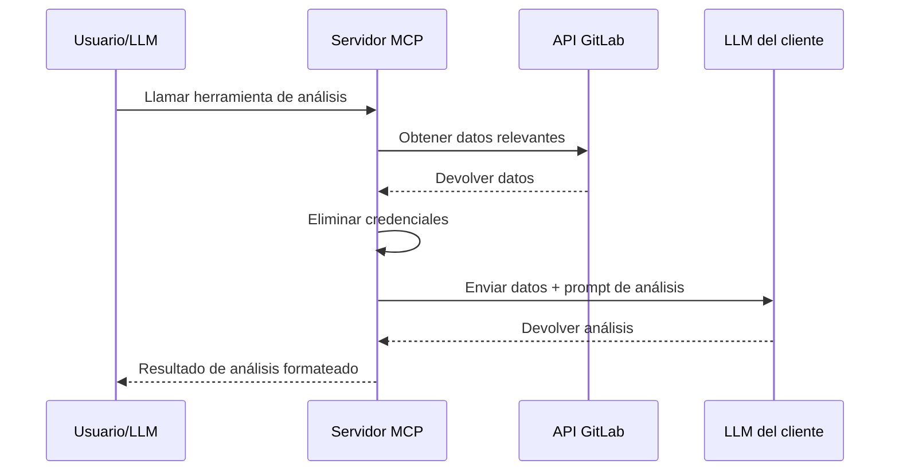

GitLab MCP Server incluye **11 herramientas de análisis basadas en sampling** que aprovechan el LLM del propio cliente de IA para realizar análisis profundos de datos de GitLab. A diferencia de las herramientas regulares que devuelven datos crudos de la API, las herramientas de análisis recopilan contexto relevante de GitLab y lo envían al modelo de lenguaje del cliente para una interpretación inteligente.

## Cómo funciona el sampling

MCP sampling es una capacidad del protocolo donde el **servidor solicita al LLM del cliente que procese datos**. El flujo de trabajo es:



1. El usuario (o LLM) invoca una herramienta de análisis
2. El servidor obtiene todos los datos relevantes de la API de GitLab
3. Las credenciales sensibles se eliminan de los datos
4. Los datos se empaquetan con un prompt de análisis y se envían al LLM del cliente mediante MCP sampling
5. El LLM del cliente genera el análisis
6. El servidor formatea y devuelve el resultado

:::caution
Las herramientas de análisis requieren que el cliente MCP soporte la **capacidad de sampling**. No todos los clientes MCP implementan esto. Consulta la documentación de tu cliente para verificar el soporte de sampling.
:::

## Herramientas de análisis disponibles

### Análisis de merge requests

| Herramienta                  | Descripción                                                                                                                                                                                             |
| ---------------------------- | ------------------------------------------------------------------------------------------------------------------------------------------------------------------------------------------------------- |
| `gitlab_analyze_mr_changes`  | Analiza los diffs de merge requests buscando calidad de código, posibles bugs, problemas de seguridad y preocupaciones arquitectónicas. Proporciona una revisión estructurada con niveles de severidad. |
| `gitlab_summarize_mr_review` | Resume todos los comentarios de revisión, hilos y discusiones de una merge request. Identifica consensos, elementos sin resolver y decisiones clave.                                                    |
| `gitlab_review_mr_security`  | Revisión de seguridad enfocada en los cambios de una MR. Comprueba vulnerabilidades comunes, secretos expuestos, riesgos de inyección y problemas del OWASP Top 10.                                     |

### Análisis de issues

| Herramienta                  | Descripción                                                                                                                                                                          |
| ---------------------------- | ------------------------------------------------------------------------------------------------------------------------------------------------------------------------------------ |
| `gitlab_summarize_issue`     | Genera un resumen conciso de un issue incluyendo su contexto completo, etiquetas, asignados, merge requests relacionadas y puntos destacados de la discusión.                        |
| `gitlab_analyze_issue_scope` | Estima la complejidad y el alcance de un issue. Considera sub-tareas, issues relacionados, etiquetas y discusión para proporcionar estimaciones de esfuerzo y evaluación de riesgos. |

### Análisis de CI/CD

| Herramienta                       | Descripción                                                                                                                       |
| --------------------------------- | --------------------------------------------------------------------------------------------------------------------------------- |
| `gitlab_analyze_pipeline_failure` | Realiza análisis de causa raíz en pipelines fallidos. Examina los logs de jobs, patrones de fallo y sugiere correcciones.         |
| `gitlab_analyze_ci_configuration` | Revisa `.gitlab-ci.yml` buscando buenas prácticas, oportunidades de optimización, preocupaciones de seguridad y posibles mejoras. |

### Análisis de proyectos y releases

| Herramienta                        | Descripción                                                                                                                                                |
| ---------------------------------- | ---------------------------------------------------------------------------------------------------------------------------------------------------------- |
| `gitlab_generate_release_notes`    | Genera notas de release completas a partir de issues y merge requests asociadas a un milestone o tag. Categoriza los cambios por tipo.                     |
| `gitlab_generate_milestone_report` | Crea un informe de progreso para un milestone incluyendo porcentaje de completitud, análisis de burndown y evaluación de riesgos para elementos atrasados. |
| `gitlab_find_technical_debt`       | Analiza issues del proyecto, MRs y patrones de código para identificar y categorizar deuda técnica. Sugiere estrategias de priorización.                   |

### Análisis de despliegues

| Herramienta                         | Descripción                                                                                                                                    |
| ----------------------------------- | ---------------------------------------------------------------------------------------------------------------------------------------------- |
| `gitlab_analyze_deployment_history` | Analiza patrones de despliegue, frecuencia, tasas de fallo e incidentes de rollback. Proporciona métricas estilo DORA y sugerencias de mejora. |

## Ejemplo: Análisis de fallo de pipeline

```json
{
 "tool": "gitlab_analyze_pipeline_failure",
 "arguments": {
  "project": "my-group/backend-api",
  "pipeline_id": 12345
 }
}
```

La herramienta:

1. Obtiene los detalles del pipeline y el estado de todos los jobs
2. Descarga los logs de los jobs fallidos
3. Recopila la configuración `.gitlab-ci.yml`
4. Elimina cualquier credencial de los datos recopilados
5. Envía todo al LLM del cliente con un prompt de análisis
6. Devuelve un análisis estructurado que incluye:
   - **Identificación de la causa raíz**
   - **Jobs afectados** y sus modos de fallo
   - **Correcciones sugeridas** con acciones específicas
   - Recomendaciones de **prevención**

## Ejemplo: Revisión de seguridad de MR

```json
{
 "tool": "gitlab_review_mr_security",
 "arguments": {
  "project": "my-group/backend-api",
  "merge_request_iid": 87
 }
}
```

Devuelve un análisis enfocado en seguridad que cubre:

- Secretos o tokens hardcodeados en los diffs
- Vulnerabilidades de inyección SQL o XSS
- Problemas de autenticación/autorización
- Preocupaciones de seguridad en dependencias
- Cumplimiento del OWASP Top 10

## Seguridad: Eliminación de credenciales

Antes de que cualquier dato se envíe al LLM del cliente para sampling, el servidor aplica **eliminación automática de credenciales**. Esto remueve patrones sensibles de los datos incluyendo:

- Personal access tokens de GitLab (`glpat-*`)
- Tokens de pipeline de GitLab (`glptt-*`)
- Claves de acceso y secretas de AWS
- Tokens y URLs de webhook de Slack
- Tokens JWT
- Patrones genéricos de API key
- Claves SSH privadas

:::tip
La eliminación de credenciales es una medida de defensa en profundidad. Siempre sigue el principio de mínimo privilegio al configurar tu token de GitLab — usa tokens con solo los scopes necesarios para tu flujo de trabajo.
:::

## Requisitos

| Requisito       | Detalles                                                                   |
| --------------- | -------------------------------------------------------------------------- |
| Cliente MCP     | Debe soportar la capacidad de `sampling`                                   |
| Token de GitLab | Acceso de lectura a los recursos que se analizan                           |
| Red             | El servidor debe poder alcanzar tanto la API de GitLab como el cliente MCP |

Las herramientas de análisis se registran tanto en modo individual como en modo meta-herramientas. En modo meta-herramientas, aparecen como herramientas independientes (no agrupadas bajo una meta-herramienta de dominio) porque cada herramienta de análisis tiene un prompt único y especializado.
