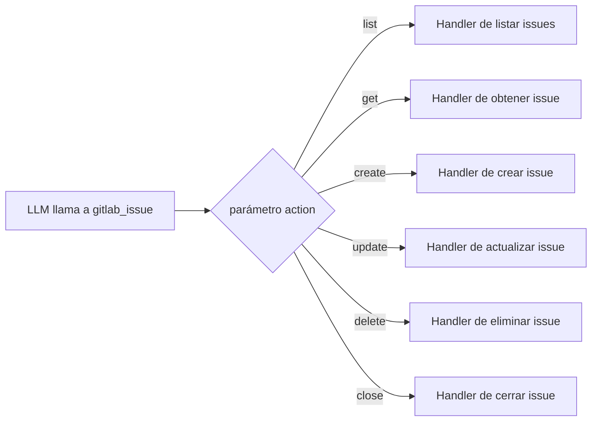

:::note[Documentación para desarrolladores]
Para la referencia técnica completa, consulta [`docs/meta-tools.md`](https://github.com/jmrplens/gitlab-mcp-server/blob/main/docs/meta-tools.md) en el repositorio.
:::

Las meta-herramientas son el modo de operación predeterminado de GitLab MCP Server. En lugar de exponer cada operación de la API de GitLab como una herramienta MCP separada, las meta-herramientas **agrupan operaciones relacionadas bajo una única herramienta** con un parámetro `action` que despacha al handler correcto.

## ¿Por qué meta-herramientas?

Los LLMs tienen ventanas de contexto limitadas. Cuando un servidor MCP registra 1006 herramientas individuales, solo las descripciones de las herramientas consumen una gran porción de los tokens disponibles, dejando menos espacio para la conversación real.

| Modo              | Nº de herramientas | Overhead de tokens | Funcionalidad               |
| ----------------- | ------------------ | ------------------ | --------------------------- |
| Individual        | 1006               | Muy alto           | Completa                    |
| Meta (base)       | 32                 | Bajo               | Completa                    |
| Meta (enterprise) | 47                 | Bajo               | Completa + Premium/Ultimate |

Las meta-herramientas reducen el recuento de herramientas en un **97%** mientras preservan el 100% de la funcionalidad. Cada operación de herramienta individual está disponible como una acción dentro de una de las meta-herramientas de dominio.

:::note[Compatibilidad con clientes]
Algunos clientes de IA imponen límites en el número de herramientas (por ejemplo, JetBrains AI Assistant limita los servidores MCP a 100 herramientas). El modo meta-herramientas (32 herramientas) funciona dentro de estas restricciones. Si desactivas las meta-herramientas (`META_TOOLS=false`), los clientes con dichos límites solo verán un subconjunto de las 1006 herramientas individuales.
:::

## Cómo funcionan las meta-herramientas

Cada meta-herramienta define un enum `action` que lista todas las operaciones disponibles. El servidor valida la acción y la despacha a la función handler correspondiente internamente.



El parámetro action siempre es requerido y debe ser uno de los valores enumerados. Los parámetros adicionales dependen de la acción elegida.

## Ejemplos de uso

### Crear un issue

```json
{
	"tool": "gitlab_issue",
	"arguments": {
		"action": "create",
		"project": "my-group/my-project",
		"title": "Update API documentation",
		"description": "The REST API docs are missing the new v2 endpoints",
		"labels": "documentation,api",
		"assignee_ids": "42",
		"milestone_id": 7
	}
}
```

### Listar merge requests

```json
{
	"tool": "gitlab_merge_request",
	"arguments": {
		"action": "list",
		"project": "my-group/my-project",
		"state": "opened",
		"order_by": "updated_at",
		"per_page": 20
	}
}
```

### Buscar código

```json
{
	"tool": "gitlab_search",
	"arguments": {
		"action": "code",
		"search": "func handleWebhook",
		"project": "my-group/my-project"
	}
}
```

## Referencia de meta-herramientas clave

### `gitlab_project`

Gestiona el ciclo de vida y la configuración de proyectos.

**Acciones**: `list`, `get`, `create`, `update`, `delete`, `archive`, `unarchive`, `fork`, `star`, `unstar`, `transfer`, `languages`, `users`, `forks`, `starrers`, `hooks`, `create_hook`, `update_hook`, `delete_hook`

### `gitlab_issue`

Gestión completa del ciclo de vida de issues incluyendo etiquetas, asignados y transiciones de estado.

**Acciones**: `list`, `get`, `create`, `update`, `delete`, `close`, `reopen`, `subscribe`, `unsubscribe`, `move`, `clone`, `add_label`, `remove_label`, `set_assignees`, `add_time_spent`, `reset_time_spent`, `set_time_estimate`, `reset_time_estimate`

### `gitlab_merge_request`

Flujo de trabajo completo de merge requests desde la creación hasta el merge.

**Acciones**: `list`, `get`, `create`, `update`, `merge`, `close`, `reopen`, `rebase`, `approve`, `unapprove`, `subscribe`, `unsubscribe`, `add_label`, `remove_label`, `set_assignees`, `set_reviewers`, `add_time_spent`, `reset_time_spent`

### `gitlab_pipeline`

Gestión y monitorización de pipelines.

**Acciones**: `list`, `get`, `create`, `cancel`, `retry`, `delete`, `variables`, `test_report`, `bridges`, `wait`

### `gitlab_job`

Gestión de jobs de CI/CD.

**Acciones**: `list`, `get`, `play`, `cancel`, `retry`, `erase`, `trace`, `artifacts`, `download_artifact`, `delete_artifacts`, `delete_project_artifacts`, `wait`

### `gitlab_branch`

Operaciones con ramas.

**Acciones**: `list`, `get`, `create`, `delete`, `merged`

### `gitlab_commit`

Operaciones con commits e historial.

**Acciones**: `list`, `get`, `diff`, `refs`, `cherry_pick`, `revert`, `comments`, `create_comment`, `statuses`, `merge_requests`

### `gitlab_tag`

Gestión de tags.

**Acciones**: `list`, `get`, `create`, `delete`

### `gitlab_release`

Gestión del ciclo de vida de releases.

**Acciones**: `list`, `get`, `create`, `update`, `delete`, `evidences`

### `gitlab_label`

Gestión de etiquetas para proyectos y grupos.

**Acciones**: `list`, `get`, `create`, `update`, `delete`, `subscribe`, `unsubscribe`

### `gitlab_milestone`

Seguimiento de milestones.

**Acciones**: `list`, `get`, `create`, `update`, `delete`, `issues`, `merge_requests`

### `gitlab_member`

Membresía de proyectos y grupos.

**Acciones**: `list`, `get`, `add`, `update`, `remove`, `all`

### `gitlab_group`

Gestión de grupos y subgrupos.

**Acciones**: `list`, `get`, `create`, `update`, `delete`, `projects`, `subgroups`, `members`, `labels`, `milestones`, `hooks`

### `gitlab_search`

Búsqueda entre recursos en toda tu instancia de GitLab.

**Acciones**: `code`, `issues`, `merge_requests`, `projects`, `users`, `commits`, `blobs`, `notes`, `milestones`, `wiki_blobs`

### `gitlab_user`

Información y búsqueda de usuarios.

**Acciones**: `get`, `current`, `list`, `status`, `activities`

### `gitlab_wiki`

Gestión de páginas wiki.

**Acciones**: `list`, `get`, `create`, `update`, `delete`

### `gitlab_todo`

Lista personal de tareas pendientes.

**Acciones**: `list`, `mark_done`, `mark_all_done`

## Modo Enterprise

Establecer `GITLAB_ENTERPRISE=true` habilita 15 meta-herramientas adicionales que exponen funciones de GitLab Premium y Ultimate. Además, se añaden 6 rutas de acción solo enterprise a las meta-herramientas base existentes:

- **Iterations** → enrutadas a través de `gitlab_issue`
- **Project mirrors** → enrutadas a través de `gitlab_project`
- **SSH certificates** → enrutadas a través de `gitlab_group`
- **Security settings** → divididas entre `gitlab_project` y `gitlab_group`
- **Group credentials** → enrutadas a través de `gitlab_group`
- **Group analytics** → enrutadas a través de `gitlab_group`

:::tip
Puedes comprobar qué herramientas tiene registradas tu servidor mirando la salida del log de inicio o llamando al método MCP `tools/list`.
:::

## Configuración

| Variable            | Predeterminado | Descripción                                                                            |
| ------------------- | -------------- | -------------------------------------------------------------------------------------- |
| `META_TOOLS`        | `true`         | Habilitar modo meta-herramientas. Establecer a `false` para herramientas individuales. |
| `GITLAB_ENTERPRISE` | `false`        | Habilitar meta-herramientas solo enterprise (requiere Premium/Ultimate).               |
