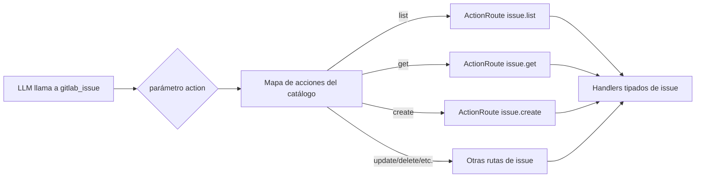

import stats from "../../../../data/stats.json";
import FAQ from "../../../../components/FAQ.astro";

:::tip[De un vistazo]

- **`GITLAB_MCP_TOOL_SURFACE=meta` agrupa las operaciones en {stats.meta.base} herramientas en Free/CE** ({stats.meta.premium} en Premium autoalojado, hasta {stats.meta.gitlab_com} en GitLab.com Ultimate) que enrutan por un parámetro `action`, en lugar de una herramienta por operación.
- **No se pierde ninguna capacidad.** Cada operación individual sigue siendo accesible como acción dentro de una meta-herramienta de dominio.
- **Los esquemas son opacos por defecto.** Lee `gitlab://tools/{id}` para obtener la forma exacta de llamada de una acción sin inflar la lista de herramientas.

:::

Las meta-herramientas son un modo de operación explícito de GitLab MCP Server, habilitado con `GITLAB_MCP_TOOL_SURFACE=meta`. En lugar de exponer cada operación de la API de GitLab como una herramienta MCP separada, las meta-herramientas **agrupan operaciones relacionadas bajo una única herramienta** con un parámetro `action` que despacha al handler correcto. El resultado es una lista de herramientas pequeña y explorable —un puñado de herramientas a nivel de dominio como `gitlab_issue`, `gitlab_project` y `gitlab_pipeline`— que aun así alcanza cualquier operación de GitLab.

## ¿Por qué usar meta-herramientas?

Las meta-herramientas existen para encajar una superficie completa de la API de GitLab en una ventana de contexto LLM limitada. Cuando un servidor MCP registra cientos de herramientas individuales (hasta {stats.tools.gitlab_com} en GitLab.com Ultimate con Orbit), solo las descripciones de las herramientas consumen una gran porción de los tokens disponibles, dejando menos espacio para la conversación real. El modo meta-herramientas colapsa esas operaciones en herramientas a nivel de dominio, así que la lista de herramientas se mantiene pequeña mientras la funcionalidad sigue completa.

Consolidar responde a tres costes que arrastra una lista larga de herramientas, y por eso el servidor agrupa las operaciones por dominio y no por paquete ([ADR-0005](https://github.com/jmrplens/gitlab-mcp-server/blob/main/docs/development/adr/adr-0005-meta-tool-consolidation.md)):

- **Tokens.** El cliente envía la lista de herramientas al modelo como contexto, así que la descripción y el esquema de cada herramienta se pagan en cada petición.
- **Selección.** Un modelo que elige entre muchas herramientas parecidas se equivoca más a menudo que uno que elige entre unos pocos dominios claramente distintos.
- **Presentación.** Cada cliente dibuja su paleta de herramientas a su manera, y una lista corta y bien organizada se lee mejor en todos.

| Modo                 | Free/CE            | Premium, autoalojado  | Ultimate, autoalojado                | Ultimate, GitLab.com     | Coste en tokens |
| -------------------- | ------------------ | --------------------- | ------------------------------------ | ------------------------ | --------------- |
| Dinámico _(predet.)_ | {stats.dynamic}    | {stats.dynamic}       | {stats.dynamic}                      | {stats.dynamic}          | El más bajo     |
| Meta                 | {stats.meta.base}  | {stats.meta.premium}  | {stats.meta.self_managed_enterprise} | {stats.meta.gitlab_com}  | Medio           |
| Individual           | {stats.tools.free} | {stats.tools.premium} | {stats.tools.ultimate_self_managed}  | {stats.tools.gitlab_com} | El más alto     |

Los tres modos alcanzan todas las acciones que permite el tier; solo cambia el empaquetado. En GitLab.com, Premium también recibe Orbit: la meta-herramienta `gitlab_orbit` en esta superficie, o sus seis herramientas en la individual. Los scopes de un token pueden bajar estas cifras: sin `admin_mode`, quedan fuera los grupos que lo necesitan ([Filtrado de herramientas por scopes](/gitlab-mcp-server/es/operations/security/#filtrado-de-herramientas-por-scopes)).

Las meta-herramientas reducen el recuento de herramientas en **más del 95%** mientras preservan el 100% de la funcionalidad. Cada operación de herramienta individual está disponible como una acción dentro de una de las meta-herramientas de dominio.

Las {stats.meta.base} herramientas de Free/CE son 28 despachadores de dominio de GitLab, la herramienta de diagnóstico `gitlab_server`, `gitlab_discover_project` y los cuatro flujos de creación `gitlab_interactive_*`. `gitlab_server` (acciones de solo lectura `status` y `health_check`) se registra en todos los tiers y cuenta en todas las cifras anteriores; la superficie dinámica alcanza esas mismas dos acciones como `server.status` y `server.health_check`.

:::note[Compatibilidad con clientes]
Algunos clientes de IA imponen límites en el número de herramientas: Windsurf admite 100 herramientas entre todos los servidores, y los clientes basados en OpenAI envían como mucho 128 por petición al modelo ([Límites de cliente que conviene conocer](/gitlab-mcp-server/es/compatibility/#límites-de-cliente-que-conviene-conocer)). El modo meta-herramientas ({stats.meta.base} herramientas en Free/CE, {stats.meta.premium} en Premium autoalojado, {stats.meta.self_managed_enterprise} en Ultimate autoalojado o {stats.meta.gitlab_com} en GitLab.com Ultimate con Orbit) funciona dentro de estas restricciones. Si seleccionas herramientas individuales con `GITLAB_MCP_TOOL_SURFACE=individual`, los clientes con dichos límites solo verán un subconjunto del conjunto completo de herramientas individuales.
:::

## ¿Cómo funcionan las meta-herramientas?

Cada meta-herramienta define un enum `action` que lista todas las operaciones que admite, luego valida la acción elegida y la despacha a la función handler correspondiente internamente. El parámetro `action` siempre es requerido y debe ser uno de los valores enumerados; los parámetros adicionales dependen de la acción elegida. Por eso una sola herramienta como `gitlab_issue` puede cubrir un dominio entero sin exponer una herramienta separada por operación.


```mermaid
flowchart LR
	A[LLM llama a gitlab_issue] --> B{parámetro action}
	B --> C[Mapa de acciones del catálogo]
	C -->|list| D[ActionRoute issue.list]
	C -->|get| E[ActionRoute issue.get]
	C -->|create| F[ActionRoute issue.create]
	C -->|update/delete/etc.| G[Otras rutas de issue]
	D --> H[Handlers tipados de issue]
	E --> H
	F --> H
	G --> H
```

### El argumento `params`

Una meta-herramienta recibe exactamente dos argumentos de primer nivel, `action` y `params`. `params` es un objeto con los argumentos propios de la acción elegida: los mismos que recibe la herramienta de esa acción en la superficie individual, y los mismos `params` que recibe `gitlab_execute_action` en la superficie dinámica, así que una llamada pasa de una superficie a otra sin renombrar ningún campo. Una acción destructiva acepta además `confirm` dentro de `params` ([Eliminar una rama](#eliminar-una-rama-con-confirmación)).

```json
{
  "action": "list",
  "params": {
    "project_id": "my-group/my-project",
    "per_page": 20
  }
}
```

Antes de llamar a GitLab, el servidor comprueba el sobre: una llamada que nombra una acción que la herramienta no tiene se rechaza con la lista de acciones válidas, y una a la que le falta un parámetro requerido se rechaza con los nombres que necesita, salvo que `params` lleve también un nombre que el schema no recoge, que puede ser un alias de parámetro que la acción resuelve. Una acción sin parámetros requeridos recibe un objeto vacío, `"params": {}`, o ningún `params`.

## ¿Cuántas acciones tiene cada meta-herramienta?

Cada cifra es lo que el catálogo construye para ese tier: las acciones del enum `action` del despachador, menos las que declaran un tier mínimo superior. Lee la lista real de tu despliegue en `gitlab://tools`, porque los scopes del token, el modo de solo lectura y `GITLAB_MCP_EXCLUDE_TOOLS` la reducen aún más. Ultimate es igual en una instancia autoalojada y en GitLab.com para estos 29 despachadores.

| Meta-herramienta        | Free/CE | Premium | Ultimate | Cubre                                                                                                                                                                                                                                                                                                                                                                                                                                                         |
| ----------------------- | ------: | ------: | -------: | ------------------------------------------------------------------------------------------------------------------------------------------------------------------------------------------------------------------------------------------------------------------------------------------------------------------------------------------------------------------------------------------------------------------------------------------------------------- |
| `gitlab_access`         |      48 |      48 |       48 | Tokens de acceso de proyecto, de grupo y personales (rotación y autorrotación incluidas), deploy keys y deploy tokens en todos los alcances, solicitudes de acceso e invitaciones                                                                                                                                                                                                                                                                             |
| `gitlab_achievement`    |      12 |      12 |       12 | Los logros que define un namespace de grupo o de proyecto y los otorgamientos hechos a partir de ellos, leídos y escritos por GraphQL con paginación por cursor                                                                                                                                                                                                                                                                                               |
| `gitlab_admin`          |      92 |      92 |       92 | Administración de la instancia: ajustes, apariencia, licencia, mensajes broadcast, feature flags de la instancia, system hooks, métricas de Sidekiq, límites de planes, temas, aplicaciones OAuth, atributos personalizados, datos de uso, importaciones desde GitHub, Bitbucket y otras instancias de GitLab, seguimiento de errores, imágenes de métricas de alertas, archivos seguros, estados de Terraform, agentes de clúster y el proxy de dependencias |
| `gitlab_branch`         |      11 |      11 |       11 | Ramas, ramas protegidas y reglas de rama (GraphQL)                                                                                                                                                                                                                                                                                                                                                                                                            |
| `gitlab_ci_catalog`     |       2 |       2 |        2 | Recursos del Catálogo CI/CD (GraphQL)                                                                                                                                                                                                                                                                                                                                                                                                                         |
| `gitlab_ci_variable`    |      15 |      15 |       15 | Variables de CI/CD a nivel de proyecto, grupo e instancia                                                                                                                                                                                                                                                                                                                                                                                                     |
| `gitlab_custom_emoji`   |       3 |       3 |        3 | Los emojis personalizados de un grupo (GraphQL)                                                                                                                                                                                                                                                                                                                                                                                                               |
| `gitlab_environment`    |      18 |      23 |       23 | Entornos, despliegues con sus aprobaciones y merge requests, y periodos de congelación de despliegue; entornos protegidos desde Premium                                                                                                                                                                                                                                                                                                                       |
| `gitlab_feature_flags`  |      10 |      10 |       10 | Feature flags de proyecto y sus listas de usuarios                                                                                                                                                                                                                                                                                                                                                                                                            |
| `gitlab_group`          |      75 |     153 |      158 | Grupos y subgrupos con sus miembros, etiquetas, hitos, boards, badges, subidas, exportación e importación, compartición, transferencia y cuentas de servicio; desde Premium, epics, wikis, webhooks, reglas de push, ramas y entornos protegidos, LDAP y SAML, certificados SSH y analíticas; desde Ultimate, credenciales y ajustes de seguridad                                                                                                             |
| `gitlab_issue`          |      66 |      71 |       71 | Issues con sus notas, discusiones, enlaces, emojis, eventos de recursos, estadísticas, seguimiento de tiempo, work items y vistas guardadas; iteraciones desde Premium                                                                                                                                                                                                                                                                                        |
| `gitlab_job`            |      25 |      25 |       25 | Jobs, logs, artefactos, bridges y el alcance del CI/CD job token                                                                                                                                                                                                                                                                                                                                                                                              |
| `gitlab_merge_request`  |      46 |      58 |       58 | Merge requests, aprobaciones, commits de contexto, emojis, eventos de recursos y seguimiento de tiempo; desde Premium, reglas de aprobación, ajustes de aprobación y dependencias                                                                                                                                                                                                                                                                             |
| `gitlab_model_registry` |       1 |       1 |        1 | Descarga de un archivo de paquete de modelo del registro de modelos                                                                                                                                                                                                                                                                                                                                                                                           |
| `gitlab_mr_review`      |      23 |      23 |       23 | Notas, discusiones, notas en borrador, cambios y versiones de diff de merge requests                                                                                                                                                                                                                                                                                                                                                                          |
| `gitlab_package`        |      30 |      30 |       30 | Registro de paquetes, publicación y descarga de paquetes genéricos, registro de contenedores y las reglas de protección de ambos                                                                                                                                                                                                                                                                                                                              |
| `gitlab_pipeline`       |      33 |      33 |       33 | Pipelines, informes de tests, tokens de trigger, grupos de recursos y schedules de pipelines                                                                                                                                                                                                                                                                                                                                                                  |
| `gitlab_project`        |     124 |     142 |      144 | Proyectos con sus ajustes, forks, estrellas, miembros, etiquetas, hitos, boards, badges, webhooks, integraciones, subidas, exportación e importación, push mirrors, Pages y cuentas de servicio; desde Premium, reglas de aprobación, pull mirroring, reglas de push, reglas de rama destino y el Dependency Firewall; desde Ultimate, ajustes de seguridad                                                                                                   |
| `gitlab_release`        |      12 |      12 |       12 | Releases y sus enlaces de activos                                                                                                                                                                                                                                                                                                                                                                                                                             |
| `gitlab_repository`     |      41 |      41 |       41 | Árbol del repositorio, archivos, blame, commits con sus discusiones, estados y firmas, comparación, cherry-pick y revert, submódulos, changelogs, archivos comprimidos y renderizado de Markdown                                                                                                                                                                                                                                                              |
| `gitlab_runner`         |      19 |      19 |       34 | Runners, sus tokens de registro y de autenticación, gestores de runners y jobs; controladores de runners desde Ultimate                                                                                                                                                                                                                                                                                                                                       |
| `gitlab_search`         |      10 |      10 |       10 | Búsqueda en toda la instancia, en un grupo o en un proyecto                                                                                                                                                                                                                                                                                                                                                                                                   |
| `gitlab_server`         |       2 |       2 |        2 | Diagnóstico del servidor: conectividad con GitLab, versiones y el usuario autenticado                                                                                                                                                                                                                                                                                                                                                                         |
| `gitlab_snippet`        |      34 |      34 |       34 | Snippets personales y de proyecto con sus notas, discusiones y emojis                                                                                                                                                                                                                                                                                                                                                                                         |
| `gitlab_storage_move`   |      12 |      18 |       18 | Movimientos de almacenamiento de repositorios de proyectos y snippets; movimientos de grupos desde Premium                                                                                                                                                                                                                                                                                                                                                    |
| `gitlab_tag`            |       9 |       9 |        9 | Etiquetas (tags), tags protegidos y firmas de tags                                                                                                                                                                                                                                                                                                                                                                                                            |
| `gitlab_template`       |      12 |      12 |       12 | Plantillas de gitignore, CI YAML, Dockerfile, licencias y proyectos, y CI lint                                                                                                                                                                                                                                                                                                                                                                                |
| `gitlab_user`           |      76 |      76 |       76 | Usuarios y el usuario actual: estado, claves SSH y GPG, correos, eventos, membresías, ajustes de notificaciones, namespaces, avatares, tareas pendientes, tokens de suplantación y de acceso personal, cuentas de servicio y administración de usuarios (bloquear, banear, aprobar)                                                                                                                                                                           |
| `gitlab_wiki`           |       6 |       6 |        6 | Páginas wiki de proyecto y adjuntos                                                                                                                                                                                                                                                                                                                                                                                                                           |

`gitlab_admin` y `gitlab_storage_move` solo se listan a un token que lleva el scope `admin_mode`, o cuyos scopes el servidor no pudo leer ([Filtrado de herramientas por scopes](/gitlab-mcp-server/es/operations/security/#filtrado-de-herramientas-por-scopes)). Las otras cinco de las {stats.meta.base} herramientas reciben sus argumentos directamente en lugar de mediante `action` y `params`: `gitlab_discover_project` y los cuatro flujos `gitlab_interactive_*`, que la superficie dinámica alcanza como `discover_project.resolve`, `interactive.issue_create`, `interactive.mr_create`, `interactive.project_create` e `interactive.release_create`. Las herramientas que añaden Premium y Ultimate están en [Modo Enterprise](#modo-enterprise).

## ¿Cómo descubro los parámetros por acción?

Las meta-herramientas usan un sobre común, y la forma exacta de `params` para cualquier acción se descubre a través del manifiesto de herramientas en lugar de incluirse en cada schema de herramienta. Por defecto, `GITLAB_MCP_META_PARAM_SCHEMA=opaque` mantiene pequeño el schema de la herramienta: los clientes ven el enum válido de `action`, mientras `params` queda como un objeto específico de la acción.

```json
{
  "action": "create",
  "params": {
    "project_id": "42"
  }
}
```

Para descubrir la forma exacta de una acción concreta, lee el manifiesto de herramientas:

| Recurso               | Uso                                                                                             |
| --------------------- | ----------------------------------------------------------------------------------------------- |
| `gitlab://tools`      | Lista herramientas visibles y entradas ejecutables para la superficie activa                    |
| `gitlab://tools/{id}` | Devuelve la forma de llamada aceptada y el JSON Schema de una acción, como `gitlab_project.get` |

Ejemplos de lectura de recursos:

```json
{
  "method": "resources/read",
  "params": {
    "uri": "gitlab://tools"
  }
}
```

```json
{
  "method": "resources/read",
  "params": {
    "uri": "gitlab://tools/gitlab_merge_request.create"
  }
}
```

La respuesta del detalle por acción incluye el schema de `params` y la forma de llamada final. Estos recursos siguen disponibles para meta-herramientas cuando `GITLAB_MCP_CAPABILITY_SURFACE=minimal` está habilitado, mientras se omiten recursos opcionales de GitLab, prompts y guías de flujo. Los despliegues dinámicos pueden seguir usando `gitlab_find_action` para schemas inline; los despliegues de meta-herramientas pueden mantener `GITLAB_MCP_META_PARAM_SCHEMA=opaque` y leer `gitlab://tools/{id}` en vez de incluir schemas en `tools/list`. Medidos hoy, los esquemas de entrada de las meta-herramientas ocupan con `compact` unas 8 veces lo que con `opaque`, y con `full` unas 18 veces; vuelve a medirlo con `go run ./cmd/audit_tokens --compare-schemas`. El `tools/list` completo crece menos, porque las descripciones no cambian: en Free/CE unas 1,6 veces con `compact` y 2,3 veces con `full`, según la [referencia de huella de tokens](https://github.com/jmrplens/gitlab-mcp-server/blob/main/docs/development/token-footprint.md).

### El manifiesto `gitlab://tools` en la superficie meta

En la superficie meta el manifiesto lista una entrada `meta_action` por cada acción de cada despachador visible, con la clave `<herramienta>.<acción>`, y una entrada `visible_tool` por cada herramienta que recibe sus argumentos directamente (`gitlab_discover_project` y los flujos de creación guiada). `visible_tool_count` cuenta todas las herramientas que devuelve `tools/list`, `gitlab_server` incluida. Una lectura abreviada en Free/CE, con una herramienta visible y una entrada:

```json
{
  "surface": "meta",
  "uri_template": "gitlab://tools/{id}",
  "visible_tool_count": 34,
  "entry_count": 872,
  "visible_tools": [
    {
      "name": "gitlab_merge_request",
      "title": "Merge Request",
      "detail_uri": "gitlab://tools/gitlab_merge_request",
      "read_only": false,
      "destructive": true
    }
  ],
  "entries": [
    {
      "id": "gitlab_merge_request.create",
      "kind": "meta_action",
      "tool": "gitlab_merge_request",
      "action": "create",
      "domain": "merge_request",
      "detail_uri": "gitlab://tools/gitlab_merge_request.create",
      "destructive": false,
      "read_only": false,
      "required_params": [
        { "name": "project_id", "type": "string|integer" },
        { "name": "source_branch", "type": "string" },
        { "name": "target_branch", "type": "string" },
        { "name": "title", "type": "string" }
      ]
    }
  ]
}
```

Las entradas llevan además un `title` y una `description`. `required_params` nombra solo los parámetros que la acción exige siempre, cada uno con su tipo JSON; cuando una acción acepta en su lugar uno de varios grupos, estos van en `required_params_any_of`. En la superficie de capacidades `full` el manifiesto lleva también un bloque `subscriptions` que nombra los recursos que aceptan `resources/subscribe` ([Suscripciones a recursos](/gitlab-mcp-server/es/capabilities/subscriptions/)). El recurso de detalle responde también al ID canónico de la acción, así que `gitlab://tools/merge_request.create` devuelve el mismo detalle que `gitlab://tools/gitlab_merge_request.create`.

### Incluir los esquemas con `compact` o `full`

`GITLAB_MCP_META_PARAM_SCHEMA` decide cuánto del esquema de cada acción llega a `tools/list`:

- **`opaque`** (predeterminado): el `inputSchema` de la herramienta es solo el sobre, un enum `action` y un objeto `params` abierto. El esquema exacto de cada acción se lee en `gitlab://tools/{id}`.
- **`full`**: el sobre gana un `oneOf` con una rama por acción. Cada rama fija `action` al nombre de esa acción con `const`, exige `params` e incluye el esquema completo de parámetros de la acción, así que un cliente que valida contra `oneOf` elige la rama por `action`. En este modo los parámetros de cada acción están cerrados, así que un alias de parámetro que `opaque` y `compact` aceptan se rechaza antes de que la acción se ejecute.
- **`compact`**: el mismo `oneOf`, con los parámetros de cada acción reducidos a sus nombres, tipos y valores de enum; se omiten las descripciones y la propia lista `required` de los parámetros.

Mantén `opaque` salvo que tu cliente MCP no pueda leer recursos: la llamada se despacha igual en los tres modos, y solo cambia el esquema que se envía al modelo, salvo que `full` rechaza un alias de parámetro antes de que lo vea el handler.

## ¿Qué devuelve una meta-herramienta?

Una llamada correcta devuelve el resultado dos veces: como Markdown en `content`, y como la salida tipada de la acción en `structuredContent`. Cuando el tipo de salida declara un campo `next_steps`, el servidor copia en él las sugerencias que cierran el Markdown, así que un cliente que solo lee el JSON también las recibe (Codex, por ejemplo, entrega a su modelo solo `structuredContent` cuando un resultado lo lleva). Todas las superficies lo hacen, porque los despachadores meta, individual y dinámico terminan un resultado de la misma forma; un tipo de salida sin ese campo lleva sus sugerencias solo en el Markdown, y una llamada rechazada o fallida lleva su texto y ningún `structuredContent`. La salida estructurada de `gitlab_branch` con `action: "list"`, abreviada a una rama:

```json
{
  "next_steps": [
    "When presenting these results, always include the clickable [text](url) links from the table so the user can navigate to GitLab",
    "Use action 'branch.get' to see one branch in full",
    "Use action 'branch.create' to create a new branch",
    "Use action 'branch.protect' to protect a branch"
  ],
  "branches": [
    {
      "name": "main",
      "merged": false,
      "protected": true,
      "default": true,
      "web_url": "https://gitlab.example.com/my-group/my-project/-/tree/main",
      "can_push": true,
      "developers_can_push": false,
      "developers_can_merge": false
    }
  ],
  "pagination": {
    "page": 1,
    "per_page": 20,
    "total_items": 23,
    "total_pages": 2,
    "next_page": 2,
    "prev_page": 0,
    "has_more": true
  }
}
```

La primera sugerencia abre los siguientes pasos de toda lista cuya tabla enlaza a GitLab: pide al modelo que conserve esos enlaces clicables al responder. Las demás nombran acciones por su ID canónico, que `gitlab://tools/{id}` resuelve en cualquier superficie. [Formato de salida](/gitlab-mcp-server/es/reference/output-format/) describe la respuesta completa.

## Ejemplos de uso

### Crear un issue

```json
{
  "tool": "gitlab_issue",
  "arguments": {
    "action": "create",
    "params": {
      "project_id": "my-group/my-project",
      "title": "Update API documentation",
      "description": "The REST API docs are missing the new v2 endpoints",
      "labels": ["documentation", "api"],
      "assignee_ids": [42],
      "milestone_id": 7
    }
  }
}
```

### Listar merge requests

```json
{
  "tool": "gitlab_merge_request",
  "arguments": {
    "action": "list",
    "params": {
      "project_id": "my-group/my-project",
      "state": "opened",
      "order_by": "updated_at",
      "per_page": 20
    }
  }
}
```

### Buscar código

```json
{
  "tool": "gitlab_search",
  "arguments": {
    "action": "code",
    "params": {
      "query": "func handleWebhook",
      "project_id": "my-group/my-project"
    }
  }
}
```

### Eliminar una rama (con confirmación)

```json
{
  "tool": "gitlab_branch",
  "arguments": {
    "action": "delete",
    "params": {
      "project_id": "42",
      "branch_name": "feature/old-branch"
    }
  }
}
```

`delete` es una acción destructiva, así que el servidor decide si puede ejecutarse antes de llamar a GitLab, en este orden:

1. **Modo YOLO.** Cuando `GITLAB_MCP_YOLO_MODE` tiene un valor verdadero (`1`, `true` o `yes`), la acción se ejecuta sin preguntar. `AUTOPILOT` cuenta igual, pero solo mientras `GITLAB_MCP_YOLO_MODE` no está definido, así que `GITLAB_MCP_YOLO_MODE=false` anula un `AUTOPILOT=true` heredado.
2. **Una confirmación explícita.** `"confirm": true` dentro de `params` ejecuta la acción sin preguntar.
3. **Elicitation.** Cuando el cliente admite elicitation, el servidor pregunta al usuario `Confirm gitlab_branch/delete? This action may be irreversible.` y solo ejecuta la acción si el usuario acepta; una pregunta rechazada o cancelada devuelve un resultado de error. Con el protocolo 2026-07-28 la pregunta viaja como una petición de datos que el cliente responde reintentando la llamada ([Elicitation](/gitlab-mcp-server/es/capabilities/elicitation/)).
4. **Rechazo por defecto (fail-closed).** Un cliente que no puede preguntar recibe un resultado de error en lugar de una eliminación, que indica al modelo que reenvíe la llamada con `confirm` a `true` solo después de que el usuario lo apruebe explícitamente.

El recurso de detalle indica dónde va la confirmación: el `call` que devuelve `gitlab://tools/gitlab_branch.delete` lleva un `confirm_location` que nombra el campo `confirm` dentro de `params`, un campo que solo tienen las acciones destructivas.

### Comprobar disponibilidad de Orbit

```json
{
  "tool": "gitlab_orbit",
  "arguments": {
    "action": "status",
    "params": {
      "response_format": "llm"
    }
  }
}
```

`gitlab_orbit` solo se registra para conexiones con `https://gitlab.com` en el nivel Premium o Ultimate y expone seis acciones de solo lectura del Knowledge Graph: `status`, `schema`, `tools`, `dsl`, `query` y `graph_status`.

## Referencia de meta-herramientas clave

Las listas de acciones siguientes son una selección representativa, no el conjunto completo, y algunas de las acciones que nombran solo se sirven desde Premium (los `hook_*` del grupo, las reglas de aprobación de la merge request). `gitlab://tools` lista todas las herramientas visibles y entradas ejecutables de la superficie activa, y `gitlab://tools/{id}` devuelve la lista completa de acciones y el JSON Schema de una de ellas. Las cifras por tier están en la [tabla de recuento de acciones](#cuántas-acciones-tiene-cada-meta-herramienta).

### `gitlab_project`

Ciclo de vida y configuración de proyectos, además de las etiquetas, hitos, miembros, badges, boards, integraciones y subidas con alcance de proyecto.

**Acciones**: `list`, `get`, `create`, `update`, `delete`, `restore`, `archive`, `unarchive`, `fork`, `star`, `unstar`, `transfer`, `languages`, `list_users`, `list_forks`, `list_starrers`, `hook_list`, `hook_add`, `hook_edit`, `hook_delete`, `label_*`, `milestone_*`, `members`, `member_*`, `badge_*`, `board_*`, `upload`

### `gitlab_issue`

Ciclo de vida completo de issues, incluidas notas, discusiones, enlaces y seguimiento de tiempo.

**Acciones**: `list`, `list_all`, `list_group`, `get`, `create`, `update`, `delete`, `move`, `reorder`, `subscribe`, `unsubscribe`, `create_todo`, `participants`, `time_estimate_set`, `spent_time_add`, `note_*`, `discussion_*`, `link_*`

### `gitlab_merge_request`

Flujo de trabajo completo de merge requests desde la creación hasta el merge.

**Acciones**: `list`, `list_global`, `list_group`, `get`, `create`, `update`, `merge`, `rebase`, `approve`, `unapprove`, `subscribe`, `unsubscribe`, `commits`, `pipelines`, `reviewers`, `participants`, `cancel_auto_merge`, `approval_*`, `time_estimate_set`, `spent_time_add`

### `gitlab_mr_review`

La superficie de revisión de merge requests: notas, discusiones en hilo, notas en borrador y diffs.

**Acciones**: `note_list`, `note_get`, `note_create`, `note_update`, `note_delete`, `discussion_list`, `discussion_get`, `discussion_create`, `discussion_reply`, `discussion_resolve`, `draft_note_*`, `changes_get`, `raw_diffs`, `diff_versions_list`, `diff_version_get`

### `gitlab_pipeline`

Gestión y seguimiento de pipelines, además de schedules y tokens de trigger.

**Acciones**: `list`, `get`, `latest`, `create`, `cancel`, `retry`, `delete`, `variables`, `test_report`, `test_report_summary`, `update_metadata`, `wait`, `schedule_*`, `trigger_*`

### `gitlab_job`

Gestión de jobs de CI/CD.

**Acciones**: `list`, `list_project`, `get`, `play`, `cancel`, `retry`, `erase`, `trace`, `artifacts`, `download_artifacts`, `keep_artifacts`, `delete_artifacts`, `delete_project_artifacts`, `list_bridges`, `wait`

### `gitlab_branch`

Operaciones de ramas y reglas de protección.

**Acciones**: `list`, `get`, `create`, `delete`, `delete_merged`, `protect`, `unprotect`, `list_protected`, `get_protected`, `update_protected`

### `gitlab_repository`

Árbol del repositorio, archivos, commits, diffs e historial. Los commits no tienen meta-herramienta propia: sus operaciones son acciones de esta.

**Acciones**: `tree`, `compare`, `merge_base`, `contributors`, `blob`, `raw_blob`, `archive`, `changelog_generate`, `changelog_add`, `file_get`, `file_create`, `file_update`, `file_delete`, `file_blame`, `file_raw`, `commit_list`, `commit_get`, `commit_diff`, `commit_refs`, `commit_cherry_pick`, `commit_revert`, `commit_comments`, `commit_comment_create`, `commit_statuses`, `commit_merge_requests`

### `gitlab_tag`

Gestión de etiquetas (tags) y reglas de protección.

**Acciones**: `list`, `get`, `create`, `delete`, `get_signature`, `protect`, `unprotect`, `list_protected`, `get_protected`

### `gitlab_release`

Ciclo de vida de releases y enlaces de activos de release.

**Acciones**: `list`, `get`, `get_latest`, `create`, `update`, `delete`, `link_list`, `link_get`, `link_create`, `link_create_batch`, `link_update`, `link_delete`

### Etiquetas, hitos y miembros

Las etiquetas, los hitos y los miembros no tienen meta-herramienta propia. Son acciones de las meta-herramientas de proyecto y de grupo:

- A través de `gitlab_project`: `label_list`, `label_get`, `label_create`, `label_update`, `label_delete`, `label_subscribe`, `label_unsubscribe`, `label_promote`, `milestone_list`, `milestone_get`, `milestone_create`, `milestone_update`, `milestone_delete`, `milestone_issues`, `milestone_merge_requests`, `members`, `member_get`, `member_add`, `member_edit`, `member_delete`
- A través de `gitlab_group`: casi las mismas operaciones con el prefijo `group_` (`group_label_*`, `group_milestone_*`, `group_member_*`), con estas diferencias: la lista de miembros es `members`, la baja es `group_member_remove`, las etiquetas no se pueden promover, y el grupo añade `group_member_get_inherited`, `group_member_share`, `group_member_unshare` y, desde Premium, `group_milestone_burndown`

### `gitlab_group`

Gestión de grupos y subgrupos.

**Acciones**: `list`, `get`, `create`, `update`, `delete`, `restore`, `archive`, `unarchive`, `projects`, `subgroups`, `members`, `shared_with`, `invited_groups`, `transfer`, `transfer_project`, `share_with_group`, `unshare_from_group`, `hook_*`

### `gitlab_search`

Búsqueda entre recursos en toda tu instancia de GitLab.

**Acciones**: `code`, `issues`, `merge_requests`, `commits`, `milestones`, `notes`, `projects`, `snippets`, `users`, `wiki`

### `gitlab_user`

Información y búsqueda de usuarios, más la lista de tareas pendientes del usuario autenticado, que no tiene meta-herramienta propia.

**Acciones**: `current`, `get`, `list`, `create`, `modify`, `get_status`, `set_status`, `ssh_keys`, `emails`, `contribution_events`, `block`, `unblock`, `ban`, `unban`, `activate`, `deactivate`, `todo_list`, `todo_mark_done`, `todo_mark_all_done`

### `gitlab_wiki`

Gestión de páginas wiki.

**Acciones**: `list`, `get`, `create`, `update`, `delete`, `upload_attachment`

## Modo Enterprise

Los catálogos Premium y Ultimate habilitan {stats.meta.self_managed_enterprise - stats.meta.base} meta-herramientas adicionales que exponen funciones de GitLab Premium y Ultimate: seis llegan con Premium ({stats.meta.premium} herramientas en una instancia autoalojada) y once más con Ultimate ({stats.meta.self_managed_enterprise} en una instancia autoalojada). Cuando el tier no se fija, se detecta en los dos modos, a partir de la licencia de la instancia, después de los planes de los namespaces que administra el token y después, en GitLab.com, de los planes de los grupos de nivel superior de los que el token es miembro: una vez al arrancar en stdio, y por entrada token+URL en modo HTTP. Para forzar el catálogo, establece `GITLAB_MCP_TIER=premium` o `GITLAB_MCP_TIER=ultimate`, o pasa `--tier=premium` (o `--tier=ultimate`) en modo HTTP. El modo HTTP también lee `GITLAB_MCP_TIER` de su entorno, pero solo cuando `--tier` no se pasa en la línea de comandos. El tier también retira los campos de los esquemas de entrada que quedan por encima de él, mientras los campos de salida siguen llegando al cliente.

Las seis meta-herramientas de Premium, que Ultimate conserva:

| Meta-herramienta         | Acciones | Cubre                                                     | Scope del token |
| ------------------------ | -------: | --------------------------------------------------------- | --------------- |
| `gitlab_audit_event`     |        6 | Eventos de auditoría de instancia, grupo o proyecto       | Cualquiera      |
| `gitlab_enterprise_user` |        4 | Usuarios enterprise de un grupo y desactivación de su 2FA | `admin_mode`    |
| `gitlab_geo`             |        8 | Sitios Geo, su estado y su reparación                     | `admin_mode`    |
| `gitlab_group_scim`      |        4 | Las identidades SCIM de un grupo                          | Cualquiera      |
| `gitlab_merge_train`     |        4 | Merge trains de un proyecto o de una rama destino         | Cualquiera      |
| `gitlab_project_alias`   |        4 | Alias de proyecto                                         | `admin_mode`    |

"Cualquiera" significa que el grupo no pide ningún scope propio; una escritura sigue necesitando un token que pueda escribir. Los tres grupos que necesitan `admin_mode` quedan fuera para un token sin ese scope ([Filtrado de herramientas por scopes](/gitlab-mcp-server/es/operations/security/#filtrado-de-herramientas-por-scopes)).

Las once meta-herramientas de Ultimate, ninguna de las cuales retira el filtro de scopes por falta de `admin_mode`. `gitlab_compliance_policy` llama, eso sí, a una ruta `/admin`, así que GitLab solo se la responde a un administrador:

| Meta-herramienta               | Acciones | Cubre                                                                                           |
| ------------------------------ | -------: | ----------------------------------------------------------------------------------------------- |
| `gitlab_attestation`           |        2 | Atestaciones de compilación (procedencia SLSA)                                                  |
| `gitlab_compliance_policy`     |        2 | Ajustes de configuración de políticas de seguridad                                              |
| `gitlab_dependency`            |        4 | La lista de dependencias y sus exportaciones                                                    |
| `gitlab_dora_metrics`          |        2 | Métricas DORA de un proyecto o de un grupo                                                      |
| `gitlab_external_status_check` |        8 | Comprobaciones de estado externas de un proyecto y de sus merge requests                        |
| `gitlab_member_role`           |        6 | Roles de miembro personalizados de un grupo o de la instancia                                   |
| `gitlab_security_attribute`    |        5 | Atributos de seguridad y su asignación a proyectos (GraphQL)                                    |
| `gitlab_security_category`     |        3 | Categorías de seguridad (GraphQL)                                                               |
| `gitlab_security_finding`      |        1 | Los hallazgos de seguridad de un pipeline (GraphQL)                                             |
| `gitlab_security_scan_profile` |        3 | Vincular y desvincular perfiles de escaneo de seguridad, y los estados de un proyecto (GraphQL) |
| `gitlab_vulnerability`         |        8 | Vulnerabilidades, su estado y el resumen de seguridad de un pipeline (GraphQL)                  |

En GitLab.com, `gitlab_orbit` se suma a ellas en Premium y Ultimate, con seis acciones de solo lectura ([Orbit](/gitlab-mcp-server/es/tools/orbit/)).

Premium y Ultimate también añaden acciones a siete de los despachadores base:

- **`gitlab_project`**: configuración y reglas de aprobación, pull mirroring (los push mirrors se sirven en todos los tiers, Free incluido), reglas de push, reglas de rama destino y la evaluación del Dependency Firewall desde Premium; ajustes de seguridad desde Ultimate
- **`gitlab_group`**: epics con sus notas, discusiones, issues, eventos de etiquetas y boards, wikis de grupo, webhooks, reglas de push, ramas y entornos protegidos, enlaces LDAP y SAML, certificados SSH, analíticas, miembros facturables, usuarios aprovisionados, el burndown de hitos, y crear y eliminar boards de grupo desde Premium; credenciales y ajustes de seguridad desde Ultimate
- **`gitlab_issue`**: iteraciones, y eventos de iteración y de peso, desde Premium
- **`gitlab_merge_request`**: estado y reglas de aprobación, ajustes de aprobación y dependencias de merge requests desde Premium
- **`gitlab_environment`**: entornos protegidos desde Premium
- **`gitlab_storage_move`**: movimientos de almacenamiento de grupos desde Premium
- **`gitlab_runner`**: controladores de runners con sus scopes y tokens desde Ultimate

:::tip
El log de inicio dice cuántas herramientas registró tu servidor (`registered meta-tools` con un recuento `tools`); el método MCP `tools/list` dice cuáles.
:::

## Configuración

| Variable                        | Predeterminado    | Descripción                                                                                                                                                                                                                                                               |
| ------------------------------- | ----------------- | ------------------------------------------------------------------------------------------------------------------------------------------------------------------------------------------------------------------------------------------------------------------------- |
| `GITLAB_MCP_TOOL_SURFACE`       | `dynamic`         | Selector canónico: usa `meta` para meta-herramientas. Usa `individual` solo cuando quieras deliberadamente una herramienta MCP por operación de GitLab; sin definir, se usa la superficie dinámica predeterminada.                                                        |
| `GITLAB_MCP_CAPABILITY_SURFACE` | `full`            | Selector del catálogo de recursos y prompts: `full` o `minimal`. Minimal mantiene el manifiesto `gitlab://tools`, y omite recursos opcionales, guías y prompts.                                                                                                           |
| `GITLAB_MCP_META_PARAM_SCHEMA`  | `opaque`          | Controla cuánto schema de `params` por acción se incluye en `tools/list`: `opaque`, `compact` o `full`. Los schemas exactos están disponibles con `gitlab://tools/{id}`.                                                                                                  |
| `GITLAB_MCP_TIER`               | _(autodetectado)_ | Selector de edición: `free`/`ce`, `premium` o `ultimate`. Cuando se omite, el tier se detecta desde `GET /license`, después desde los planes de los namespaces del token y después, en GitLab.com, desde los planes de sus grupos de nivel superior (por defecto `free`). |
| `--tier`                        | _(autodetectado)_ | Flag de edición en modo HTTP: `free`/`ce`, `premium` o `ultimate`. Cuando no se pasa, se usa en su lugar `GITLAB_MCP_TIER` del entorno.                                                                                                                                   |

El selector booleano `META_TOOLS` al que sustituyó `GITLAB_MCP_TOOL_SURFACE` se eliminó en la 3.0.0. Ya nada lo lee ni avisa de él, así que una configuración que todavía lo define recibe la superficie dinámica predeterminada: sustitúyelo por `GITLAB_MCP_TOOL_SURFACE=meta`.

## Metadatos de descubrimiento

Cada acción de meta-herramienta lleva metadatos de descubrimiento (alias, uso, guía de parámetros, acciones relacionadas) que ayudan a los modelos a elegir la acción correcta y a dar forma a los parámetros.

<FAQ />
