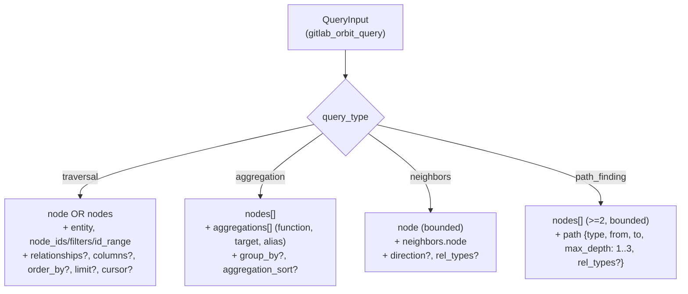
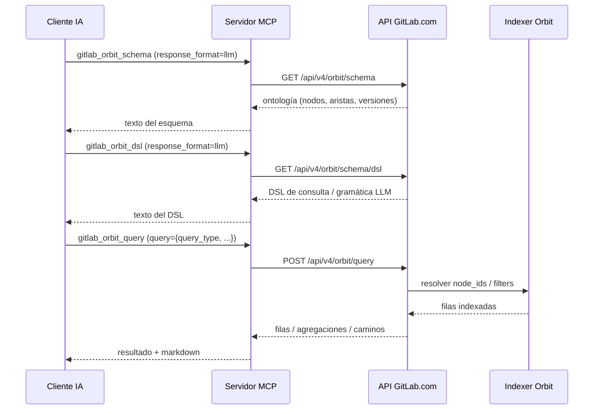

import FAQ from "../../../../components/FAQ.astro";

Orbit expone la API experimental Knowledge Graph de GitLab.com mediante **seis herramientas MCP de solo lectura** —`status`, `schema`, `tools`, `dsl`, `query` y `graph_status`—. Solo está disponible cuando el servidor se conecta a `https://gitlab.com` y el catálogo Enterprise/Premium está habilitado con Ultimate (`GITLAB_TIER=ultimate`, o `--tier=ultimate` en modo HTTP). La variable de entorno heredada `GITLAB_ENTERPRISE=true` sigue funcionando en modo stdio como alternativa, pero está deprecada; el modo HTTP solo lee `--tier`. Orbit nunca escribe: cada herramienta inspecciona salud, esquema o datos indexados, o ejecuta una consulta de solo lectura sobre el grafo.

:::note[Referencia técnica]
Para la referencia generada completa, consulta [`docs/tools/orbit.md`](https://github.com/jmrplens/gitlab-mcp-server/blob/main/docs/reference/tools/orbit.md) en el repositorio.
:::

## ¿Cuándo está disponible Orbit?

Orbit solo se registra en conexiones a GitLab.com Ultimate. Requiere el host `https://gitlab.com` **y** el catálogo Enterprise/Premium habilitado con Ultimate. En la superficie dinámica predeterminada sus seis acciones son las entradas `orbit.*` del catálogo, accesibles con `gitlab_find_action` y `gitlab_execute_action`; con `GITLAB_MCP_TOOL_SURFACE=meta` es la única herramienta `gitlab_orbit` con seis acciones; con `GITLAB_MCP_TOOL_SURFACE=individual` son seis herramientas `gitlab_orbit_*`. Todas las herramientas Orbit son de solo lectura.

| Requisito                            | Valor                                               |
| ------------------------------------ | --------------------------------------------------- |
| Host de GitLab                       | `https://gitlab.com`                                |
| Catálogo                             | Enterprise/Premium                                  |
| Superficie dinámica (predeterminada) | Acciones `orbit.*` mediante `gitlab_execute_action` |
| Modo meta-herramientas               | `gitlab_orbit` con seis acciones                    |
| Modo individual                      | Seis herramientas `gitlab_orbit_*`                  |
| Comportamiento de escritura          | Solo lectura                                        |

Las instancias GitLab autoalojadas no registran herramientas Orbit, incluso cuando el catálogo Enterprise/Premium está habilitado.

## Acciones

| Acción         | ID canónico          | Herramienta individual      | Propósito                                                                      |
| -------------- | -------------------- | --------------------------- | ------------------------------------------------------------------------------ |
| `status`       | `orbit.status`       | `gitlab_orbit_status`       | Comprobar la salud del servicio Orbit y el estado de sus componentes           |
| `schema`       | `orbit.schema`       | `gitlab_orbit_schema`       | Inspeccionar la ontología del grafo y ampliar definiciones de nodos            |
| `tools`        | `orbit.tools`        | `gitlab_orbit_tools`        | Descubrir el manifiesto vivo de consultas Orbit                                |
| `dsl`          | `orbit.dsl`          | `gitlab_orbit_dsl`          | Obtener el esquema DSL o gramática LLM de Orbit                                |
| `query`        | `orbit.query`        | `gitlab_orbit_query`        | Ejecutar un objeto de consulta de solo lectura sobre el Knowledge Graph        |
| `graph_status` | `orbit.graph_status` | `gitlab_orbit_graph_status` | Inspeccionar el estado de indexación de un namespace, proyecto o ruta completa |

El nombre de la acción es lo que la meta-herramienta `gitlab_orbit` recibe en `action`; el ID canónico es lo que recibe `gitlab_execute_action` en la superficie dinámica predeterminada.

## ¿Cuál es el flujo típico?

El flujo típico de Orbit descubre primero el esquema vivo y luego ejecuta una consulta tipada —nunca al revés—, porque la ontología y el DSL que sirve GitLab.com pueden cambiar. Confirma que el servicio está activo con `status`, inspecciona el grafo con `schema`, obtén el manifiesto vivo de consultas con `tools`, opcionalmente recupera la gramática DSL con `dsl`, y luego envía un objeto de consulta a `query`.

1. Ejecuta la acción `status` (`gitlab_execute_action` con `action: "orbit.status"` en la superficie predeterminada; `gitlab_orbit` con `action: "status"` cuando `GITLAB_MCP_TOOL_SURFACE=meta`) para confirmar que el servicio está disponible.
2. Ejecuta `schema` para inspeccionar dominios, nodos y relaciones del grafo.
3. Ejecuta `tools` antes de `query` para obtener el schema vivo de consultas servido por GitLab.com.
4. (Opcional) Ejecuta `dsl` para obtener el esquema DSL o gramática LLM de Orbit.
5. Pasa un objeto JSON de consulta a `query` con `response_format` en `raw` o `llm`.

### Variantes del DSL de consulta

El parámetro `query` de la acción `query` es un objeto JSON cuyo `query_type` selecciona una de cuatro variantes. El siguiente diagrama resume la forma mínima aceptada para cada variante. Un `graph TD` de Mermaid es la herramienta adecuada porque las cuatro variantes comparten un único discriminador `query_type` y solo divergen en las claves hermanas; un árbol hace que los discriminantes y campos requeridos sean legibles de un vistazo.



### Flujo descubrir → consultar

El patrón recomendado es descubrir primero el esquema vivo (`schema`, y opcionalmente `dsl`) y luego ejecutar una consulta tipada mediante `query`. Un `sequenceDiagram` es la herramienta adecuada porque los pasos involucran a cuatro actores distintos (cliente de IA, servidor MCP, GitLab.com e indexer de Orbit) y los límites de respuesta importan: el LLM no debe asumir que el esquema devuelto por `dsl` es estable.



Los ejemplos siguientes usan la superficie dinámica predeterminada; con `GITLAB_MCP_TOOL_SURFACE=meta` llama a `gitlab_orbit` en lugar de `gitlab_execute_action` y quita el prefijo `orbit.` de `action`.

### Ejemplo: Comprobar estado de Orbit

```json
{
  "tool": "gitlab_execute_action",
  "arguments": {
    "action": "orbit.status",
    "params": {}
  }
}
```

### Ejemplo: Obtener el esquema del grafo

```json
{
  "tool": "gitlab_execute_action",
  "arguments": {
    "action": "orbit.schema",
    "params": {
      "expand": ["Project", "User"],
      "response_format": "llm"
    }
  }
}
```

### Ejemplo: Obtener el manifiesto de herramientas Orbit

```json
{
  "tool": "gitlab_execute_action",
  "arguments": {
    "action": "orbit.tools",
    "params": {}
  }
}
```

### Ejemplo: Obtener el DSL de consultas Orbit

```json
{
  "tool": "gitlab_execute_action",
  "arguments": {
    "action": "orbit.dsl",
    "params": {
      "response_format": "llm"
    }
  }
}
```

### Ejemplo: Ejecutar una consulta Knowledge Graph

```json
{
  "tool": "gitlab_execute_action",
  "arguments": {
    "action": "orbit.query",
    "params": {
      "query": {
        "query_type": "traversal",
        "node": {
          "id": "p",
          "entity": "Project",
          "filters": {
            "full_path": { "op": "starts_with", "value": "gitlab-org/" }
          },
          "columns": ["id", "full_path"]
        }
      },
      "response_format": "llm"
    }
  }
}
```

### Ejemplo: Comprobar estado de indexación

```json
{
  "tool": "gitlab_execute_action",
  "arguments": {
    "action": "orbit.graph_status",
    "params": {
      "project_id": 278964,
      "response_format": "llm"
    }
  }
}
```

## Detalle de acciones

### `status` — Comprobar salud del servicio Orbit

Devuelve la salud del clúster y el estado de los componentes backend. Útil para verificar si Orbit está disponible para tu token y proyecto.

**Ejemplo:** Ver arriba.

### `schema` — Inspeccionar la ontología del grafo

Devuelve la ontología del grafo Orbit, incluyendo versión, dominios, nodos y aristas. Usa `expand` para obtener definiciones detalladas de nodos. Soporta `response_format` (`raw` o `llm`).

**Ejemplo:** Ver arriba.

### `tools` — Descubrir el manifiesto de herramientas Orbit

Devuelve el manifiesto MCP Orbit vivo. Úsalo antes de `query` para descubrir los esquemas de consulta y parámetros soportados.

**Ejemplo:** Ver arriba.

### `dsl` — Obtener el esquema DSL o gramática LLM de Orbit

Devuelve el DSL de consultas Orbit como JSON Schema (`raw`) o gramática LLM (`llm`). Útil para construcción avanzada de consultas e integración con LLMs.

**Ejemplo:** Ver arriba.

### `query` — Ejecutar una consulta Knowledge Graph

Ejecuta una consulta de solo lectura sobre el Knowledge Graph. El parámetro `query` debe ajustarse al esquema de `tools`. Soporta `response_format` (`raw` o `llm`).

**Ejemplo:** Ver arriba.

### `graph_status` — Inspeccionar estado de indexación

Devuelve el estado de indexación del grafo para un namespace, proyecto o ruta. Útil para saber si un proyecto está indexado y listo para consultas.

**Ejemplo:** Ver arriba.

## ¿Cómo descubro los schemas de consulta?

En cualquier superficie, los schemas de parámetros por acción están disponibles como recursos MCP, así que puedes conocer la forma exacta de `params` de cada acción Orbit sin expandir todos los schemas en `tools/list`; en la superficie dinámica `gitlab_find_action` devuelve el mismo schema inline. Estos recursos siguen disponibles con `GITLAB_MCP_CAPABILITY_SURFACE=full` o `minimal` en cualquier modo de `GITLAB_MCP_META_PARAM_SCHEMA`. La tabla lista los IDs de la superficie predeterminada; con `GITLAB_MCP_TOOL_SURFACE=meta` la entrada es `gitlab://tools/gitlab_orbit.<acción>`.

| Recurso                             | Propósito                                            |
| ----------------------------------- | ---------------------------------------------------- |
| `gitlab://tools/orbit.status`       | Parámetros para comprobar salud del servicio         |
| `gitlab://tools/orbit.schema`       | Parámetros para inspeccionar la ontología            |
| `gitlab://tools/orbit.tools`        | Parámetros para descubrir el manifiesto de consultas |
| `gitlab://tools/orbit.dsl`          | Parámetros para el esquema DSL/gramática             |
| `gitlab://tools/orbit.query`        | Parámetros para consultas Knowledge Graph            |
| `gitlab://tools/orbit.graph_status` | Parámetros para comprobar estado de indexación       |

## ¿Cómo ejecuto las pruebas en vivo?

Orbit incluye una suite de pruebas en vivo protegida por build tag en `test/e2e/orbit/live_test.go` que ejercita cada handler contra los endpoints reales `https://gitlab.com/api/v4/orbit/*`. La suite tiene cuatro puntos de entrada y 41 subtests que cubren los seis handlers, las formas canónicas del DSL de consulta, pruebas de humo basadas en fixtures, y toda la superficie de características del DSL. El orquestador `make test-e2e-gitlab-com` aprovisiona los proyectos `kg-fixtures` y `security-fixtures` en tu namespace (idempotente), espera a que el indexer de Orbit se ponga al día, y luego ejecuta las pruebas:

```bash
# Añade un Personal Access Token (alcance api) a .env primero
echo 'GITLAB_COM_TOKEN=glpat-...' >> .env

# El namespace por defecto es plens1; anúlalo con ORBIT_FIXTURES_NAMESPACE
make test-e2e-gitlab-com ORBIT_FIXTURES_NAMESPACE=acme-research

# Cuando los fixtures ya están aprovisionados, ejecuta solo las pruebas
GITLAB_COM_TOKEN=glpat-... \
  go test -tags orbitlive -count=1 -v -timeout 300s ./test/e2e/orbit/
```

Consulta [Orbit live test fixtures](https://github.com/jmrplens/gitlab-mcp-server/blob/main/docs/development/orbit-fixtures.md) para ver la disposición de los fixtures, el reproductor `scripts/setup-orbit-fixtures.sh`, y la advertencia sobre el indexer (el estado `error` transitorio es normal y las pruebas son informativas, no de igualdad estricta).

<FAQ />
