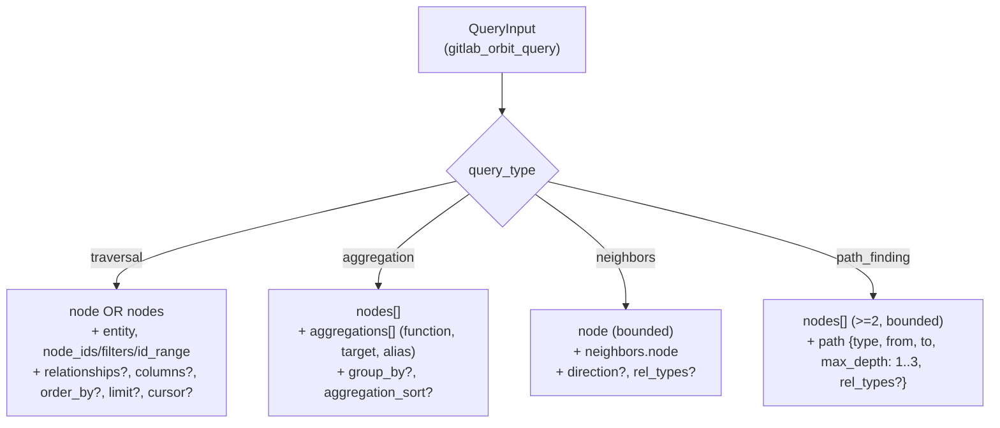
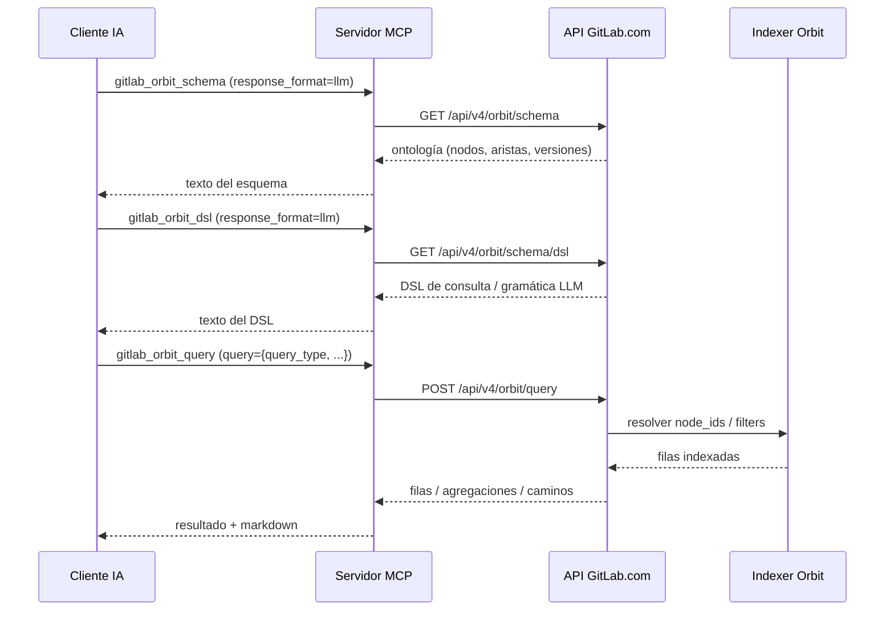

Orbit expone la API experimental Knowledge Graph de GitLab.com mediante seis herramientas MCP de solo lectura. Solo está disponible cuando el servidor se conecta a `https://gitlab.com` y el catálogo Enterprise/Premium está habilitado con `GITLAB_TIER=ultimate` (o `--tier=ultimate` en modo HTTP). Los flags heredados `GITLAB_ENTERPRISE=true`/`--enterprise` siguen funcionando pero están deprecados.

:::note[Referencia técnica]
Para la referencia generada completa, consulta [`docs/tools/orbit.md`](https://github.com/jmrplens/gitlab-mcp-server/blob/main/docs/tools/orbit.md) en el repositorio.
:::

## Disponibilidad

| Requisito                   | Valor                              |
| --------------------------- | ---------------------------------- |
| Host de GitLab              | `https://gitlab.com`               |
| Catálogo                    | Enterprise/Premium                 |
| Modo meta-herramientas      | `gitlab_orbit` con seis acciones   |
| Modo individual             | Seis herramientas `gitlab_orbit_*` |
| Comportamiento de escritura | Solo lectura                       |

Las instancias GitLab autoalojadas no registran herramientas Orbit, incluso cuando el catálogo Enterprise/Premium está habilitado.

## Acciones

| Acción         | Herramienta individual      | Propósito                                                                      |
| -------------- | --------------------------- | ------------------------------------------------------------------------------ |
| `status`       | `gitlab_orbit_status`       | Comprobar la salud del servicio Orbit y el estado de sus componentes           |
| `schema`       | `gitlab_orbit_schema`       | Inspeccionar la ontología del grafo y ampliar definiciones de nodos            |
| `tools`        | `gitlab_orbit_tools`        | Descubrir el manifiesto vivo de consultas Orbit                                |
| `dsl`          | `gitlab_orbit_dsl`          | Obtener el esquema DSL o gramática LLM de Orbit                                |
| `query`        | `gitlab_orbit_query`        | Ejecutar un objeto de consulta de solo lectura sobre el Knowledge Graph        |
| `graph_status` | `gitlab_orbit_graph_status` | Inspeccionar el estado de indexación de un namespace, proyecto o ruta completa |

## Flujo típico

1. Llama a `gitlab_orbit` con `action: "status"` para confirmar que el servicio está disponible.
2. Llama a `action: "schema"` para inspeccionar dominios, nodos y relaciones del grafo.
3. Llama a `action: "tools"` antes de `action: "query"` para obtener el schema vivo de consultas servido por GitLab.com.
4. (Opcional) Llama a `action: "dsl"` para obtener el esquema DSL o gramática LLM de Orbit.
5. Pasa un objeto JSON de consulta a `action: "query"` con `response_format` en `raw` o `llm`.

### Variantes del DSL de consulta

El parámetro `query` de la acción `query` es un objeto JSON cuyo `query_type` selecciona una de cuatro variantes. El siguiente diagrama resume la forma mínima aceptada para cada variante. Un `graph TD` de Mermaid es la herramienta adecuada porque las cuatro variantes comparten un único discriminador `query_type` y solo divergen en las claves hermanas; un árbol hace que los discriminantes y campos requeridos sean legibles de un vistazo.



### Flujo descubrir → consultar

El patrón recomendado es descubrir primero el esquema vivo (`schema`, y opcionalmente `dsl`) y luego ejecutar una consulta tipada mediante `query`. Un `sequenceDiagram` es la herramienta adecuada porque los pasos involucran a cuatro actores distintos (cliente de IA, servidor MCP, GitLab.com e indexer de Orbit) y los límites de respuesta importan: el LLM no debe asumir que el esquema devuelto por `dsl` es estable.



### Ejemplo: Comprobar estado de Orbit

```json
{
	"tool": "gitlab_orbit",
	"arguments": {
		"action": "status"
	}
}
```

### Ejemplo: Obtener el esquema del grafo

```json
{
	"tool": "gitlab_orbit",
	"arguments": {
		"action": "schema",
		"params": {
			"expand": ["Project", "User"],
			"response_format": "llm"
		}
	}
}
```

### Ejemplo: Obtener el manifiesto de herramientas Orbit

```json
{
	"tool": "gitlab_orbit",
	"arguments": {
		"action": "tools"
	}
}
```

### Ejemplo: Obtener el DSL de consultas Orbit

```json
{
	"tool": "gitlab_orbit",
	"arguments": {
		"action": "dsl",
		"params": {
			"response_format": "llm"
		}
	}
}
```

### Ejemplo: Ejecutar una consulta Knowledge Graph

```json
{
	"tool": "gitlab_orbit",
	"arguments": {
		"action": "query",
		"params": {
			"query": {
				"query_type": "traversal",
				"node": {
					"id": "p",
					"entity": "Project",
					"filters": {
						"full_path": { "op": "starts_with", "value": "gitlab-org/" }
					},
					"columns": ["id", "full_path"]
				}
			},
			"response_format": "llm"
		}
	}
}
```

### Ejemplo: Comprobar estado de indexación

```json
{
	"tool": "gitlab_orbit",
	"arguments": {
		"action": "graph_status",
		"params": {
			"project_id": 278964,
			"response_format": "llm"
		}
	}
}
```

## Detalle de acciones

### `status` — Comprobar salud del servicio Orbit

Devuelve la salud del clúster y el estado de los componentes backend. Útil para verificar si Orbit está disponible para tu token y proyecto.

**Ejemplo:** Ver arriba.

### `schema` — Inspeccionar la ontología del grafo

Devuelve la ontología del grafo Orbit, incluyendo versión, dominios, nodos y aristas. Usa `expand` para obtener definiciones detalladas de nodos. Soporta `response_format` (`raw` o `llm`).

**Ejemplo:** Ver arriba.

### `tools` — Descubrir el manifiesto de herramientas Orbit

Devuelve el manifiesto MCP Orbit vivo. Úsalo antes de `query` para descubrir los esquemas de consulta y parámetros soportados.

**Ejemplo:** Ver arriba.

### `dsl` — Obtener el esquema DSL o gramática LLM de Orbit

Devuelve el DSL de consultas Orbit como JSON Schema (`raw`) o gramática LLM (`llm`). Útil para construcción avanzada de consultas e integración con LLMs.

**Ejemplo:** Ver arriba.

### `query` — Ejecutar una consulta Knowledge Graph

Ejecuta una consulta de solo lectura sobre el Knowledge Graph. El parámetro `query` debe ajustarse al esquema de `tools`. Soporta `response_format` (`raw` o `llm`).

**Ejemplo:** Ver arriba.

### `graph_status` — Inspeccionar estado de indexación

Devuelve el estado de indexación del grafo para un namespace, proyecto o ruta. Útil para saber si un proyecto está indexado y listo para consultas.

**Ejemplo:** Ver arriba.

## Descubrimiento de schemas

En modo meta-herramientas, los schemas de parámetros por acción están disponibles como recursos MCP:

| Recurso                                    | Propósito                                            |
| ------------------------------------------ | ---------------------------------------------------- |
| `gitlab://tools/gitlab_orbit.status`       | Parámetros para comprobar salud del servicio         |
| `gitlab://tools/gitlab_orbit.schema`       | Parámetros para inspeccionar la ontología            |
| `gitlab://tools/gitlab_orbit.tools`        | Parámetros para descubrir el manifiesto de consultas |
| `gitlab://tools/gitlab_orbit.dsl`          | Parámetros para el esquema DSL/gramática             |
| `gitlab://tools/gitlab_orbit.query`        | Parámetros para consultas Knowledge Graph            |
| `gitlab://tools/gitlab_orbit.graph_status` | Parámetros para comprobar estado de indexación       |

Estos recursos siguen disponibles con `CAPABILITY_SURFACE=full` o `minimal` en cualquier modo de `META_PARAM_SCHEMA`.

## Ejecutar las pruebas en vivo

Orbit incluye una suite de pruebas en vivo protegida por build tag en `test/e2e/orbit/live_test.go` que ejercita cada handler contra los endpoints reales `https://gitlab.com/api/v4/orbit/*`. La suite tiene cuatro puntos de entrada y 41 subtests que cubren los seis handlers, las formas canónicas del DSL de consulta, pruebas de humo basadas en fixtures, y toda la superficie de características del DSL. El orquestador `make test-e2e-gitlab-com` aprovisiona los proyectos `kg-fixtures` y `security-fixtures` en tu namespace (idempotente), espera a que el indexer de Orbit se ponga al día, y luego ejecuta las pruebas:

```bash
# Añade un Personal Access Token (alcance api) a .env primero
echo 'GITLAB_COM_TOKEN=glpat-...' >> .env

# El namespace por defecto es plens1; anúlalo con ORBIT_FIXTURES_NAMESPACE
make test-e2e-gitlab-com ORBIT_FIXTURES_NAMESPACE=acme-research

# Cuando los fixtures ya están aprovisionados, ejecuta solo las pruebas
GITLAB_COM_TOKEN=glpat-... \
  go test -tags orbitlive -count=1 -v -timeout 300s ./test/e2e/orbit/
```

Consulta [Orbit live test fixtures](https://github.com/jmrplens/gitlab-mcp-server/blob/main/docs/development/orbit-fixtures.md) para ver la disposición de los fixtures, el reproductor `scripts/setup-orbit-fixtures.sh`, y la advertencia sobre el indexer (el estado `error` transitorio es normal y las pruebas son informativas, no de igualdad estricta).
