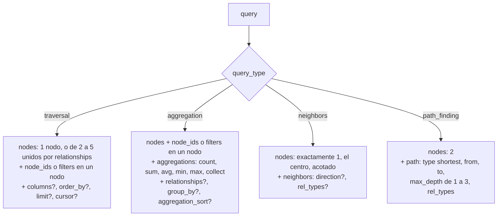
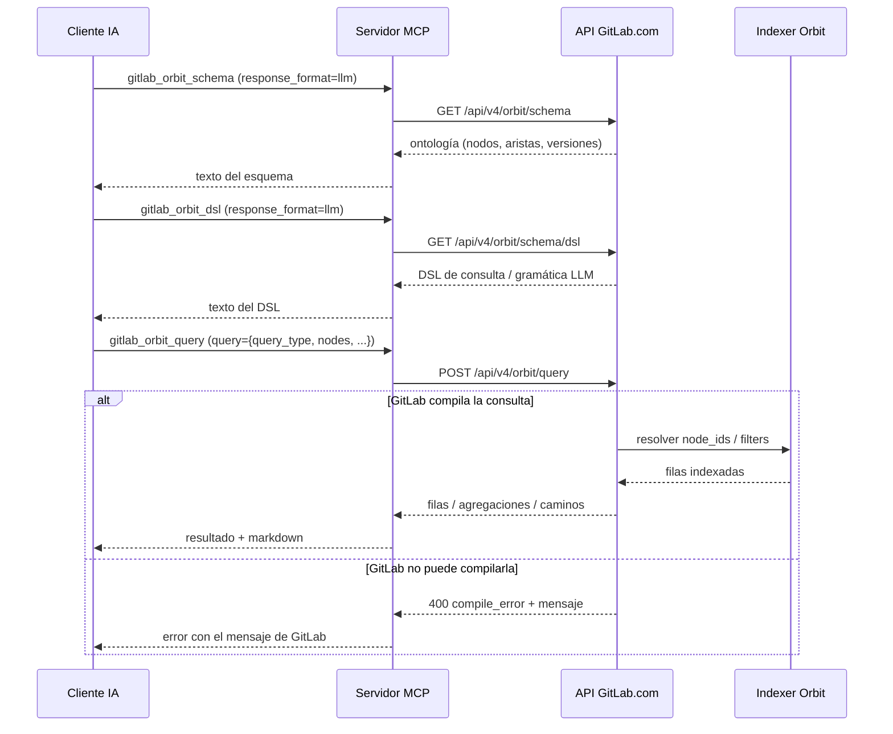

import FAQ from "../../../../components/FAQ.astro";

Orbit expone la API experimental Knowledge Graph de GitLab.com mediante **seis herramientas MCP de solo lectura**: `status`, `schema`, `tools`, `dsl`, `query` y `graph_status`. Solo está disponible cuando el servidor se conecta a `https://gitlab.com` y el nivel resuelto es Premium o Ultimate (`GITLAB_MCP_TIER=premium` o `GITLAB_MCP_TIER=ultimate`, `--tier=premium` o `--tier=ultimate` en modo HTTP, o el nivel detectado a partir de la licencia de la instancia y después de los planes de los namespaces). La variable de entorno `GITLAB_ENTERPRISE` se eliminó en 3.0.0 y se ignora. Orbit nunca escribe: cada herramienta inspecciona salud, esquema o datos indexados, o ejecuta una consulta de solo lectura sobre el grafo.

:::note[Referencia técnica]
Para cada acción con sus parámetros, consulta la página [Grafo de conocimiento Orbit](/gitlab-mcp-server/es/reference/tools/orbit/) de la referencia de herramientas.
:::

## ¿Cuándo está disponible Orbit?

Orbit solo se registra en conexiones a GitLab.com con nivel Premium o Ultimate. Requiere el host `https://gitlab.com` **y** un nivel resuelto de Premium o Ultimate. En la superficie dinámica predeterminada sus seis acciones son las entradas `orbit.*` del catálogo, accesibles con `gitlab_find_action` y `gitlab_execute_action`; con `GITLAB_MCP_TOOL_SURFACE=meta` es la única herramienta `gitlab_orbit` con seis acciones; con `GITLAB_MCP_TOOL_SURFACE=individual` son seis herramientas `gitlab_orbit_*`. Todas las herramientas Orbit son de solo lectura.

| Requisito                            | Valor                                               |
| ------------------------------------ | --------------------------------------------------- |
| Host de GitLab                       | `https://gitlab.com`                                |
| Nivel                                | Premium o Ultimate                                  |
| Superficie dinámica (predeterminada) | Acciones `orbit.*` mediante `gitlab_execute_action` |
| Modo meta-herramientas               | `gitlab_orbit` con seis acciones                    |
| Modo individual                      | Seis herramientas `gitlab_orbit_*`                  |
| Comportamiento de escritura          | Solo lectura                                        |

Las instancias GitLab autoalojadas no registran herramientas Orbit, incluso en un nivel Premium o Ultimate.

## Acciones

| Acción         | ID canónico          | Herramienta individual      | Propósito                                                                      |
| -------------- | -------------------- | --------------------------- | ------------------------------------------------------------------------------ |
| `status`       | `orbit.status`       | `gitlab_orbit_status`       | Comprobar la salud del servicio Orbit y el estado de sus componentes           |
| `schema`       | `orbit.schema`       | `gitlab_orbit_schema`       | Inspeccionar la ontología del grafo y ampliar definiciones de nodos            |
| `tools`        | `orbit.tools`        | `gitlab_orbit_tools`        | Listar el manifiesto de herramientas MCP que sirve Orbit                       |
| `dsl`          | `orbit.dsl`          | `gitlab_orbit_dsl`          | Obtener el esquema DSL o gramática LLM de Orbit                                |
| `query`        | `orbit.query`        | `gitlab_orbit_query`        | Ejecutar un objeto de consulta de solo lectura sobre el Knowledge Graph        |
| `graph_status` | `orbit.graph_status` | `gitlab_orbit_graph_status` | Inspeccionar el estado de indexación de un namespace, proyecto o ruta completa |

El nombre de la acción es lo que la meta-herramienta `gitlab_orbit` recibe en `action`; el ID canónico es lo que recibe `gitlab_execute_action` en la superficie dinámica predeterminada.

## ¿Cuál es el flujo típico?

El flujo típico de Orbit aprende primero el lenguaje de consulta y el grafo, y consulta después, porque el DSL y la ontología que sirve GitLab.com cambian durante la beta. Confirma que el servicio está activo con `status`, lee el lenguaje de consulta con `dsl` y el grafo con `schema`, y luego envía un objeto de consulta a `query`.

1. Ejecuta la acción `status` (`gitlab_execute_action` con `action: "orbit.status"` en la superficie predeterminada; `gitlab_orbit` con `action: "status"` cuando `GITLAB_MCP_TOOL_SURFACE=meta`) para confirmar que el servicio está disponible.
2. Ejecuta `dsl` para obtener el lenguaje de consulta, como JSON Schema (`raw`) o como gramática compacta (`llm`).
3. Ejecuta `schema` para obtener las entidades, sus propiedades y los tipos de relación entre ellas.
4. (Opcional) Ejecuta `tools` para obtener el manifiesto de herramientas MCP que sirve Orbit, con el esquema de parámetros de cada una de sus herramientas.
5. Pasa un objeto JSON de consulta a `query` con `response_format` en `raw` o `llm`.

### Variantes del DSL de consulta

El parámetro `query` de la acción `query` es una consulta en la versión 12 del DSL de consultas de Orbit (`graph_query/v12`, el esquema que devuelve `dsl`). Toda consulta lleva un `query_type` y una lista `nodes`, aunque tenga un solo nodo, y el `query_type` decide qué más necesita. El diagrama resume la forma mínima que GitLab.com ejecuta para cada tipo. Un `graph TD` de Mermaid encaja porque los cuatro tipos comparten un único discriminador y solo difieren en las claves que lo acompañan.


```mermaid
graph TD
    Q["query"] --> QT{"query_type"}
    QT -->|"traversal"| TR["nodes: 1 nodo, o de 2 a 5 unidos por relationships<br/>+ node_ids o filters en un nodo<br/>+ columns?, order_by?, limit?, cursor?"]
    QT -->|"aggregation"| AG["nodes + node_ids o filters en un nodo<br/>+ aggregations: count, sum, avg, min, max, collect<br/>+ relationships?, group_by?, aggregation_sort?"]
    QT -->|"neighbors"| NB["nodes: exactamente 1, el centro, acotado<br/>+ neighbors: direction?, rel_types?"]
    QT -->|"path_finding"| PF["nodes: 2<br/>+ path: type shortest, from, to,<br/>max_depth de 1 a 3, rel_types"]
```

Las reglas en las que más se equivoca un modelo. Las tres primeras rechazan una forma anterior del DSL, la que también enseñaba este servidor antes de pasar a la versión 12, y la agregación con su función como clave es nueva en la versión 12:

- **Sin `node` en el primer nivel.** Los selectores de nodo van en `nodes`, que GitLab exige, y un `node` en el primer nivel se rechaza.
- **Un filtro es un valor sin más o un objeto con operadores como claves.** `{"full_path": "gitlab-org/gitlab"}` coincide con un valor, y `{"full_path": {"starts_with": "gitlab-org/"}}` o `{"star_count": {"gte": 1, "lt": 9}}` aplican operadores. Los operadores son `eq`, `ne`, `gt`, `lt`, `gte`, `lte`, `in`, `contains`, `starts_with`, `ends_with`, `is_null`, `is_not_null`, `token_match`, `all_tokens` y `any_tokens`. Un objeto `{"op": ..., "value": ...}` se rechaza.
- **Una consulta neighbors no nombra ningún nodo dentro de `neighbors`.** Su centro es su único nodo, y `neighbors` solo contiene `direction` y `rel_types`. La dirección por defecto es `outgoing`, así que una consulta que quiera todas las relaciones del centro pasa `"both"`: el grupo, el creador y las etiquetas de un proyecto se alcanzan por relaciones entrantes.
- **Una consulta de camino nombra sus tipos de relación.** `rel_types` es obligatorio, `["*"]` para cualquier tipo, cada relación se recorre solo en su dirección definida, y `shortest` es el único tipo de camino.
- **Las agregaciones, la agrupación y el orden son compactos.** Una agregación lleva su función como clave, `{"count": "mr", "as": "mr_count"}`. Una entrada de `group_by` es el id de un nodo, o el id de un nodo y una propiedad unidos por un punto. `order_by` y `aggregation_sort` son cadenas, con un `-` delante para orden descendente.
- **Un traversal o una aggregation está acotado.** Al menos un nodo lleva `node_ids` o `filters`, y una consulta neighbors acota su centro del mismo modo. GitLab rechaza una consulta sin acotar en lugar de recorrer todas las aristas.

### Cuando GitLab rechaza una consulta

El servidor solo comprueba que se haya dado una consulta y que se codifique como JSON; del resto juzga GitLab. A una consulta que no puede compilar responde con `400` y un mensaje que nombra el fallo, que llega al modelo en el texto del error junto con una sugerencia para corregir la consulta a partir de `dsl` y `schema`:

```text
orbit_query: bad request: check your input parameters ({code: compile_error}, {message: schema violation: "nodes" is a required property at ; Additional properties are not allowed ('node' was unexpected) at }). Suggestion: correct the query where GitLab's message points. orbit.dsl serves the query language and orbit.schema the entities, properties and relationship types it accepts: POST https://gitlab.com/api/v4/orbit/query: 400 ...
```

A un nombre que GitLab no conoce responde con todos los que sí conoce, como la lista completa de tipos de relación ante un `IN_PROJECT` mal escrito, así que la corrección suele estar en el propio mensaje.

### Flujo descubrir → consultar

El patrón recomendado es leer primero el grafo con `schema` y el lenguaje de consulta con `dsl`, y luego ejecutar una consulta mediante `query`. Un `sequenceDiagram` encaja porque los pasos involucran a cuatro actores distintos (cliente de IA, servidor MCP, GitLab.com e indexer de Orbit) y los límites de respuesta importan: el LLM no debe asumir que el DSL que devuelve `dsl` es estable, y una consulta que GitLab no puede compilar vuelve con la explicación del propio GitLab.


```mermaid
sequenceDiagram
    participant LLM as Cliente IA
    participant MCP as Servidor MCP
    participant GL as API GitLab.com
    participant IDX as Indexer Orbit

    LLM->>MCP: gitlab_orbit_schema (response_format=llm)
    MCP->>GL: GET /api/v4/orbit/schema
    GL-->>MCP: ontología (nodos, aristas, versiones)
    MCP-->>LLM: texto del esquema

    LLM->>MCP: gitlab_orbit_dsl (response_format=llm)
    MCP->>GL: GET /api/v4/orbit/schema/dsl
    GL-->>MCP: DSL de consulta / gramática LLM
    MCP-->>LLM: texto del DSL

    LLM->>MCP: gitlab_orbit_query (query={query_type, nodes, ...})
    MCP->>GL: POST /api/v4/orbit/query
    alt GitLab compila la consulta
        GL->>IDX: resolver node_ids / filters
        IDX-->>GL: filas indexadas
        GL-->>MCP: filas / agregaciones / caminos
        MCP-->>LLM: resultado + markdown
    else GitLab no puede compilarla
        GL-->>MCP: 400 compile_error + mensaje
        MCP-->>LLM: error con el mensaje de GitLab
    end
```

Los ejemplos siguientes usan la superficie dinámica predeterminada; con `GITLAB_MCP_TOOL_SURFACE=meta` llama a `gitlab_orbit` en lugar de `gitlab_execute_action` y quita el prefijo `orbit.` de `action`.

### Ejemplo: Comprobar estado de Orbit

```json
{
  "tool": "gitlab_execute_action",
  "arguments": {
    "action": "orbit.status",
    "params": {}
  }
}
```

### Ejemplo: Obtener el esquema del grafo

```json
{
  "tool": "gitlab_execute_action",
  "arguments": {
    "action": "orbit.schema",
    "params": {
      "expand": ["Project", "User"],
      "response_format": "llm"
    }
  }
}
```

### Ejemplo: Obtener el manifiesto de herramientas Orbit

```json
{
  "tool": "gitlab_execute_action",
  "arguments": {
    "action": "orbit.tools",
    "params": {}
  }
}
```

### Ejemplo: Obtener el DSL de consultas Orbit

```json
{
  "tool": "gitlab_execute_action",
  "arguments": {
    "action": "orbit.dsl",
    "params": {
      "response_format": "llm"
    }
  }
}
```

### Ejemplo: Ejecutar una consulta Knowledge Graph

```json
{
  "tool": "gitlab_execute_action",
  "arguments": {
    "action": "orbit.query",
    "params": {
      "query": {
        "query_type": "traversal",
        "nodes": [
          {
            "id": "p",
            "entity": "Project",
            "filters": {
              "full_path": { "starts_with": "gitlab-org/" }
            },
            "columns": ["id", "full_path"]
          }
        ],
        "limit": 20
      },
      "response_format": "llm"
    }
  }
}
```

### Ejemplo: Contar merge requests por proyecto

```json
{
  "tool": "gitlab_execute_action",
  "arguments": {
    "action": "orbit.query",
    "params": {
      "query": {
        "query_type": "aggregation",
        "nodes": [
          {
            "id": "p",
            "entity": "Project",
            "filters": { "full_path": { "starts_with": "gitlab-org/" } }
          },
          { "id": "mr", "entity": "MergeRequest" }
        ],
        "relationships": [{ "type": "IN_PROJECT", "from": "mr", "to": "p" }],
        "group_by": ["p"],
        "aggregations": [{ "count": "mr", "as": "mr_count" }],
        "aggregation_sort": "-mr_count"
      }
    }
  }
}
```

### Ejemplo: Todo aquello con lo que se relaciona un proyecto

```json
{
  "tool": "gitlab_execute_action",
  "arguments": {
    "action": "orbit.query",
    "params": {
      "query": {
        "query_type": "neighbors",
        "nodes": [
          {
            "id": "p",
            "entity": "Project",
            "filters": { "full_path": "gitlab-org/gitlab" }
          }
        ],
        "neighbors": { "direction": "both" },
        "limit": 50
      }
    }
  }
}
```

### Ejemplo: Un camino de un usuario a un proyecto

```json
{
  "tool": "gitlab_execute_action",
  "arguments": {
    "action": "orbit.query",
    "params": {
      "query": {
        "query_type": "path_finding",
        "nodes": [
          { "id": "u", "entity": "User", "node_ids": [1] },
          { "id": "p", "entity": "Project", "node_ids": [278964] }
        ],
        "path": {
          "type": "shortest",
          "from": "u",
          "to": "p",
          "max_depth": 3,
          "rel_types": ["*"]
        }
      }
    }
  }
}
```

### Ejemplo: Comprobar estado de indexación

```json
{
  "tool": "gitlab_execute_action",
  "arguments": {
    "action": "orbit.graph_status",
    "params": {
      "project_id": 278964,
      "response_format": "llm"
    }
  }
}
```

## Detalle de acciones

### `status` — Comprobar salud del servicio Orbit

Devuelve la salud del clúster y el estado de los componentes backend. Útil para verificar si Orbit está disponible para tu token y proyecto.

**Ejemplo:** Ver arriba.

### `schema` — Inspeccionar la ontología del grafo

Devuelve la ontología del grafo Orbit, incluyendo versión, dominios, nodos y aristas. Usa `expand` para obtener definiciones detalladas de nodos. Soporta `response_format` (`raw` o `llm`).

**Ejemplo:** Ver arriba.

### `tools` — Descubrir el manifiesto de herramientas Orbit

Devuelve el manifiesto de herramientas MCP que sirve Orbit, con el esquema de parámetros de cada una de sus herramientas. El lenguaje de consulta en sí es lo que devuelve `dsl`.

**Ejemplo:** Ver arriba.

### `dsl` — Obtener el esquema DSL o gramática LLM de Orbit

Devuelve el DSL de consultas Orbit como JSON Schema (`raw`) o gramática LLM (`llm`). Útil para construcción avanzada de consultas e integración con LLMs.

**Ejemplo:** Ver arriba.

### `query` — Ejecutar una consulta Knowledge Graph

Ejecuta una consulta de solo lectura sobre el Knowledge Graph. El parámetro `query` es una consulta en el DSL que devuelve `dsl`, hoy la versión 12, que nombra entidades, propiedades y tipos de relación que lista `schema`. GitLab juzga la consulta y responde a la que no puede ejecutar con un mensaje que nombra el fallo, y el servidor lo transmite. Soporta `response_format` (`raw` o `llm`).

**Ejemplo:** Ver arriba.

### `graph_status` — Inspeccionar estado de indexación

Devuelve el estado de indexación del grafo para un namespace, proyecto o ruta. Útil para saber si un proyecto está indexado y listo para consultas.

**Ejemplo:** Ver arriba.

## ¿Cómo descubro los schemas de consulta?

En cualquier superficie, los schemas de parámetros por acción están disponibles como recursos MCP, así que puedes conocer la forma exacta de `params` de cada acción Orbit sin expandir todos los schemas en `tools/list`; en la superficie dinámica `gitlab_find_action` devuelve el mismo schema inline. Estos recursos siguen disponibles con `GITLAB_MCP_CAPABILITY_SURFACE=full` o `minimal` en cualquier modo de `GITLAB_MCP_META_PARAM_SCHEMA`. La tabla lista los IDs de la superficie predeterminada; con `GITLAB_MCP_TOOL_SURFACE=meta` la entrada es `gitlab://tools/gitlab_orbit.<acción>`.

| Recurso                             | Propósito                                            |
| ----------------------------------- | ---------------------------------------------------- |
| `gitlab://tools/orbit.status`       | Parámetros para comprobar salud del servicio         |
| `gitlab://tools/orbit.schema`       | Parámetros para inspeccionar la ontología            |
| `gitlab://tools/orbit.tools`        | Parámetros para descubrir el manifiesto de consultas |
| `gitlab://tools/orbit.dsl`          | Parámetros para el esquema DSL/gramática             |
| `gitlab://tools/orbit.query`        | Parámetros para consultas Knowledge Graph            |
| `gitlab://tools/orbit.graph_status` | Parámetros para comprobar estado de indexación       |

<FAQ />
