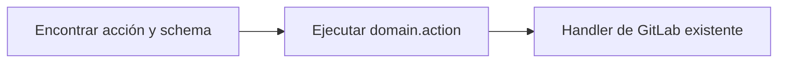

import stats from "../../../../data/stats.json";

:::note[Documentación para desarrolladores]
Esta página es la visión general orientada a usuarios. Para la referencia completa de herramientas por dominio, consulta [docs/reference/tools](https://github.com/jmrplens/gitlab-mcp-server/blob/main/docs/reference/tools/README.md).
:::

GitLab MCP Server expone las operaciones de GitLab como herramientas MCP que los asistentes de IA pueden invocar directamente. Ofrece **tres modos de herramientas** —dinámico, meta-herramientas e individual— que exponen la misma superficie de API de GitLab con distinto empaquetado, de modo que puedes equilibrar el coste de contexto del LLM con la granularidad de la lista de herramientas sin perder ninguna capacidad.

Los tres modos se proyectan desde un único **catálogo canónico de acciones**, por lo que comparten los mismos handlers, esquemas tipados y comportamiento de seguridad. Solo se diferencian en cómo se presentan las operaciones al asistente: el modo dinámico busca y ejecuta IDs canónicos `domain.action`, el modo meta-herramientas agrupa acciones por dominio y el modo individual registra una herramienta por operación.

## ¿Qué modo de herramientas debería usar?

Elige el modo que se ajuste a cómo tu cliente MCP descubre herramientas y a cuánto presupuesto de contexto puedes dedicar a la lista de herramientas. **El modo dinámico es el predeterminado y la opción adecuada para la mayoría de los asistentes**, porque mantiene solo dos herramientas en el contexto del modelo y aun así alcanza cualquier operación de GitLab. Pasa al modo meta-herramientas cuando tu cliente funcione mejor con una lista fija de herramientas a nivel de dominio, y usa el modo individual solo cuando un cliente necesite enumerar por adelantado todas las operaciones.

| Modo                     | Herramientas públicas expuestas                                     | Ideal para                                               | Coste relativo de tokens |
| ------------------------ | ------------------------------------------------------------------- | -------------------------------------------------------- | ------------------------ |
| **Dinámico** _(predet.)_ | 2 — `gitlab_find_action`, `gitlab_execute_action`                   | La mayoría de asistentes; mínimo coste de contexto       | El más bajo              |
| **Meta-herramientas**    | {stats.meta.base} herramientas de dominio base (más con Enterprise) | Una lista fija y explorable a nivel de dominio           | Medio                    |
| **Individual**           | {stats.tools.free}–{stats.tools.gitlab_com} herramientas            | Clientes que necesitan todas las operaciones de antemano | El más alto              |

Define el modo con la variable de entorno `TOOL_SURFACE` (`dynamic`, `meta` o `individual`). El modo dinámico se usa cuando `TOOL_SURFACE` no está definido.

## Modos de operación

### ¿Cómo funciona el modo individual?

El modo individual registra **una herramienta MCP por operación de GitLab**: **{stats.tools.free} herramientas** para CE, **{stats.tools.ultimate_self_managed} herramientas** para Enterprise/Premium autoalojado, o **{stats.tools.gitlab_com} herramientas** en GitLab.com Enterprise/Premium cuando Orbit está disponible. Esto ofrece al asistente la máxima granularidad —cada operación es una herramienta distinta y descrita individualmente— a costa de un consumo significativo de tokens de contexto al listar y desambiguar herramientas durante el descubrimiento.

### ¿Cómo funciona el modo meta-herramientas?

El modo meta-herramientas (`TOOL_SURFACE=meta`) consolida operaciones relacionadas en **meta-herramientas a nivel de dominio**. Cada meta-herramienta acepta un parámetro `action` que enruta al handler apropiado, reduciendo el recuento a **{stats.meta.base} meta-herramientas base**, **{stats.meta.self_managed_enterprise} en Enterprise/Premium autoalojado**, o **{stats.meta.gitlab_com} en GitLab.com Enterprise/Premium** cuando Orbit está disponible. Esto mejora drásticamente la eficiencia de tokens frente al modo individual manteniendo una lista de herramientas fija y explorable.

```json
{
	"tool": "gitlab_issue",
	"arguments": {
		"action": "create",
		"project": "my-group/my-project",
		"title": "Fix login redirect",
		"description": "Users are redirected to 404 after login",
		"labels": "bug,priority::high"
	}
}
```

### ¿Cómo funciona el conjunto dinámico de herramientas?

El modo dinámico (`TOOL_SURFACE=dynamic`) es el predeterminado de bajo coste de tokens. Expone solo dos herramientas públicas —`gitlab_find_action` y `gitlab_execute_action` (el nombre en singular `gitlab_execute_action` es intencionado)— manteniendo cada acción de GitLab accesible a través del catálogo canónico. El asistente primero encuentra una acción y su esquema exacto, y luego ejecuta el ID canónico `domain.action`.



Como las meta-herramientas y el modo dinámico comparten el catálogo canónico de acciones, **el comportamiento de seguridad se mantiene coherente entre ambos modos**: el filtrado de solo lectura, las vistas previas de modo seguro, el filtrado por alcance de token, las confirmaciones de acciones destructivas, los esquemas y el formato de resultados son idénticos.

## Convención de nombres de herramientas

Todas las herramientas siguen un patrón de nombres coherente:

- **Herramientas individuales**: `gitlab_{action}_{resource}` (p. ej., `gitlab_create_issue`, `gitlab_list_projects`)
- **Meta-herramientas**: `gitlab_{domain}` (p. ej., `gitlab_issue`, `gitlab_project`)
- **Acciones dinámicas**: IDs canónicos `domain.action` ejecutados mediante `gitlab_execute_action` (p. ej., `issue.create`, `merge_request.list`)

## Meta-herramientas base ({stats.meta.base})

### Gestión de proyectos

| Meta-herramienta | Descripción                                                                                                                          | Acciones clave                                                                                               |
| ---------------- | ------------------------------------------------------------------------------------------------------------------------------------ | ------------------------------------------------------------------------------------------------------------ |
| `gitlab_project` | CRUD de proyectos, configuración, hooks, etiquetas, hitos, miembros, badges, tokens de acceso, todo, subida y más                    | list, get, create, update, delete, fork, star, archive, label\_\*, milestone\_\*, members, badge\_\*, upload |
| `gitlab_issue`   | Ciclo de vida de incidencias, notas, discusiones, enlaces, work items (incluidos sus tipos), seguimiento de tiempo, emojis y eventos | list, get, create, update, delete, note\_\*, link\_\*, discussion\_\*, work_item\_\*, time\_\*               |
| `gitlab_group`   | CRUD de grupos, subgrupos, miembros, badges, hooks, etiquetas, hitos, transferencia y proyectos descendientes                        | list, get, create, update, delete, label\_\*, milestone\_\*, member\_\*, badge\_\*, hook\_\*                 |
| `gitlab_user`    | Información de usuario, estado, claves SSH, claves GPG, correos, actividad, preferencias y cuentas de servicio (Enterprise)          | get, current, list, ssh_key\_\*, gpg_key\_\*, email\_\*, status\_\*, service_account\_\*                     |
| `gitlab_wiki`    | Gestión de páginas wiki y adjuntos                                                                                                   | list, get, create, update, delete, upload_attachment                                                         |

### Código y repositorio

| Meta-herramienta       | Descripción                                                                                                                                  | Acciones clave                                                                                |
| ---------------------- | -------------------------------------------------------------------------------------------------------------------------------------------- | --------------------------------------------------------------------------------------------- |
| `gitlab_branch`        | Gestión de ramas y reglas de protección (incluidas consultas de reglas de rama vía GraphQL)                                                  | list, get, create, delete, protect, unprotect, branch_rule\_\*                                |
| `gitlab_tag`           | Gestión de etiquetas (tags) y reglas de protección con verificación de firma GPG                                                             | list, get, create, delete, protect, unprotect                                                 |
| `gitlab_release`       | Gestión de releases y enlaces de activos de release                                                                                          | list, get, create, update, delete, link\_\*                                                   |
| `gitlab_repository`    | Árbol del repositorio, archivos, commits, diffs, blame, comparación (incl. entre proyectos), cherry-pick, revert, contribuyentes, changelogs | tree, file\_\*, commit\_\*, compare, blame, archive, changelog, submodule\_\*, discussion\_\* |
| `gitlab_merge_request` | Ciclo de vida de MR, aprobaciones, reglas de aprobación, seguimiento de tiempo, suscripciones, commits de contexto, emojis y eventos         | list, get, create, update, merge, rebase, approve, approval\_\*, time\_\*, event\_\*          |

### Revisión de código

| Meta-herramienta   | Descripción                                                                              | Acciones clave                                             |
| ------------------ | ---------------------------------------------------------------------------------------- | ---------------------------------------------------------- |
| `gitlab_mr_review` | Notas de MR, discusiones en hilo, diffs de código, notas en borrador y versiones de diff | note\_\*, discussion\_\*, diff\_\*, draft\_\*, version\_\* |

### CI/CD

| Meta-herramienta     | Descripción                                                                                               | Acciones clave                                                            |
| -------------------- | --------------------------------------------------------------------------------------------------------- | ------------------------------------------------------------------------- |
| `gitlab_pipeline`    | Gestión de pipelines, grupos de recursos, informes de tests, tokens de trigger, bridges y schedules       | list, get, create, cancel, retry, delete, wait, schedule\_\*, trigger\_\* |
| `gitlab_job`         | Gestión de jobs de CI, artefactos, logs y agentes de Kubernetes (cancelación forzada admitida)            | list, get, play, cancel, retry, erase, trace, artifacts, wait, k8s\_\*    |
| `gitlab_runner`      | Gestión de runners de CI/CD, controladores de runners, scopes de controlador y tokens de controlador      | list, get, update, remove, jobs, controller\_\*, register, verify         |
| `gitlab_ci_variable` | Variables de CI/CD a nivel de instancia, grupo y proyecto                                                 | list, get, create, update, delete (en cada nivel de alcance)              |
| `gitlab_environment` | Gestión de entornos, entornos protegidos, periodos de congelación de despliegue y registros de despliegue | list, get, create, update, delete, stop, deployment\_\*, freeze\_\*       |

### Búsqueda y análisis

| Meta-herramienta | Descripción                                                   | Acciones clave                                                                            |
| ---------------- | ------------------------------------------------------------- | ----------------------------------------------------------------------------------------- |
| `gitlab_search`  | Búsqueda entre recursos en proyectos, grupos y alcance global | code, issues, merge_requests, commits, milestones, notes, projects, snippets, users, wiki |

### Acceso y credenciales

| Meta-herramienta | Descripción                                                                                                 | Acciones clave                                                          |
| ---------------- | ----------------------------------------------------------------------------------------------------------- | ----------------------------------------------------------------------- |
| `gitlab_access`  | Deploy keys, deploy tokens, tokens de acceso de proyecto, tokens de acceso de grupo y solicitudes de acceso | deploy_key\_\*, deploy_token\_\*, project_token\_\*, group_token\_\*    |
| `gitlab_admin`   | Administración de instancia: Sidekiq, ajustes, licencia, mensajes broadcast, hooks, PATs y más              | sidekiq\_\*, setting\_\*, license\_\*, broadcast\_\*, hook\_\*, pat\_\* |

### Paquetes y contenido

| Meta-herramienta  | Descripción                                                                       | Acciones clave                                              |
| ----------------- | --------------------------------------------------------------------------------- | ----------------------------------------------------------- |
| `gitlab_package`  | Gestión del registro de paquetes y subida/descarga de paquetes genéricos          | list, get, delete, upload, download, protection_rule\_\*    |
| `gitlab_snippet`  | Snippets de proyecto y personales con discusiones, notas y emojis                 | list, get, create, update, delete, discussion\_\*, note\_\* |
| `gitlab_template` | Plantillas de proyecto (gitignores, CI YAML, Dockerfiles, licencias) y CI linting | gitignore\_\*, ci\_\*, dockerfile\_\*, license\_\*, lint    |

### Descubrimiento y utilidades

| Meta-herramienta         | Descripción                                                             | Acciones clave                                   |
| ------------------------ | ----------------------------------------------------------------------- | ------------------------------------------------ |
| `gitlab_feature_flags`   | Gestión de feature flags y listas de usuarios de feature flags          | list, get, create, update, delete, user_list\_\* |
| `gitlab_model_registry`  | Descarga de archivos de paquetes de modelos ML del Model Registry       | download                                         |
| `gitlab_ci_catalog`      | Descubrimiento de recursos del Catálogo CI/CD (componentes, plantillas) | list, get                                        |
| `gitlab_custom_emoji`    | Gestión de emojis personalizados a nivel de grupo vía GraphQL           | list, get, create, delete                        |
| `gitlab_resolve_project` | Resolución de URLs de remoto Git a IDs de proyecto de GitLab            | resolve                                          |

:::note
Dos herramientas independientes adicionales (`gitlab_server_check_update`, `gitlab_server_apply_update`) se registran en los modos meta e individual cuando la autoactualización está habilitada. El modo dinámico expone las mismas acciones de actualización a través del catálogo canónico de acciones.
:::

## Herramientas exclusivas de Enterprise

Cuando el catálogo Enterprise/Premium está habilitado, el servidor registra 16 meta-herramientas autoalojadas adicionales para funciones de GitLab Premium y Ultimate:

`gitlab_merge_train`, `gitlab_audit_event`, `gitlab_dora_metrics`, `gitlab_dependency`, `gitlab_external_status_check`, `gitlab_group_scim`, `gitlab_member_role`, `gitlab_enterprise_user`, `gitlab_attestation`, `gitlab_compliance_policy`, `gitlab_project_alias`, `gitlab_geo`, `gitlab_vulnerability`, `gitlab_security_attribute`, `gitlab_security_category`, `gitlab_security_finding`

En GitLab.com Enterprise/Premium, el catálogo también registra `gitlab_orbit` con seis acciones de solo lectura del Knowledge Graph: `status`, `schema`, `tools`, `dsl`, `query` y `graph_status`.

:::note
Las herramientas Enterprise requieren una licencia de GitLab Premium o Ultimate en tu instancia. Forzar el catálogo Enterprise/Premium en una instancia Community Edition registrará las herramientas, pero las llamadas a la API devolverán errores de permiso.
:::

## Preguntas frecuentes

### ¿Cuál es la diferencia entre el modo meta-herramientas y el modo dinámico?

Tanto el modo meta-herramientas como el dinámico reducen el coste de tokens frente al modo individual, pero empaquetan las operaciones de forma distinta. El **modo meta-herramientas** expone una lista fija de {stats.meta.base} herramientas a nivel de dominio, cada una enrutando según un parámetro `action` —útil cuando un cliente funciona mejor con una lista de herramientas estable y explorable. El **modo dinámico** expone solo dos herramientas y resuelve las operaciones bajo demanda mediante búsqueda, ofreciendo la lista de herramientas más pequeña posible. Ambos comparten los mismos handlers y comportamiento de seguridad.

### ¿Todos los modos admiten las mismas operaciones de GitLab?

Sí. Los modos dinámico, meta-herramientas e individual se proyectan desde un único catálogo canónico de acciones, por lo que cubren las mismas operaciones REST y GraphQL de GitLab. Solo se diferencian en el empaquetado, no en la capacidad. El filtrado de solo lectura, las vistas previas de modo seguro, las confirmaciones de acciones destructivas, el filtrado por alcance de token y el formato de resultados se comportan de forma idéntica sea cual sea el modo que elijas.

### ¿Cuántas herramientas expone cada modo?

El modo individual expone {stats.tools.free} herramientas en CE, {stats.tools.ultimate_self_managed} en Enterprise/Premium autoalojado y {stats.tools.gitlab_com} en GitLab.com cuando Orbit está disponible. El modo meta-herramientas expone {stats.meta.base} herramientas de dominio base (más con el catálogo Enterprise). El modo dinámico expone siempre exactamente dos herramientas públicas, sin importar cuántas operaciones de GitLab estén disponibles.

### ¿Las herramientas Enterprise requieren una licencia de GitLab de pago?

Sí. Las meta-herramientas Enterprise —como merge trains, métricas DORA, vulnerabilidades y políticas de cumplimiento— requieren una licencia de GitLab Premium o Ultimate en la instancia conectada. Forzar el catálogo Enterprise en una instancia Community Edition registra las herramientas, pero las llamadas a la API subyacente devuelven errores de permiso porque las funciones no están licenciadas.

## Lectura adicional

- [Meta-herramientas](/gitlab-mcp-server/es/tools/meta-tools/) — arquitectura detallada de meta-herramientas y uso
- [Conjunto dinámico](/gitlab-mcp-server/es/tools/dynamic-tools/) — modo de búsqueda, descripción y ejecución con bajo consumo de tokens
- [Orbit](/gitlab-mcp-server/es/tools/orbit/) — herramientas Knowledge Graph para GitLab.com Enterprise/Premium
- [Recursos y prompts](/gitlab-mcp-server/es/tools/resources-prompts/) — contexto de solo lectura y plantillas de prompts

## Referencias externas

- [Especificación del Model Context Protocol](https://modelcontextprotocol.io/) — el protocolo que implementan estas herramientas
- [API REST v4 de GitLab](https://docs.gitlab.com/api/rest/) — la superficie REST que llama la mayoría de las herramientas
- [API GraphQL de GitLab](https://docs.gitlab.com/api/graphql/) — la superficie GraphQL que usan el resto de dominios
