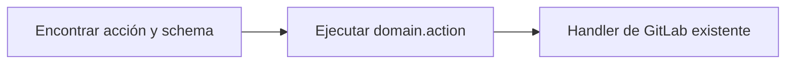

import stats from "../../../../data/stats.json";
import Facts from "../../../../components/docs/Facts.astro";
import Fact from "../../../../components/docs/Fact.astro";
import FAQ from "../../../../components/FAQ.astro";

GitLab MCP Server expone las operaciones de GitLab como herramientas MCP que los asistentes de IA pueden invocar directamente. Ofrece **tres modos de herramientas**: dinámico, meta-herramientas e individual. Los tres alcanzan la misma superficie de API de GitLab. Solo cambian en el empaquetado, así que la elección equilibra coste de contexto y granularidad de la lista, nunca capacidad.

Cada modo se proyecta desde un único **catálogo canónico de acciones**. Eso da a los tres los mismos handlers, esquemas tipados y comportamiento de seguridad. Lo único que cambia es la presentación. El modo dinámico busca y ejecuta IDs canónicos `domain.action`. El modo meta-herramientas agrupa acciones por dominio. El modo individual registra una herramienta por operación.

## ¿Qué modo de herramientas debería usar?

**El modo dinámico es el predeterminado y la opción adecuada para la mayoría de los asistentes.** Mantiene dos herramientas en el contexto del modelo y aun así alcanza cualquier operación de GitLab. Elige el modo meta-herramientas cuando tu cliente funcione mejor con una lista fija de herramientas a nivel de dominio. Elige el modo individual solo cuando un cliente necesite enumerar por adelantado todas las operaciones.

| Modo                     | Herramientas públicas expuestas                                     | Ideal para                                               | Coste relativo de tokens |
| ------------------------ | ------------------------------------------------------------------- | -------------------------------------------------------- | ------------------------ |
| **Dinámico** _(predet.)_ | 2 — `gitlab_find_action`, `gitlab_execute_action`                   | La mayoría de asistentes; mínimo coste de contexto       | El más bajo              |
| **Meta-herramientas**    | {stats.meta.base} herramientas de dominio base (más con Enterprise) | Una lista fija y explorable a nivel de dominio           | Medio                    |
| **Individual**           | {stats.tools.free}–{stats.tools.gitlab_com} herramientas            | Clientes que necesitan todas las operaciones de antemano | El más alto              |

Define el modo con la variable de entorno `GITLAB_MCP_TOOL_SURFACE` (`dynamic`, `meta` o `individual`). El modo dinámico se usa cuando `GITLAB_MCP_TOOL_SURFACE` no está definido.

## Modos de operación

### ¿Cómo funciona el modo individual?

El modo individual registra **una herramienta MCP por operación de GitLab**: **{stats.tools.free} herramientas** para CE, **{stats.tools.ultimate_self_managed} herramientas** para Enterprise/Premium autoalojado, o **{stats.tools.gitlab_com} herramientas** en GitLab.com Enterprise/Premium cuando Orbit está disponible. Esto ofrece al asistente la máxima granularidad —cada operación es una herramienta distinta y descrita individualmente— a costa de un consumo significativo de tokens de contexto al listar y desambiguar herramientas durante el descubrimiento.

<Facts>
	<Fact kind="exposes">
		una herramienta MCP visible por operación de GitLab, cada una con su
		esquema tipado de entrada y salida — el catálogo completo, en plano.
	</Fact>
	<Fact kind="requires">`GITLAB_MCP_TOOL_SURFACE=individual` (o el legado `GITLAB_MCP_META_TOOLS=false`), y un cliente con presupuesto de contexto para sostener la lista completa.</Fact>
	<Fact kind="tier">
		el propio número de herramientas se mueve con la licencia: Free/CE
		registra el catálogo base, Premium y Ultimate añaden sus herramientas
		restringidas, y los tiers inferiores nunca ven campos de entrada de
		tiers superiores en los esquemas.
	</Fact>
	<Fact kind="notCovered">
		un arranque de bajo coste de tokens: listar cada herramienta es el
		propósito de esta superficie, así que el coste de descubrimiento no se
		puede reducir sin cambiar de superficie. Los clientes con ventanas de
		contexto pequeñas deberían usar la dinámica por defecto.
	</Fact>
</Facts>

### ¿Cómo funciona el modo meta-herramientas?

El modo meta-herramientas (`GITLAB_MCP_TOOL_SURFACE=meta`) consolida operaciones relacionadas en **meta-herramientas a nivel de dominio**. Cada meta-herramienta acepta un parámetro `action` que enruta al handler apropiado, reduciendo el recuento a **{stats.meta.base} meta-herramientas base**, **{stats.meta.self_managed_enterprise} en Enterprise/Premium autoalojado**, o **{stats.meta.gitlab_com} en GitLab.com Enterprise/Premium** cuando Orbit está disponible. Esto mejora drásticamente la eficiencia de tokens frente al modo individual manteniendo una lista de herramientas fija y explorable.

```json
{
  "tool": "gitlab_issue",
  "arguments": {
    "action": "create",
    "params": {
      "project_id": "my-group/my-project",
      "title": "Fix login redirect",
      "description": "Users are redirected to 404 after login",
      "labels": ["bug", "priority::high"]
    }
  }
}
```

<Facts>
	<Fact kind="exposes">
		una herramienta despachadora por dominio (proyectos, issues, merge
		requests, pipelines…), cada una enrutando un parámetro `action` a los
		mismos handlers que usan las demás superficies.
	</Fact>
	<Fact kind="requires">`GITLAB_MCP_TOOL_SURFACE=meta`. Las formas de llamada por acción siguen siendo descubribles vía `gitlab://tools` y `gitlab://tools/{id}` sea cual sea el valor de `GITLAB_MCP_META_PARAM_SCHEMA`.</Fact>
	<Fact kind="tier">
		Premium/Ultimate añaden meta-herramientas enterprise dedicadas e
		inyectan rutas solo-enterprise en `gitlab_project`, `gitlab_group` y
		`gitlab_issue`.
	</Fact>
	<Fact kind="notCovered">
		descripciones por operación en la lista de herramientas del cliente: una
		despachadora resume su dominio, así que un asistente que necesita el
		esquema exacto lo lee de los recursos del catálogo, no de `tools/list`.
	</Fact>
</Facts>

### ¿Cómo funciona el conjunto dinámico de herramientas?

El modo dinámico (`GITLAB_MCP_TOOL_SURFACE=dynamic`) es el predeterminado de bajo coste de tokens. Expone solo dos herramientas públicas —`gitlab_find_action` y `gitlab_execute_action` (el nombre en singular `gitlab_execute_action` es intencionado)— manteniendo cada acción de GitLab accesible a través del catálogo canónico. El asistente primero encuentra una acción y su esquema exacto, y luego ejecuta el ID canónico `domain.action`.



Como los tres modos comparten el catálogo canónico de acciones, **el comportamiento de seguridad se mantiene coherente en todas las superficies**: el filtrado de solo lectura, las vistas previas de modo seguro, el filtrado por alcance de token, las confirmaciones de acciones destructivas, los esquemas y el formato de resultados son idénticos.

<Facts>
	<Fact kind="exposes">
		dos herramientas — `gitlab_find_action` y `gitlab_execute_action` — que
		alcanzan el catálogo canónico completo: find devuelve esquemas exactos y
		execute ejecuta el `domain.action` canónico.
	</Fact>
	<Fact kind="requires">nada: es el modo por defecto cuando `GITLAB_MCP_TOOL_SURFACE` no está definido. `GITLAB_MCP_CAPABILITY_SURFACE=minimal` reduce aún más la huella compartida de recursos y prompts.</Fact>
	<Fact kind="tier">
		invisible en `tools/list` (siempre dos herramientas) pero real en
		alcance: find solo muestra, y execute solo acepta, las acciones que el
		tier resuelto registra.
	</Fact>
	<Fact kind="notCovered">
		una lista de herramientas explorable: el cliente ve dos herramientas,
		así que un humano que recorra `tools/list` no aprende nada sobre la
		cobertura — para eso están `gitlab://tools` y la herramienta find.
	</Fact>
</Facts>

## Convención de nombres de herramientas

Todas las herramientas siguen un patrón de nombres coherente:

- **Herramientas individuales**: `gitlab_{domain}_{action}` (p. ej., `gitlab_issue_create`, `gitlab_project_list`) — primero el dominio, no el verbo
- **Meta-herramientas**: `gitlab_{domain}` (p. ej., `gitlab_issue`, `gitlab_project`)
- **Acciones dinámicas**: IDs canónicos `domain.action` ejecutados mediante `gitlab_execute_action` (p. ej., `issue.create`, `merge_request.list`)

## Meta-herramientas base ({stats.meta.base})

### Gestión de proyectos

| Meta-herramienta | Descripción                                                                                                                                    | Acciones clave                                                                                               |
| ---------------- | ---------------------------------------------------------------------------------------------------------------------------------------------- | ------------------------------------------------------------------------------------------------------------ |
| `gitlab_project` | CRUD de proyectos, configuración, hooks, etiquetas, hitos, miembros, badges, boards, integraciones, Pages y subidas                            | list, get, create, update, delete, fork, star, archive, label\_\*, milestone\_\*, members, badge\_\*, upload |
| `gitlab_issue`   | Ciclo de vida de incidencias, notas, discusiones, enlaces, work items (incluidos sus tipos), seguimiento de tiempo, emojis y eventos           | list, get, create, update, delete, note\_\*, link\_\*, discussion\_\*, work_item\_\*, time\_\*               |
| `gitlab_group`   | CRUD de grupos, subgrupos, miembros, badges, hooks, etiquetas, hitos, transferencia y proyectos descendientes                                  | list, get, create, update, delete, group_label\_\*, group_milestone\_\*, group_member\_\*, badge\_\*         |
| `gitlab_user`    | Información de usuario, estado, claves SSH, claves GPG, correos, actividad, preferencias, tareas pendientes y cuentas de servicio (Enterprise) | get, current, list, ssh_key\_\*, gpg_key\_\*, email\_\*, status\_\*, todo\_\*, service_account\_\*           |
| `gitlab_wiki`    | Gestión de páginas wiki y adjuntos                                                                                                             | list, get, create, update, delete, upload_attachment                                                         |

### Código y repositorio

| Meta-herramienta       | Descripción                                                                                                                                  | Acciones clave                                                                                |
| ---------------------- | -------------------------------------------------------------------------------------------------------------------------------------------- | --------------------------------------------------------------------------------------------- |
| `gitlab_branch`        | Gestión de ramas y reglas de protección (incluidas consultas de reglas de rama vía GraphQL)                                                  | list, get, create, delete, protect, unprotect, branch_rule\_\*                                |
| `gitlab_tag`           | Gestión de etiquetas (tags) y reglas de protección con verificación de firma GPG                                                             | list, get, create, delete, protect, unprotect                                                 |
| `gitlab_release`       | Gestión de releases y enlaces de activos de release                                                                                          | list, get, create, update, delete, link\_\*                                                   |
| `gitlab_repository`    | Árbol del repositorio, archivos, commits, diffs, blame, comparación (incl. entre proyectos), cherry-pick, revert, contribuyentes, changelogs | tree, file\_\*, commit\_\*, compare, blame, archive, changelog, submodule\_\*, discussion\_\* |
| `gitlab_merge_request` | Ciclo de vida de MR, aprobaciones, reglas de aprobación, seguimiento de tiempo, suscripciones, commits de contexto, emojis y eventos         | list, get, create, update, merge, rebase, approve, approval\_\*, time\_\*, event\_\*          |

### Revisión de código

| Meta-herramienta   | Descripción                                                                              | Acciones clave                                             |
| ------------------ | ---------------------------------------------------------------------------------------- | ---------------------------------------------------------- |
| `gitlab_mr_review` | Notas de MR, discusiones en hilo, diffs de código, notas en borrador y versiones de diff | note\_\*, discussion\_\*, diff\_\*, draft\_\*, version\_\* |

### CI/CD

| Meta-herramienta     | Descripción                                                                                               | Acciones clave                                                            |
| -------------------- | --------------------------------------------------------------------------------------------------------- | ------------------------------------------------------------------------- |
| `gitlab_pipeline`    | Gestión de pipelines, grupos de recursos, informes de tests, tokens de trigger, bridges y schedules       | list, get, create, cancel, retry, delete, wait, schedule\_\*, trigger\_\* |
| `gitlab_job`         | Gestión de jobs de CI, artefactos, logs y agentes de Kubernetes (cancelación forzada admitida)            | list, get, play, cancel, retry, erase, trace, artifacts, wait, k8s\_\*    |
| `gitlab_runner`      | Gestión de runners de CI/CD, controladores de runners, scopes de controlador y tokens de controlador      | list, get, update, remove, jobs, controller\_\*, register, verify         |
| `gitlab_ci_variable` | Variables de CI/CD a nivel de instancia, grupo y proyecto                                                 | list, get, create, update, delete (en cada nivel de alcance)              |
| `gitlab_environment` | Gestión de entornos, entornos protegidos, periodos de congelación de despliegue y registros de despliegue | list, get, create, update, delete, stop, deployment\_\*, freeze\_\*       |

### Búsqueda y análisis

| Meta-herramienta | Descripción                                                   | Acciones clave                                                                            |
| ---------------- | ------------------------------------------------------------- | ----------------------------------------------------------------------------------------- |
| `gitlab_search`  | Búsqueda entre recursos en proyectos, grupos y alcance global | code, issues, merge_requests, commits, milestones, notes, projects, snippets, users, wiki |

### Acceso y credenciales

| Meta-herramienta | Descripción                                                                                                 | Acciones clave                                                          |
| ---------------- | ----------------------------------------------------------------------------------------------------------- | ----------------------------------------------------------------------- |
| `gitlab_access`  | Deploy keys, deploy tokens, tokens de acceso de proyecto, tokens de acceso de grupo y solicitudes de acceso | deploy_key\_\*, deploy_token\_\*, project_token\_\*, group_token\_\*    |
| `gitlab_admin`   | Administración de instancia: Sidekiq, ajustes, licencia, mensajes broadcast, hooks, PATs y más              | sidekiq\_\*, setting\_\*, license\_\*, broadcast\_\*, hook\_\*, pat\_\* |

### Paquetes y contenido

| Meta-herramienta  | Descripción                                                                       | Acciones clave                                              |
| ----------------- | --------------------------------------------------------------------------------- | ----------------------------------------------------------- |
| `gitlab_package`  | Gestión del registro de paquetes y subida/descarga de paquetes genéricos          | list, get, delete, upload, download, protection_rule\_\*    |
| `gitlab_snippet`  | Snippets de proyecto y personales con discusiones, notas y emojis                 | list, get, create, update, delete, discussion\_\*, note\_\* |
| `gitlab_template` | Plantillas de proyecto (gitignores, CI YAML, Dockerfiles, licencias) y CI linting | gitignore\_\*, ci\_\*, dockerfile\_\*, license\_\*, lint    |

### Descubrimiento y utilidades

| Meta-herramienta        | Descripción                                                                           | Acciones clave                                   |
| ----------------------- | ------------------------------------------------------------------------------------- | ------------------------------------------------ |
| `gitlab_feature_flags`  | Gestión de feature flags y listas de usuarios de feature flags                        | list, get, create, update, delete, user_list\_\* |
| `gitlab_model_registry` | Descarga de archivos de paquetes de modelos ML del Model Registry                     | download                                         |
| `gitlab_ci_catalog`     | Descubrimiento de recursos del Catálogo CI/CD (componentes, plantillas)               | list, get                                        |
| `gitlab_custom_emoji`   | Gestión de emojis personalizados a nivel de grupo vía GraphQL                         | list, get, create, delete                        |
| `gitlab_storage_move`   | Movimientos de almacenamiento de repositorios de proyectos, snippets y grupos (admin) | retrieve\_\*, get\_\*, schedule\_\*              |

Se registran cinco herramientas más junto a las meta-herramientas de dominio. Reciben sus parámetros directamente, sin envoltorio `action`, y conservan el mismo nombre en el modo individual:

| Herramienta                         | Descripción                                                                         |
| ----------------------------------- | ----------------------------------------------------------------------------------- |
| `gitlab_discover_project`           | Resuelve una URL completa de remoto git al ID de proyecto de GitLab y sus metadatos |
| `gitlab_interactive_issue_create`   | Creación guiada de incidencias mediante elicitation de MCP                          |
| `gitlab_interactive_mr_create`      | Creación guiada de merge requests mediante elicitation de MCP                       |
| `gitlab_interactive_project_create` | Creación guiada de proyectos mediante elicitation de MCP                            |
| `gitlab_interactive_release_create` | Creación guiada de releases mediante elicitation de MCP                             |

:::note
Junto a estas se registra una meta-herramienta `gitlab_server` que no cuenta en la cifra de {stats.meta.base} anterior. Es de solo lectura, con dos acciones: `status` y `health_check`. El modo individual registra `gitlab_server_status`; el modo dinámico alcanza ambas a través del catálogo canónico de acciones. No hay ninguna acción de autoactualización que invocar, porque el binario pertenece al canal con el que se instaló.
:::

## Herramientas exclusivas de Enterprise

Cuando el catálogo Enterprise/Premium está habilitado, el servidor registra {stats.meta.self_managed_enterprise - stats.meta.base} meta-herramientas autoalojadas adicionales para funciones de GitLab Premium y Ultimate:

`gitlab_merge_train`, `gitlab_audit_event`, `gitlab_dora_metrics`, `gitlab_dependency`, `gitlab_external_status_check`, `gitlab_group_scim`, `gitlab_member_role`, `gitlab_enterprise_user`, `gitlab_attestation`, `gitlab_compliance_policy`, `gitlab_project_alias`, `gitlab_geo`, `gitlab_vulnerability`, `gitlab_security_attribute`, `gitlab_security_category`, `gitlab_security_finding`, `gitlab_security_scan_profile`

En GitLab.com Enterprise/Premium, el catálogo también registra `gitlab_orbit` con seis acciones de solo lectura del Knowledge Graph: `status`, `schema`, `tools`, `dsl`, `query` y `graph_status`.

:::note
Las herramientas Enterprise requieren una licencia de GitLab Premium o Ultimate en tu instancia. Forzar el catálogo Enterprise/Premium en una instancia Community Edition registrará las herramientas, pero las llamadas a la API devolverán errores de permiso.
:::

<FAQ />

## Lectura adicional

- [Meta-herramientas](/gitlab-mcp-server/es/tools/meta-tools/) — arquitectura detallada de meta-herramientas y uso
- [Conjunto dinámico](/gitlab-mcp-server/es/tools/dynamic-tools/) — modo de búsqueda, descripción y ejecución con bajo consumo de tokens
- [Orbit](/gitlab-mcp-server/es/tools/orbit/) — herramientas Knowledge Graph para GitLab.com Enterprise/Premium
- [Recursos y prompts](/gitlab-mcp-server/es/tools/resources-prompts/) — contexto de solo lectura y plantillas de prompts

## Referencias externas

- [Especificación del Model Context Protocol](https://modelcontextprotocol.io/) — el protocolo que implementan estas herramientas
- [API REST v4 de GitLab](https://docs.gitlab.com/api/rest/) — la superficie REST que llama la mayoría de las herramientas
- [API GraphQL de GitLab](https://docs.gitlab.com/api/graphql/) — la superficie GraphQL que usan el resto de dominios

## Referencia de la fuente

:::note[Documentación para desarrolladores]
Esta página es la visión general orientada a usuarios. Para la referencia completa de herramientas por dominio, consulta [docs/reference/tools](https://github.com/jmrplens/gitlab-mcp-server/blob/main/docs/reference/tools/README.md).
:::
