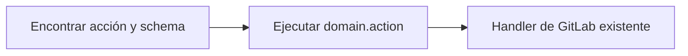

import stats from "../../../../data/stats.json";
import Facts from "../../../../components/docs/Facts.astro";
import Fact from "../../../../components/docs/Fact.astro";
import FAQ from "../../../../components/FAQ.astro";

GitLab MCP Server expone las operaciones de GitLab como herramientas MCP que los asistentes de IA pueden invocar directamente. Ofrece **tres modos de herramientas**: dinámico, meta-herramientas e individual. Los tres alcanzan la misma superficie de API de GitLab. Solo cambian en el empaquetado, así que la elección equilibra coste de contexto y granularidad de la lista, nunca capacidad.

Cada modo se proyecta desde un único **catálogo canónico de acciones**. Eso da a los tres los mismos handlers, esquemas tipados y reglas de seguridad, salvo en cómo se confirma una llamada destructiva. Por lo demás, solo cambia la presentación. El modo dinámico busca y ejecuta IDs canónicos `domain.action`. El modo meta-herramientas agrupa acciones por dominio. El modo individual registra una herramienta por operación.

## ¿Qué modo de herramientas debería usar?

**El modo dinámico es el predeterminado y la opción adecuada para la mayoría de los asistentes.** Mantiene dos herramientas en el contexto del modelo y aun así alcanza cualquier operación de GitLab. Elige el modo meta-herramientas cuando tu cliente funcione mejor con una lista fija de herramientas a nivel de dominio. Elige el modo individual solo cuando un cliente necesite enumerar por adelantado todas las operaciones.

| Modo                     | Herramientas públicas expuestas                                                                                         | Ideal para                                               | Coste relativo de tokens |
| ------------------------ | ----------------------------------------------------------------------------------------------------------------------- | -------------------------------------------------------- | ------------------------ |
| **Dinámico** _(predet.)_ | 2: `gitlab_find_action`, `gitlab_execute_action`                                                                        | La mayoría de asistentes; mínimo coste de contexto       | El más bajo              |
| **Meta-herramientas**    | {stats.meta.base} en Free/CE, {stats.meta.premium} en Premium autoalojado, hasta {stats.meta.gitlab_com} en Ultimate    | Una lista fija y explorable a nivel de dominio           | Medio                    |
| **Individual**           | {stats.tools.free} en Free/CE, {stats.tools.premium} en Premium autoalojado, hasta {stats.tools.gitlab_com} en Ultimate | Clientes que necesitan todas las operaciones de antemano | El más alto              |

Define el modo con la variable de entorno `GITLAB_MCP_TOOL_SURFACE` (`dynamic`, `meta` o `individual`). El modo dinámico se usa cuando `GITLAB_MCP_TOOL_SURFACE` no está definido.

## Modos de operación

### ¿Cómo funciona el modo individual?

El modo individual registra **una herramienta MCP por operación de GitLab**: **{stats.tools.free} herramientas** en Free/CE, **{stats.tools.premium} herramientas** en Premium autoalojado, **{stats.tools.ultimate_self_managed} herramientas** en Ultimate autoalojado, o **{stats.tools.gitlab_com} herramientas** en GitLab.com Ultimate, donde Orbit está disponible. Esto ofrece al asistente la máxima granularidad (cada operación es una herramienta distinta y descrita individualmente) a costa de un consumo significativo de tokens de contexto al listar y desambiguar herramientas durante el descubrimiento.

<Facts>
	<Fact kind="exposes">
		una herramienta MCP visible por operación de GitLab, cada una con su
		esquema tipado de entrada y salida — el catálogo completo, en plano.
	</Fact>
	<Fact kind="requires">`GITLAB_MCP_TOOL_SURFACE=individual`, y un cliente con presupuesto de contexto para sostener la lista completa.</Fact>
	<Fact kind="tier">
		el propio número de herramientas se mueve con la licencia: Free/CE
		registra el catálogo base, Premium y Ultimate añaden sus herramientas
		restringidas, y los tiers inferiores nunca ven campos de entrada de
		tiers superiores en los esquemas.
	</Fact>
	<Fact kind="notCovered">
		un arranque de bajo coste de tokens: listar cada herramienta es el
		propósito de esta superficie, así que el coste de descubrimiento no se
		puede reducir sin cambiar de superficie. Los clientes con ventanas de
		contexto pequeñas deberían usar la dinámica por defecto.
	</Fact>
</Facts>

### ¿Cómo funciona el modo meta-herramientas?

El modo meta-herramientas (`GITLAB_MCP_TOOL_SURFACE=meta`) consolida operaciones relacionadas en **meta-herramientas a nivel de dominio**. Cada meta-herramienta acepta un parámetro `action` que enruta al handler apropiado, reduciendo el recuento a **{stats.meta.base} meta-herramientas en Free/CE**, **{stats.meta.premium} en Premium autoalojado**, **{stats.meta.self_managed_enterprise} en Ultimate autoalojado**, o **{stats.meta.gitlab_com} en GitLab.com Ultimate**, donde Orbit está disponible. Esto mejora drásticamente la eficiencia de tokens frente al modo individual manteniendo una lista de herramientas fija y explorable.

```json
{
  "tool": "gitlab_issue",
  "arguments": {
    "action": "create",
    "params": {
      "project_id": "my-group/my-project",
      "title": "Fix login redirect",
      "description": "Users are redirected to 404 after login",
      "labels": ["bug", "priority::high"]
    }
  }
}
```

<Facts>
	<Fact kind="exposes">
		una herramienta despachadora por dominio (proyectos, issues, merge
		requests, pipelines…), cada una enrutando un parámetro `action` a los
		mismos handlers que usan las demás superficies.
	</Fact>
	<Fact kind="requires">`GITLAB_MCP_TOOL_SURFACE=meta`. Las formas de llamada por acción siguen siendo descubribles vía `gitlab://tools` y `gitlab://tools/{id}` sea cual sea el valor de `GITLAB_MCP_META_PARAM_SCHEMA`.</Fact>
	<Fact kind="tier">
		Premium/Ultimate añaden meta-herramientas enterprise dedicadas y suman
		acciones a siete despachadores base: `gitlab_project`, `gitlab_group`,
		`gitlab_issue`, `gitlab_merge_request`, `gitlab_environment`,
		`gitlab_storage_move` y `gitlab_runner`.
	</Fact>
	<Fact kind="notCovered">
		el esquema exacto de parámetros de cada acción en `tools/list` con el modo
		predeterminado `opaque`: la descripción de un despachador lleva una línea
		de guía por acción, y un asistente lee el esquema exacto de los recursos
		del catálogo (`gitlab://tools/{id}`) salvo que
		`GITLAB_MCP_META_PARAM_SCHEMA` sea `compact` o `full`.
	</Fact>
</Facts>

### ¿Cómo funciona el conjunto dinámico de herramientas?

El modo dinámico (`GITLAB_MCP_TOOL_SURFACE=dynamic`) es el predeterminado de bajo coste de tokens. Expone solo dos herramientas públicas —`gitlab_find_action` y `gitlab_execute_action` (el nombre en singular `gitlab_execute_action` es intencionado)— manteniendo cada acción de GitLab accesible a través del catálogo canónico. El asistente primero encuentra una acción y su esquema exacto, y luego ejecuta el ID canónico `domain.action`.


```mermaid
flowchart LR
	A[Encontrar acción y schema] --> B[Ejecutar domain.action]
	B --> C[Handler de GitLab existente]
```

Como los tres modos comparten el catálogo canónico de acciones, **las reglas de seguridad salen de un solo sitio**: el filtrado de solo lectura, el modo seguro, el filtrado por alcance de token, la clasificación destructiva, los esquemas y el formato de resultados son los mismos en todas las superficies. Lo que difiere es cómo se confirma una llamada destructiva: la superficie dinámica exige `confirm: true` en cada una e ignora `GITLAB_MCP_YOLO_MODE`, como explica [Acciones destructivas](/gitlab-mcp-server/es/operations/security/#acciones-destructivas).

<Facts>
	<Fact kind="exposes">
		dos herramientas — `gitlab_find_action` y `gitlab_execute_action` — que
		alcanzan el catálogo canónico completo: find devuelve esquemas exactos y
		execute ejecuta el `domain.action` canónico.
	</Fact>
	<Fact kind="requires">nada: es el modo por defecto cuando `GITLAB_MCP_TOOL_SURFACE` no está definido. `GITLAB_MCP_CAPABILITY_SURFACE=minimal` reduce aún más la huella compartida de recursos y prompts.</Fact>
	<Fact kind="tier">
		invisible en `tools/list` (siempre dos herramientas) pero real en
		alcance: find solo muestra, y execute solo acepta, las acciones que el
		tier resuelto registra.
	</Fact>
	<Fact kind="notCovered">
		una lista de herramientas explorable: el cliente ve dos herramientas,
		así que un humano que recorra `tools/list` no aprende nada sobre la
		cobertura — para eso están `gitlab://tools` y la herramienta find.
	</Fact>
</Facts>

## Convención de nombres de herramientas

Todas las herramientas siguen un patrón de nombres coherente:

- **Herramientas individuales**: la forma predominante es `gitlab_{domain}_{action}` (p. ej., `gitlab_issue_create`, `gitlab_project_list`), primero el dominio; un conjunto heredado va con el verbo primero (`gitlab_list_issue_discussions`, `gitlab_add_ssh_key`), y cada nombre se declara en la especificación de catálogo de la acción en lugar de derivarse, así que léelo en `gitlab://tools` en vez de inferirlo
- **Meta-herramientas**: `gitlab_{domain}` (p. ej., `gitlab_issue`, `gitlab_project`)
- **Acciones dinámicas**: IDs canónicos `domain.action` ejecutados mediante `gitlab_execute_action` (p. ej., `issue.create`, `merge_request.list`)

## Meta-herramientas base ({stats.meta.base})

Las {stats.meta.base} herramientas que sirve una instancia Free/CE son 28 despachadores de dominio, la herramienta de diagnóstico `gitlab_server` y cinco herramientas que reciben sus argumentos directamente. Premium y Ultimate añaden acciones a siete de estos despachadores; el número de acciones de cada uno en cada tier está en [Meta-herramientas](/gitlab-mcp-server/es/tools/meta-tools/#cuántas-acciones-tiene-cada-meta-herramienta).

### Gestión de proyectos

| Meta-herramienta | Descripción                                                                                                                                                                                                                                                          | Acciones clave                                                                                                       |
| ---------------- | -------------------------------------------------------------------------------------------------------------------------------------------------------------------------------------------------------------------------------------------------------------------- | -------------------------------------------------------------------------------------------------------------------- |
| `gitlab_project` | Proyectos con sus ajustes, forks, estrellas, miembros, etiquetas, hitos, boards, badges, webhooks, integraciones, subidas, exportación e importación, push mirrors, Pages y cuentas de servicio; reglas de aprobación, pull mirroring y reglas de push desde Premium | list, get, create, update, delete, fork, star, archive, label\_\*, milestone\_\*, members, badge\_\*, upload         |
| `gitlab_issue`   | Ciclo de vida de issues con notas, discusiones, enlaces, work items (incluidos sus tipos) y vistas guardadas, estadísticas, seguimiento de tiempo, emojis y eventos de recursos; iteraciones desde Premium                                                           | list, get, create, update, delete, note\_\*, link\_\*, discussion\_\*, work_item\_\*, time\_\*                       |
| `gitlab_group`   | Grupos y subgrupos con sus miembros, etiquetas, hitos, boards, badges, subidas, exportación e importación, compartición, transferencia, proyectos descendientes y cuentas de servicio; epics, wikis, webhooks, ramas protegidas, LDAP y SAML desde Premium           | list, get, create, update, delete, group_label\_\*, group_milestone\_\*, group_member\_\*, badge\_\*                 |
| `gitlab_user`    | Usuarios y el usuario actual: estado, claves SSH y GPG, correos, actividad, membresías, ajustes de notificaciones, namespaces, tareas pendientes, tokens de suplantación y de acceso personal, administración de usuarios y cuentas de servicio de instancia         | get, current, list, ssh_keys, add_ssh_key, gpg_keys, emails, get_status, set_status, todo\_\*, list_service_accounts |
| `gitlab_wiki`    | Páginas wiki de proyecto y adjuntos (las wikis de grupo son acciones de `gitlab_group`)                                                                                                                                                                              | list, get, create, update, delete, upload_attachment                                                                 |

### Código y repositorio

| Meta-herramienta       | Descripción                                                                                                                                                                                                                                   | Acciones clave                                                                                                             |
| ---------------------- | --------------------------------------------------------------------------------------------------------------------------------------------------------------------------------------------------------------------------------------------- | -------------------------------------------------------------------------------------------------------------------------- |
| `gitlab_branch`        | Gestión de ramas y reglas de protección (incluidas consultas de reglas de rama vía GraphQL)                                                                                                                                                   | list, get, create, delete, protect, unprotect, rule_list                                                                   |
| `gitlab_tag`           | Gestión de etiquetas (tags), reglas de protección y firmas X.509 de las etiquetas (`get_signature`)                                                                                                                                           | list, get, create, delete, protect, unprotect, get_signature                                                               |
| `gitlab_release`       | Gestión de releases y enlaces de activos de release                                                                                                                                                                                           | list, get, create, update, delete, link\_\*                                                                                |
| `gitlab_repository`    | Árbol del repositorio, archivos y su historial, commits con sus discusiones, estados y firmas, diffs, blame, comparación (incl. entre proyectos), cherry-pick, revert, contribuyentes, submódulos, archivos comprimidos, changelogs, markdown | tree, compare, blob, archive, changelog\_\*, file\_\*, commit\_\*, commit_discussion\_\*, list_submodules, markdown_render |
| `gitlab_merge_request` | Ciclo de vida de MR, aprobaciones, pipelines, seguimiento de tiempo, suscripciones, commits de contexto, emojis y eventos de recursos; reglas de aprobación, ajustes de aprobación y dependencias desde Premium                               | list, get, create, update, merge, rebase, approve, approval\_\*, time\_\*, emoji_mr\_\*, event_mr\_\*                      |

### Revisión de código

| Meta-herramienta   | Descripción                                                                              | Acciones clave                                                                     |
| ------------------ | ---------------------------------------------------------------------------------------- | ---------------------------------------------------------------------------------- |
| `gitlab_mr_review` | Notas de MR, discusiones en hilo, diffs de código, notas en borrador y versiones de diff | note\_\*, discussion\_\*, draft_note\_\*, changes_get, raw_diffs, diff_version\_\* |

### CI/CD

| Meta-herramienta     | Descripción                                                                                                                                              | Acciones clave                                                                 |
| -------------------- | -------------------------------------------------------------------------------------------------------------------------------------------------------- | ------------------------------------------------------------------------------ |
| `gitlab_pipeline`    | Gestión de pipelines, grupos de recursos, informes de tests, tokens de trigger y programaciones de pipeline                                              | list, get, create, cancel, retry, delete, wait, schedule\_\*, trigger\_\*      |
| `gitlab_job`         | Gestión de jobs de CI, artefactos, logs, bridges de pipeline y el alcance del CI job token (cancelación forzada admitida)                                | list, get, play, cancel, retry, erase, trace, artifacts, wait, token_scope\_\* |
| `gitlab_runner`      | Runners de CI/CD, sus tokens de registro y de autenticación, gestores de runners y jobs; controladores de runners con sus scopes y tokens desde Ultimate | list, get, update, remove, jobs, controller\_\*, register, verify              |
| `gitlab_ci_variable` | Variables de CI/CD a nivel de instancia, grupo y proyecto                                                                                                | list, get, create, update, delete (en cada nivel de alcance)                   |
| `gitlab_environment` | Entornos, registros de despliegue con sus aprobaciones y merge requests, y periodos de congelación de despliegue; entornos protegidos desde Premium      | list, get, create, update, delete, stop, deployment\_\*, freeze\_\*            |

### Búsqueda y análisis

| Meta-herramienta | Descripción                                                   | Acciones clave                                                                            |
| ---------------- | ------------------------------------------------------------- | ----------------------------------------------------------------------------------------- |
| `gitlab_search`  | Búsqueda entre recursos en proyectos, grupos y alcance global | code, issues, merge_requests, commits, milestones, notes, projects, snippets, users, wiki |

### Acceso y credenciales

| Meta-herramienta | Descripción                                                                                                                                                                                                                                                                                                                                                                                                                               | Acciones clave                                                                                       |
| ---------------- | ----------------------------------------------------------------------------------------------------------------------------------------------------------------------------------------------------------------------------------------------------------------------------------------------------------------------------------------------------------------------------------------------------------------------------------------- | ---------------------------------------------------------------------------------------------------- |
| `gitlab_access`  | Deploy keys, deploy tokens, tokens de acceso de proyecto, de grupo y personales con su rotación, solicitudes de acceso e invitaciones                                                                                                                                                                                                                                                                                                     | deploy_key\_\*, deploy_token\_\*, token_project\_\*, token_group\_\*, token_personal\_\*, invite\_\* |
| `gitlab_admin`   | Administración de instancia: ajustes, apariencia, licencia, mensajes broadcast, feature flags de la instancia, system hooks, métricas de Sidekiq, límites de planes, temas, aplicaciones OAuth, atributos personalizados, datos de uso, importaciones, seguimiento de errores, imágenes de métricas de alertas, archivos seguros, estados de Terraform, agentes de clúster y el proxy de dependencias. Necesita un token con `admin_mode` | sidekiq\_\*, settings\_\*, license\_\*, broadcast_message\_\*, system_hook\_\*, feature\_\*          |

### Paquetes y contenido

| Meta-herramienta  | Descripción                                                                                 | Acciones clave                                                                           |
| ----------------- | ------------------------------------------------------------------------------------------- | ---------------------------------------------------------------------------------------- |
| `gitlab_package`  | Registro de paquetes, registro de contenedores y publicación/descarga de paquetes genéricos | list, group_list, delete, publish, download, file\_\*, registry\_\*, protection_rule\_\* |
| `gitlab_snippet`  | Snippets de proyecto y personales con discusiones, notas y emojis                           | list, get, create, update, delete, discussion\_\*, note\_\*                              |
| `gitlab_template` | Plantillas de proyecto (gitignores, CI YAML, Dockerfiles, licencias) y CI linting           | gitignore\_\*, ci_yml\_\*, dockerfile\_\*, license\_\*, project_template\_\*, lint       |

### Descubrimiento y utilidades

| Meta-herramienta        | Descripción                                                                                                                                                                                      | Acciones clave                                                     |
| ----------------------- | ------------------------------------------------------------------------------------------------------------------------------------------------------------------------------------------------ | ------------------------------------------------------------------ |
| `gitlab_feature_flags`  | Gestión de feature flags y listas de usuarios de feature flags                                                                                                                                   | feature_flag\_\*, ff_user_list\_\*                                 |
| `gitlab_model_registry` | Descarga de archivos de paquetes de modelos ML del Model Registry                                                                                                                                | download                                                           |
| `gitlab_ci_catalog`     | Descubrimiento de recursos del Catálogo CI/CD (componentes, plantillas)                                                                                                                          | list, get                                                          |
| `gitlab_custom_emoji`   | Gestión de emojis personalizados a nivel de grupo vía GraphQL                                                                                                                                    | list, create, delete                                               |
| `gitlab_achievement`    | Logros que define un namespace de grupo o de proyecto y los otorgamientos hechos a partir de ellos, vía GraphQL                                                                                  | list, create, update, delete, award, revoke, recipients, user_list |
| `gitlab_storage_move`   | Movimientos de almacenamiento de repositorios de proyectos y snippets en todos los tiers (12 acciones); los movimientos de grupos añaden 6 más desde Premium. Necesita un token con `admin_mode` | retrieve\_\*, get\_\*, schedule\_\*                                |

Se registran cinco herramientas más junto a las meta-herramientas de dominio. Reciben sus parámetros directamente, sin envoltorio `action`, y conservan el mismo nombre en el modo individual:

| Herramienta                         | Descripción                                                                         |
| ----------------------------------- | ----------------------------------------------------------------------------------- |
| `gitlab_discover_project`           | Resuelve una URL completa de remoto git al ID de proyecto de GitLab y sus metadatos |
| `gitlab_interactive_issue_create`   | Creación guiada de issues mediante elicitación de MCP                               |
| `gitlab_interactive_mr_create`      | Creación guiada de merge requests mediante elicitación de MCP                       |
| `gitlab_interactive_project_create` | Creación guiada de proyectos mediante elicitación de MCP                            |
| `gitlab_interactive_release_create` | Creación guiada de releases mediante elicitación de MCP                             |

:::note
Junto a estas se registra en todos los tiers una meta-herramienta `gitlab_server`, que cuenta en la cifra de {stats.meta.base} anterior y en las de Premium y Ultimate. Es de solo lectura, con dos acciones: `status` y `health_check`. El modo individual registra `gitlab_server_status`; el modo dinámico alcanza ambas a través del catálogo canónico de acciones. No hay ninguna acción de autoactualización que invocar, porque el binario pertenece al canal con el que se instaló.
:::

## Herramientas exclusivas de Enterprise

Cuando el nivel resuelto es Premium o Ultimate, el servidor registra hasta {stats.meta.self_managed_enterprise - stats.meta.base} meta-herramientas autoalojadas adicionales para funciones de GitLab Premium y Ultimate. Seis llegan con Premium, para {stats.meta.premium} meta-herramientas (el número de acciones de cada una va entre paréntesis):

`gitlab_audit_event` (6), `gitlab_enterprise_user` (4, necesita `admin_mode`), `gitlab_geo` (8, necesita `admin_mode`), `gitlab_group_scim` (4), `gitlab_merge_train` (4), `gitlab_project_alias` (4, necesita `admin_mode`)

Once más llegan con Ultimate, para {stats.meta.self_managed_enterprise} en una instancia autoalojada:

`gitlab_attestation` (2), `gitlab_compliance_policy` (2), `gitlab_dependency` (4), `gitlab_dora_metrics` (2), `gitlab_external_status_check` (8), `gitlab_member_role` (6), `gitlab_security_attribute` (5), `gitlab_security_category` (3), `gitlab_security_finding` (1), `gitlab_security_scan_profile` (3), `gitlab_vulnerability` (8)

En GitLab.com con nivel Premium o Ultimate, el catálogo también registra `gitlab_orbit` con seis acciones de solo lectura del Knowledge Graph: `status`, `schema`, `tools`, `dsl`, `query` y `graph_status`. Eso da {stats.meta.gitlab_com} meta-herramientas en GitLab.com Ultimate.

Un grupo que necesita `admin_mode` queda fuera para un token sin ese scope ([Filtrado de herramientas por scopes](/gitlab-mcp-server/es/operations/security/#filtrado-de-herramientas-por-scopes)). Lo que ambos tiers añaden a los despachadores base se detalla en [Modo Enterprise](/gitlab-mcp-server/es/tools/meta-tools/#modo-enterprise).

:::note
Las herramientas Enterprise requieren una licencia de GitLab Premium o Ultimate en tu instancia. Forzar el catálogo Enterprise/Premium en una instancia Community Edition registrará las herramientas, pero sus llamadas a la API fallan: Community Edition no sirve esos endpoints y responde 404, y una Enterprise Edition sin licencia las rechaza.
:::

<FAQ />

## Lectura adicional

- [Herramientas por dominio](/gitlab-mcp-server/es/reference/tools/): cada acción de cada grupo del catálogo, con sus parámetros y el tier que necesita
- [Meta-herramientas](/gitlab-mcp-server/es/tools/meta-tools/) — arquitectura detallada de meta-herramientas y uso
- [Conjunto dinámico](/gitlab-mcp-server/es/tools/dynamic-tools/): el modo de búsqueda y ejecución con bajo consumo de tokens
- [Orbit](/gitlab-mcp-server/es/tools/orbit/) — herramientas Knowledge Graph para GitLab.com Premium/Ultimate
- [Recursos y prompts](/gitlab-mcp-server/es/tools/resources-prompts/) — contexto de solo lectura y plantillas de prompts
- [Formato de salida](/gitlab-mcp-server/es/reference/output-format/): lo que lleva un resultado de herramienta, en Markdown y en JSON
- [Línea de comandos](/gitlab-mcp-server/es/reference/cli/) y [variables de entorno](/gitlab-mcp-server/es/reference/environment/): cada ajuste que elige una superficie, un tier o un filtro

## Referencias externas

- [Especificación del Model Context Protocol](https://modelcontextprotocol.io/) — el protocolo que implementan estas herramientas
- [API REST v4 de GitLab](https://docs.gitlab.com/api/rest/) — la superficie REST que llama la mayoría de las herramientas
- [API GraphQL de GitLab](https://docs.gitlab.com/api/graphql/) — la superficie GraphQL que usan el resto de dominios
