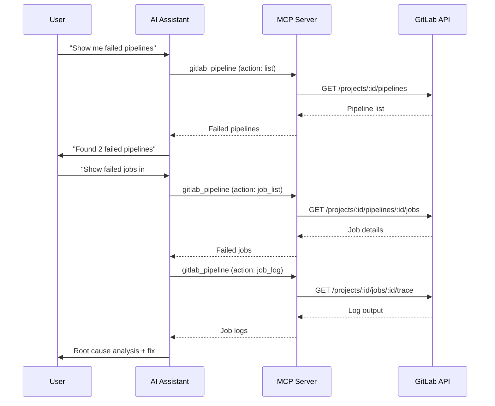

import { CardGrid, LinkCard } from "@astrojs/starlight/components";

<CardGrid>
	<LinkCard
		title="Code Review Workflows"
		href="/gitlab-mcp-server/examples/code-review-workflows/"
		description="MR review, AI analysis, and discussions"
	/>
	<LinkCard
		title="Issue Management"
		href="/gitlab-mcp-server/examples/issue-management/"
		description="Triage, tracking, and project management"
	/>
	<LinkCard
		title="Usage Examples"
		href="/gitlab-mcp-server/examples/usage/"
		description="Quick reference for all domains"
	/>
</CardGrid>

Step-by-step examples for common CI/CD workflows. Each example shows the natural language prompt and the meta-tool actions the server performs.

## Monitor pipeline health



### Get pipeline overview

**Prompt**: "Show me all failed pipelines in my-group/backend"

```text
gitlab_pipeline → action: list, project_id: "my-group/backend", status: "failed"
```

Returns: pipeline IDs, branches, failure reasons, and durations.

### Drill into a failed pipeline

**Prompt**: "Show me the failed jobs in pipeline #45892"

```text
gitlab_pipeline → action: job_list, project_id: "my-group/backend", pipeline_id: 45892, scope: "failed"
```

Returns: job names, stages, failure messages, and runner info.

### Read job logs

**Prompt**: "Get the log output from the 'test-integration' job in pipeline #45892"

```text
gitlab_pipeline → action: job_log, project_id: "my-group/backend", job_id: 98765
```

Returns: full job log output. Useful for diagnosing test failures without opening the GitLab UI.

### AI-powered failure analysis

**Prompt**: "Analyze why pipeline #45892 failed and suggest fixes"

```text
gitlab_analyze_pipeline_failure (sampling) → fetches job logs, identifies root cause, suggests fixes
```

The server uses LLM sampling to read job logs, correlate errors across stages, and provide actionable remediation steps.

---

## Manage CI/CD variables

### List project variables

**Prompt**: "What CI/CD variables are configured in the backend project?"

```text
gitlab_ci_variable → action: project_list, project_id: "my-group/backend"
```

Returns: variable keys, protection status, masking status, and environment scopes. Values are masked for security.

### Add a deployment variable

**Prompt**: "Add a CI/CD variable DEPLOY_TOKEN with value 'abc123' to the backend project, masked and protected"

```text
gitlab_ci_variable → action: project_create, project_id: "my-group/backend",
  key: "DEPLOY_TOKEN", value: "abc123", masked: true, protected: true
```

### Update variable scope

**Prompt**: "Update the DATABASE_URL variable in backend to only apply to the production environment"

```text
gitlab_ci_variable → action: project_update, project_id: "my-group/backend",
  key: "DATABASE_URL", environment_scope: "production"
```

---

## Pipeline schedules

### Create a nightly build

**Prompt**: "Create a pipeline schedule that runs every night at 2 AM UTC on the main branch"

```text
gitlab_pipeline → action: schedule_create, project_id: "my-group/backend",
  description: "Nightly build", ref: "main", cron: "0 2 * * *", cron_timezone: "UTC"
```

### List active schedules

**Prompt**: "Show me all pipeline schedules in the backend project"

```text
gitlab_pipeline → action: schedule_list, project_id: "my-group/backend"
```

Returns: schedule descriptions, cron expressions, next run times, and owner info.

---

## Environment management

### List environments

**Prompt**: "Show me all environments for the backend project"

```text
gitlab_environment → action: list, project_id: "my-group/backend"
```

Returns: environment names, external URLs, last deployment info, and state.

### Check deployment history

**Prompt**: "Show recent deployments to the production environment"

```text
gitlab_environment → action: deployment_list, project_id: "my-group/backend", environment: "production"
```

### Stop a review environment

**Prompt**: "Stop the review/feature-login environment in the backend project"

```text
gitlab_environment → action: stop, project_id: "my-group/backend", environment_id: 42
```

---

## Validate CI configuration

### Lint CI config

**Prompt**: "Validate the .gitlab-ci.yml in my-group/backend for syntax errors"

```text
gitlab_template → action: ci_lint, project_id: "my-group/backend"
```

Returns: validation status, merged YAML, warnings, and error details.

### AI-powered CI review

**Prompt**: "Review the CI configuration in my-group/backend for best practices"

```text
gitlab_analyze_ci_configuration (sampling) → reads .gitlab-ci.yml, analyzes structure, suggests improvements
```

Checks for: redundant jobs, missing caching, inefficient artifact handling, security best practices, and parallelization opportunities.

---

## DORA metrics

### Project performance

**Prompt**: "Show me DORA metrics for the backend project over the last 30 days"

```text
gitlab_dora_metrics → action: project, project_id: "my-group/backend",
  metric: "all", start_date: "2024-01-01", end_date: "2024-01-31"
```

Returns: deployment frequency, lead time for changes, time to restore service, and change failure rate.

### Group-level metrics

**Prompt**: "Compare DORA metrics across all projects in the platform group"

```text
gitlab_dora_metrics → action: group, group_id: "platform",
  metric: "all", interval: "monthly"
```

Returns: aggregated metrics for the entire group, useful for engineering leadership dashboards.

---

:::tip
All CI/CD examples use meta-tool mode (default). The AI assistant maps your natural language request to the correct `action` parameter automatically.
:::
