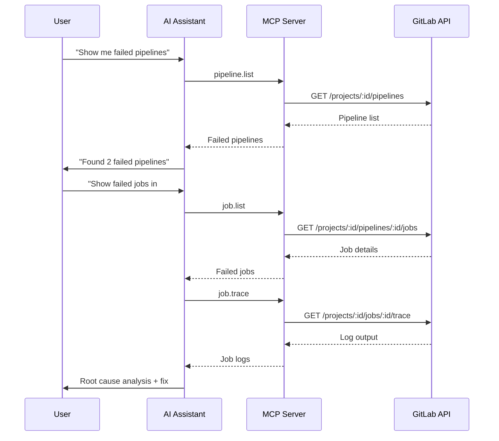

import { CardGrid, LinkCard } from "@astrojs/starlight/components";
import FAQ from "../../../components/FAQ.astro";

<CardGrid>
  <LinkCard
    title="Code Review Workflows"
    href="/gitlab-mcp-server/examples/code-review-workflows/"
    description="MR review, AI analysis, and discussions"
  />
  <LinkCard
    title="Issue Management"
    href="/gitlab-mcp-server/examples/issue-management/"
    description="Triage, tracking, and project management"
  />
  <LinkCard
    title="Usage Examples"
    href="/gitlab-mcp-server/examples/usage/"
    description="Quick reference for all domains"
  />
</CardGrid>

These step-by-step CI/CD workflows show how to diagnose pipeline failures, manage CI/CD variables, schedule builds, control environments, validate config, and read DORA metrics — all in natural language. Each example pairs the prompt you type with the exact catalog action the server runs, written as `domain.action → parameters`: on the default dynamic surface that is the `action` you pass to `gitlab_execute_action`, and with `GITLAB_MCP_TOOL_SURFACE=meta` it is the `action` of the `gitlab_<domain>` meta-tool, so you can see precisely what happens behind the scenes and reuse the call directly.

## Diagnose a failing pipeline

When a pipeline fails, this workflow takes you from the list of failed pipelines down to the specific job log that explains the failure — without leaving your assistant. List failed pipelines, drill into the failing jobs, then read the job log to find the root cause.


```mermaid
sequenceDiagram
    participant U as User
    participant AI as AI Assistant
    participant MCP as MCP Server
    participant GL as GitLab API

    U->>AI: "Show me failed pipelines"
    AI->>MCP: pipeline.list
    MCP->>GL: GET /projects/:id/pipelines
    GL-->>MCP: Pipeline list
    MCP-->>AI: Failed pipelines
    AI->>U: "Found 2 failed pipelines"
    U->>AI: "Show failed jobs in #45892"
    AI->>MCP: job.list
    MCP->>GL: GET /projects/:id/pipelines/:id/jobs
    GL-->>MCP: Job details
    MCP-->>AI: Failed jobs
    AI->>MCP: job.trace
    MCP->>GL: GET /projects/:id/jobs/:id/trace
    GL-->>MCP: Log output
    MCP-->>AI: Job logs
    AI->>U: Root cause analysis + fix
```

### Get pipeline overview

**Prompt**: "Show me all failed pipelines in my-group/backend"

```text
pipeline.list → project_id: "my-group/backend", status: "failed"
```

Returns: pipeline IDs, branches, failure reasons, and durations.

### Drill into a failed pipeline

**Prompt**: "Show me the failed jobs in pipeline #45892"

```text
job.list → project_id: "my-group/backend", pipeline_id: 45892, scope: ["failed"]
```

Returns: job names, stages, failure messages, and runner info.

### Read job logs

**Prompt**: "Get the log output from the 'test-integration' job in pipeline #45892"

```text
job.trace → project_id: "my-group/backend", job_id: 98765
```

Returns: full job log output. Useful for diagnosing test failures without opening the GitLab UI.

---

## Manage CI/CD variables

Configure the environment your pipelines run in by listing, creating, and scoping CI/CD variables. Use this to inspect what is already set, add secrets like deploy tokens with masking and protection, or restrict a variable to a single environment.

### List project variables

**Prompt**: "What CI/CD variables are configured in the backend project?"

```text
ci_variable.list → project_id: "my-group/backend"
```

Returns: variable keys, values, protection status, masking status, and environment scopes. The value comes back as GitLab returns it to the token, so treat the output as sensitive.

### Add a deployment variable

**Prompt**: "Add a CI/CD variable DEPLOY_TOKEN with value 'abc123' to the backend project, masked and protected"

```text
ci_variable.create → project_id: "my-group/backend",
  key: "DEPLOY_TOKEN", value: "abc123", masked: true, protected: true
```

### Update variable scope

**Prompt**: "Update the DATABASE_URL variable in backend to only apply to the production environment"

```text
ci_variable.update → project_id: "my-group/backend",
  key: "DATABASE_URL", environment_scope: "production"
```

---

## Pipeline schedules

Automate recurring pipelines with cron-based schedules — for example a nightly build — and review which schedules already exist and when they run next.

### Create a nightly build

**Prompt**: "Create a pipeline schedule that runs every night at 2 AM UTC on the main branch"

```text
pipeline.schedule_create → project_id: "my-group/backend",
  description: "Nightly build", ref: "main", cron: "0 2 * * *", cron_timezone: "UTC"
```

### List active schedules

**Prompt**: "Show me all pipeline schedules in the backend project"

```text
pipeline.schedule_list → project_id: "my-group/backend"
```

Returns: schedule descriptions, cron expressions, next run times, and owner info.

---

## Environment management

Track and control where your code is deployed. List environments to see their state and URLs, review deployment history for production, and stop ephemeral review environments when they are no longer needed.

### List environments

**Prompt**: "Show me all environments for the backend project"

```text
environment.list → project_id: "my-group/backend"
```

Returns: environment names, external URLs, last deployment info, and state.

### Check deployment history

**Prompt**: "Show recent deployments to the production environment"

```text
environment.deployment_list → project_id: "my-group/backend", environment: "production"
```

### Stop a review environment

**Prompt**: "Stop the review/feature-login environment in the backend project"

```text
environment.stop → project_id: "my-group/backend", environment_id: 42
```

---

## Validate CI configuration

Catch `.gitlab-ci.yml` mistakes before they break a pipeline by linting the config. The server returns the validation status alongside the fully merged YAML, so you can confirm that includes and templates resolve as expected.

### Lint CI config

**Prompt**: "Validate the .gitlab-ci.yml in my-group/backend for syntax errors"

```text
template.lint_project → project_id: "my-group/backend"
```

Returns: validation status, merged YAML, warnings, and error details.

---

## DORA metrics

Measure delivery performance with the four DORA metrics — deployment frequency, lead time for changes, time to restore service, and change failure rate — at either project or group scope. DORA metrics require a GitLab Premium or Ultimate license.

### Project performance

**Prompt**: "Show me the deployment frequency for the backend project over January"

```text
dora_metrics.project → project_id: "my-group/backend",
  metric: "deployment_frequency", start_date: "2024-01-01", end_date: "2024-01-31"
```

Returns: one series of daily values for the requested metric. `metric` is required and takes one of `deployment_frequency`, `lead_time_for_changes`, `time_to_restore_service` or `change_failure_rate`, so the four metrics are four calls.

### Group-level metrics

**Prompt**: "Compare the monthly change failure rate across all projects in the platform group"

```text
dora_metrics.group → group_id: "platform",
  metric: "change_failure_rate", interval: "monthly"
```

Returns: the metric aggregated for the entire group per interval, useful for engineering leadership dashboards.

## Dynamic-first CI/CD calls

In the default dynamic surface, the assistant discovers the exact CI/CD action and its schema first, then executes it, so the `domain.action` IDs above are exactly what it passes to `gitlab_execute_action`. The two-step pattern is find, then execute:

```text
gitlab_find_action → query: "latest pipeline status for project"
gitlab_execute_action → action: "pipeline.latest", params: { project_id: "42" }
```

For failed jobs, discover the log or retry action first, then execute with the returned schema:

```text
gitlab_find_action → query: "get failed job trace"
gitlab_execute_action → action: "job.trace", params: { project_id: "42", job_id: 9876 }
```

---

:::tip
These CI/CD prompts work with the default dynamic surface. With `GITLAB_MCP_TOOL_SURFACE=meta`, the AI assistant maps the same requests to the appropriate domain meta-tool and `action` parameter.
:::

<FAQ />
