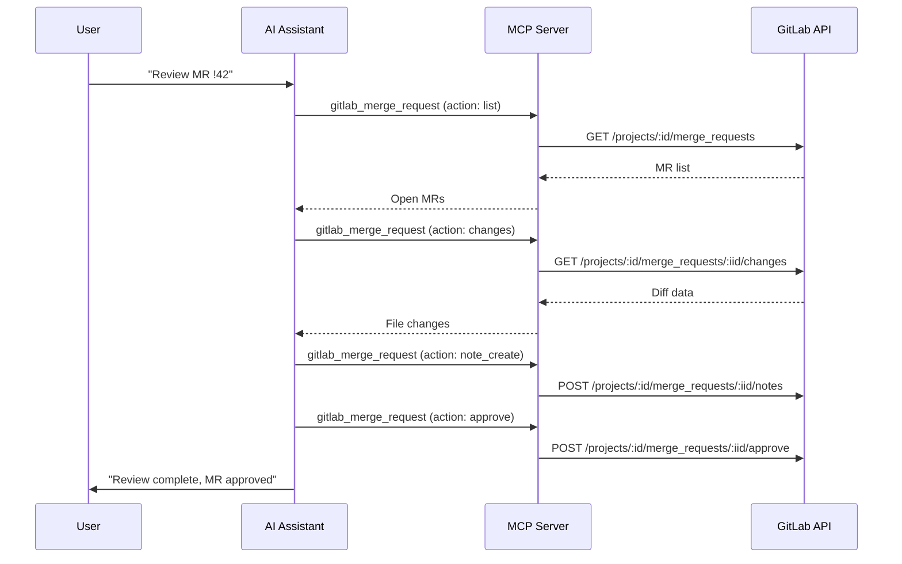

import { CardGrid, LinkCard } from "@astrojs/starlight/components";
import FAQ from "../../../components/FAQ.astro";

<CardGrid>
  <LinkCard
    title="CI/CD Workflows"
    href="/gitlab-mcp-server/examples/ci-cd-workflows/"
    description="Pipeline management and monitoring"
  />
  <LinkCard
    title="Issue Management"
    href="/gitlab-mcp-server/examples/issue-management/"
    description="Triage, tracking, and project management"
  />
  <LinkCard
    title="Usage Examples"
    href="/gitlab-mcp-server/examples/usage/"
    description="Quick reference for all domains"
  />
</CardGrid>

These step-by-step workflows cover the full merge request review cycle: finding MRs that need your attention, reading their diffs, checking approval state, leaving notes and threaded discussions, and finally merging or rebasing. Each example pairs the prompt you type with the exact meta-tool action the server runs, so you can reuse the call directly.

## MR review workflow

This is the core review loop: list the open MRs assigned to you, read the file changes, post review feedback, and approve once the code looks good. The diagram traces a single MR (`!42`) through that sequence.



### List MRs awaiting review

**Prompt**: "Show me all merge requests assigned to me for review in the backend project"

```text
gitlab_merge_request → action: list, project_id: "my-group/backend",
  reviewer_username: "johndoe", state: "opened"
```

Returns: MR titles, authors, branches, labels, and review status.

### Read MR changes

**Prompt**: "Show me the file changes in MR !42"

```text
gitlab_merge_request → action: changes, project_id: "my-group/backend", merge_request_iid: 42
```

Returns: list of changed files with additions, deletions, and full diffs.

### Check MR approval status

**Prompt**: "Who has approved MR !42 and who still needs to approve?"

```text
gitlab_merge_request → action: approval_state, project_id: "my-group/backend",
  merge_request_iid: 42
```

Returns: approval rules, required approvals, current approvals, and eligible approvers.

### Approve an MR

**Prompt**: "Approve merge request !42 in the backend project"

```text
gitlab_merge_request → action: approve, project_id: "my-group/backend",
  merge_request_iid: 42
```

---

## AI-powered code review

There is no separate "AI review" tool. AI-powered review happens when the assistant reads an MR's diff with `gitlab_merge_request → action: changes`, reasons over the code, and then writes its findings back as notes or threaded discussions. A typical request — _"Read the changes in MR !42 and flag any error-handling or security issues"_ — chains the read action above with the `note_create` and `discussion_create` actions below, all within a single conversation.

---

## MR discussions and notes

Share review feedback directly on the MR. Post a single inline comment, open a threaded discussion for a larger topic, find threads that are still unresolved, or stage draft notes to publish your whole review at once.

The three comment types behave differently, and picking the wrong one is the most common review mistake:

| Type       | Action              | Resolvable?         | Visible immediately?        | Use it for                                    |
| ---------- | ------------------- | ------------------- | --------------------------- | --------------------------------------------- |
| Note       | `note_create`       | No                  | Yes                         | A single standalone remark                    |
| Discussion | `discussion_create` | Yes                 | Yes                         | Feedback that must be resolved before merge   |
| Draft note | `draft_note_create` | Yes, once published | No — staged until published | A multi-comment review published in one batch |

Only discussions count toward the unresolved-threads gate. Draft notes keep the author from receiving one notification per comment while you work through a large MR.

### Add a review comment

**Prompt**: "Add a comment to MR !42 saying 'The error handling in auth.go needs a retry mechanism'"

```text
gitlab_merge_request → action: note_create, project_id: "my-group/backend",
  merge_request_iid: 42, body: "The error handling in auth.go needs a retry mechanism"
```

### Create a discussion thread

**Prompt**: "Start a discussion on MR !42 about the database migration strategy"

```text
gitlab_merge_request → action: discussion_create, project_id: "my-group/backend",
  merge_request_iid: 42, body: "Let's discuss the database migration strategy..."
```

### List unresolved threads

**Prompt**: "Show me all unresolved discussion threads in MR !42"

```text
gitlab_merge_request → action: discussion_list, project_id: "my-group/backend",
  merge_request_iid: 42
```

Filter the results for threads where `resolved: false` to find outstanding review items.

### Use draft notes

**Prompt**: "Create a draft review note on MR !42 — I'll publish all my comments together"

```text
gitlab_merge_request → action: draft_note_create, project_id: "my-group/backend",
  merge_request_iid: 42, note: "Consider using a context timeout here..."
```

Draft notes are only visible to you until you publish them all at once with `action: draft_note_publish_all`.

---

## MR lifecycle

Drive a merge request through its full lifecycle: open it from a feature branch, rebase it onto the latest target, merge it (optionally squashing), or close it when an approach is superseded.

### Create an MR

**Prompt**: "Create a merge request from branch feature/auth-refactor to main in the backend project"

```text
gitlab_merge_request → action: create, project_id: "my-group/backend",
  source_branch: "feature/auth-refactor", target_branch: "main",
  title: "Refactor authentication module"
```

### Merge after approval

**Prompt**: "Merge MR !42 using squash commit"

```text
gitlab_merge_request → action: merge, project_id: "my-group/backend",
  merge_request_iid: 42, squash: true
```

### Rebase before merge

**Prompt**: "Rebase MR !42 against the latest main branch"

```text
gitlab_merge_request → action: rebase, project_id: "my-group/backend",
  merge_request_iid: 42
```

### Close without merging

**Prompt**: "Close MR `!99`, the approach was superseded by MR `!105`"

```text
gitlab_merge_request → action: update, project_id: "my-group/backend",
  merge_request_iid: 99, state_event: "close"
```

---

## Compare branches

Before opening or merging an MR, compare two branches to see exactly what would change. The comparison returns the commits, changed files, and diff statistics between them.

### Diff between branches

**Prompt**: "Compare the develop branch with main in the backend project"

```text
gitlab_repository → action: compare, project_id: "my-group/backend",
  from: "main", to: "develop"
```

Returns: list of commits, changed files, and diff statistics between the two branches.

---

:::tip
For the best review experience, combine several prompts in sequence: first list MRs, then read changes, then ask for AI analysis. The AI assistant maintains context across prompts.
:::

<FAQ />
