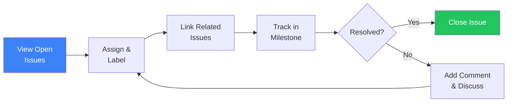

import { CardGrid, LinkCard } from "@astrojs/starlight/components";

<CardGrid>
	<LinkCard
		title="CI/CD Workflows"
		href="/gitlab-mcp-server/examples/ci-cd-workflows/"
		description="Pipeline management and monitoring"
	/>
	<LinkCard
		title="Code Review Workflows"
		href="/gitlab-mcp-server/examples/code-review-workflows/"
		description="MR review, AI analysis, and discussions"
	/>
	<LinkCard
		title="Usage Examples"
		href="/gitlab-mcp-server/examples/usage/"
		description="Quick reference for all domains"
	/>
</CardGrid>

Step-by-step examples for issue management and project triage workflows. Each example shows the natural language prompt and the meta-tool actions the server performs.

## Issue triage



### View open issues

**Prompt**: "Show me all open issues in the backend project with label 'bug'"

```text
gitlab_issue → action: list, project_id: "my-group/backend",
  state: "opened", labels: "bug"
```

Returns: issue titles, authors, labels, milestones, assignees, and creation dates.

### Assign and label

**Prompt**: "Assign issue #123 to johndoe and add labels 'priority::high' and 'team::backend'"

```text
gitlab_issue → action: update, project_id: "my-group/backend",
  issue_iid: 123, assignee_ids: [45], add_labels: "priority::high,team::backend"
```

### Bulk triage by milestone

**Prompt**: "Show me all unassigned issues in the Sprint 15 milestone"

```text
gitlab_issue → action: list, project_id: "my-group/backend",
  milestone: "Sprint 15", assignee_id: 0
```

Returns: issues without assignees that need attention before the sprint starts.

### Close resolved issues

**Prompt**: "Close issue #456 with a comment explaining the fix"

```text
gitlab_issue → action: note_create, project_id: "my-group/backend",
  issue_iid: 456, body: "Fixed in MR !89 — the timeout was caused by..."
gitlab_issue → action: update, project_id: "my-group/backend",
  issue_iid: 456, state_event: "close"
```

---

## AI-powered issue analysis

### Summarize an issue

**Prompt**: "Summarize issue #234 and all its comments"

```text
gitlab_summarize_issue (sampling) → reads issue description and all notes, produces summary
```

Returns: problem statement, key discussion points, proposed solutions, current status, and blockers.

### Find technical debt

**Prompt**: "Identify technical debt across the backend project issues"

```text
gitlab_find_technical_debt (sampling) → analyzes issue patterns, labels, and staleness
```

Returns: categorized debt items (code quality, testing gaps, infrastructure, documentation) with severity ratings.

---

## Issue linking

### Create related issues

**Prompt**: "Link issue #100 as related to issue #200 in the backend project"

```text
gitlab_issue → action: link_create, project_id: "my-group/backend",
  issue_iid: 100, target_issue_iid: 200, link_type: "relates_to"
```

### Create blocking relationships

**Prompt**: "Mark issue #300 as blocking issue #400"

```text
gitlab_issue → action: link_create, project_id: "my-group/backend",
  issue_iid: 300, target_issue_iid: 400, link_type: "blocks"
```

### View issue links

**Prompt**: "Show me all issues related to issue #100"

```text
gitlab_issue → action: link_list, project_id: "my-group/backend", issue_iid: 100
```

Returns: linked issues with relationship types (relates_to, blocks, is_blocked_by).

---

## Labels and milestones

### Organize with labels

**Prompt**: "Create a scoped label 'priority::critical' with red color in the backend project"

```text
gitlab_label → action: create, project_id: "my-group/backend",
  name: "priority::critical", color: "#CC0000"
```

### Track milestone progress

**Prompt**: "Show me the progress of milestone Sprint 15"

```text
gitlab_milestone → action: get, project_id: "my-group/backend", milestone_id: 15
```

Returns: completion percentage, open/closed issue counts, start date, due date, and remaining days.

### Generate milestone report

**Prompt**: "Generate a detailed report for the Q2 milestone"

```text
gitlab_generate_milestone_report (sampling) → analyzes milestone issues, MRs, and velocity
```

Returns: executive summary, completion metrics, velocity trends, risk items, and projected completion date.

---

## Issue discussions

### Add a comment

**Prompt**: "Comment on issue #123: 'Reproduced on staging — the error only occurs with concurrent requests'"

```text
gitlab_issue → action: note_create, project_id: "my-group/backend",
  issue_iid: 123, body: "Reproduced on staging — the error only occurs with concurrent requests"
```

### Start a threaded discussion

**Prompt**: "Create a discussion thread on issue #123 about the proposed architecture"

```text
gitlab_issue → action: discussion_create, project_id: "my-group/backend",
  issue_iid: 123, body: "Let's discuss the proposed architecture for this feature..."
```

### Award emoji reactions

**Prompt**: "Add a thumbs-up reaction to issue #123"

```text
gitlab_issue → action: award_emoji_create, project_id: "my-group/backend",
  issue_iid: 123, name: "thumbsup"
```

---

## Search across projects

### Find issues by keyword

**Prompt**: "Search for issues mentioning 'memory leak' across all my projects"

```text
gitlab_search → scope: "issues", search: "memory leak"
```

Returns: matching issues across all accessible projects with titles, descriptions, and project paths.

### Search within a group

**Prompt**: "Find all open issues with label 'security' in the platform group"

```text
gitlab_issue → action: list, group_id: "platform",
  state: "opened", labels: "security"
```

Returns: security-related issues across all projects in the group.

---

:::tip
Combine search with triage for an efficient workflow: first search for issues matching a pattern, then assign, label, and link them in sequence. The AI assistant maintains context across prompts.
:::
