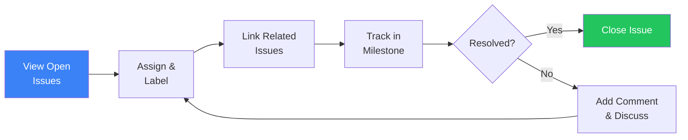

import { CardGrid, LinkCard } from "@astrojs/starlight/components";

<CardGrid>
	<LinkCard
		title="CI/CD Workflows"
		href="/gitlab-mcp-server/examples/ci-cd-workflows/"
		description="Pipeline management and monitoring"
	/>
	<LinkCard
		title="Code Review Workflows"
		href="/gitlab-mcp-server/examples/code-review-workflows/"
		description="MR review, AI analysis, and discussions"
	/>
	<LinkCard
		title="Usage Examples"
		href="/gitlab-mcp-server/examples/usage/"
		description="Quick reference for all domains"
	/>
</CardGrid>

These step-by-step workflows cover issue management end to end: triaging open issues, assigning and labeling them, linking related and blocking issues, tracking milestone progress, holding discussions, and searching across projects. Each example pairs the prompt you type with the exact meta-tool action the server runs, so you can reuse the call directly.

## Issue triage

The triage loop moves an issue from intake to resolution: view open issues, assign and label them, link related issues, track them in a milestone, and either close them or keep the discussion going. The diagram shows that cycle and where it loops back.


```mermaid
flowchart LR
    A[View Open<br/>Issues] --> B[Assign &<br/>Label]
    B --> C[Link Related<br/>Issues]
    C --> D[Track in<br/>Milestone]
    D --> E{Resolved?}
    E -->|Yes| F[Close Issue]
    E -->|No| G[Add Comment<br/>& Discuss]
    G --> B

    style A fill:#3b82f6,color:#fff
    style F fill:#22c55e,color:#fff
```

### View open issues

**Prompt**: "Show me all open issues in the backend project with label 'bug'"

```text
gitlab_issue → action: list, project_id: "my-group/backend",
  state: "opened", labels: "bug"
```

Returns: issue titles, authors, labels, milestones, assignees, and creation dates.

### Assign and label

**Prompt**: "Assign issue #123 to johndoe and add labels 'priority::high' and 'team::backend'"

```text
gitlab_issue → action: update, project_id: "my-group/backend",
  issue_iid: 123, assignee_ids: [45], add_labels: "priority::high,team::backend"
```

### Bulk triage by milestone

**Prompt**: "Show me all unassigned issues in the Sprint 15 milestone"

```text
gitlab_issue → action: list, project_id: "my-group/backend",
  milestone: "Sprint 15", assignee_id: 0
```

Returns: issues without assignees that need attention before the sprint starts.

### Close resolved issues

**Prompt**: "Close issue #456 with a comment explaining the fix"

```text
gitlab_issue → action: note_create, project_id: "my-group/backend",
  issue_iid: 456, body: "Fixed in MR !89 — the timeout was caused by..."
gitlab_issue → action: update, project_id: "my-group/backend",
  issue_iid: 456, state_event: "close"
```

---

## AI-powered issue analysis

There is no dedicated "AI analysis" tool. AI-powered analysis happens when the assistant reads issues with `gitlab_issue → action: list` or `action: get`, reasons over their content, and then acts on the result — assigning, labeling, linking, or commenting with the actions below. For example, _"Find the open bugs in backend, group them by likely root cause, and label the duplicates"_ chains a read action with the triage actions in this guide, all within one conversation.

---

## Issue linking

Model relationships between issues so dependencies are explicit. Mark issues as related, record blocking relationships, and review every link attached to an issue.

### Create related issues

**Prompt**: "Link issue #100 as related to issue #200 in the backend project"

```text
gitlab_issue → action: link_create, project_id: "my-group/backend",
  issue_iid: 100, target_issue_iid: 200, link_type: "relates_to"
```

### Create blocking relationships

**Prompt**: "Mark issue #300 as blocking issue #400"

```text
gitlab_issue → action: link_create, project_id: "my-group/backend",
  issue_iid: 300, target_issue_iid: 400, link_type: "blocks"
```

### View issue links

**Prompt**: "Show me all issues related to issue #100"

```text
gitlab_issue → action: link_list, project_id: "my-group/backend", issue_iid: 100
```

Returns: linked issues with relationship types (relates_to, blocks, is_blocked_by).

---

## Labels and milestones

Organize and measure work with labels and milestones. Create scoped labels to categorize issues, and check a milestone's progress to see how close a sprint is to completion.

### Organize with labels

**Prompt**: "Create a scoped label 'priority::critical' with red color in the backend project"

```text
gitlab_label → action: create, project_id: "my-group/backend",
  name: "priority::critical", color: "#CC0000"
```

### Track milestone progress

**Prompt**: "Show me the progress of milestone Sprint 15"

```text
gitlab_milestone → action: get, project_id: "my-group/backend", milestone_id: 15
```

Returns: completion percentage, open/closed issue counts, start date, due date, and remaining days.

---

## Issue discussions

Keep the conversation on the issue itself. Add a quick comment, open a threaded discussion for a deeper topic, or react with award emoji to acknowledge updates without adding noise.

### Add a comment

**Prompt**: "Comment on issue #123: 'Reproduced on staging — the error only occurs with concurrent requests'"

```text
gitlab_issue → action: note_create, project_id: "my-group/backend",
  issue_iid: 123, body: "Reproduced on staging — the error only occurs with concurrent requests"
```

### Start a threaded discussion

**Prompt**: "Create a discussion thread on issue #123 about the proposed architecture"

```text
gitlab_issue → action: discussion_create, project_id: "my-group/backend",
  issue_iid: 123, body: "Let's discuss the proposed architecture for this feature..."
```

### Award emoji reactions

**Prompt**: "Add a thumbs-up reaction to issue #123"

```text
gitlab_issue → action: award_emoji_create, project_id: "my-group/backend",
  issue_iid: 123, name: "thumbsup"
```

---

## Search across projects

Find issues beyond a single project. Search globally by keyword across every project you can access, or scope the search to one group to surface issues by label.

### Find issues by keyword

**Prompt**: "Search for issues mentioning 'memory leak' across all my projects"

```text
gitlab_search → scope: "issues", search: "memory leak"
```

Returns: matching issues across all accessible projects with titles, descriptions, and project paths.

### Search within a group

**Prompt**: "Find all open issues with label 'security' in the platform group"

```text
gitlab_issue → action: list, group_id: "platform",
  state: "opened", labels: "security"
```

Returns: security-related issues across all projects in the group.

---

:::tip
Combine search with triage for an efficient workflow: first search for issues matching a pattern, then assign, label, and link them in sequence. The AI assistant maintains context across prompts.
:::
