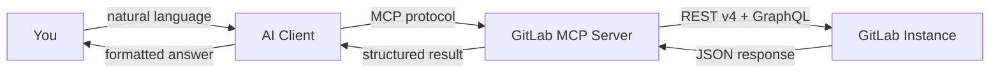

import { Card, CardGrid, LinkCard } from "@astrojs/starlight/components";

**GitLab MCP Server** is a [Model Context Protocol](https://modelcontextprotocol.io/) server that enables AI assistants to interact with GitLab through natural language. Ask your AI to create issues, review merge requests, analyze pipelines, and much more — all without leaving your editor.

## What can it do?

Instead of switching between your editor and GitLab's web UI, just ask:

```text
Show me all open merge requests in my-project that need review
```

```text
Why did the pipeline fail on branch feature/auth? Summarize the error and suggest a fix
```

```text
Create an issue titled "Refactor auth module" with priority label and assign it to me
```

The server translates these requests into GitLab API calls, executes them, and returns structured results your AI assistant can understand and act upon.

## Key features

| Feature                  | Details                                                                                                         |
| ------------------------ | --------------------------------------------------------------------------------------------------------------- |
| **32 Meta-Tools**       | Domain-grouped tools covering projects, issues, merge requests, pipelines, CI/CD, wikis, releases, and more     |
| **11 Analysis Tools**    | AI-powered analysis via MCP sampling — pipeline failure diagnosis, MR security review, technical debt detection |
| **44 MCP Resources**     | Read-only data endpoints for project info, user profiles, server configuration                                  |
| **38 MCP Prompts**       | Pre-built prompt templates for reports, audits, cross-project analysis, and team workflows                      |
| **Multi-User HTTP Mode** | Deploy as a shared server with per-token isolation for team environments                                        |
| **GitLab CE & EE**       | Compatible with both Community Edition and Enterprise Edition, including self-hosted instances                  |
| **Enterprise Tools**     | Optional 15 additional tools for GitLab Premium/Ultimate features (DORA metrics, vulnerabilities, compliance)   |
| **Auto-Update**          | Built-in self-update mechanism — always run the latest version                                                  |
| **Cross-Platform**       | Single binary for Linux, macOS, and Windows (amd64 & arm64)                                                     |

## Quick example

**You:** "What merge requests are open in `my-org/backend` and who's assigned?"

**AI Assistant** (via GitLab MCP Server):

> Found 3 open merge requests in `my-org/backend`:
>
> | MR   | Title                        | Author   | Assignee | Pipeline   |
> | ---- | ---------------------------- | -------- | -------- | ---------- |
> | !142 | Add rate limiting middleware | @alice   | @bob     | ✅ passed  |
> | !139 | Fix N+1 query in /users      | @charlie | @alice   | ❌ failed  |
> | !137 | Update OpenAPI spec          | @bob     | —        | ⏳ running |
>
> **!139** has a failed pipeline — would you like me to analyze the failure?

**You:** "Yes, check why !139 failed"

**AI Assistant:**

> Pipeline #8847 failed at the `test` stage, job `unit-tests`:
>
> ```text
> FAIL: TestUserService_ListUsers — expected 10 results, got 15
> ```
>
> The N+1 fix changed the query to return all results without applying the default pagination limit.
> **Suggested fix:** Add `.Limit(defaultPageSize)` to the query in `user_repository.go:87`.

## Without vs with GitLab MCP Server

|                        | ❌ Without                                                | ✅ With GitLab MCP Server                                        |
| ---------------------- | --------------------------------------------------------- | ---------------------------------------------------------------- |
| **Code review**        | Switch to GitLab UI, read diffs, write comments manually  | _"Review the security of MR !142 and leave comments"_            |
| **Pipeline debugging** | Open pipeline logs, trace failing jobs, search for errors | _"Why did the pipeline fail on feature/auth?"_                   |
| **Issue management**   | Navigate to Issues, fill forms, assign labels one by one  | _"Create a P1 bug for the auth regression and assign to @alice"_ |
| **Release notes**      | Read every commit since last tag, write changelog by hand | _"Generate release notes for v2.1.0 vs v2.0.0"_                  |
| **Project overview**   | Open multiple tabs: MRs, issues, pipelines, milestones    | _"Give me a status report for my-org/backend"_                   |

## Example prompts

Try these with your AI assistant once GitLab MCP Server is connected:

### Projects & Code

- _"List my GitLab projects"_
- _"Show the README of project my-app"_
- _"Search for TODO comments across the codebase"_

### Merge Requests & Code Review

- _"Show open merge requests in my-app"_
- _"Summarize the changes in MR !42"_
- _"Is MR !15 safe to merge? Check for security issues"_

### Issues & Planning

- _"List open issues assigned to me"_
- _"Create a bug report titled 'Fix login page' with label 'bug'"_
- _"What's the progress on milestone v2.0?"_

### CI/CD & Pipelines

- _"What's the latest pipeline status for my-app?"_
- _"Why did the last pipeline fail?"_
- _"Show the CI variables for project my-app"_

### Reports & Analysis

- _"Generate release notes from v1.0 to v2.0"_
- _"Give me a daily standup summary"_
- _"Assess the risk of merge request !23"_

## Get started

<CardGrid>
 <LinkCard
  title="Getting Started"
  href="/gitlab-mcp-server/getting-started/"
  description="Install the binary and connect to your first AI client in minutes"
 />
 <LinkCard
  title="Architecture"
  href="/gitlab-mcp-server/architecture/"
  description="Understand how the server connects AI assistants to GitLab"
 />
 <LinkCard
  title="Configuration"
  href="/gitlab-mcp-server/configuration/"
  description="Environment variables, client configs, and deployment options"
 />
 <LinkCard
  title="Tools Reference"
  href="/gitlab-mcp-server/tools/overview/"
  description="Browse all available MCP tools by domain"
 />
</CardGrid>

## How it works



The server acts as a bridge: your AI client sends tool calls over the MCP protocol, the server translates them into GitLab REST API v4 or GraphQL requests, and returns the results in both structured JSON (for the AI) and formatted Markdown (for you).

## Supported AI clients

GitLab MCP Server works with any MCP-compatible client:

- **VS Code + GitHub Copilot** — via `mcp.json` configuration
- **Claude Desktop** — via `claude_desktop_config.json`
- **Cursor** — via `.cursor/mcp.json`
- **Claude Code** — via `claude code mcp add`
- **Any MCP client** — stdio or HTTP transport
