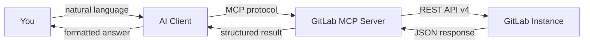

import { Card, CardGrid, LinkCard } from "@astrojs/starlight/components";

**GitLab MCP Server** is a [Model Context Protocol](https://modelcontextprotocol.io/) server that enables AI assistants to interact with GitLab through natural language. Ask your AI to create issues, review merge requests, analyze pipelines, and much more — all without leaving your editor.

## What Can It Do?

Instead of switching between your editor and GitLab's web UI, just ask:

```
Show me all open merge requests in my-project that need review
```

```
Why did the pipeline fail on branch feature/auth? Summarize the error and suggest a fix
```

```
Create an issue titled "Refactor auth module" with priority label and assign it to me
```

The server translates these requests into GitLab API calls, executes them, and returns structured results your AI assistant can understand and act upon.

## Key Features

| Feature                  | Details                                                                                                         |
| ------------------------ | --------------------------------------------------------------------------------------------------------------- |
| **40+ Meta-Tools**       | Domain-grouped tools covering projects, issues, merge requests, pipelines, CI/CD, wikis, releases, and more     |
| **11 Analysis Tools**    | AI-powered analysis via MCP sampling — pipeline failure diagnosis, MR security review, technical debt detection |
| **24 MCP Resources**     | Read-only data endpoints for project info, user profiles, server configuration                                  |
| **38 MCP Prompts**       | Pre-built prompt templates for reports, audits, cross-project analysis, and team workflows                      |
| **Multi-User HTTP Mode** | Deploy as a shared server with per-token isolation for team environments                                        |
| **GitLab CE & EE**       | Compatible with both Community Edition and Enterprise Edition, including self-hosted instances                  |
| **Enterprise Tools**     | Optional 19 additional tools for GitLab Premium/Ultimate features (DORA metrics, vulnerabilities, compliance)   |
| **Auto-Update**          | Built-in self-update mechanism — always run the latest version                                                  |
| **Cross-Platform**       | Single binary for Linux, macOS, and Windows (amd64 & arm64)                                                     |

## Quick Example

**You:** "What merge requests are open in `my-org/backend` and who's assigned?"

**AI Assistant** (via GitLab MCP Server):

> Found 3 open merge requests in `my-org/backend`:
>
> | MR   | Title                        | Author   | Assignee | Pipeline   |
> | ---- | ---------------------------- | -------- | -------- | ---------- |
> | !142 | Add rate limiting middleware | @alice   | @bob     | ✅ passed  |
> | !139 | Fix N+1 query in /users      | @charlie | @alice   | ❌ failed  |
> | !137 | Update OpenAPI spec          | @bob     | —        | ⏳ running |
>
> **!139** has a failed pipeline — would you like me to analyze the failure?

**You:** "Yes, check why !139 failed"

**AI Assistant:**

> Pipeline #8847 failed at the `test` stage, job `unit-tests`:
>
> ```
> FAIL: TestUserService_ListUsers — expected 10 results, got 15
> ```
>
> The N+1 fix changed the query to return all results without applying the default pagination limit.
> **Suggested fix:** Add `.Limit(defaultPageSize)` to the query in `user_repository.go:87`.

## Get Started

<CardGrid>
	<LinkCard
		title="Getting Started"
		href="/en/getting-started/"
		description="Install the binary and connect to your first AI client in minutes"
	/>
	<LinkCard
		title="Architecture"
		href="/en/architecture/"
		description="Understand how the server connects AI assistants to GitLab"
	/>
	<LinkCard
		title="Configuration"
		href="/en/configuration/"
		description="Environment variables, client configs, and deployment options"
	/>
	<LinkCard
		title="Tools Reference"
		href="/en/tools/"
		description="Browse all available MCP tools by domain"
	/>
</CardGrid>

## How It Works



The server acts as a bridge: your AI client sends tool calls over the MCP protocol, the server translates them into GitLab REST API requests, and returns the results in both structured JSON (for the AI) and formatted Markdown (for you).

## Supported AI Clients

GitLab MCP Server works with any MCP-compatible client:

- **VS Code + GitHub Copilot** — via `mcp.json` configuration
- **Claude Desktop** — via `claude_desktop_config.json`
- **Cursor** — via `.cursor/mcp.json`
- **Claude Code** — via `claude code mcp add`
- **Any MCP client** — stdio or HTTP transport
