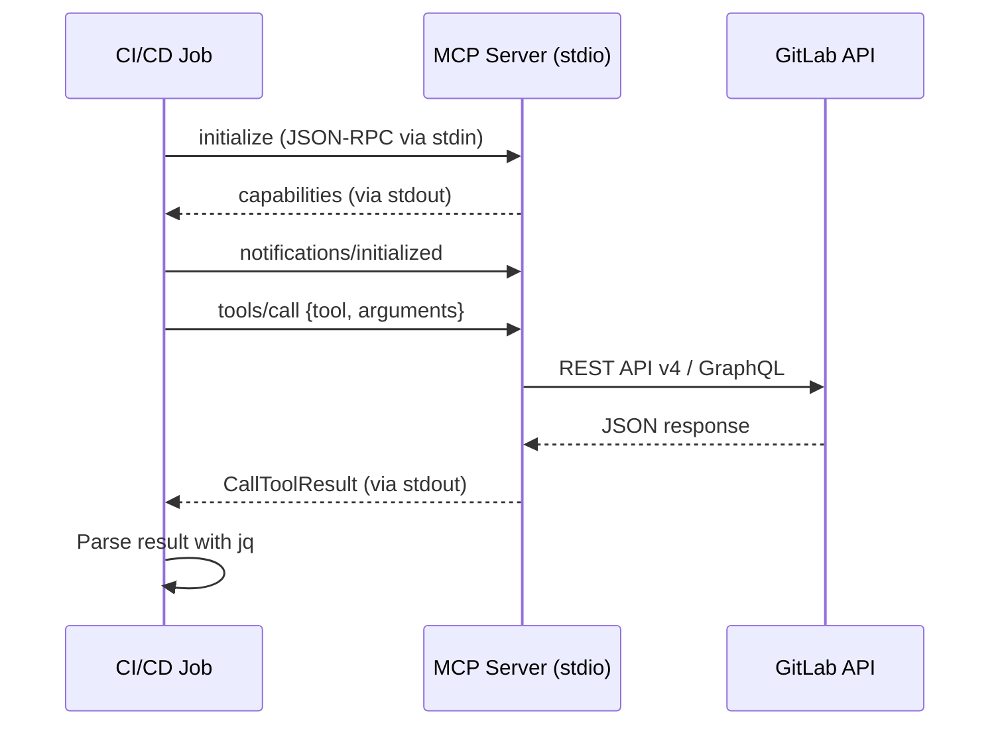

import { Steps, Tabs, TabItem } from "@astrojs/starlight/components";
import FAQ from "../../../components/FAQ.astro";

gitlab-mcp-server can run inside CI/CD jobs just like any other CLI tool. Two usage modes are available:

| Mode                                 | LLM Required | Use Case                                                         |      Determinism      |
| ------------------------------------ | :----------: | ---------------------------------------------------------------- | :-------------------: |
| **Deterministic** (JSON-RPC)         |      No      | Scripted operations: list issues, post comments, create releases | ✅ Fully deterministic |
| **LLM-driven** (headless MCP client) |     Yes      | Intelligent workflows: code review, issue triage, MR analysis    |  ❌ Non-deterministic  |

Both modes authenticate with a **Personal Access Token** (PAT) or **Project Access Token**. A token with `api` scope reaches every action the instance's tier serves, Premium and Ultimate adding their own. On GitLab.com, Premium and Ultimate also serve the Orbit actions.

This page is about running the server inside a job. For the pipeline, job, variable, schedule and trigger actions an assistant can call, see [CI/CD tools available](#cicd-tools-available) below and the [CI/CD workflow examples](/gitlab-mcp-server/examples/ci-cd-workflows/).



## Prerequisites

<Steps>

1. **Download the binary** from [GitHub Releases](https://github.com/jmrplens/gitlab-mcp-server/releases):

   ```bash
   curl -sSL "https://github.com/jmrplens/gitlab-mcp-server/releases/latest/download/gitlab-mcp-server-linux-amd64" \
     -o gitlab-mcp-server
   chmod +x gitlab-mcp-server
   ```

   To pin a release instead of following the newest one, replace `releases/latest/download/` with `releases/download/v<version>/`, as [Native binary](/gitlab-mcp-server/install/binary/#download-by-hand) shows.

2. **Create a Project Access Token** (recommended over personal PATs for CI) under the project's **Settings > Access Tokens**. Give it `api` for every tool the job may call, or `read_api` for a job that only reads (list, get and search actions): the server serves a `read_api` token the actions GitLab accepts from it, which leaves out linting inline CI content (`template.lint`). Set an expiry date; 90 days at most is a sound default.

3. **Store the token** as a masked CI/CD variable named `MCP_PAT`, as [Storing the token](#storing-the-token) describes.

</Steps>

:::caution
Do not run the released Linux binary on Alpine. The Linux assets are position-independent executables that use the glibc dynamic loader (`/lib64/ld-linux-x86-64.so.2`), which musl does not provide, so `./gitlab-mcp-server` fails with a misleading `not found` even though the file is there and executable. Use a glibc base image (`debian:stable-slim`, `ubuntu`, `python:3.12-slim`), or the container image `ghcr.io/jmrplens/gitlab-mcp-server`, which is built against musl. It infers its transport from stdin, and a CI runner promises nothing about the shape of stdin, so say `--transport stdio` outright for a stdio job.
:::

### Storing the token

**GitLab CI**: under **Settings > CI/CD > Variables**, add:

| Variable  | Value           | Properties                   |
| --------- | --------------- | ---------------------------- |
| `MCP_PAT` | `glpat-xxxx...` | Masked, Protected (optional) |

**GitHub Actions**: under **Settings > Secrets and variables > Actions**, add a repository secret named `MCP_PAT`.

Never write a token into a pipeline file, and never print it in a job log: every example on this page passes it through the CI system's secret variable and nothing else.

## Mode 1: Deterministic (No LLM)

Send JSON-RPC messages directly to the server via stdio. Fully deterministic — no LLM or external API needed.

### How it works

The server communicates via the [MCP protocol](https://modelcontextprotocol.io/specification/2025-11-25/basic/transports#stdio) over stdin/stdout using JSON-RPC 2.0. Each interaction requires an `initialize` handshake, an `initialized` notification, then one or more `tools/call` requests.

**Keep stdin open until the answer has arrived.** The server stops when its standard input closes, and it cancels every call still running at that moment, so a call is answered only if stdin is still open when its result is ready. A tool call also waits until the server has built its tool catalog, which follows its first requests to GitLab, so the result comes a moment after the handshake. Piping a fixed set of lines into the server (`{ echo ...; } | ./gitlab-mcp-server`) closes stdin as soon as the last line is written, and the job reads `null` instead of a result. Every example below starts the server as a bash coprocess, writes the requests to it, reads its answers until the one with the expected `id` arrives, and only then closes its input.

Which tool names a job may call depends on the active **tool surface**. The default is `dynamic`: it registers exactly two tools, `gitlab_find_action` and `gitlab_execute_action`, so a script calls `gitlab_execute_action` with a canonical `domain.action` ID and a `params` object. Naming an individual tool on the default surface is answered with `{"code":-32602,"message":"unknown tool ..."}`; because that is a JSON-RPC error and not a tool result, `jq -r '.result.content[0].text'` prints `null` and the job succeeds with no output unless it checks for `error`, as the examples below do. If you prefer one tool per operation, set `GITLAB_MCP_TOOL_SURFACE=individual` in the job's `variables:`. Individual names are domain-first, not verb-first (`gitlab_issue_list`, `gitlab_mr_list`, `gitlab_project_get`); see the [Tools Overview](/gitlab-mcp-server/tools/overview/).

### GitLab CI example

```yaml
# .gitlab-ci.yml
mcp-list-issues:
  stage: test
  image: debian:stable-slim
  variables:
    GITLAB_URL: ${CI_SERVER_URL}
    GITLAB_TOKEN: ${MCP_PAT}
  before_script:
    - apt-get update && apt-get install -y --no-install-recommends ca-certificates curl jq
    - curl -sSL "https://github.com/jmrplens/gitlab-mcp-server/releases/latest/download/gitlab-mcp-server-linux-amd64"
      -o gitlab-mcp-server
    - chmod +x gitlab-mcp-server
  script:
    - |
      # stdin stays open until the answer to id 2 has been read: the server
      # cancels a call still running when its input closes.
      coproc MCP { ./gitlab-mcp-server 2>/dev/null; }
      to=${MCP[1]} from=${MCP[0]} pid=${MCP_PID}
      echo '{"jsonrpc":"2.0","method":"initialize","params":{"protocolVersion":"2025-11-25","capabilities":{},"clientInfo":{"name":"ci","version":"1.0"}},"id":1}' >&"${to}"
      echo '{"jsonrpc":"2.0","method":"notifications/initialized"}' >&"${to}"
      echo '{"jsonrpc":"2.0","method":"tools/call","params":{"name":"gitlab_execute_action","arguments":{"action":"issue.list","params":{"project_id":"'"${CI_PROJECT_ID}"'","state":"opened","per_page":5}}},"id":2}' >&"${to}"
      RESULT=""
      while IFS= read -r line <&"${from}"; do
        if jq -e '.id == 2' >/dev/null <<<"${line}"; then RESULT=${line}; break; fi
      done
      exec {to}>&-
      wait "${pid}"
    # An empty RESULT means the server exited without answering. jq -e then
    # fails the job on a JSON-RPC error or a tool error instead of printing
    # "null" and exiting 0.
    - test -n "${RESULT}"
    - jq -e 'has("error") | not' >/dev/null <<<"${RESULT}"
    - jq -e '.result.isError != true' >/dev/null <<<"${RESULT}"
    - jq -r '.result.content[0].text' <<<"${RESULT}"
```

### Standalone script

The same exchange as a script a job can call, with the token taken from the masked variable:

```bash
#!/bin/bash
set -euo pipefail

export GITLAB_URL="${CI_SERVER_URL}"
export GITLAB_TOKEN="${MCP_PAT}"

coproc MCP { ./gitlab-mcp-server 2>/dev/null; }
to=${MCP[1]} from=${MCP[0]} pid=${MCP_PID}

# 1. Initialize handshake
echo '{"jsonrpc":"2.0","method":"initialize","params":{"protocolVersion":"2025-11-25","capabilities":{},"clientInfo":{"name":"ci-script","version":"1.0"}},"id":1}' >&"${to}"
# 2. Initialized notification
echo '{"jsonrpc":"2.0","method":"notifications/initialized"}' >&"${to}"
# 3. Call an action through the default dynamic surface
echo '{"jsonrpc":"2.0","method":"tools/call","params":{"name":"gitlab_execute_action","arguments":{"action":"issue.list","params":{"project_id":"'"${CI_PROJECT_ID}"'","state":"opened","per_page":10}}},"id":2}' >&"${to}"

# 4. Read until the answer to id 2 arrives, and only then close stdin
RESULT=""
while IFS= read -r line <&"${from}"; do
  if jq -e '.id == 2' >/dev/null <<<"${line}"; then RESULT=${line}; break; fi
done
exec {to}>&-
wait "${pid}"

if [[ -z "${RESULT}" ]]; then
  echo "the server exited without answering" >&2
  exit 1
fi
jq '.' <<<"${RESULT}"
```

The server answers one JSON-RPC message per line. The loop reads them in turn, skips the answer to `initialize` (`id` 1) and stops at the tool result (`id` 2), the moment it is safe to close the server's input; the `{ echo ...; } | ./gitlab-mcp-server` shape that ends stdin at once gets no result at all.

### Several calls in one session

One process can answer several calls. Give each its own `id`, keep stdin open until every `id` has been answered, and match each answer to its call by `id` rather than by position:

```bash
#!/bin/bash
set -euo pipefail

export GITLAB_URL="${CI_SERVER_URL}"
export GITLAB_TOKEN="${MCP_PAT}"

coproc MCP { ./gitlab-mcp-server 2>/dev/null; }
to=${MCP[1]} from=${MCP[0]} pid=${MCP_PID}

echo '{"jsonrpc":"2.0","method":"initialize","params":{"protocolVersion":"2025-11-25","capabilities":{},"clientInfo":{"name":"ci","version":"1.0"}},"id":1}' >&"${to}"
echo '{"jsonrpc":"2.0","method":"notifications/initialized"}' >&"${to}"

# List open merge requests
echo '{"jsonrpc":"2.0","method":"tools/call","params":{"name":"gitlab_execute_action","arguments":{"action":"merge_request.list","params":{"project_id":"'"${CI_PROJECT_ID}"'","state":"opened"}}},"id":2}' >&"${to}"

# Get the project's details
echo '{"jsonrpc":"2.0","method":"tools/call","params":{"name":"gitlab_execute_action","arguments":{"action":"project.get","params":{"project_id":"'"${CI_PROJECT_ID}"'"}}},"id":3}' >&"${to}"

# Keep stdin open until both calls are answered
RESPONSES=()
while (( ${#RESPONSES[@]} < 2 )) && IFS= read -r line <&"${from}"; do
  if jq -e '.id == 2 or .id == 3' >/dev/null <<<"${line}"; then RESPONSES+=("${line}"); fi
done
exec {to}>&-
wait "${pid}"

printf '%s\n' "${RESPONSES[@]}" | jq -s '.'
```

### Helper function

For pipelines with many tool calls, wrap the protocol in a reusable function. Its optional third argument sets the JSON-RPC `id` of the call, any number but 1, which the handshake uses:

```bash
mcp_call() {
  local action="$1"
  local args="$2"
  local id="${3:-2}"
  local response="" line to from pid
  coproc MCP { ./gitlab-mcp-server 2>/dev/null; }
  to=${MCP[1]} from=${MCP[0]} pid=${MCP_PID}
  echo '{"jsonrpc":"2.0","method":"initialize","params":{"protocolVersion":"2025-11-25","capabilities":{},"clientInfo":{"name":"ci","version":"1.0"}},"id":1}' >&"${to}"
  echo '{"jsonrpc":"2.0","method":"notifications/initialized"}' >&"${to}"
  echo '{"jsonrpc":"2.0","method":"tools/call","params":{"name":"gitlab_execute_action","arguments":{"action":"'"${action}"'","params":'"${args}"'}},"id":'"${id}"'}' >&"${to}"

  # stdin stays open until the answer arrives: the server cancels a call
  # still running when its input closes.
  while IFS= read -r line <&"${from}"; do
    if jq -e --argjson id "${id}" '.id == $id' >/dev/null <<<"${line}"; then
      response=${line}
      break
    fi
  done
  exec {to}>&-
  wait "${pid}"

  # No answer, a JSON-RPC error and a tool error are different failures, and
  # none of them sets an exit status: without these checks the function
  # prints nothing useful and the job succeeds.
  if [[ -z "${response}" ]]; then
    echo "MCP ${action}: the server exited without answering" >&2
    return 1
  fi
  if jq -e 'has("error")' >/dev/null <<<"${response}"; then
    echo "MCP ${action} failed: $(jq -r '.error.message' <<<"${response}")" >&2
    return 1
  fi
  if jq -e '.result.isError == true' >/dev/null <<<"${response}"; then
    echo "MCP ${action} returned a tool error: $(jq -r '.result.content[0].text' <<<"${response}")" >&2
    return 1
  fi
  jq -r '.result.content[0].text' <<<"${response}"
}

# Usage
ISSUES=$(mcp_call "issue.list" '{"project_id":"'"${CI_PROJECT_ID}"'","state":"opened"}')
echo "Open issues: ${ISSUES}"

# CI_MERGE_REQUEST_IID is set only in merge request pipelines
MR_DETAILS=$(mcp_call "merge_request.get" '{"project_id":"'"${CI_PROJECT_ID}"'","merge_request_iid":"'"${CI_MERGE_REQUEST_IID}"'"}')
echo "MR details: ${MR_DETAILS}"
```

## Mode 2: LLM-driven (Headless MCP client)

Use a headless MCP client to let an LLM drive tool selection and orchestration. Ideal for intelligent workflows like code review, issue triage, and release notes generation.

### Recommended client: IBM mcp-cli

[IBM mcp-cli](https://github.com/IBM/mcp-cli) supports command mode for scriptable LLM-driven workflows, with OpenAI, Anthropic, Azure, Gemini, Groq, and local Ollama providers:

- `mcp-cli cmd --prompt "..."` hands a natural-language task to the model, which picks and calls the tools.
- `mcp-cli cmd --tool <name> --tool-args '{...}'` calls one tool directly, with no model deciding anything.
- Its interactive mode can also build multi-step tool plans as dependency graphs and run their independent steps in parallel.

### Server configuration

mcp-cli reads its servers from `server_config.json`:

```json
{
  "mcpServers": {
    "gitlab": {
      "command": "./gitlab-mcp-server"
    }
  }
}
```

The file names no credential on purpose. mcp-cli starts the server with the job's own environment, so `GITLAB_URL` and `GITLAB_TOKEN` set as job variables reach it unchanged. It does not expand environment variables inside the file: an `env` block written as `"GITLAB_TOKEN": "${GITLAB_TOKEN}"` would replace the real token with that literal text. The one placeholder it resolves is a whole value of the form `${TOKEN:<namespace>:<name>}`, which it reads from its own token store, not from the environment (checked against mcp-cli 0.20.1).

### GitLab CI: automated MR review

```yaml
# .gitlab-ci.yml
auto-review:
  stage: review
  image: python:3.12-slim
  variables:
    GITLAB_URL: ${CI_SERVER_URL}
    GITLAB_TOKEN: ${MCP_PAT}
    OPENAI_API_KEY: ${OPENAI_KEY}
  before_script:
    - apt-get update && apt-get install -y curl
    - curl -sSL "https://github.com/jmrplens/gitlab-mcp-server/releases/latest/download/gitlab-mcp-server-linux-amd64"
      -o gitlab-mcp-server
    - chmod +x gitlab-mcp-server
    - pip install --quiet mcp-cli
  script:
    - |
      cat > server_config.json << 'EOF'
      {
        "mcpServers": {
          "gitlab": {
            "command": "./gitlab-mcp-server"
          }
        }
      }
      EOF
    - |
      mcp-cli cmd \
        --config-file server_config.json \
        --server gitlab \
        --provider openai \
        --model gpt-4o \
        --prompt "Review merge request !${CI_MERGE_REQUEST_IID} in project ${CI_PROJECT_ID}. Check for code quality, security issues, and missing tests. Post your review as a note on the MR." \
        --raw
  rules:
    - if: $CI_MERGE_REQUEST_IID
```

### GitLab CI: scheduled issue triage

The same setup, run from a pipeline schedule, can label the backlog. The token needs `api`, since adding labels is a write:

```yaml
# .gitlab-ci.yml
triage-issues:
  stage: deploy
  image: python:3.12-slim
  variables:
    GITLAB_URL: ${CI_SERVER_URL}
    GITLAB_TOKEN: ${MCP_PAT}
    OPENAI_API_KEY: ${OPENAI_KEY}
  before_script:
    - apt-get update && apt-get install -y curl
    - curl -sSL "https://github.com/jmrplens/gitlab-mcp-server/releases/latest/download/gitlab-mcp-server-linux-amd64"
      -o gitlab-mcp-server
    - chmod +x gitlab-mcp-server
    - pip install --quiet mcp-cli
  script:
    - |
      cat > server_config.json << 'EOF'
      {
        "mcpServers": {
          "gitlab": {
            "command": "./gitlab-mcp-server"
          }
        }
      }
      EOF
    - |
      mcp-cli cmd \
        --config-file server_config.json \
        --server gitlab \
        --provider openai \
        --model gpt-4o \
        --prompt "List all open issues in project ${CI_PROJECT_ID} without labels. For each issue, analyze its content and add appropriate labels (bug, feature, documentation, etc.)." \
        --raw
  rules:
    - if: $CI_PIPELINE_SOURCE == "schedule"
```

### Using a local LLM (Ollama)

For pipelines that cannot use external LLM APIs, run Ollama as a CI service. mcp-cli's Ollama provider (from its `chuk-llm` dependency) finds the service through `OLLAMA_BASE_URL`, which its model discovery reads as well, and never through `OLLAMA_HOST`:

```yaml
local-llm-review:
  stage: review
  image: python:3.12-slim
  services:
    - name: ollama/ollama:latest
      alias: ollama
  variables:
    GITLAB_URL: ${CI_SERVER_URL}
    GITLAB_TOKEN: ${MCP_PAT}
    OLLAMA_BASE_URL: http://ollama:11434
  before_script:
    - apt-get update && apt-get install -y --no-install-recommends curl
    - curl -sSL "https://github.com/jmrplens/gitlab-mcp-server/releases/latest/download/gitlab-mcp-server-linux-amd64"
      -o gitlab-mcp-server
    - chmod +x gitlab-mcp-server
    - pip install --quiet mcp-cli
    - curl -s "${OLLAMA_BASE_URL}/api/pull" -d '{"name":"qwen2.5-coder:7b"}'
  script:
    - |
      cat > server_config.json << 'EOF'
      {
        "mcpServers": {
          "gitlab": {
            "command": "./gitlab-mcp-server"
          }
        }
      }
      EOF
    - |
      mcp-cli cmd \
        --config-file server_config.json \
        --server gitlab \
        --provider ollama \
        --model qwen2.5-coder:7b \
        --prompt "Summarize the latest 5 merge requests in project ${CI_PROJECT_ID}." \
        --raw
```

## HTTP transport in CI

For pipelines that make many tool calls, the HTTP transport avoids per-call process startup overhead:

```yaml
# .gitlab-ci.yml
http-mode-pipeline:
  stage: test
  image: debian:stable-slim
  before_script:
    - apt-get update && apt-get install -y --no-install-recommends ca-certificates curl jq
    - curl -sSL "https://github.com/jmrplens/gitlab-mcp-server/releases/latest/download/gitlab-mcp-server-linux-amd64"
      -o gitlab-mcp-server
    - chmod +x gitlab-mcp-server
  script:
    # Start the server in the background, then wait until /health answers.
    # --json-response makes each answer a plain JSON body that jq can read;
    # the default is a text/event-stream envelope.
    - |
      ./gitlab-mcp-server --http \
        --gitlab-url="${CI_SERVER_URL}" \
        --http-addr=127.0.0.1:8080 \
        --json-response &
      for _ in $(seq 30); do
        curl -fsS http://127.0.0.1:8080/health >/dev/null && break
        sleep 1
      done
    # The default transport is stateless: every POST stands on its own, so a
    # tools/call needs no initialize before it. curl reads the token's header
    # from a file only this user can read, so the token never reaches its argv.
    - |
      HEADER=$(mktemp)
      printf 'PRIVATE-TOKEN: %s\n' "${MCP_PAT}" > "${HEADER}"
      curl -s -X POST http://127.0.0.1:8080/mcp \
        -H "Content-Type: application/json" \
        -H "Accept: application/json, text/event-stream" \
        -H @"${HEADER}" \
        -d '{"jsonrpc":"2.0","method":"tools/call","params":{"name":"gitlab_execute_action","arguments":{"action":"issue.list","params":{"project_id":"'"${CI_PROJECT_ID}"'","state":"opened"}}},"id":2}' \
        | jq '.result.content[0].text'
      rm -f "${HEADER}"
```

Three details decide whether that job reads an answer:

- **`--json-response`.** Without it each answer is a `text/event-stream` envelope, which `jq` cannot parse. The flag has a cost the server states at startup: progress notifications cannot be delivered in a JSON body, so a long action such as `pipeline.wait` reports nothing until it ends.
- **The `Accept` header.** The transport answers `400` (`Accept must contain both 'application/json' and 'text/event-stream'`) to a POST whose `Accept` admits only one of the two. curl's default `*/*` admits both, so name them explicitly as the protocol asks: a client with a narrower default is refused.
- **No handshake.** `--stateless` is on by default, so each POST is self-contained and the call above is the whole conversation.

In HTTP mode each credential is limited to 10 calls a second with a burst of 40 by default; a job that loops faster can raise `--rate-limit-rps` and `--rate-limit-burst` ([Rate limiting](/gitlab-mcp-server/operations/http-server/#rate-limiting)). See [HTTP Server Mode](/gitlab-mcp-server/operations/http-server/) for every flag and the authentication options.

## GitHub Actions

The server runs the same way in a GitHub Actions job against any GitLab instance. GitHub sets no `CI_SERVER_URL`, so name the instance and the project as repository variables (**Settings > Secrets and variables > Actions**, Variables tab), next to the `MCP_PAT` secret. An unset or empty `GITLAB_URL` means `https://gitlab.com`, so a variable that was never created sends the token there.

### Deterministic mode

```yaml
# .github/workflows/mcp-query.yml
name: MCP Query
on:
  workflow_dispatch:

jobs:
  list-issues:
    runs-on: ubuntu-latest
    env:
      GITLAB_URL: ${{ vars.GITLAB_URL }}
      GITLAB_TOKEN: ${{ secrets.MCP_PAT }}
      GITLAB_PROJECT: ${{ vars.GITLAB_PROJECT }}
    steps:
      - name: Download gitlab-mcp-server
        run: |
          curl -sSL "https://github.com/jmrplens/gitlab-mcp-server/releases/latest/download/gitlab-mcp-server-linux-amd64" \
            -o gitlab-mcp-server
          chmod +x gitlab-mcp-server

      - name: List open issues
        run: |
          # stdin stays open until the answer to id 2 has been read
          coproc MCP { ./gitlab-mcp-server 2>/dev/null; }
          to=${MCP[1]} from=${MCP[0]} pid=${MCP_PID}
          echo '{"jsonrpc":"2.0","method":"initialize","params":{"protocolVersion":"2025-11-25","capabilities":{},"clientInfo":{"name":"ci","version":"1.0"}},"id":1}' >&"${to}"
          echo '{"jsonrpc":"2.0","method":"notifications/initialized"}' >&"${to}"
          echo '{"jsonrpc":"2.0","method":"tools/call","params":{"name":"gitlab_execute_action","arguments":{"action":"issue.list","params":{"project_id":"'"${GITLAB_PROJECT}"'","state":"opened","per_page":5}}},"id":2}' >&"${to}"
          RESULT=""
          while IFS= read -r line <&"${from}"; do
            if jq -e '.id == 2' >/dev/null <<<"${line}"; then RESULT=${line}; break; fi
          done
          exec {to}>&-
          wait "${pid}"
          test -n "${RESULT}"
          jq -e 'has("error") | not' >/dev/null <<<"${RESULT}"
          jq -e '.result.isError != true' >/dev/null <<<"${RESULT}"
          jq -r '.result.content[0].text' <<<"${RESULT}"
```

`GITLAB_PROJECT` holds the project's numeric ID or its `group/project` path.

### LLM-driven mode

```yaml
# .github/workflows/mcp-summary.yml
name: MCP Summary
on:
  workflow_dispatch:

jobs:
  summarize:
    runs-on: ubuntu-latest
    env:
      GITLAB_URL: ${{ vars.GITLAB_URL }}
      GITLAB_TOKEN: ${{ secrets.MCP_PAT }}
      GITLAB_PROJECT: ${{ vars.GITLAB_PROJECT }}
      OPENAI_API_KEY: ${{ secrets.OPENAI_KEY }}
    steps:
      - name: Setup
        run: |
          curl -sSL "https://github.com/jmrplens/gitlab-mcp-server/releases/latest/download/gitlab-mcp-server-linux-amd64" \
            -o gitlab-mcp-server
          chmod +x gitlab-mcp-server
          pipx install mcp-cli

      - name: Summarize recent changes
        run: |
          cat > server_config.json << 'EOF'
          {
            "mcpServers": {
              "gitlab": {
                "command": "./gitlab-mcp-server"
              }
            }
          }
          EOF
          mcp-cli cmd \
            --config-file server_config.json \
            --server gitlab \
            --provider openai \
            --model gpt-4o \
            --prompt "Summarize the merge requests merged in the last week in GitLab project ${GITLAB_PROJECT}." \
            --raw
```

As in the GitLab CI jobs, the token reaches the server through the job's environment and is never written into `server_config.json`.

## CI/CD tools available

Beyond running the server in pipelines, GitLab MCP Server provides comprehensive CI/CD management tools that AI assistants can use interactively. These are available through the default dynamic find/execute surface and through explicit meta-tools with `GITLAB_MCP_TOOL_SURFACE=meta`.

### Pipelines

The `pipeline` domain manages the full pipeline lifecycle. Its actions are `pipeline.<action>` IDs for `gitlab_execute_action` on the default dynamic surface and the `action` values of the `gitlab_pipeline` meta-tool with `GITLAB_MCP_TOOL_SURFACE=meta`:

| Action                | Description                                                                                               |
| --------------------- | --------------------------------------------------------------------------------------------------------- |
| `list`                | List pipelines with filtering by status, ref                                                              |
| `get`                 | Get pipeline details and status                                                                           |
| `create`              | Trigger a new pipeline with variables                                                                     |
| `cancel`              | Cancel a running pipeline                                                                                 |
| `retry`               | Retry a failed pipeline                                                                                   |
| `delete`              | Delete a pipeline                                                                                         |
| `variables`           | List pipeline variables                                                                                   |
| `test_report`         | Get test report for a pipeline                                                                            |
| `wait`                | **Wait for pipeline completion** with polling                                                             |
| `latest`              | Get the latest pipeline for a ref                                                                         |
| `test_report_summary` | Get the test report summary for a pipeline                                                                |
| `update_metadata`     | Update a pipeline's metadata (name)                                                                       |
| `trigger_*`           | Pipeline trigger token management (list, get, create, update, delete, run)                                |
| `schedule_*`          | Pipeline schedule CRUD (list, get, create, update, delete, run, take ownership, list triggered pipelines) |
| `schedule_*_variable` | Schedule variable CRUD (create, edit, delete)                                                             |

The schedule rows belong to the same `gitlab_pipeline` group as every other row, so on the dynamic surface their IDs read `pipeline.schedule_list`, `pipeline.schedule_run`, `pipeline.schedule_take_ownership`, `pipeline.schedule_list_triggered_pipelines`, `pipeline.schedule_create_variable`, `pipeline.schedule_edit_variable` and so on; on the meta surface they are `action` values of `gitlab_pipeline` like the rest of the table.

:::tip[Wait for pipeline]
The `wait` action polls a pipeline until it reaches a terminal state (success, failed, canceled). This is especially useful in CI scripts that need to block until a triggered pipeline finishes.
:::

### Jobs

The `job` domain provides complete job management. Its actions are `job.<action>` IDs for `gitlab_execute_action` on the default dynamic surface and the `action` values of the `gitlab_job` meta-tool with `GITLAB_MCP_TOOL_SURFACE=meta`:

| Action               | Description                                                                |
| -------------------- | -------------------------------------------------------------------------- |
| `list`               | List jobs for a pipeline                                                   |
| `get`                | Get job details                                                            |
| `play`               | Trigger a manual job                                                       |
| `cancel`             | Cancel a running job                                                       |
| `retry`              | Retry a failed job                                                         |
| `trace`              | Get job log output                                                         |
| `artifacts`          | Download a job's artifacts archive, or one report by `file_type` (19.4+)   |
| `download_artifacts` | Download the latest artifacts archive for a ref and job name               |
| `download_single_*`  | Download one file from a job's artifacts, by job ID or by ref and job name |
| `keep_artifacts`     | Keep artifacts past their expiry                                           |
| `delete_artifacts`   | Delete a job's artifacts (a project-wide variant deletes every job's)      |
| `erase`              | Erase a job's log and artifacts                                            |
| `list_project`       | List jobs across a project                                                 |
| `list_bridges`       | List a pipeline's trigger (bridge) jobs                                    |
| `wait`               | **Wait for job completion** with polling                                   |

The two single-file downloads are `job.download_single_artifact` (by job ID) and `job.download_single_artifact_by_ref` (by ref and job name); the project-wide delete is `job.delete_project_artifacts`.

### CI/CD configuration

| Domain (meta-tool)                   | Actions                                                             | Description                         |
| ------------------------------------ | ------------------------------------------------------------------- | ----------------------------------- |
| `template` (`gitlab_template`)       | `lint`, `lint_project`                                              | Validate `.gitlab-ci.yml` syntax    |
| `ci_variable` (`gitlab_ci_variable`) | `list`, `get`, `create`, `update`, `delete`                         | Manage CI/CD variables              |
| `environment` (`gitlab_environment`) | `list`, `get`, `create`, `update`, `delete`, `stop`, `deployment_*` | Manage environments and deployments |

### Pipeline with variables example

Trigger a pipeline with custom variables on the default dynamic surface:

```json
{
  "tool": "gitlab_execute_action",
  "arguments": {
    "action": "pipeline.create",
    "params": {
      "project_id": "my-group/my-project",
      "ref": "main",
      "variables": [
        { "key": "DEPLOY_ENV", "value": "staging", "variable_type": "env_var" },
        { "key": "CONFIG", "value": "...", "variable_type": "file" }
      ]
    }
  }
}
```

With `GITLAB_MCP_TOOL_SURFACE=meta` the same call is `gitlab_pipeline` with `{ "action": "create", "params": { ... } }`; meta-tools accept only `action` and `params` at the top level, so the parameters stay nested under `params` on both surfaces.

For the complete tool reference, see [Tools Overview](/gitlab-mcp-server/tools/overview/).

## Security best practices

| Practice      | Recommendation                                                     |
| ------------- | ------------------------------------------------------------------ |
| Token type    | **Project Access Token**, scoped to a single project, auditable    |
| Scope         | `api` for full access, `read_api` for read-only workflows          |
| Expiration    | 90 days maximum, rotate before expiry                              |
| Storage       | **Masked CI/CD variable**, never committed to the repository       |
| Visibility    | Mark the variable **Protected** if only protected branches need it |
| Multi-project | Use **Group Access Tokens** for cross-project workflows            |

### Minimal scope for the workflow

Match the token's scope to what the job does. A `read_api` token is served the actions GitLab accepts from `read_api`, so an action the job could not run is not even listed ([Token scopes](/gitlab-mcp-server/operations/security/#token-scopes)). That is decided by the request an action sends, not by whether it writes: linting CI content the job passes inline reads, and GitLab still answers it only from `api`, because it is sent as a `POST`, while linting the configuration the project has committed is a `GET` and takes `read_api`. Each action's entry in the [tool reference](/gitlab-mcp-server/reference/tools/) says which scope it needs:

| Workflow                            | Required scope |
| ----------------------------------- | -------------- |
| List issues, MRs, pipelines         | `read_api`     |
| Lint the committed CI configuration | `read_api`     |
| Lint CI content passed inline       | `api`          |
| Post comments, create issues        | `api`          |
| Manage releases, packages           | `api`          |
| Full MR review workflow             | `api`          |

### Group Access Tokens

For a workflow that spans several projects, create one **Group Access Token** instead of a token per project:

1. Go to the group's **Settings > Access Tokens**.
2. Create a token with the scope the workflow needs.
3. Use it in any project of the group, stored the same way as `MCP_PAT`.

## Troubleshooting

| Error                                           | Solution                                                                                                                                                                                                                                    |
| ----------------------------------------------- | ------------------------------------------------------------------------------------------------------------------------------------------------------------------------------------------------------------------------------------------- |
| `not found` / permission denied                 | On an Alpine (musl) image the released binary cannot start at all: use a glibc image or the container image. Otherwise check that the asset matches the runner's platform, run `chmod +x`, and confirm with `./gitlab-mcp-server --version` |
| `401 Unauthorized`                              | Check that `MCP_PAT` is set, not expired, and carries `api` or `read_api`; a Project Access Token works only for the project it belongs to                                                                                                  |
| `x509: certificate signed by unknown authority` | Set `GITLAB_MCP_SKIP_TLS_VERIFY: "true"` in the job's `variables:` (quoted, so YAML keeps it a string)                                                                                                                                      |
| Timeout on large responses                      | Add `per_page` to the action's `params`, for example `{"action": "issue.list", "params": {"project_id": "123", "per_page": 20}}`                                                                                                            |
| mcp-cli provider errors                         | Check that the provider's key variable is set (`OPENAI_API_KEY`, `ANTHROPIC_API_KEY`) or, for Ollama, that the service answers at `OLLAMA_BASE_URL` (mcp-cli does not read `OLLAMA_HOST`); then try `pip install --upgrade mcp-cli`         |

<FAQ />
