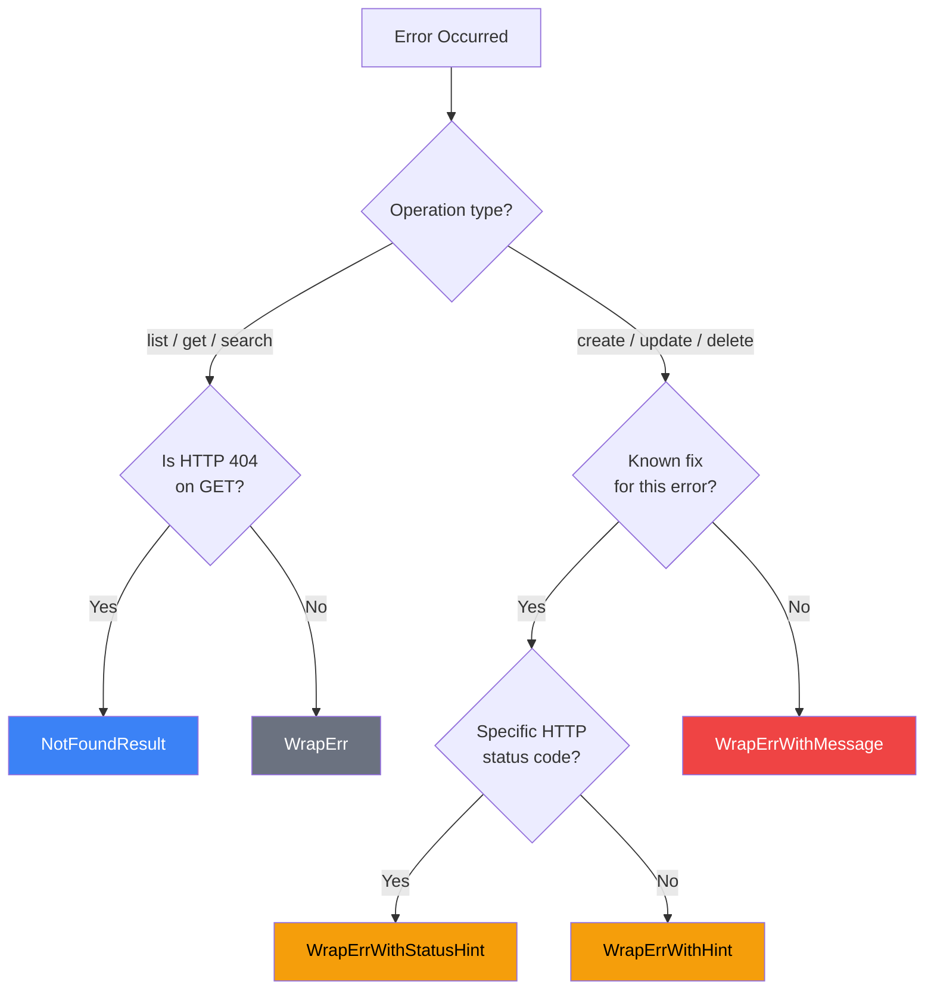

import { Tabs, TabItem } from "@astrojs/starlight/components";
import FAQ from "../../../components/FAQ.astro";

GitLab MCP Server provides structured error handling that classifies errors, extracts actionable details from GitLab API responses, and suggests corrective actions to the AI assistant.

## Error classification

Every error from the GitLab API is classified by HTTP status code into an actionable message:

| Status Code | Classification               | Message                                                                      |
| ----------- | ---------------------------- | ---------------------------------------------------------------------------- |
| 400         | Bad request                  | Check your input parameters                                                  |
| 401         | Authentication or permission | Invalid or expired `GITLAB_TOKEN`, or a permission refusal answered with 401 |
| 403         | Permissions                  | Your token lacks the required permissions                                    |
| 404         | Not found                    | Missing, inaccessible, or above your GitLab tier                             |
| 405         | Not allowed                  | The action does not apply to the resource's current state                    |
| 409         | Conflict                     | The resource already exists or there is a state conflict                     |
| 422         | Validation                   | GitLab rejected the request due to invalid data                              |
| 429         | Rate limit                   | Too many requests, wait before retrying                                      |
| 500         | Server error                 | GitLab internal server error                                                 |
| 502         | Bad gateway                  | GitLab is temporarily unavailable                                            |
| 503         | Maintenance                  | GitLab is under maintenance or overloaded                                    |

Network-level errors are also classified:

| Error Type         | Message                                      |
| ------------------ | -------------------------------------------- |
| Connection refused | GitLab server is unreachable                 |
| DNS failure        | GitLab server hostname could not be resolved |
| Timeout            | Request to GitLab timed out                  |
| TLS/SSL            | TLS/SSL handshake failed                     |

## Error wrapping functions

The server uses five error handling helpers, chosen based on the operation type:

<Tabs>
  <TabItem label="WrapErr">
    **Read-only operations** — Used for `list`, `get`, and `search` operations. Classifies the error and wraps it with the operation name:

    ```text
    list_issues: authentication failed: GitLab rejected the token (GITLAB_TOKEN) itself as invalid, expired, revoked or without the api or read_api scope, so renew or replace it
    ```

  </TabItem>
  <TabItem label="WrapErrWithMessage">
    **Mutating operations** — Used for `create`, `update`, and `delete` operations. Includes the specific error detail extracted from the GitLab API response:

    ```text
    fileCreate: bad request — A file with this name already exists: POST .../files: 400
    ```

    The server extracts the detailed error message from GitLab's API response, handling nested formats like `{message: {base: [text]}}`, and truncates at 300 characters.

  </TabItem>
  <TabItem label="WrapErrWithHint">
    **Known corrective actions** — Used when the corrective action for a specific error is known. Appends an actionable suggestion:

    ```text
    branchProtect: conflict — Protected branch rule already exists.
    Suggestion: use gitlab_protected_branch_get to view current rules
    ```

  </TabItem>
</Tabs>

### Decision tree

| Scenario                                    | Function                |
| ------------------------------------------- | ----------------------- |
| Read-only operation (list, get, search)     | `WrapErr`               |
| Mutating operation (create, update, delete) | `WrapErrWithMessage`    |
| Specific error with known fix               | `WrapErrWithHint`       |
| Status-specific hint (single code)          | `WrapErrWithStatusHint` |
| Get operation returning 404                 | `NotFoundResult`        |



### NotFoundResult — Informational 404 responses

For `get` handlers, 404 errors are treated as informational rather than failures. Instead of returning an opaque Go error (logged at ERROR level), the handler returns a `CallToolResult` with `IsError: true` and domain-specific hints:

```markdown
## ❓ Branch Not Found

Branch `feature/old` was not found in the project.

💡 **Next steps:**

- Use `gitlab_branch_list` to see available branches
- Check branch name spelling and case sensitivity
```

This pattern is applied through a shared formatter in each of 19 domains, so every get handler of a domain answers the same way. It logs at INFO level (expected outcome) and provides the AI assistant with actionable next steps.

## Corrective hints

Where the fix for an error is known, the handler attaches it at the call site: `WrapErrWithStatusHint` appends the hint only when the response carries one HTTP status (a `422` validation failure, a `404`, a `409`), falling back to `WrapErrWithMessage` for every other status, and `WrapErrWithHint` always appends it, which is what a GraphQL error reported inside a `200` response needs, since it carries no status code. A GraphQL refusal answered with an error status carries one, and `WrapErrWithStatusHint` reads it there as it does over REST. The suggestion travels in the error text as `Suggestion: ...`, so the AI assistant can correct its request without additional API calls.

## Error response format

When a handler answers with an error result rather than a Go error, the response is a Markdown block with structured diagnostic fields:

```markdown
## ❌ Error: branch/list

**Message**: unauthorized: either the token (GITLAB_TOKEN) is invalid or expired, or it is valid and lacks a permission this action needs, since some GitLab endpoints answer a missing permission with 401 rather than 403. If the token works for other calls, treat this as a permission refusal
**HTTP Status**: 401 Unauthorized
**Details**: GET https://gitlab.example.com/api/v4/projects/42/repository/branches: 401 {message: 401 Unauthorized}
**Request ID**: `abc123def456`
```

The structured response includes:

| Field           | Description                                                    |
| --------------- | -------------------------------------------------------------- |
| **Heading**     | The domain and action that failed                              |
| **Message**     | The classified error message                                   |
| **HTTP Status** | GitLab's status code and its reason phrase, when there was one |
| **Details**     | The request line and the message GitLab returned, when present |
| **Request ID**  | GitLab's `X-Request-Id` for support tickets                    |

## Transient vs permanent errors

:::danger[Do not retry permanent errors]
4xx errors (except 429) indicate a problem with the request itself — retrying will produce the same result. Fix the input parameters or configuration instead.
:::

The server classifies errors as **transient** (retryable) or **permanent**:

| Type      | Status Codes                           | Behavior                                      |
| --------- | -------------------------------------- | --------------------------------------------- |
| Transient | 429, 5xx, timeouts, connection refused | Safe to retry after a delay                   |
| Permanent | 4xx (except 429)                       | Do not retry — fix the input or configuration |

## Example error scenarios

### Invalid token

```text
❌ list_projects: authentication failed: GitLab rejected the token (GITLAB_TOKEN) itself as invalid, expired, revoked or without the api or read_api scope, so renew or replace it
💡 Generate a new token with api scope at GitLab → Preferences → Access Tokens
```

GitLab says so explicitly for an expired, revoked or impersonation-disabled token, and for any 401 from its GraphQL endpoint, a token without the `api` or `read_api` scope included. Those are the cases where the message names the token alone.

### Permission refused with 401

GitLab answers some permission refusals with 401 rather than 403: approving a merge request you opened on an instance that prevents approval by the author, or merging without push access to the target branch. The status alone cannot say which cause applies, so the message names both, and the handler's suggestion names the permission:

```text
❌ mrApprove: unauthorized: either the token (GITLAB_TOKEN) is invalid or expired, or it is valid and lacks a permission this action needs, since some GitLab endpoints answer a missing permission with 401 rather than 403. If the token works for other calls, treat this as a permission refusal. Suggestion: you may be the MR author (self-approval not allowed) or lack sufficient permissions
```

Every action whose GitLab route refuses a permission this way carries a suggestion naming it: merging and cancelling auto-merge, approving and resetting approvals, adding to a merge train, push mirrors, access token reads, lists and rotation, external status checks, security settings, removing an award emoji, updating a group and linking a fork. The suggestion is left out when GitLab says the token itself was refused, since the message has already said so and a missing permission cannot be the reason.

### Permission denied

```text
❌ create_issue: access denied — your token lacks the required permissions
Detail: 403 Forbidden
💡 Ensure the token has api scope and you have Developer+ access to the project
```

### Resource conflict

```text
❌ branchProtect: conflict — Protected branch rule already exists
💡 Use gitlab_protected_branch_get to view current rules, or gitlab_protected_branch_update to modify
```

### Validation error

```text
❌ create_issue: validation failed — title is too long (maximum is 255 characters)
💡 Shorten the title to 255 characters or less
```

<FAQ />

## Source reference

:::note[Developer Documentation]
For the complete technical reference, see [`docs/concepts/error-handling.md`](https://github.com/jmrplens/gitlab-mcp-server/blob/main/docs/concepts/error-handling.md) in the repository.
:::
