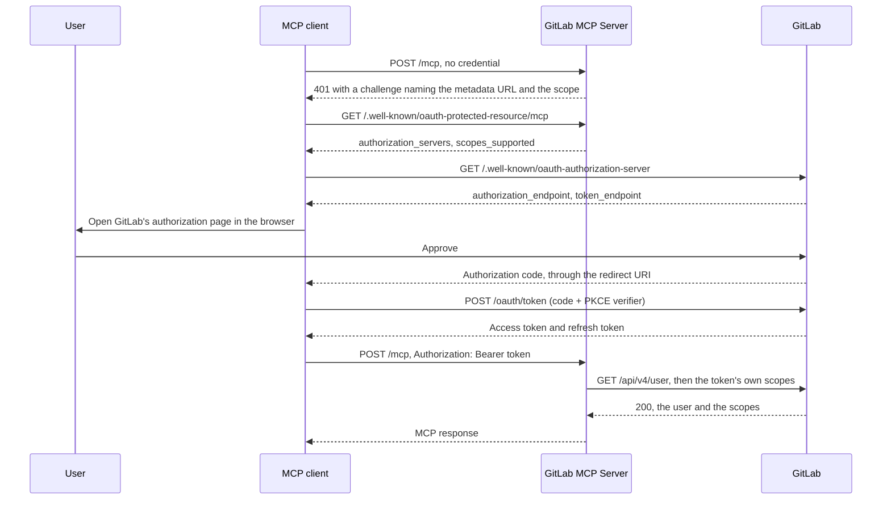

import { Tabs, TabItem } from "@astrojs/starlight/components";
import FAQ from "../../../components/FAQ.astro";

When GitLab MCP Server runs with `--auth-mode=oauth`, an MCP client that speaks OAuth 2.1 signs its user in at GitLab, in the browser, and sends the token it receives with every request. GitLab issues that token only to an OAuth application it knows, so a deployment needs a **GitLab OAuth application**, and every client is configured with that application's ID.

The server takes no part in the exchange. It is the **resource server**: it publishes where to authorize, and verifies each token it is sent against GitLab. The OAuth client is the MCP client (VS Code, Claude Code, Cursor), which obtains the token from GitLab directly, so the server neither holds nor needs the application's secret.

:::note[Using the hosted endpoint?]
`https://mcp.jmrp.io/gitlab` already has its application registered, and its [server card](https://mcp.jmrp.io/servers/gitlab/) publishes the client ID and a snippet per client; see [Hosted endpoint](/gitlab-mcp-server/install/hosted/). This page is for a deployment you run yourself.
:::

## Before you start

- **The right to create the application**: an administrator for an instance-wide one, the group's Owner for a group one. Any user can create one of their own.
- **An https GitLab URL.** Bearer tokens are forwarded to the instance on every call, so OAuth mode refuses an `http` `--gitlab-url`, and `--skip-tls-verify` for an instance that is not on loopback. `http` is accepted only for a loopback host (`localhost`, `127.0.0.1`, `::1`), for development.
- **The URL clients will use**, which the server takes as `--public-url`: an https URL (`http` only for a loopback host), with no trailing slash and no fragment. The server refuses to start in OAuth mode without one.

The flags, and how OAuth mode relates to the rest of HTTP mode, are in [HTTP Server Mode](/gitlab-mcp-server/operations/http-server/#oauth-mode).

## How the flow works



1. The client sends a request without a credential and is answered `401` with a challenge naming the RFC 9728 metadata URL and the scope to ask for.
2. It reads the metadata document, which names the GitLab instance to authorize at (`authorization_servers`) and the scope (`scopes_supported`), and then GitLab's own authorization server metadata.
3. It runs the authorization code flow with PKCE against GitLab, in the user's browser, as the OAuth application whose ID it was configured with.
4. It sends the access token as `Authorization: Bearer` with every request.
5. The server verifies the token against GitLab and caches the identity for `--oauth-cache-ttl`; see [Token lifetimes and the identity cache](#token-lifetimes-and-the-identity-cache).

## Step 1: create the application

GitLab documents the form itself in [Configure GitLab as an OAuth 2.0 authentication identity provider](https://docs.gitlab.com/integration/oauth_provider/).

### Where to create it

The three kinds differ only in who owns the application and can revoke it; the OAuth flow is the same.

| Kind     | Where in GitLab                                                                                  | Create it when                                                                    | Notes                                        |
| -------- | ------------------------------------------------------------------------------------------------ | --------------------------------------------------------------------------------- | -------------------------------------------- |
| Instance | **Admin** > **Applications** (`/admin/applications`) > **New application**                       | You administer a self-managed GitLab and the deployment serves the whole instance | Not available to regular users on GitLab.com |
| Group    | The group's **Settings** > **Applications**                                                      | A team shares the deployment and should keep owning the application               | Survives any one member leaving              |
| User     | Your avatar > **Edit profile** > **Access** > **Applications** (`/-/user_settings/applications`) | You run the deployment yourself, or you are on GitLab.com without owning a group  | Tied to your account, and revoked with it    |

### Fill in the form

1. **Name**: anything that tells users what they are authorizing, `MCP Server` for example.
2. **Redirect URI**: one line per callback your users' clients send; see [Step 2](#step-2-register-the-redirect-uris).
3. **Confidential**: clear it. MCP clients are public OAuth clients: they run on the user's machine, keep no secret, and protect the code exchange with PKCE.
4. **Scopes**: `api`, `read_api`, or both; see [Which scope to check](#which-scope-to-check).
5. Save the application and copy its **Application ID**. That is the `clientId` every client is configured with. No client is given the secret.

:::note[Device authorization grant]
If the form offers the **Device authorization grant** (RFC 8628), leave it off. No MCP client uses it: the MCP authorization flow is the authorization code grant with PKCE and a browser redirect, and a grant nothing uses only adds room for device-code phishing.
:::

### Which scope to check

- **`api`**: what a deployment that can write asks for. Every action this server exposes is a REST v4 or GraphQL call made with the user's token.
- **`read_api`**: what a deployment started with `--read-only` or `--safe-mode` asks for, and the right scope for a client that should change nothing, such as a browser inspector or a dashboard. **A `read_api` token is admitted by every deployment, one that can write included**, and is served the read-only tool surface: the write check is made per action, not per deployment.
- **`mcp`**: do not check it for this server. It is the scope of GitLab's own built-in MCP server, and a token that carries only it reaches none of the REST or GraphQL API this server calls; see [Dynamic client registration and the `mcp` scope](#dynamic-client-registration-and-the-mcp-scope).

The server admits a token that carries `read_api` or `api`, since `api` covers `read_api`. A token GitLab accepts that carries neither, one with only `read_user` for instance, is answered `403` with an `insufficient_scope` challenge.

**A client asks for one scope, and the application must have it checked.** The deployment advertises exactly one, in its `401` challenge and in the RFC 9728 `scopes_supported` field: `api` when it can write, `read_api` under `--read-only` or `--safe-mode`, so no user is asked to grant more than the server can use. GitLab refuses an authorization that names a scope the application does not have, before any consent screen, with `invalid_scope` ("The requested scope is invalid, unknown, or malformed"):

| The application has | A client asking for `api` | For `read_api`  | For `api read_api` |
| ------------------- | ------------------------- | --------------- | ------------------ |
| `api` only          | Authorized                | `invalid_scope` | `invalid_scope`    |
| `read_api` only     | `invalid_scope`           | Authorized      | `invalid_scope`    |
| Both                | Authorized                | Authorized      | Authorized         |

That is why the deployment never advertises both: a client that reads `scopes_supported` asks for every scope in it. A client that wants a read-only credential from a deployment that can write names `read_api` itself instead of taking the advertised scope (Claude Code's `oauth.scopes`, Cursor's `auth.scopes`, Kiro's `oauth.oauthScopes`), from an application that has `read_api` checked; the token is admitted and served the read-only surface. An application's scopes can be edited in place, and its Application ID does not change.

## Step 2: register the redirect URIs

Each client sends its own callback, and GitLab compares it with the application's list. Register every callback your users' clients will send, one per line in the **Redirect URI** field.

| Client                     | Redirect URI                                       | Note                                                                                                                                                                                                       |
| -------------------------- | -------------------------------------------------- | ---------------------------------------------------------------------------------------------------------------------------------------------------------------------------------------------------------- |
| VS Code, GitHub Copilot    | `http://127.0.0.1:33418`                           | A loopback IP literal, so the port is not significant                                                                                                                                                      |
| VS Code Remote, vscode.dev | `https://vscode.dev/redirect`                      | For remote development environments                                                                                                                                                                        |
| Cursor (desktop)           | `http://localhost:8787/callback`                   | A fixed callback; the path is part of the match                                                                                                                                                            |
| Cursor (web, Cloud Agents) | `https://www.cursor.com/agents/mcp/oauth/callback` | Only for Cursor's hosted surfaces                                                                                                                                                                          |
| Claude Code (CLI)          | `http://localhost:8090/callback`                   | With `--callback-port 8090`; register the port you pin                                                                                                                                                     |
| Claude Desktop, claude.ai  | `https://claude.ai/api/mcp/auth_callback`          | Shared by the hosted Claude surfaces                                                                                                                                                                       |
| OpenAI Codex CLI           | `http://127.0.0.1/callback`                        | A loopback IP literal, so the port Codex picks is not significant; register your `mcp_oauth_callback_url` instead when you set one. Only with `--oauth-client-id`: the bearer-token path needs no redirect |
| Gemini CLI                 | The `oauth.redirectUri` pinned in its settings     | Register exactly what you pin                                                                                                                                                                              |
| Kiro                       | The `oauth.redirectUri` pinned in its settings     | Register exactly what you pin; left unset, Kiro listens on a random `localhost` port that no entry can match                                                                                               |
| LM Studio                  | `http://127.0.0.1:33389/mcp-oauth-callback`        | A loopback IP literal, as LM Studio documents it                                                                                                                                                           |

:::caution[`localhost` is not `127.0.0.1`]
GitLab matches a loopback IP literal on its host alone, as RFC 8252 asks of native applications, so the port VS Code picks does not matter. `localhost` is a name rather than an IP literal, and an entry naming it is matched exactly, port and path included. Claude Code's callback is `http://localhost:<port>/callback`, so a bare `http://localhost` entry never matches it: `--callback-port` is required, and the registered URI carries that port and the `/callback` path. Without it Claude Code listens on a random port that no entry can match.
:::

For a team on VS Code, Claude Code and Cursor desktop, the field reads:

```text
http://127.0.0.1:33418
https://vscode.dev/redirect
http://localhost:8090/callback
http://localhost:8787/callback
```

## Step 3: start the server and check the metadata

```bash
gitlab-mcp-server --http \
  --gitlab-url=https://gitlab.example.com \
  --auth-mode=oauth \
  --public-url=https://mcp.example.com/mcp
```

`--public-url` is the RFC 9728 resource identifier: the URL clients are configured with, published exactly as written. `GITLAB_MCP_AUTH_MODE` and `GITLAB_MCP_PUBLIC_URL` set the same two settings from the environment, and a flag passed explicitly wins.

The metadata document's path is derived from it by putting the well-known segment between the host and the path, so this deployment publishes it at `/.well-known/oauth-protected-resource/mcp`, and a `--public-url` with no path at `/.well-known/oauth-protected-resource` itself ([where the metadata lives](/gitlab-mcp-server/operations/http-server/#where-the-metadata-lives-host-root-or-sub-path)). Check it from the server's machine:

```bash
curl -s http://localhost:8080/.well-known/oauth-protected-resource/mcp | jq .
```

```json
{
  "resource": "https://mcp.example.com/mcp",
  "authorization_servers": ["https://gitlab.example.com"],
  "scopes_supported": ["api"],
  "bearer_methods_supported": ["header"],
  "resource_name": "GitLab MCP Server",
  "resource_documentation": "https://jmrp.io/docs/gitlab-mcp-server/operations/http-server/"
}
```

- `authorization_servers` lists every instance `--gitlab-url` publishes, and `scopes_supported` reads `read_api` under `--read-only` or `--safe-mode`.
- `resource_documentation` is always published, and defaults to this site's HTTP server page. RFC 9728 has no field for a client ID, so the closest a resource server can come to telling a client which application to use is a page that says so: point `--resource-documentation` at one of your own that names your Application ID and its redirect URIs.
- `--resource-policy-uri` and `--resource-tos-uri` add `resource_policy_uri` and `resource_tos_uri`, and are omitted while empty. All three take an https URL.

### Behind a reverse proxy

The metadata path sits at the **root of the host**, whatever path `--public-url` carries. Started with `--public-url=https://mcp.example.com/gitlab`, a deployment publishes `https://mcp.example.com/.well-known/oauth-protected-resource/gitlab`, which a proxy that forwards only `/gitlab/` never routes. Route that exact path to the server, without rewriting it:

```nginx
location = /.well-known/oauth-protected-resource/gitlab {
    proxy_pass http://127.0.0.1:8080;   # no path rewrite
    proxy_set_header Host $host;
}
```

- **`location =` is an exact match, and that is the point.** A prefix `location` would send every path under `/.well-known/oauth-protected-resource/` here, the documents of the other servers sharing the host included, and this server serves only the one path its `--public-url` derives. A deployment that owns its host name derives the bare path, and routes that one.
- **`--public-url` is published verbatim, and clients compare it exactly.** It becomes the `resource` field as written, and RFC 9728 section 3.3 has a client compare it, code point by code point, with the URL it sent its request to. Configure clients with that exact string: not an alias, not the host with `www.` added, not a trailing slash (which the server refuses at startup anyway). A client pointed at `https://mcp.example.com/gitlab/` rejects the document of a deployment started with `--public-url=https://mcp.example.com/gitlab`.
- **`Host` must reach the server as the public host**, which is what `proxy_set_header Host $host;` does. Two checks read it. The Host guard answers `403` to a host the deployment did not declare when the request arrives over loopback, and the `--public-url` host is declared. The cross-origin check compares a browser's `Origin` with `Host` when the browser sends no `Sec-Fetch-Site`, so forwarding an internal name breaks legitimate same-origin browser calls.
- **Browser clients need `--trusted-origins`.** A cross-origin browser `POST` is refused before authentication unless its origin is listed, and the `--public-url` origin is trusted automatically; see [Cross-origin protection](/gitlab-mcp-server/operations/security/#cross-origin-protection).

Complete configurations for nginx, Caddy, Traefik, Apache and Cloudflare Tunnel are in [Remote Deployment](/gitlab-mcp-server/operations/remote-deployment/#behind-a-reverse-proxy).

### The 401 challenge

A request that carries no credential is answered:

```http
HTTP/1.1 401 Unauthorized
WWW-Authenticate: Bearer realm="gitlab-mcp-server", scope="api", resource_metadata="https://mcp.example.com/.well-known/oauth-protected-resource/mcp"
```

The body is a JSON-RPC error with code `-40100`. `resource_metadata` is where discovery starts. `scope` names the same single scope as `scopes_supported`, so a client asks for one scope whichever of the two it reads: the MCP specification has a client take the challenge's scope first, and some clients, Claude Code among them, read the metadata instead. A client that asked GitLab for every scope its authorization server advertises would be refused with `invalid_scope`. The scope is a recommendation, not the admission bar: a client that asks for `read_api` on purpose is admitted and served the read-only surface.

Every `401` challenge carries that `scope`, the one answering an invalid token included, so a client that reads the header and never fetches the metadata still knows what to ask for. The `403` answering a token below the minimum is the exception: its `insufficient_scope` challenge names `read_api`, the least the server admits, as RFC 6750 asks of that error. A GitLab that is throttled or does not answer gets `503` with `Retry-After` and no challenge, since the token was never judged ([Security](/gitlab-mcp-server/operations/security/#oauth-mode)).

## Step 4: configure the clients

Configure each client with the **Application ID** from Step 1 and with the `--public-url` value as the server's URL.

<Tabs>
<TabItem label="VS Code / Copilot">

```json
{
  "servers": {
    "gitlab": {
      "type": "http",
      "url": "https://mcp.example.com/mcp",
      "oauth": {
        "clientId": "YOUR_GITLAB_APPLICATION_ID"
      }
    }
  }
}
```

</TabItem>
<TabItem label="Claude Code">

```bash
claude mcp add gitlab \
  --transport http \
  --client-id YOUR_GITLAB_APPLICATION_ID \
  --callback-port 8090 \
  https://mcp.example.com/mcp
```

</TabItem>
</Tabs>

Always configure the client ID. Without it these clients fall back to dynamic client registration, which on GitLab yields a token this server cannot use; see the next section.

### Other clients

| Client                    | OAuth against GitLab | How                                                                                                                                     |
| ------------------------- | -------------------- | --------------------------------------------------------------------------------------------------------------------------------------- |
| OpenAI Codex CLI          | Yes                  | `codex mcp add <name> --url <URL> --oauth-client-id <APP_ID>`, or no OAuth at all with `bearer_token_env_var` in `~/.codex/config.toml` |
| Gemini CLI                | Yes                  | `mcpServers.<name>.oauth`: `clientId` plus a pinned `redirectUri`                                                                       |
| Kiro                      | Yes                  | `mcpServers.<name>.oauth`: `clientId` plus a pinned `redirectUri`, in `.kiro/settings/mcp.json`                                         |
| LM Studio                 | Yes                  | An `auth` block with `CLIENT_ID` in its `mcp.json`                                                                                      |
| mcp-remote (stdio proxy)  | Yes                  | `--static-oauth-client-info`                                                                                                            |
| MCP Inspector             | Yes                  | Static client credentials in its authentication settings                                                                                |
| GitLab Duo Agent Platform | **No**               | Documents an HTTP entry as `type` and `url` alone, with no header: run the server over stdio, or reach HTTP through mcp-remote          |
| Zed                       | **No**               | Supports only CIMD and DCR, neither of which yields an `api`-scoped GitLab token: send a personal access token as Bearer                |
| JetBrains AI Assistant    | **No**               | Runs no OAuth flow, and documents a remote entry as a `url` alone: reach the server through mcp-remote with a personal access token     |

Every client in the "No" rows still works. OAuth mode accepts a personal access token sent as `Authorization: Bearer <glpat-...>` and verifies it against GitLab like an OAuth access token, unless the deployment [admits only its own application](#admitting-only-your-own-application); GitLab Duo and JetBrains send it through mcp-remote ([Client configuration](/gitlab-mcp-server/install/clients/#mcp-remote-a-stdio-bridge)). The `PRIVATE-TOKEN` header is refused in OAuth mode.

## Dynamic client registration and the `mcp` scope

GitLab.com's authorization server advertises an RFC 7591 registration endpoint (`/oauth/register`), so a client that supports Dynamic Client Registration (DCR) registers itself without you creating anything. That path does not work with this server, and the reason is worth knowing.

**GitLab built DCR for its own MCP server.** A dynamically registered client is given the `mcp` scope whatever it asks for, and a token with that scope reaches GitLab's built-in MCP endpoint and nothing else. Every action of this server is a REST or GraphQL call, so the server refuses such a token at the door, with `403` and `insufficient_scope`, since it carries neither `read_api` nor `api`.

So **a pre-registered application with `api` or `read_api` is mandatory**, and its Application ID is configured in each client. A client that cannot be given a static client ID (Zed and JetBrains today) cannot use the OAuth path against GitLab at all, and sends a personal access token as Bearer instead.

GitLab does not implement Client ID Metadata Documents (CIMD) either, the mechanism the MCP authorization specification now prefers over DCR, which it deprecates. It is tracked upstream in [gitlab-org/gitlab#585069](https://gitlab.com/gitlab-org/gitlab/-/work_items/585069).

## Token lifetimes and the identity cache

Two lifetimes are in play: the GitLab token's, and this server's verification cache.

### GitLab's access tokens

GitLab issues OAuth access tokens that expire after two hours, with a refresh token beside them, and since GitLab 19.1 an administrator of a self-managed instance can change that lifetime. What happens at expiry is up to the client:

- A client that implements refresh, Claude Code and VS Code among them, renews the token without the user noticing.
- One that does not shows an authentication error about every two hours and asks the user to authorize again.
- The server plays no part in either: it verifies whatever token arrives and answers `401` once GitLab rejects it.

A personal access token sent as Bearer has none of this. It lives until its own expiry date, which is why it stays the practical choice for headless and CI use.

### The server's identity cache

| Event                                      | What happens                                                                                                                                                                                                                                     |
| ------------------------------------------ | ------------------------------------------------------------------------------------------------------------------------------------------------------------------------------------------------------------------------------------------------ |
| A token is presented for the first time    | GitLab verifies it: `GET /api/v4/user`, then the token's own scopes and expiry (`/api/v4/personal_access_tokens/self`, or `/oauth/token/info`). The identity is cached                                                                           |
| The same token within `--oauth-cache-ttl`  | Answered from the cache, with no call to GitLab                                                                                                                                                                                                  |
| The TTL, or the token's own expiry, passes | Verified again on the next request                                                                                                                                                                                                               |
| The token is revoked on GitLab             | The first call GitLab refuses ends the token's pool entry. From the next request the server's own probe of the token is refused and the request is answered `401`, although the identity stays cached until the TTL or the token's expiry passes |
| The cache is full (10,000 identities)      | An expired identity makes room for the new one, or else the identity used least recently                                                                                                                                                         |
| Identities nobody presents again           | Swept in the background once expired                                                                                                                                                                                                             |

The cache holds only successful verifications, keyed by a SHA-256 digest of the instance and the token, and an entry holds no token material. `--oauth-cache-ttl` (default `15m`, from `1m` to `2h`; `GITLAB_MCP_OAUTH_CACHE_TTL` in the environment) bounds how long a verified identity is reused without asking GitLab, and the token's own expiry shortens that when GitLab reports one. It does not keep a revoked token working: from the request after the first call GitLab refuses, the server's own probe refuses it, as the table says. A token GitLab refused is remembered apart, for five minutes, and refused from memory meanwhile. At most 16 tokens the cache does not hold are verified at once across the process; a new token that finds no slot free within five seconds is answered `503` with `Retry-After`, without having been judged ([OAuth mode in Security](/gitlab-mcp-server/operations/security/#oauth-mode)).

## Admitting only your own application

By default the server admits any credential the instance accepts: a token from your application, a token from any other OAuth application on the same GitLab, or a personal access token. GitLab's authorization server publishes no `resource_indicators_supported`, so RFC 8707 audience restriction is not available and the token alone does not say which application it was issued to; the reasoning is in [ADR-0019](https://github.com/jmrplens/gitlab-mcp-server/blob/main/docs/development/adr/adr-0019-audience-binding-unavailable-at-the-authorization-server.md).

`--oauth-client-uid` (`GITLAB_MCP_OAUTH_CLIENT_UID` in the environment) turns on the check the MCP specification allows instead. Its value is the **Application ID** from Step 1, the same string clients configure as `clientId`: GitLab reports it as `application.uid` when the server asks about a new token at `/oauth/token/info`, and only a token naming one of the listed applications is admitted. List several, comma-separated, when `--gitlab-url` publishes several instances, since each has its own application.

```bash
gitlab-mcp-server --http \
  --gitlab-url=https://gitlab.example.com \
  --auth-mode=oauth \
  --public-url=https://mcp.example.com/mcp \
  --oauth-client-uid=YOUR_GITLAB_APPLICATION_ID \
  --resource-documentation=https://docs.example.com/gitlab-mcp
```

- **Personal access tokens are refused**, fine-grained ones included, since they belong to no application. That is why the check is off by default: it takes the Bearer way in away from every client in the "No" rows of [Other clients](#other-clients).
- **A token from another application, or a personal access token, is answered `401`** with `error="invalid_token"` and an `error_uri` naming the page published as `resource_documentation`. It is not charged to the address's failure budget, and it is remembered for five minutes:

  ```http
  HTTP/1.1 401 Unauthorized
  WWW-Authenticate: Bearer realm="gitlab-mcp-server", error="invalid_token", error_description="the token was not issued to an OAuth application this deployment admits", error_uri="https://docs.example.com/gitlab-mcp", scope="api", resource_metadata="https://mcp.example.com/.well-known/oauth-protected-resource/mcp"
  ```

  That page is where a person reading the refusal learns which application to use, so point `--resource-documentation` at your own when you pin.

- **A token GitLab will not describe is refused too**, with `503` and `Retry-After` rather than `401`: a check the server could not make admits nothing, and the refusal is reported as an upstream failure, neither cached nor charged.

## Security considerations

- **A public client, with no secret.** MCP clients run on the user's device and are public OAuth clients, which is what OAuth 2.1 expects of native applications. Never put the application's secret in a client's configuration; the Application ID is all a client needs.
- **PKCE.** The authorization code is bound to the client that asked for it, so an intercepted code is worth nothing. GitLab supports PKCE with `S256`.
- **Token storage belongs to the client.** The token's safety depends on where the client keeps it; VS Code keeps it in the operating system's credential store. The server stores no token: its cache is keyed by a digest and holds identities.
- **No scope broader than needed.** The application needs the scope its clients ask for: `api` for a deployment that can write, `read_api` for one that cannot or for a client that pins it. `sudo` and the repository and registry scopes buy this server nothing. `admin_mode` matters only on an application for administrators who should reach the admin actions, which are listed only to a token that carries it ([scope-based tool filtering](/gitlab-mcp-server/operations/security/#scope-based-tool-filtering)); since the deployment advertises one scope, their clients name `api admin_mode` themselves.
- **Pin the application on a shared deployment** with `--oauth-client-uid`, so a token minted for some other application on the same GitLab is not admitted; see [Admitting only your own application](#admitting-only-your-own-application).

## Troubleshooting

| Symptom                                   | Cause                                                                                                                                                                                | What to do                                                                                                                                   |
| ----------------------------------------- | ------------------------------------------------------------------------------------------------------------------------------------------------------------------------------------ | -------------------------------------------------------------------------------------------------------------------------------------------- |
| `redirect_uri_mismatch` from GitLab       | The client's callback is not registered exactly as the client sends it                                                                                                               | Add the exact URI from [Step 2](#step-2-register-the-redirect-uris); for `localhost`, port and path included                                 |
| `invalid_client` from GitLab              | The client's `clientId` is not the application's Application ID, or the application is marked **Confidential** and the client, which keeps no secret, sends none                     | Copy the Application ID again, exactly, and clear **Confidential** on the application ([Step 1](#fill-in-the-form))                          |
| `invalid_scope` before any consent screen | The client asked for a scope the application does not have: `api` from one with only `read_api`, `read_api` from one with only `api`, or both at once from a server older than 3.1.0 | Check that scope on the application, or pin the client to the one it has; the Application ID does not change                                 |
| `access_denied` from GitLab               | The authorization was denied, at GitLab's consent screen or by GitLab                                                                                                                | Authorize again and approve. A scope the application lacks is answered `invalid_scope`, not this                                             |
| The OAuth flow never starts               | The server is not in OAuth mode, or the metadata URL in the challenge does not answer                                                                                                | Check `--auth-mode=oauth`, and that the URL in `resource_metadata` answers `200` ([Step 3](#step-3-start-the-server-and-check-the-metadata)) |
| `403` with `insufficient_scope`           | The token carries neither `read_api` nor `api`, typically the `mcp` scope of a client that registered itself                                                                         | Configure the client's `clientId`, and authorize again                                                                                       |
| `401` with `error_uri`                    | `--oauth-client-uid` is set, and the token belongs to another application or is a personal access token                                                                              | Use a client configured with the pinned Application ID                                                                                       |
| Works with `curl` but not from the client | The client is not sending `Authorization: Bearer`; `PRIVATE-TOKEN` is refused in OAuth mode                                                                                          | Check the client's MCP log                                                                                                                   |

More OAuth symptoms, among them a `503` on a new token and a `404` on the metadata path, are in [Troubleshooting](/gitlab-mcp-server/operations/troubleshooting/#oauth-mode---auth-modeoauth).

## References

- [GitLab: Configure GitLab as an OAuth 2.0 authentication identity provider](https://docs.gitlab.com/integration/oauth_provider/): GitLab's own documentation of OAuth applications.
- [RFC 9728: OAuth 2.0 Protected Resource Metadata](https://datatracker.ietf.org/doc/html/rfc9728): the specification `--auth-mode=oauth` implements.
- [RFC 8252: OAuth 2.0 for Native Apps](https://datatracker.ietf.org/doc/html/rfc8252): loopback redirect URIs and why their port is not compared.
- [The OAuth 2.1 Authorization Framework](https://datatracker.ietf.org/doc/draft-ietf-oauth-v2-1/): the draft that makes PKCE mandatory.
- [MCP specification: Authorization](https://modelcontextprotocol.io/specification/2026-07-28/basic/authorization), with its [authorization server discovery](https://modelcontextprotocol.io/specification/2026-07-28/basic/authorization/authorization-server-discovery), [client registration](https://modelcontextprotocol.io/specification/2026-07-28/basic/authorization/client-registration) and [security considerations](https://modelcontextprotocol.io/specification/2026-07-28/basic/authorization/security-considerations) pages.

<FAQ />
