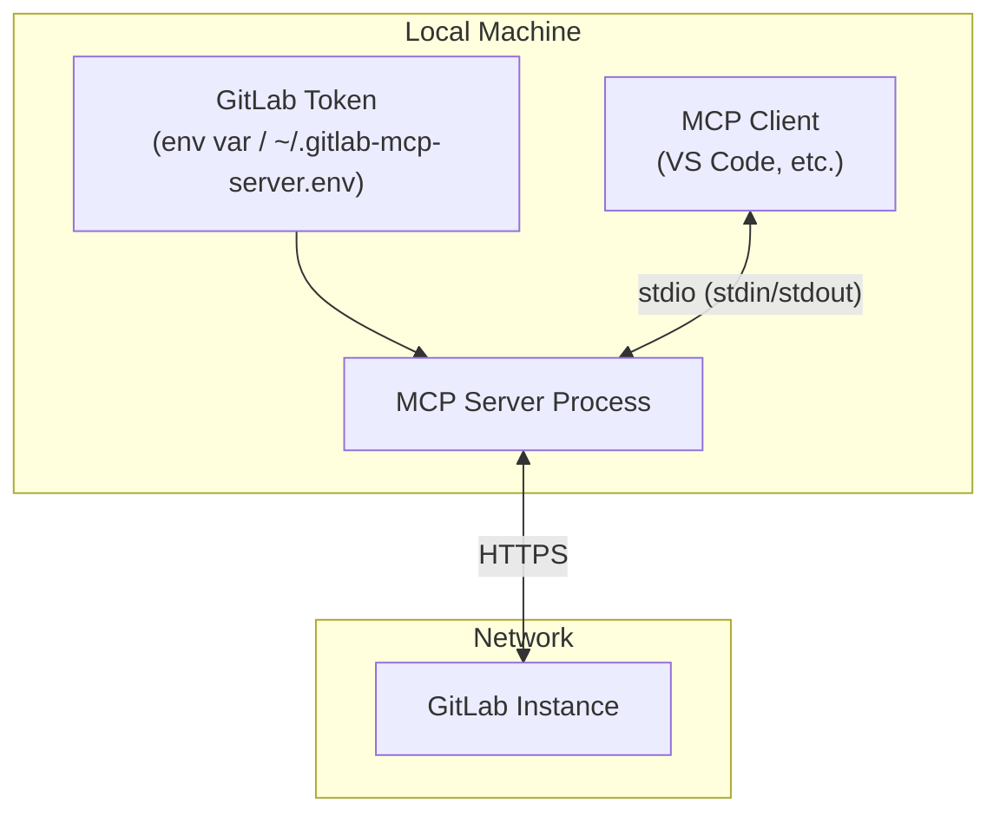

import FAQ from "../../../components/FAQ.astro";

**GitLab MCP Server never persists your GitLab token.** In stdio mode it reads the token from an environment variable at startup, holds it only in memory for the life of the process, and sends it only to your GitLab instance — over TLS when `GITLAB_URL` points at an `https://` endpoint (the default) — never to any third party. Read-only mode and safe mode (dry-run previews) add optional guardrails, and every release ships with checksums and signatures for integrity verification. This page details that security model, credential handling, and best practices for safe deployment.

## Security model overview


```mermaid
flowchart TB
    subgraph Local["Local Machine"]
        Token["GitLab Token<br/>(env var / ~/.gitlab-mcp-server.env)"]
        Server["MCP Server Process"]
        Client["MCP Client<br/>(VS Code, etc.)"]
    end
    subgraph Remote["Network"]
        GitLab["GitLab Instance"]
    end

    Token --> Server
    Client <-->|"stdio (stdin/stdout)"| Server
    Server <-->|"HTTPS"| GitLab
```

### Key principles

- **Token isolation**: In stdio mode, the GitLab token never leaves the local server process. It is loaded from the environment and used exclusively for GitLab API calls.
- **No token forwarding**: The token is never sent to the MCP client and never included in tool outputs.
- **Process-level isolation**: The server runs as a local process communicating via stdin/stdout. No network ports are opened in stdio mode.
- **Minimal privilege**: The server only needs a GitLab token with scopes required for the operations you intend to use.

## Token management

### Recommended: Environment file

Store your token in `~/.gitlab-mcp-server.env` with restricted permissions:

```bash
# Create the home env file; the prompt keeps the token out of shell history
printf 'GitLab token: ' && read -rs t && printf 'GITLAB_TOKEN=%s\n' "$t" > ~/.gitlab-mcp-server.env && unset t && echo
# Add GITLAB_URL here only for self-managed instances.

# Restrict permissions (owner read/write only)
chmod 600 ~/.gitlab-mcp-server.env
```

To keep the file elsewhere, name it by absolute path in `GITLAB_MCP_ENV_FILE`.

:::danger
A `.env` in your working directory is **not** read, so putting the token there does nothing. That directory belongs to whatever repository your editor opened. Never commit a file holding a token to version control.
:::

### VS Code input variables

For VS Code users, you can use input variables to avoid storing tokens in plain text:

```json
{
  "servers": {
    "gitlab": {
      "type": "stdio",
      "command": "gitlab-mcp-server",
      "env": {
        "GITLAB_TOKEN": "${input:gitlabToken}"
      }
    }
  }
}
```

The token is prompted at startup and kept only in memory.

### Keep the token out of client configuration

MCP client configuration files that live in a project, such as `.vscode/mcp.json`, `.cursor/mcp.json` or `.idea/mcp.json`, are often committed with the rest of the repository. The server reads `~/.gitlab-mcp-server.env`, or the file `GITLAB_MCP_ENV_FILE` names, by itself, so any client's entry can leave `GITLAB_TOKEN` out and carry only settings that are not secret. A client's own way of keeping a secret out of its file works too, such as the input variables above or VS Code's [`envFile`](https://code.visualstudio.com/docs/copilot/reference/mcp-configuration#_standard-io-stdio-servers).

If a client's entry carries the token inline:

- keep it in that client's machine-local configuration, never in a file inside a project or workspace that other people can read;
- treat the file as a secret, since anyone who can read it has the token;
- rotate the token at once if the file is exposed, in a commit, a backup or a screen share.

Prefer tokens with an expiry date, and rotate them on a schedule. A rotated token has to be replaced wherever it is configured: the env file, the client's configuration or the environment.

### Token scopes

Three classic scopes change what the server serves, and a token needs one of the first two to be served at all:

| Scope        | What it gives the server                                                                              |
| ------------ | ----------------------------------------------------------------------------------------------------- |
| `read_api`   | Admission, and the read-only surface for a token without `api`                                        |
| `api`        | Admission, and every action the tier allows, writes included                                          |
| `admin_mode` | The five administration groups listed under [Scope-based tool filtering](#scope-based-tool-filtering) |

A token GitLab accepts that carries neither `read_api` nor `api` reaches no tool, so it is refused. `read_repository`, `write_repository`, `read_user` and the registry scopes buy this server nothing on their own, and on a token that also carries `read_api` or `api` they change nothing it is served.

:::tip
If you only need read operations, use the `read_api` scope: the server detects it at startup and serves only the read actions, on stdio as in HTTP mode. `GITLAB_MCP_READ_ONLY=true` keeps a token that could write read-only as well, for defense-in-depth.
:::

### Scope-based tool filtering

On startup on stdio, and for each pooled credential in HTTP mode, the server reads the token's own description (`GET /api/v4/personal_access_tokens/self`) and narrows what it serves in two ways:

- **Writes.** A token without `api` is served the read-only surface, exactly as if `GITLAB_MCP_READ_ONLY` were set for it. In HTTP mode the narrowing is per token, so one client's `read_api` token never narrows another client's `api` token.
- **Administration.** Five catalog groups need `admin_mode` for every action in them, and are removed from the catalog for a token without it. On the meta surface they are the tools `gitlab_admin`, `gitlab_enterprise_user`, `gitlab_project_alias`, `gitlab_geo` and `gitlab_storage_move`; on the dynamic surface their actions are neither listed nor run; on the individual surface no tool projected from them is registered.

Removal is all or nothing per group, so `gitlab_admin` is slightly over-broad: four of its reads (`admin.topic_list`, `admin.topic_get`, `admin.broadcast_message_list` and `admin.broadcast_message_get`) are served by GitLab to any token and go with the rest. It errs toward less access.

When the scopes cannot be read, on an older or restricted instance or when the description gets no answer, nothing is filtered and the token counts as able to write: a wrong "no" would silently remove tools, while a wrong "yes" surfaces as GitLab's own `403` on the one call that tried. A fine-grained token is read the same way, since its scope list says nothing about its grant ([below](#fine-grained-personal-access-tokens)).

This prevents the AI from attempting operations that would fail with permission errors and keeps the tool list focused on what your token can actually do.

To skip the scope filtering and register all tools regardless of token permissions:

```bash
GITLAB_MCP_IGNORE_SCOPES=true
```

Or in HTTP mode:

```bash
./gitlab-mcp-server --http --ignore-scopes
```

:::note
When the filtering is skipped, tools are still registered but API calls may fail with `403 Forbidden` if the token lacks required permissions. The token's scopes are still read: one carrying neither `read_api` nor `api` reaches no tool, so it is refused in both modes, a `403` over HTTP and every catalog request answered with JSON-RPC `-40300` on stdio, whatever this setting says.
:::

### Fine-grained personal access tokens

A fine-grained token carries no scopes: its scope list is the single value `granular`, and what it may do is a grant of named permissions fixed when it is created. The server reads it as unknown authority, never as read-only, so the scope filtering above removes nothing for it. Its grant decides instead: when the token may read its own grant (Personal Access Token: Read) and the instance version (Metadata: Read), and the instance runs GitLab 19.4, the release the server's permission table records, each session is listed the actions the grant reaches, judged per action against the permissions GitLab 19.4.1 declares, and a call to any other is answered with the permission it needs before anything reaches GitLab. Otherwise only the actions no fine-grained token can reach are withheld, and GitLab judges the rest.

Whatever the token, the server admits it at the minimum any action needs and applies authority per action ([ADR-0018](https://github.com/jmrplens/gitlab-mcp-server/blob/main/docs/development/adr/adr-0018-authorization-admits-per-action-gating.md), [ADR-0024](https://github.com/jmrplens/gitlab-mcp-server/blob/main/docs/development/adr/adr-0024-fine-grained-token-authority-per-action.md)). The kind of token decides what that authority is read from:

| Token                                        | What the server reads                                                                                                                                                                      | What decides an action                                                                                                                           | When the server cannot tell                                                                                     |
| -------------------------------------------- | ------------------------------------------------------------------------------------------------------------------------------------------------------------------------------------------ | ------------------------------------------------------------------------------------------------------------------------------------------------ | --------------------------------------------------------------------------------------------------------------- |
| Classic personal access token or OAuth token | Its scopes (`/personal_access_tokens/self`, or `/oauth/token/info` for an OAuth token, `--auth-mode=oauth` only; elsewhere an OAuth token's scopes are unknown and count as able to write) | Whether the action writes, against `api` or `read_api`, and the `admin_mode` groups above                                                        | Unknown scopes count as able to write; GitLab's `403` answers the call the token cannot make                    |
| Fine-grained personal access token           | Its grant (`GET /personal_access_tokens/:id`) and the instance version (`GET /version`)                                                                                                    | Whether the grant reaches every request the action makes, judged against what GitLab 19.4.1 declares for each route and GraphQL type or mutation | Only what no fine-grained token can reach is withheld; GitLab judges the rest and the server quotes its refusal |

What keeps the grant reading safe:

- **The grant is never a key.** It is a value the caller mints, so no shared catalog, server or manifest cache is keyed on it, and neither is the version an instance reports, which under `--allow-any-gitlab-url` is the caller's too. One HTTP deployment therefore serves classic and fine-grained tokens side by side and narrows per request.
- **What is read is bounded where it is read.** The grant at most 1 MiB and 1000 scopes at a time, read again on every revalidation; the version only in the shape GitLab releases use and at most 64 bytes long.
- **A refusal costs only what any refusal costs.** A withheld call spends its rate-limit token like any refused call and charges no failure budget. The HTTP door's `403` for a fine-grained token without User: Read is uncharged, since GitLab authenticated the token, and remembered for five minutes.
- **A log line names at most three permissions of the grant.** It names the phase (whether the grant was evaluated), the reason it was not, the release it was judged at and, for a grant naming permissions the record lacks, how many and at most three of their names, each cut to 64 bytes; never the token, its id, the rest of its grant or its projects and groups.
- **On REST a wrong "yes" is GitLab's own `403`**, which names the permission, and the server quotes it. **On GraphQL it is silent**: a position the grant does not reach comes back `null`, and a list drops the items it does not reach. So a GraphQL action's requirement includes the objects its answer is made of, actions whose answer GitLab cannot serve any fine-grained token are withheld, and an answer that may be empty for the credential carries a note saying so.

`--ignore-scopes` does not turn any of this off. See [Fine-grained Tokens](/gitlab-mcp-server/operations/fine-grained-tokens/).

## TLS verification

By default, the server verifies TLS certificates when connecting to GitLab. For self-signed certificates:

```bash
GITLAB_MCP_SKIP_TLS_VERIFY=true
```

:::caution
Disabling TLS verification removes protection against man-in-the-middle attacks. Only use this for development environments with self-signed certificates. Never disable TLS verification in production.
:::

In HTTP mode, `--auth-mode=oauth` refuses `--skip-tls-verify` for a non-loopback instance: bearer tokens are forwarded to that instance on every call, and an unverified certificate would let any host answering its address collect them. Install the CA in the system trust store, or point `SSL_CERT_FILE` at a CA bundle, instead.

## Read-only mode

Enable read-only mode to prevent any mutating operations:

```bash
GITLAB_MCP_READ_ONLY=true
```

Read-only mode removes every action that writes, and it does so per action rather than per tool. Two of the three tool surfaces serve many actions through one tool: a meta tool such as `gitlab_issue` serves `list` and `create` alike, and the dynamic surface routes every action through `gitlab_execute_action`. Removing those tools whole would take their reads down with them, so the policy is applied to the action catalog all three surfaces are built from:

- **Dynamic surface** (the default): the write actions are gone from `gitlab_find_action`, and `gitlab_execute_action` stays, annotated read-only, for the reads it can still route. Asking it for a removed action is answered that the action exists and this deployment withholds it, not that it is unknown.
- **Meta surface**: each domain tool keeps its read actions, and a write action is answered as an unknown action, with the valid ones listed.
- **Individual surface**: one tool is one action, so the write tools are not registered.

Nothing reaches GitLab for a removed action, whatever the token could do. A token without `api` gets the same narrowing without the setting, and the dynamic surface then names the token's scope as the cause.

This is useful for:

- Exploration and discovery workflows
- Demo environments
- Environments where the token has write access but you want to restrict the server

## Safe mode

Enable safe mode to preview mutating operations without executing them:

```bash
GITLAB_MCP_SAFE_MODE=true
```

Safe mode keeps the write actions listed but answers each with a preview instead of running it, and it too works per action: on the dynamic and meta surfaces `issue.create` previews while `issue.list` executes.

- The preview is a card headed `Safe mode blocked` and the action, with rows for the status (`blocked`), the mode (`safe`) and the action (its canonical ID on the dynamic and meta surfaces, the tool name on the individual one), the arguments the call would have sent in a JSON block, and the hint `Set GITLAB_MCP_SAFE_MODE=false to execute this operation`. On the individual surface it comes back as an error result, since the tool did not run. Nothing is sent to GitLab
- Read-only actions execute normally
- If `GITLAB_MCP_READ_ONLY=true` is also set, it takes precedence: the write actions are absent rather than previewed

This is useful for dry-run workflows, training environments, and debugging tool parameters.

## Destructive actions

An action whose effect cannot be undone by calling its opposite is classified destructive, once per action in the catalog, and all three surfaces read that one bit (`destructiveHint`). Deleting something is the obvious case and not the whole of it: an action that hands something to a party outside the instance belongs there too. `project.mirror_add` is the one worth naming, because it does not read as destructive: creating a push mirror deletes nothing, and gives the host named in its `url` a continuing copy of the whole repository. A model acting on an issue body that asks for a "backup mirror" could otherwise send the repository away with one call, so that call needs confirmation like any other destructive one.

On every surface, a destructive call proceeds on the first of these that holds:

1. `GITLAB_MCP_YOLO_MODE` is truthy (`1`, `true` or `yes`), or, when it is unset, `AUTOPILOT` is: for unattended pipelines.
2. The call carries `"confirm": true`, which on the dynamic surface is a top-level `confirm: true` beside `action` and `params`.
3. The client supports elicitation, and the user approves the prompt. Only the meta and individual surfaces ask: the default dynamic surface never prompts, so there the first two are the only ways through.

Otherwise it fails closed and nothing reaches GitLab. A client that cannot prompt, and every dynamic call, gets an error asking it to send the call again with `confirm: true` only after the user explicitly approves. A user who declines gets an answer telling the model not to retry and to ask what they want instead; a prompt dismissed without an answer is reported as having changed nothing, and may be asked again.

`GITLAB_MCP_YOLO_MODE` and `AUTOPILOT` therefore skip the same step on all three surfaces; up to 3.1.0 the dynamic surface read neither and needed `confirm: true` whatever they said. Read-only mode and safe mode come before all of it: a read-only deployment has no destructive action to call, and safe mode answers one with its preview, whatever either setting says. The two guards under [When the arguments decide](#when-the-arguments-decide) follow the same order. [Error handling](/gitlab-mcp-server/operations/error-handling/#destructive-actions-and-confirmation) quotes what each refusal says.

### When the arguments decide

One bit per action cannot describe an action that destroys something for some arguments and nothing for the rest, and classifying such an action would put a confirmation in front of every ordinary edit, which is a confirmation callers learn to click through. Two actions are guarded in their own handler instead, on the same precedence, and declare a `confirm` field so their input schema shows it:

- `issue.work_item_update`: an explicit empty `assignee_ids` or `crm_contact_ids` removes every current entry, while leaving the field out leaves it untouched. Clearing entries that exist needs the confirmation.
- `project.pull_mirror_configure`: `mirror_overwrites_diverged_branches` makes every sync replace this project's diverged branches with the source's, which [GitLab documents](https://docs.gitlab.com/user/project/repository/mirror/pull/) as "the loss of local changes". The guard asks when the configuration the call leaves behind both pulls and overwrites, and the call is the one that arms it or points it elsewhere: by setting the flag, by enabling the mirror, or by changing its URL.

Pull-mirror configuration as a whole is deliberately not destructive, as [issue 674](https://github.com/jmrplens/gitlab-mcp-server/issues/674) decided: without the overwrite flag GitLab stops updating a diverged branch rather than replacing it, nothing of the project leaves the instance, and classifying the action would put a confirmation in front of turning a hostile mirror off.

## Tool input and output

### Input validation

- An unknown field is refused before the handler runs. Every individual tool's input schema sets `additionalProperties: false`; on the meta and dynamic surfaces the envelope's `params` object is open in the schema, and an unknown field inside it is refused when the action decodes its parameters, strictly, before the handler runs. The reserved `confirm` key is taken out first, so it never trips either check.
- Required fields are checked before anything is sent to GitLab.
- A local path a tool reads or writes (`file_path`, `directory_path`, `output_path`) is resolved through symbolic links and must sit in the working directory, the OS temporary directory, or a directory the `GITLAB_MCP_ALLOWED_*_DIRS` settings add ([Configuration](/gitlab-mcp-server/configuration/)). A file it reads must be a regular file no larger than `GITLAB_MCP_UPLOAD_MAX_FILE_SIZE`. Over HTTP every caller-supplied local path is refused, since the caller's files are not on the machine the server runs on, and `content_base64` is the remote form.
- Generic package names and file names are checked against GitLab's naming rules before an upload.

### Content written by other people

Tool results carry text other people wrote: issue and merge request descriptions, commit messages, notes, wiki pages, file contents and job logs. Any of it can be written to steer a model. The server cannot tell an instruction from a description, so it makes sure such text cannot change the structure of the response it sits in:

| Where the text lands                 | Helper                | What it prevents                                                                                                                          |
| ------------------------------------ | --------------------- | ----------------------------------------------------------------------------------------------------------------------------------------- |
| A table cell, or a single-line value | `EscapeMdTableCell`   | Pipes and newlines breaking the row; `<` and `[` are escaped, so a value cannot become a live tag or a live link                          |
| A heading                            | `EscapeMdHeading`     | A leading `#` changing the level, a newline ending the heading, and tags or links inside it                                               |
| A multi-line body                    | `WrapGFMBody`         | Every line becomes a quote line, so the body cannot add a heading, a list item or a section; the server's own guidance heading is defused |
| A link                               | `MdTitleLink`         | Both halves are escaped, so neither can end the link, and an address that is not `http` or `https` is shown as code rather than linked    |
| A code block (a file, a log, a diff) | `MarkdownFencedBlock` | The fence is longer than any run of backticks in the body, so nothing in it can close the block                                           |

The first four also drop control characters. A code block is the one place where escaping is not the answer, because a file or a log has to be shown as it is; containment comes from the fence instead. A check in the project's own build reads every formatter and fails it when a value from GitLab reaches one of these places without its helper, so a release cannot ship one that does.

Boundary markers around such text, such as `<user_content>` tags, were considered and not adopted. Tool results already arrive as separate structured `content` items, apart from the system and user prompts and from each other, and with the structure contained a marker would add tokens without adding a boundary. None of this stops a model from following an instruction written in plain prose; that is what the confirmation on destructive actions, read-only mode and a narrow token are for.

### Errors

An error result carries the operation, a classification of the failure, GitLab's own message where it gave one, the HTTP status and, where one is known, a hint naming the next step. It also carries the request line GitLab refused (`METHOD scheme://host/path: status`), so whatever the call put in the path, a project, an IID or a file path, is repeated there; the query string and the request body are not copied into it, and neither is a stack trace or any internal detail. See [Error Handling](/gitlab-mcp-server/operations/error-handling/).

## HTTP mode security

When running in HTTP mode (`--http`), additional security considerations apply:

### The listener

- **`--http-addr` defaults to `:8080`, which is every interface**, not loopback. `--http-addr=127.0.0.1:8080` keeps the listener on the host, and a filesystem path (`--http-addr=/run/gitlab-mcp.sock`) binds a unix socket instead, with `--http-socket-mode` (default `0660`, owner and group) deciding who may connect: that removes the network hop to a proxy on the same machine rather than encrypting it.
- **TLS can terminate on the listener**: `--tls-cert` and `--tls-key` serve HTTPS, both or neither, loaded at startup so a wrong path stops the start rather than failing the first handshake. TLS 1.2 is the floor.
- **Every response carries the security headers**, refusals included: `X-Content-Type-Options: nosniff`, `X-Frame-Options: DENY`, `Content-Security-Policy: default-src 'none'; frame-ancestors 'none'`, `Referrer-Policy: no-referrer` and `Cache-Control: no-store`, except the two server cards and the RFC 9728 metadata document, public documents that send `Cache-Control: public, max-age=3600` instead. A request body is bounded in size (`--max-request-body-bytes`, 4 MiB by default) and in JSON nesting (100 levels).

### Per-request authentication

In HTTP mode no credential is configured at startup. Each request brings its own, and the server acts as that token's owner and nobody else:

```http
Authorization: Bearer <gitlab-personal-access-token>
```

- **Legacy mode** (the default) also accepts `PRIVATE-TOKEN: <token>`, which wins when both headers are present.
- **OAuth mode** (`--auth-mode=oauth`) reads only `Authorization: Bearer`, and verifies every token against GitLab before the request reaches the MCP handler.

In both, a token GitLab accepts must carry `read_api` or `api`; one below that is answered `403`, not charged to the address's budgets. A token GitLab refuses is answered `401`. Every rejection, with its status, JSON-RPC code and headers, is listed in [HTTP Server Mode](/gitlab-mcp-server/operations/http-server/).

### Host validation

A request whose `Host` names a host the deployment did not declare is refused `403` on every route, against DNS rebinding. Declared means the loopback names (`localhost`, `127.0.0.1`, `::1`), the host `--http-addr` binds when it names one, and the host `--public-url` advertises, which is what lets a reverse proxy that preserves the client's `Host` work. A request from an address in `--trusted-proxies` may carry whatever host that hop forwards, and a request with no `Host` at all is served, since a balancer's health check sends none and no browser omits it.

A wildcard bind (`:8080`, `0.0.0.0`, `::`) declares no host of its own: it refuses an undeclared `Host` only on a connection accepted over loopback, which is what a rebinding attack has to reach. A unix socket applies none of this, because no name resolves to a file. The check is the server's own; the MCP SDK's built-in localhost protection is switched off because it cannot see `--public-url` or `--trusted-proxies`.

### Which instance a request reaches

What the `GITLAB-URL` header may do depends on how many instances `--gitlab-url` publishes:

| Instances published                                          | What the header does                                                                                                                                                                           |
| ------------------------------------------------------------ | ---------------------------------------------------------------------------------------------------------------------------------------------------------------------------------------------- |
| One                                                          | Nothing: it is ignored and logged, and every request goes to that instance                                                                                                                     |
| Several (`--gitlab-url` repeated, or a comma-separated list) | Required, and must name one of them. A request without it is refused `400`, and one naming another instance `403` in OAuth mode and `400` in legacy mode                                       |
| None, with `--allow-any-gitlab-url`                          | Names any instance, and a request without it, or with a malformed value, is refused `400`. Accepted only when `--http-addr` binds a loopback address or a unix socket, and never in OAuth mode |
| None, without that flag                                      | Nothing: the server refuses to start                                                                                                                                                           |

The allow-list is what makes a per-request instance safe under OAuth: the bearer token is verified against the instance the request selects, so a free-form header would let a caller name a host of their own and be handed a live credential. Instances are compared in canonical form (lowercase host, no default port, no trailing slash), and a token is verified and cached per instance, never across them. OAuth mode also refuses to start with an instance that is not `https`, loopback aside. Where the server may connect once an instance is chosen is [Outbound connections](#outbound-connections).

### Session isolation

The server maintains a **bounded LRU pool** of per-credential entries:

- Each token and GitLab URL pair gets its own isolated entry: its GitLab client, its rate-limit bucket, its resource watchers and its sessions. The MCP server and its tool catalog are shared by every credential of the same configuration, since neither depends on the credential, and every request runs under the client its own entry carries
- Credentials are independent — one user cannot access another's context, watch state, or the existence of their traffic
- Idle sessions expire after `--session-timeout` (default: 30 minutes) under `--stateless=false`; the default stateless transport ends each POST's session with its response
- Under `--stateless=false` the sessions the process keeps are bounded across every credential at half its held-call ceiling, 96 under a hard descriptor limit of 1024, not configurable; each session takes a held-call slot for its standalone stream when it opens, so it is never refused the stream. The next `initialize` is refused before a session exists, in the same busy words, with `503`, `Retry-After` and the connection closed, and costs its credential nothing. Before the ceiling a process under that limit kept every session it was offered until the streams had taken all 1024 descriptors and then stopped answering; with it, 4000 sessions offered from one credential or a hundred left it at 96 sessions and at most 183 descriptors, answering `/health`. Filling it costs a caller nothing, since `initialize` spends no rate-limit token, so one credential can have every other tenant's `initialize` refused for as long as `--session-timeout`. No per-credential ceiling stands beside it, by decision (issue 951), since a credential is a key a caller can mint and such a number would multiply with every token it mints, and no fixed cap stands beside the derived figure either: where the limit is large, the memory limit the process runs under (a container's, or a systemd unit's `MemoryMax`) is what bounds the memory the sessions take
- Pooled entries are bounded by `--max-http-clients` (default: 100), which caps token+URL entries rather than sessions or the requests they hold. Under that bound eviction prefers an entry that is not serving a subscription, and takes a busy one only when every pooled entry is busy; the evicted credential is told rather than left silent
- The calls those entries hold open are bounded across the process by its descriptor limit, not configurable: 192 at once under a hard limit of 1024, far more under the limits a systemd service or a container usually gets. A `subscriptions/listen` is not counted, on any revision, since the listen ceilings count it, and each call of a JSON-RPC batch is counted on its own. The next call is refused in words that say only that the server is busy, `503` with `Retry-After` and the connection closed on protocol 2026-07-28, and it costs its credential nothing more: by then it has spent its admission (in legacy mode possibly the building of its pool entry, a probe of GitLab and, at the pool's bound, the eviction of another credential's quiet entry; in OAuth mode one verification slot), but no rate-limit token. A held call costs two file descriptors, six goroutines, about 51 KiB of live heap and about 190 KiB of resident memory. Before the ceiling, a process under a hard limit of 1024 offered 1000 calls held 503 of them and then stopped accepting connections, `/health` among them, and 442 of the calls failed with `too many open files` at their dial to GitLab; with it, a hundred credentials offering 4000 calls held the process at 394 descriptors with `/health` answering. No per-credential ceiling stands beside it, by decision (issue 951), since a credential is a key a caller can mint, so one credential can fill it, and the server keeps no memory cap of its own: the memory limit the process runs under (a container's, or a systemd unit's `MemoryMax`) is what bounds the memory held calls take, and a unit without a `MemoryMax` of its own is bounded by the slices above it where one of them sets one, and otherwise only by the host

### Authentication budgets

Two budgets refuse a request before its credential is read, so a blocked caller costs nothing and reaches no GitLab. They ask different questions, and the difference is why only one of them escalates.

| Budget               | Default                 | What it asks                                    | What it does                                |
| -------------------- | ----------------------- | ----------------------------------------------- | ------------------------------------------- |
| Failure lockout      | 10 failures in 1 minute | How many authentications this address failed    | Blocks for the rest of the window           |
| Distinct credentials | 50 in 10 minutes        | How many *different* credentials it had refused | Blocks for a minute, then ten, then an hour |

Ten failures in a minute is a stuck client retrying one bad token as much as it is an attack, and a minute's block is the right answer to both. Fifty distinct invalid tokens is only an attack: a person has one token and a fleet behind a NAT has one each, so a legitimate neighbor never reaches that count however badly its client misbehaves.

The second budget is worth having even though the server refuses those requests cheaply either way. Every distinct credential that reaches verification is a request to GitLab from **your** deployment's address, and GitLab rate-limits failed authentication per source address, so a token sprayer is spending your standing with GitLab and the throttle it eventually applies lands on all your users.

Credentials are counted as truncated SHA-256 digests and never held in the clear, and a credential the deployment is already serving is admitted from a blocked address, so one noisy client behind a shared address cannot cut off its neighbors.

```bash
# The defaults, spelled out. Set a limit to 0 to turn that budget off.
gitlab-mcp-server --http \
  --auth-failure-limit=10 --auth-failure-window=1m \
  --auth-distinct-token-limit=50 --auth-distinct-token-window=10m
```

The escalation ladder is built from `--auth-failure-window`: one window, then ten, then sixty, reset after sixty of silence. It stops there rather than growing without end, because a block is a defense and not a punishment and whoever inherits the address later did nothing to earn it.

With telemetry enabled, refusals are exported as `gitlab_mcp.auth.blocks`, split by which budget refused. The address is deliberately not a dimension of that metric.

### HTTP mode recommendations

- Terminate TLS on a reverse proxy, or on the server itself with `--tls-cert`/`--tls-key`; when the proxy shares the machine, `--http-addr=/run/…/server.sock` removes the hop rather than encrypting it
- Configure `--trusted-proxy-header` to match the header your proxy sets (e.g. `CF-Connecting-IP`, `X-Real-IP`, `X-Forwarded-For`) together with `--trusted-proxies`, the addresses or CIDR ranges the proxy connects from, so both authentication budgets above charge real client addresses rather than the proxy's; the per-call rate limiter is keyed by token and needs no address. **The header is believed only on a connection from a listed address**; from any other peer it is ignored and the peer itself is charged, so a client that reaches the listener directly cannot choose the address its failures count against. One flag without the other refuses startup. For `X-Forwarded-For`, the server reads from the right, skipping hops that are themselves listed, and charges the first that is not; a hop that is not an address charges the peer.
- Enable rate limiting at the proxy level
- Restrict access to trusted networks
- Monitor session metrics for unusual patterns

### OAuth mode

For production HTTP deployments, consider using OAuth mode (`--auth-mode=oauth`). It enables RFC 9728–compliant OAuth 2.1 authentication:

- Users authorize through the browser — no manual token distribution
- OAuth 2.1 with PKCE protects against authorization code interception
- A verified identity is cached for `--oauth-cache-ttl` (default 15 minutes, from 1 to 120 minutes) and never longer than the token's own expiry when GitLab reports one. The key is a SHA-256 digest of the instance and the token, and the entry holds the user id, the username, the scopes and the expiry, no token material. Expired entries are dropped when read, and a background sweep, at a quarter of the TTL and never more often than every 30 seconds, removes the ones nothing reads again
- Granted scopes are introspected from GitLab rather than assumed: `/api/v4/personal_access_tokens/self` for a personal access token, `/oauth/token/info` for an OAuth token. A token the cache does not hold therefore costs up to three requests to GitLab, `GET /api/v4/user` and the two introspections. When neither describes the token and either refused it with `401` or `403`, the token reads as carrying no scope and is refused `403` at the door (GitLab's refusal of a fine-grained permission aside, which marks a fine-grained token). Only when nothing answered at all, a `404`, a `5xx` or a timeout, is `api` assumed, logged at `DEBUG`, so an older instance or an unreachable endpoint keeps working, unless `--oauth-client-uid` is set ([below](#audience-binding-a-documented-deviation))
- OAuth mode is **Bearer-only**: `PRIVATE-TOKEN` is rejected with `401`. Clients without OAuth support send a personal access token as `Authorization: Bearer <glpat-...>`, which is verified the same way
- Admission asks only for `read_api`, the least any action needs; whether a call may write is settled per action, against the surface built for that token. A `read_api` token is therefore accepted by a deployment that can write, and is served the read-only tool surface. A credential GitLab accepts is refused at the door only when it carries no GitLab API scope at all, when it is a fine-grained token GitLab refuses User: Read (next item), or when `--oauth-client-uid` does not admit its application ([below](#audience-binding-a-documented-deviation)). The challenge and `scopes_supported` name the one scope that buys the full surface (`api`, or `read_api` under `--read-only` / `--safe-mode`), never both: a client asks GitLab for every scope listed, and GitLab refuses a request naming a scope the OAuth application does not have. A client that wants a credential which cannot mutate anything names `read_api` itself
- A fine-grained personal access token sent as a Bearer token meets the `read_api` minimum. One GitLab refuses User: Read, which the door's `GET /api/v4/user` needs, is answered `403`, not charged to the address's failure budget, and remembered for five minutes ([Fine-grained Tokens](/gitlab-mcp-server/operations/fine-grained-tokens/))
- The identity cache holds at most 10,000 identities, the largest pool the server can be given. A newly verified token that finds it full takes the place of an expired identity if there is one, and otherwise of the identity used least recently, which is then verified again the next time it is presented. Every request reads its token's entry, so what pushes a live identity out is 10,000 other distinct credentials used since its last request; on a deployment serving close to that many, every new verification does
- At most 16 tokens the cache does not hold are verified at once across the process, whoever sends them, so invented tokens from any number of addresses have at most 16 requests in flight to GitLab at a time. That bounds concurrency, not rate: at 50 ms a round trip it is about 320 requests a second, above what GitLab.com allows unauthenticated traffic from one address. A new token waits up to five seconds for a slot and is then answered `503` with `Retry-After`, uncached and charged to no budget, in the same words as a verification whose answer could not be read; a caller that knows the instance is healthy can still infer that other callers are verifying, the one bit a process-wide bound gives away. A cached token never waits. The ceiling is not configurable and is separate from the pool's own credential probes
- The price of that ceiling: a legitimate credential presented for the first time during a flood of invented tokens waits in the flood's queue and is served only when a slot frees before its five seconds do, for as long as the flood holds every slot. Measured against a stand-in GitLab answering in 100 ms, once the flood had settled into its queue, under a flood of 400 invented tokens a second, 42 and 40 of 120 new credentials were served in two runs, after 5.5 s rather than 0.5 s, and the rest were refused, while every request on a cached credential was served in both arms, at a median of 14 ms with the ceiling and 13 to 15 ms without it; the instance received about 160 requests a second, sixteen slots over the round trip, at most 20 at once, against about 420 a second with up to 56 at once without the ceiling (5,640 requests over the 35 seconds from the phase's first request to the answer of its last waiter, against 12,600 over 30). The waiting flood is held by the server instead, one connection per waiting request, and nothing but the arrival rate bounds how many wait. A cached credential never waits for a slot but shares the listener with that flood: where the hard descriptor limit is below the arrival rate times five seconds, a cached credential opening a connection is delayed or refused along with it. The measurement ran with a limit of 1048576 and never got there. The same flood holds memory too: each waiting request cost the process about 50 KiB in the measurement (the resident set rose by about 100 MiB for some 2,000 waiting and 250 MiB for some 5,000), so where the memory limit the process runs under is below the arrival rate times five seconds times that, the flood ends the process and every cached credential with it
- Rejections are cheap and bounded by the two budgets above, and a token GitLab has already refused is refused from memory for five minutes rather than asked about again, from a cache keyed by a SHA-256 digest of the instance and the token and bounded at 4096 entries, since its keys come from the caller. Neither an outage nor a `429` from GitLab is ever cached, since those say nothing about the credential

An unauthenticated request is something anyone can generate, and relaying each one to GitLab would turn a public deployment into an amplifier. So a request meets these in order, and a blocked caller costs nothing at all: the per-address failure budget and the distinct-credential budget, the rejected-token cache, the verified-identity cache, and only then the verification ceiling, the one layer that bounds the distributed case of many addresses each staying under their budget.

See [OAuth application](/gitlab-mcp-server/operations/oauth-app/) for creating the required GitLab OAuth Application, and [HTTP Server Mode](/gitlab-mcp-server/operations/http-server/) for full configuration details.

#### Audience binding: a documented deviation

The MCP authorization specification says a server must accept only tokens issued for it, checked through the token's audience (RFC 8707 resource indicators) or by otherwise verifying that it is the intended recipient, and must not pass a token it received through to an upstream API. This server meets neither by its named mechanism, and the deviation is accepted rather than argued away ([ADR-0019](https://github.com/jmrplens/gitlab-mcp-server/blob/main/docs/development/adr/adr-0019-audience-binding-unavailable-at-the-authorization-server.md)):

- **There is no audience to check.** GitLab's authorization server publishes no `resource_indicators_supported`, checked against GitLab.com on 2026-08-29 and again on 2026-09-05, so a client cannot ask for a token bound to this server and no token GitLab issues carries one.
- **The token is passed through.** The server sends the client's own bearer to GitLab on every call. What makes that acceptable here, and not in general, is that GitLab is both the authorization server that issued the token and the API it is sent back to: no authority is added, every action runs as the token's owner, and the token is verified against the instance it will be used on before any use. The alternative, a service credential of the server's own, would make the server an authority performing actions no user authorized.

What is enforced: the token is verified against the instance the request selected before anything else, its real scopes are read rather than assumed, only `Authorization: Bearer` is accepted, and the RFC 9728 metadata is served at the path derived from `--public-url`. Treat the token as what it is, a GitLab credential entrusted to this server, scoped as narrowly as the work allows.

The specification's alternative, verifying the recipient some other way, is available and off by default. `--oauth-client-uid` (`GITLAB_MCP_OAUTH_CLIENT_UID`, comma-separated) lists the OAuth applications whose tokens the deployment admits, compared with `application.uid` from `/oauth/token/info`. A token naming no application or another one is refused `401`; an introspection that did not answer is refused `503` with `Retry-After`, neither cached nor charged, because a pin that admitted what it could not check would make breaking introspection the way around it. It is off by default because it refuses every personal access token, which belongs to no application. Setting it up is in [OAuth application](/gitlab-mcp-server/operations/oauth-app/).

#### What the authorization specification asks of this server

The 2026-07-28 authorization pages were read clause by clause against this server on 2026-09-05. The clauses that bind a resource server are met like this:

- **Protected-resource metadata** (RFC 9728) with at least one `authorization_servers` entry, served at the path derived from `--public-url`. Each published instance appears in its canonical form, because a client builds the authorization server's metadata URL from it and must find an `issuer` identical to it, and OAuth mode refuses to start with no instance to publish.
- **Discovery**: both mechanisms are served, `resource_metadata` in every `401` challenge and the well-known document, and every challenge also names the `scope` to ask for.
- **Validating every token before the request is processed** (OAuth 2.1 section 5.2): against the instance the request selected, with the expiry taken from the token, the scope checked at the door and again per action, and every method that can reach a session authenticated, stateful `GET` and `DELETE` included.
- **Token handling**: the identity cache holds digests and identities, never the bearer; a log line names a token by a keyed digest and by none of its characters; and the only accepted transmission is the `Authorization` header, which `bearer_methods_supported` states.

The rest of those pages binds the client (PKCE with `S256`, the `resource` parameter, `state`, the `iss` check) or the authorization server (client registration, redirect URI validation, refresh-token rotation). This server registers no client, issues no token and forwards nothing to a third-party authorization server, so the confused-deputy clause about proxies holding a static client ID does not apply to it.

GitLab.com's authorization-server metadata, read on the same dates, publishes `code_challenge_methods_supported`, so the PKCE check every MCP client must make passes, and a `registration_endpoint`. It publishes no `resource_indicators_supported`, `client_id_metadata_document_supported`, `authorization_response_iss_parameter_supported` or DPoP field, which is also why this server's own metadata carries no DPoP, mutual-TLS, authorization-details or signed-metadata field: each would state a capability the authorization server does not offer.

#### What a rejection tells the client

The [RFC 6750](https://www.rfc-editor.org/rfc/rfc6750) error code in `WWW-Authenticate` is the difference between a client reauthorizing, asking for more scope and simply retrying. In OAuth mode every challenge carries `scope` and `resource_metadata`, and:

| Condition                                                                                                                                 | Status | Challenge                                                                     |
| ----------------------------------------------------------------------------------------------------------------------------------------- | ------ | ----------------------------------------------------------------------------- |
| No credential                                                                                                                             | `401`  | No `error` code (RFC 6750 section 3.1)                                        |
| GitLab rejected the token                                                                                                                 | `401`  | `error="invalid_token"` with a description                                    |
| The token carries neither `read_api` nor `api`, or is a fine-grained token GitLab refused User: Read                                      | `403`  | `error="insufficient_scope"`, with `scope="read_api"`                         |
| The token was not issued to an application `--oauth-client-uid` admits                                                                    | `401`  | `error="invalid_token"`, and an `error_uri` naming the resource documentation |
| The address is over an authentication budget                                                                                              | `429`  | None; `Retry-After` carries the longest block holding the request             |
| GitLab is throttled or unreachable, no verification slot came free within five seconds, or the introspection the pin needs did not answer | `503`  | None; `Retry-After`                                                           |

The last row matters more than it looks. Reporting a throttled GitLab as `invalid_token` would make a well-behaved client discard a good credential and start a fresh authorization flow, adding upstream traffic at exactly the moment the instance asked for less. A `503` carries no challenge, passes on GitLab's own `Retry-After` when it sent one, and says that the token has not been rejected. The pin's `401` is the one refusal whose remedy lies outside the protocol, getting a token from the application the operator published, which is why only it carries `error_uri`; it is kept off the failure budget and remembered as its own kind of refusal, because GitLab rejected nothing. Every status with its JSON-RPC code, legacy mode included, is in [HTTP Server Mode](/gitlab-mcp-server/operations/http-server/).

#### Threats

| Threat                 | Mitigation                                                                                                                                                                                                                                                                                                                                  |
| ---------------------- | ------------------------------------------------------------------------------------------------------------------------------------------------------------------------------------------------------------------------------------------------------------------------------------------------------------------------------------------- |
| Token replay           | An identity is cached no longer than `--oauth-cache-ttl` or the token's own expiry, and verified again after that                                                                                                                                                                                                                           |
| Cache key leakage      | Keys are SHA-256 digests of the instance and the token, and a cached identity carries no token material                                                                                                                                                                                                                                     |
| Brute force            | The failure and distinct-credential budgets block an address before its next credential is read, and a refused token is answered from memory; a credential the deployment already serves is exempt from a block                                                                                                                             |
| Upstream amplification | A known token, accepted or refused, is answered from memory; the failure budget caps an address at ten failed verifications a window by default; at most 16 verifications run at once across the process                                                                                                                                    |
| Memory dump            | The caches hold digests, identities, the kind of a refusal and, for a token GitLab refused a permission at the door, GitLab's sentence as the door quotes it, filtered and cut at 512 bytes. The pooled GitLab client holds its credential for the entry's lifetime, since it cannot call GitLab without it, and nothing is written to disk |

### Cross-origin protection

A page in a browser can be made to send requests to any server the browser reaches, which is what DNS rebinding and cross-site request forgery rely on. Two layers refuse that, because the routes have different jobs:

- **Every route** is behind the Go standard library's cross-origin protection, which refuses a browser's cross-origin `POST` or `DELETE` and leaves `GET`, `HEAD` and `OPTIONS` alone, so `/health`, the server card and the OAuth metadata stay readable from anywhere.
- **The MCP endpoint** is also behind a guard that refuses an untrusted `Origin` on every method but a CORS preflight, since with stateful sessions a cross-origin `GET` would otherwise open an event stream on someone else's session.

Together they meet the 2026-07-28 transport requirement to validate `Origin` on every incoming connection. A non-browser client (a CLI, an IDE, an SDK) sends neither `Origin` nor `Sec-Fetch-Site` and always passes. For the rest the decision is:

| Request                                                                 | Result                             |
| ----------------------------------------------------------------------- | ---------------------------------- |
| No `Origin` and no `Sec-Fetch-Site` (a non-browser client)              | Allowed                            |
| `Sec-Fetch-Site: none` or `same-origin`                                 | Allowed                            |
| `Sec-Fetch-Site: same-site` or `cross-site`                             | `403` unless the origin is trusted |
| `Origin` present, no `Sec-Fetch-Site`, and its host equals `Host`       | Allowed                            |
| `Origin` present, no `Sec-Fetch-Site`, and its host differs from `Host` | `403` unless the origin is trusted |

The refusal comes before authentication, as a JSON-RPC error rather than plain text, because the Streamable HTTP specification tells a client that receives a `4xx` whose body is not a JSON-RPC error to conclude the server predates version negotiation. It carries the request's `id` when the body had one:

```text
HTTP/1.1 403 Forbidden
Content-Type: application/json

{"jsonrpc":"2.0","id":1,"error":{"code":-40300,"message":"Cross-origin request refused: the Origin header names an origin this deployment does not trust."}}
```

To allow browser clients from specific origins, list them explicitly:

```bash
gitlab-mcp-server --http --trusted-origins=https://mcp.example.com
```

An allowlist **is** validation: every origin not on it is still refused. A bare IP works for local deployments (`http://192.168.1.50:8080`), and the `--public-url` origin is trusted automatically, which in OAuth mode means the origin RFC 9728 discovery points at needs no extra configuration. `*` accepts any origin and disables the protection, with a warning at startup; it is only sensible on a trusted network or behind a same-origin proxy that is the only way in. A malformed entry fails startup, since a deployment that believes an origin is trusted when it is not is worse than one that refuses to start.

Allowing the origin is only half of what a browser needs. Before a cross-origin `POST` carrying `Authorization` or a JSON body, it sends a preflight `OPTIONS` with no credentials, which OAuth mode used to refuse with `401`, so the real request never happened. A preflight from a trusted origin is answered directly; these are its CORS headers:

```http
HTTP/1.1 204 No Content
Access-Control-Allow-Origin: https://claude.ai
Access-Control-Allow-Methods: GET, POST, DELETE, OPTIONS
Access-Control-Allow-Headers: Authorization, Content-Type, Accept, If-None-Match, Mcp-Session-Id, Mcp-Protocol-Version, Last-Event-ID, Mcp-Method, Mcp-Name, Mcp-Param-Action
Access-Control-Expose-Headers: Mcp-Session-Id, Mcp-Protocol-Version, WWW-Authenticate, Retry-After, ETag
Access-Control-Max-Age: 86400
Vary: Origin
Vary: Access-Control-Request-Method
Vary: Access-Control-Request-Headers
```

The allowed headers follow the deployment. `Mcp-Method` and `Mcp-Name` are required from protocol 2026-07-28, so a preflight without them would refuse the headers the server then demands. `Mcp-Param-Action` carries `gitlab_execute_action`'s action ID, so a gateway can route on it without reading the body, and is the only `Mcp-Param-*` header this server declares. `PRIVATE-TOKEN` is added only in legacy mode, the only mode that reads it, and `GITLAB-URL` only when the header can change which instance a request reaches, which is never with exactly one published instance.

The actual response carries the same `Access-Control-Allow-Origin` and `Access-Control-Expose-Headers`, and a browser lets a script read none of those headers otherwise: `WWW-Authenticate` is what lets a cross-origin client find the `resource_metadata` URL and start the OAuth flow, `Retry-After` is what lets it honor a `429` or a `503`, and `ETag` is what lets it revalidate the server card. The origin is echoed rather than answered with `*`, because a browser rejects the wildcard on a credentialed request, and `--trusted-origins='*'` echoes whatever origin asked. An untrusted origin gets no CORS header at all.

An untrusted origin's preflight is passed down rather than answered, because the metadata document and the server card answer any origin's preflight themselves. It is never charged as a failed authentication: a preflight carries no credential by definition, and counting one would let ten routine browser questions lock an address out.

If a reverse proxy in front already advertises CORS on the server's behalf, the shape most deployments started with, its `add_header Access-Control-*` block and its `OPTIONS` short-circuit have to come out of the MCP location in the same change. Two `Access-Control-Allow-Origin` headers are a CORS failure, not a merge: `curl` reports `200` and a browser refuses the response, Chromium saying the header "contains multiple values ... but only one is allowed". Keeping both leaves the endpoint worse off than before, because the proxy's lone `*` at least worked for requests without credentials.

## Outbound connections

Everything above is about what reaches the server. This is about where the server connects to, the other half of a request-forgery question, and it applies to both transports ([ADR-0022](https://github.com/jmrplens/gitlab-mcp-server/blob/main/docs/development/adr/adr-0022-operator-named-destinations-are-exempt.md)).

The server connects to the GitLab instance it is configured for, and follows the redirects GitLab answers with: job artifacts, job traces and package downloads are answered with a redirect to object storage or a CDN wherever object storage is configured, which is GitLab.com and most self-managed instances. The credential headers (`PRIVATE-TOKEN`, `Authorization`, `Sudo`, `Job-Token`) are dropped as soon as a hop leaves the configured host and its subdomains, or goes from `https` to `http`; the presigned URLs authenticate through their query string, so the download still works. At most ten hops are followed. Those redirect targets are hosts other than the instance that the server reaches on GitLab's say-so; the [Privacy Policy](/gitlab-mcp-server/operations/privacy/) describes the rest of the data flows, telemetry among them.

Two destinations are not the operator's choice: an instance a caller names in `GITLAB-URL` under `--allow-any-gitlab-url`, and a redirect hop that left the configured instance. The check runs in the dialer, after DNS resolution and once per resolved address, so a name is judged by what it resolved to with no window between the check and the connection, and the first request and every redirect hop go through the same check:

| Tier | Refuses                                                                                                    | Applies to                                                                                               | Opt-out                                                                  |
| ---- | ---------------------------------------------------------------------------------------------------------- | -------------------------------------------------------------------------------------------------------- | ------------------------------------------------------------------------ |
| A    | The cloud metadata addresses `169.254.169.254`, `169.254.170.2`, `fd00:ec2::254` and `100.100.100.200`     | Every connection the server opens, for every deployment, and behind a proxy every URL that spells one    | None: nothing legitimate serves a GitLab API or an object store from one |
| B    | Loopback, private (RFC 1918 and unique-local), CGNAT `100.64.0.0/10`, link-local and unspecified addresses | A `GITLAB-URL` instance under `--allow-any-gitlab-url`, and a redirect hop that left the instance's host | `--allow-private-instances` (`GITLAB_MCP_ALLOW_PRIVATE_INSTANCES=true`)  |

- **An address the operator named is never checked**, whatever it resolves to. `--gitlab-url` and `GITLAB_URL` are the operator's own configuration, so a GitLab on `localhost`, on `10.x`, on `192.168.x` or behind a VPN works with nothing set, and there is deliberately no way to make the check stricter. A redirect to a private address is also allowed without the flag when the configured instance itself resolves to a private address, the self-managed GitLab with its object store on the same network; tier A still applies there, and an instance a caller named never qualifies.
- **A reused connection is judged by the pool it sits in.** A request served from an idle keep-alive connection is not dialed, so requests are split between two connection pools by what tier B answers for them, and a request tier B would refuse a private address is only ever handed a connection that was itself dialed under that refusal.
- **Behind an outbound proxy** (`HTTP_PROXY`, `HTTPS_PROXY`), the connection is to the proxy, which is the operator's own configuration and gets tier A only. The destination behind it is judged before anything is sent when its URL spells an address; a host name is resolved by the proxy, so what it reaches, a metadata endpoint included, is the proxy's own egress policy. Hosts that should be reached directly belong in `NO_PROXY`.

A refused destination sends nothing to the address. A tool call refused at the dialer says so in its error, which names `--allow-private-instances` and says that the cloud metadata addresses stay refused whatever it is set to. [HTTP Server Mode](/gitlab-mcp-server/operations/http-server/) has the recipe for a local deployment against a GitLab on the same machine.

## Two MCP clauses the server meets in part

The MCP specification (revision 2026-07-28) has one mandatory limit and one note about `clientInfo` that this server meets only in part. Where it stands on each was decided in [issue 959](https://github.com/jmrplens/gitlab-mcp-server/issues/959).

### Rate limiting tool invocations

Servers "MUST [...] Rate limit tool invocations" ([server/tools](https://modelcontextprotocol.io/specification/2026-07-28/server/tools), security considerations). The clause names no unit, value or refusal, so this is the claim:

| Transport | Default                              | Unit                                                              | Why                                                                                                                                                                     |
| --------- | ------------------------------------ | ----------------------------------------------------------------- | ----------------------------------------------------------------------------------------------------------------------------------------------------------------------- |
| HTTP      | On: 10 requests a second, 40 in hand | A token bucket per pool entry, one token and GitLab URL pair      | The deployment is shared, so one looping client's volume lands on the instance and on every other caller                                                                |
| stdio     | Off (`GITLAB_MCP_RATE_LIMIT_RPS=0`)  | A token bucket for the process, which is one person and one token | There is no co-tenant to protect, a limiter would only refuse its one user's own calls, and GitLab's own per-user limits still apply to every call the process forwards |

The bucket counts requests, refills at the configured rate per second, and is drawn on by `tools/call`, `resources/read`, `resources/subscribe`, `subscriptions/listen` and `prompts/get`, each a request to GitLab on the caller's behalf. A refused tool call comes back as a tool result flagged `isError` that begins `rate limit exceeded for <tool>`; the other methods are refused in-band with JSON-RPC `-42900`. Refusals are counted as a metric and logged at `WARN`, one line per ten-second window carrying how many refusals it stands for.

Two more methods are metered, on buckets of their own derived from the same setting and off with it at `0`. `completion/complete` draws on one ten times looser in rate and burst, since an editor asks for completions as you type, and a refused completion is an empty one rather than an error. `tools/list` reaches no GitLab but spends the processor every tenant of the process shares (one listing on the individual surface marshals about 3.2 MB), so it draws on a bucket refilled a tenth as fast with the same burst, and before that on one the whole process shares, counted in tools listed: 3000 a second and 48000 in hand, not configurable. Both listing refusals use the same words, and only the log line, with `"scope":"process"`, tells the process-wide one apart. `initialize`, `resources/list` and `prompts/list` are not metered.

To rate limit tool invocations on stdio as well, set the variable in the client's `env` block. `--rate-limit-rps` and `--rate-limit-burst` are read in HTTP mode only: stdio ignores them and says so at startup, naming these variables, so on stdio the variables are the whole switch:

```json
"env": {
  "GITLAB_URL": "https://gitlab.example.com",
  "GITLAB_TOKEN": "glpat-...",
  "GITLAB_MCP_RATE_LIMIT_RPS": "5",
  "GITLAB_MCP_RATE_LIMIT_BURST": "20"
}
```

#### Recommended values

| Deployment             | `--rate-limit-rps`             | Why                                                                                                                           |
| ---------------------- | ------------------------------ | ----------------------------------------------------------------------------------------------------------------------------- |
| GitLab.com             | `20`                           | Leaves headroom for pagination loops under GitLab.com's own per-user API limits                                               |
| Self-managed           | Below the instance's own limit | GitLab enforces the user and IP rate limits its administrator set, and a bucket above them only forwards calls GitLab refuses |
| CI or batch automation | `2` to `4`                     | Conservative, for pipelines that call many tools per job                                                                      |
| HTTP default           | `10`                           | On unless you say otherwise; bounds a looping client without touching ordinary use                                            |
| stdio default          | `0` (off)                      | Trusts GitLab's own throttle, which is the right answer for a single-user local process                                       |

The limiter adds to three defenses and replaces none of them: GitLab's own per-user rate limits, which stay the primary one; the `--max-http-clients` bound on pooled credentials; and whatever policy a reverse proxy or a web application firewall in front applies. It keeps no state across restarts.

### Behavior chosen from `clientInfo`

The specification says the `clientInfo` a client reports is self-reported, and that implementations "SHOULD NOT use them to change the behavior of the client or server, and SHOULD NOT rely on them for security decisions" ([basic](https://modelcontextprotocol.io/specification/2026-07-28/basic)). The server meets the second half. It departs from the first on purpose, in one place: the [Codex profile](/gitlab-mcp-server/compatibility/), which writes annotation priorities as 0 or 1 for a session whose `clientInfo` names Codex, because the Codex builds bundled with ChatGPT.app fail every result that carries a fractional one.

- It reads the session's `clientInfo` whenever there is one: stdio in either protocol era, HTTP with `--stateless=false`, and any session at 2026-07-28, whose requests each carry it. A Codex client on 2025-11-25 or earlier against the default stateless HTTP transport has none, because each POST there is a session of its own that never saw `initialize`, so for that case the profile reads a second self-reported label instead, a User-Agent beginning with `codex-mcp-client/`, which Codex's MCP client sends on every request ([issue 1043](https://github.com/jmrplens/gitlab-mcp-server/issues/1043)). That widens the deviation without changing its kind: the header is read only where `clientInfo` is absent, and only for the same one number.
- It changes how one number is written and nothing a model reads, and it never decides who a caller is or what it may do: identity comes from the credential on each request.
- `GITLAB_MCP_CLIENT_COMPAT=off` turns it off, and every client then receives the same response.
- It retires once a Codex built on an `rmcp` release carrying the fix is widely deployed, not merely released; the [upstream register](https://github.com/jmrplens/gitlab-mcp-server/blob/main/docs/development/upstream-bugs.md#a-non-integer-annotation-priority-breaks-a-tool-call) tracks each step.

## Verifying release integrity

Every GitHub Release ships with three integrity artifacts:

- `checksums.txt` — SHA-256 hashes for every binary in the release
- `checksums.txt.sigstore.json` — keyless [Cosign](https://docs.sigstore.dev/cosign/system_config/installation/) / Sigstore signature bundle (GitHub OIDC, no key distribution required)
- `<asset>.sbom.json` — an SPDX software bill of materials for each binary

From the first release after 3.1.0 a release also ships `THIRD_PARTY_NOTICES`, the license, notice and patent texts of every module the binaries link, which the SBOMs name without carrying. It is generated from the binaries at release time and listed in `checksums.txt`, so the steps below verify it like a binary.

Nothing verifies these for you: the server never downloads or replaces its own binary, so whoever puts a binary on the machine is the one who checks it. Package managers do their own verification (Homebrew pins a checksummed formula, npm and the container registry pin digests). For a binary you download yourself, verify both the signature and the checksum before running it.

### 1. Install Cosign

Follow the [official installation guide](https://docs.sigstore.dev/cosign/system_config/installation/). Quick install:

```bash
# macOS
brew install cosign

# Linux (binary release)
curl -L https://github.com/sigstore/cosign/releases/latest/download/cosign-linux-amd64 -o cosign
chmod +x cosign && sudo mv cosign /usr/local/bin/
```

:::caution[Use Cosign 3.x for the container image]
Signatures are produced by Cosign 3.x, which attaches them as OCI 1.1 referrers. Cosign 2.x looks for the older `sha256-<digest>.sig` tag instead and reports **`no signatures found`** on a correctly signed image, with nothing to say it is looking in the wrong place. That message means your client is too old, not that the image is unsigned. Check with `cosign version` and upgrade if it reports 2.x. Blob verification of `checksums.txt` (step 3) is unaffected.
:::

### 2. Download release artifacts

From the [Releases page](https://github.com/jmrplens/gitlab-mcp-server/releases), download:

- The binary for your platform (e.g. `gitlab-mcp-server-linux-amd64`)
- `checksums.txt`
- `checksums.txt.sigstore.json`

### 3. Verify the signature

```bash
cosign verify-blob \
  --bundle checksums.txt.sigstore.json \
  --certificate-identity-regexp "^https://github.com/jmrplens/gitlab-mcp-server/" \
  --certificate-oidc-issuer "https://token.actions.githubusercontent.com" \
  checksums.txt
```

A successful verification prints `Verified OK`. The `--certificate-identity-regexp` constraint ensures the signature was produced by a GitHub Actions workflow running in this repository, and `--certificate-oidc-issuer` pins the identity to GitHub's official OIDC issuer.

:::caution
If verification fails, **do not run the binary**. A failure indicates the checksums file was tampered with or did not originate from this repository's release pipeline.
:::

### 4. Verify the binary checksum

After the signature verification succeeds, validate that your binary matches the signed checksum:

```bash
# Linux
sha256sum --check --ignore-missing checksums.txt

# macOS (shasum has no --ignore-missing; filter the relevant line first)
grep "$(ls gitlab-mcp-server-*)" checksums.txt | shasum -a 256 -c
```

Expected output: `gitlab-mcp-server-linux-amd64: OK` (or the corresponding filename for your platform).

### 5. Verify build provenance (optional)

Every release artifact carries a SLSA provenance attestation stored by GitHub, tying the file to the workflow run that produced it:

```bash
gh attestation verify gitlab-mcp-server-linux-amd64 -R jmrplens/gitlab-mcp-server \
  --signer-workflow jmrplens/gitlab-mcp-server/.github/workflows/release.yml
```

This is independent of the Cosign signature: the signature says the checksums came from this repository's release pipeline, the attestation says which workflow run built this exact file. `--signer-workflow` holds the attestation to the release workflow, since `-R` alone accepts one minted by any workflow of the repository; add `--source-ref refs/tags/v<version>` to hold it to one release, which is what `install.sh` and `install.ps1` demand.

### 6. Verify the container image

The image is published to two registries, and the same index is pushed to both, so the digest is identical and either reference verifies the same artifact:

```bash
# Signature: who pushed this index. Either registry, same answer.
cosign verify ghcr.io/jmrplens/gitlab-mcp-server:3.0.0 \
  --certificate-identity-regexp "^https://github.com/jmrplens/gitlab-mcp-server/" \
  --certificate-oidc-issuer "https://token.actions.githubusercontent.com"

cosign verify docker.io/jmrplens/gitlab-mcp-server:3.0.0 \
  --certificate-identity-regexp "^https://github.com/jmrplens/gitlab-mcp-server/" \
  --certificate-oidc-issuer "https://token.actions.githubusercontent.com"

# Build provenance: which commit and which workflow run produced it
gh attestation verify oci://ghcr.io/jmrplens/gitlab-mcp-server:3.0.0 -R jmrplens/gitlab-mcp-server \
  --signer-workflow jmrplens/gitlab-mcp-server/.github/workflows/release.yml
gh attestation verify oci://docker.io/jmrplens/gitlab-mcp-server:3.0.0 -R jmrplens/gitlab-mcp-server \
  --signer-workflow jmrplens/gitlab-mcp-server/.github/workflows/release.yml
```

The two commands answer different questions and neither substitutes for the other. The signature binds the index to the release workflow's identity; its predicate is empty, so it says who pushed the image and not what went into it. The provenance attestation names the source commit and the workflow run.

The image also carries an SBOM attestation over the index **and** over each platform manifest, so a scanner that resolves a tag and one that resolves the platform it runs both find a document. The predicate type is the unversioned `https://spdx.dev/Document`, which is the spelling scanners match on:

```bash
# SBOM: what is inside the image. A tag resolves to the index, which carries one.
gh attestation verify oci://ghcr.io/jmrplens/gitlab-mcp-server:3.0.0 -R jmrplens/gitlab-mcp-server \
  --signer-workflow jmrplens/gitlab-mcp-server/.github/workflows/release.yml \
  --predicate-type https://spdx.dev/Document

# Or by the digest of the platform manifest you actually run
digest=$(docker buildx imagetools inspect ghcr.io/jmrplens/gitlab-mcp-server:3.0.0 \
  --format '{{range .Manifest.Manifests}}{{if and .Platform (eq .Platform.Architecture "amd64")}}{{.Digest}}{{end}}{{end}}')
gh attestation verify "oci://ghcr.io/jmrplens/gitlab-mcp-server@${digest}" -R jmrplens/gitlab-mcp-server \
  --signer-workflow jmrplens/gitlab-mcp-server/.github/workflows/release.yml \
  --predicate-type https://spdx.dev/Document
```

Each of those documents is attached a second time as a bare `application/spdx+json` referrer, because what the attestation writes is a sigstore bundle and a reader that looks for the SPDX media type itself does not match one. Both are listed side by side:

```bash
oras discover --format tree ghcr.io/jmrplens/gitlab-mcp-server:3.0.0
```

:::note
Image provenance and SBOM attestations start with the first release after 3.0.0. On 3.0.0 itself the `gh attestation verify` commands above answer that no attestation was found: that release was signed but not attested. The signature command works on 3.0.0.
:::

## Known vulnerabilities in a binary

Scanners that read a binary or an image SBOM (Trivy, Grype, osv-scanner, Docker Scout) report every advisory against any Go module the binary names in its build information, whether or not the vulnerable code is linked. CI now asks the same question of every binary the release builds, on every pull request and every push to main, and the release workflow asks it again of the tagged tree before anything is published: each one is built and checked against the Go vulnerability database at module grain, and a finding fails the build unless a reviewed declaration in the repository accepts it. You can ask it of a binary you downloaded:

```bash
go run golang.org/x/vuln/cmd/govulncheck@latest -mode binary -scan module ./gitlab-mcp-server-linux-amd64
```

Releases 3.0.0 and 3.1.0 carry `golang.org/x/crypto` in their build information, so those scanners report `GO-2026-5932` against them, although neither links the openpgp packages the advisory concerns: the module was there for one HKDF function, which later releases take from the Go standard library, so they do not carry the module at all. Releases before 3.0.0 did link openpgp, through the self-update subsystem 3.0.0 removed.

## Does the token appear in logs?

The server does not log the token. Tool-call logging is structured and writes a fixed set of fields to stderr: the tool name, the call duration, the error when one occurs, and, when the request carries an authenticated identity, the GitLab username and user ID for audit purposes. The token is not one of those fields, and it is sent to GitLab as a request header rather than in a URL, so it does not appear in logged request paths.

One field comes close, on purpose: in HTTP mode a line on which the server refuses a token, in either authentication mode, the pool's line for a newly pooled credential, and the warning about request options a deployment ignored name the token by a handle (`credential_hash`), sixteen hex characters of an HMAC-SHA-256 of the token under a key the process draws when it starts and never writes anywhere. The one refusal that names no handle is of a fine-grained token GitLab refused the permission to read its own user: its line names only the permissions GitLab listed, and nothing about the caller. The handle carries none of the token's characters, authenticates nothing, and lets an operator match a refusal to a client and to the pool entry the same credential made. Because the key never leaves the process, a log cannot confirm a guess: hashing a candidate token, or a password somebody pasted where a token belongs, does not reproduce the handle. The price is that the handle cannot be computed from a client's token, and that one credential's handle changes with every restart and differs between replicas. It stays on stderr: the copy of the log exported to an OpenTelemetry collector has it removed.

Two caveats worth stating plainly. First, logs at any level contain the GitLab URL, project paths, and resource identifiers you operate on, and `GITLAB_MCP_LOG_LEVEL=debug` adds more of that detail — treat them as you would any other operational log. Second, the server cannot control what your MCP client records in its own transcript. If you find a credential in server output, please report it through the channel below.

## Reporting a vulnerability

Report security issues privately through [GitHub Security Advisories](https://github.com/jmrplens/gitlab-mcp-server/security/advisories/new), which keeps the report confidential until a coordinated fix is published. **Do not open a public issue for a security vulnerability.**

A useful report includes the affected version (`gitlab-mcp-server --version`), the transport in use (stdio or HTTP), steps to reproduce, and the impact you believe it has. If GitHub Security Advisories is unavailable to you, contact the maintainer privately on GitHub ([@jmrplens](https://github.com/jmrplens)) rather than through a public channel. The full policy, including supported versions and preferred languages, is in [SECURITY.md](https://github.com/jmrplens/gitlab-mcp-server/blob/main/SECURITY.md).

## Best practices checklist

### Token security

- ☐ Use a dedicated GitLab token with minimum required scopes
- ☐ Store tokens in `~/.gitlab-mcp-server.env` with `chmod 600` permissions
- ☐ Keep any file holding a token out of version control
- ☐ Keep the token out of client configuration files that live in a project
- ☐ Prefer tokens with an expiry date, and rotate them periodically
- ☐ Use `read_api` scope when write access is not needed

### Server configuration

- ☐ Enable `GITLAB_MCP_READ_ONLY=true` for read-only workflows
- ☐ Keep TLS verification enabled (`GITLAB_MCP_SKIP_TLS_VERIFY` unset or `false`)
- ☐ Use stdio transport when possible (no network exposure)
- ☐ Keep the server binary updated through whichever channel installed it
- ☐ Verify Cosign/Sigstore signature on first manual install ([instructions above](#verifying-release-integrity))
- ☐ Schema lockdown: individual tool input schemas enforce `additionalProperties: false`, and the meta and dynamic surfaces decode `params` strictly, so unexpected fields are rejected

### HTTP mode

- ☐ Terminate TLS — reverse proxy, `--tls-cert`/`--tls-key`, or a unix socket to a same-host proxy
- ☐ Bind `--http-addr` to a loopback address or a unix socket unless the listener must be reachable from other machines
- ☐ Behind a reverse proxy, set `--public-url` so the `Host` the proxy forwards is declared
- ☐ Configure `--trusted-proxy-header` and `--trusted-proxies` so authentication failures are charged to real client addresses
- ☐ Let `--trusted-origins` answer CORS, and remove any CORS block from the proxy
- ☐ Configure appropriate `--session-timeout` and `--max-http-clients`
- ☐ Enable rate limiting
- ☐ Restrict network access to trusted clients

### Monitoring

- ☐ Review server logs regularly
- ☐ Monitor for unusual API call patterns
- ☐ Check for token expiration or permission changes
- ☐ Enable `GITLAB_MCP_LOG_LEVEL=info` for production audit trails

<FAQ />

## External references

- [GitLab personal access token scopes](https://docs.gitlab.com/user/profile/personal_access_tokens/) — choosing least-privilege token scopes
- [OAuth 2.0 Protected Resource Metadata (RFC 9728)](https://www.rfc-editor.org/rfc/rfc9728) — the standard behind HTTP OAuth mode
- [Bearer Token Usage (RFC 6750)](https://www.rfc-editor.org/rfc/rfc6750): the challenge and error codes a rejection carries
- [Resource Indicators for OAuth 2.0 (RFC 8707)](https://www.rfc-editor.org/rfc/rfc8707): the audience binding GitLab does not offer
- [Sigstore / Cosign documentation](https://docs.sigstore.dev/) — keyless signature verification for release binaries
