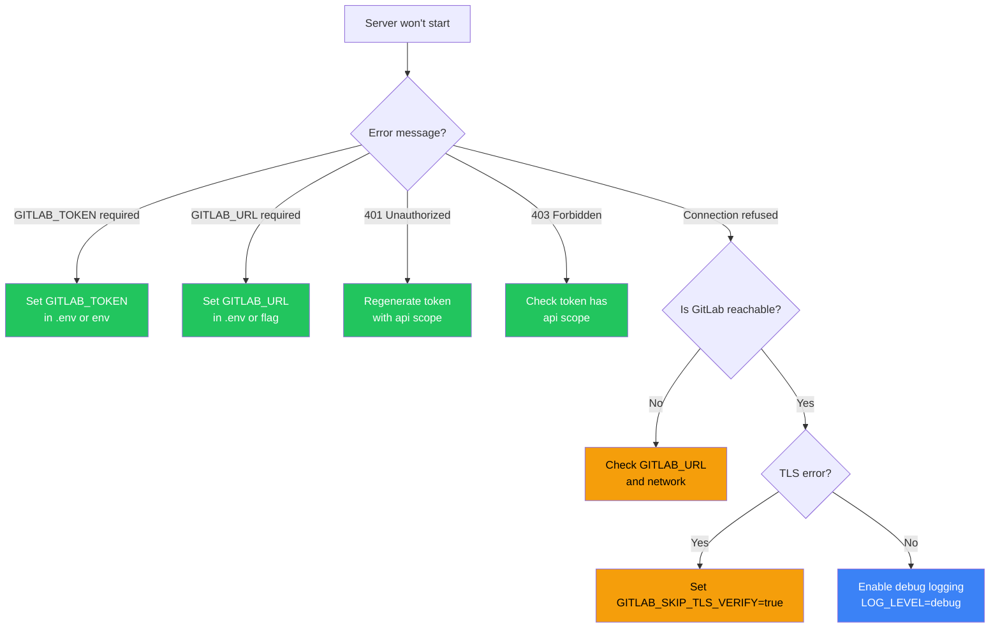

import { Tabs, TabItem, Steps } from "@astrojs/starlight/components";

:::note[Developer Documentation]
For the complete technical reference, see [`docs/troubleshooting.md`](https://github.com/jmrplens/gitlab-mcp-server/blob/main/docs/troubleshooting.md) in the repository.
:::

## Connection and authentication



| Symptom                                | Cause                       | Solution                                                                                                                                |
| -------------------------------------- | --------------------------- | --------------------------------------------------------------------------------------------------------------------------------------- |
| `GITLAB_TOKEN is required` at startup  | Token not set               | Set `GITLAB_TOKEN` in `.env` or environment                                                                                             |
| `GITLAB_URL is required` at startup    | URL not set                 | Set `GITLAB_URL` in `.env` or use `--gitlab-url` flag. In HTTP mode, `--gitlab-url` is optional if clients send the `GITLAB-URL` header |
| `401 Unauthorized` from GitLab API     | Invalid or expired PAT      | Generate a new token with `api` scope at GitLab → Preferences → Access Tokens                                                           |
| `403 Forbidden` on specific operations | Token lacks required scope  | Ensure the token has `api` scope (not just `read_api`)                                                                                  |
| Connection refused or timeout          | GitLab instance unreachable | Verify `GITLAB_URL` is reachable: `curl -s $GITLAB_URL/api/v4/version`                                                                  |

## TLS and certificates

| Symptom                                         | Cause                   | Solution                                                                                     |
| ----------------------------------------------- | ----------------------- | -------------------------------------------------------------------------------------------- |
| `x509: certificate signed by unknown authority` | Self-signed certificate | Set `GITLAB_SKIP_TLS_VERIFY=true` in `.env` or `--skip-tls-verify` in HTTP mode              |
| `x509: certificate has expired`                 | Expired TLS certificate | Renew the certificate on the GitLab server, or use `GITLAB_SKIP_TLS_VERIFY=true` temporarily |

:::caution
`GITLAB_SKIP_TLS_VERIFY=true` disables TLS verification entirely. Use it only for self-hosted instances with self-signed certificates, and never in production environments with public-facing GitLab instances.
:::

## Network and proxy

### DNS resolution

If the server cannot resolve your GitLab hostname:

```bash
# Verify DNS from the machine running the MCP server
nslookup gitlab.example.com
# or
dig gitlab.example.com +short
```

In Docker containers, ensure your compose file or `docker run` command uses `--dns` or a custom network with proper DNS configuration. Inside Kubernetes, check CoreDNS logs and `resolv.conf` in the pod.

### Corporate proxies

Go's `net/http` honours the standard proxy environment variables. Set them before launching the server:

```bash
export HTTPS_PROXY=http://proxy.corp.example.com:8080
export HTTP_PROXY=http://proxy.corp.example.com:8080
export NO_PROXY=localhost,127.0.0.1,.internal.corp
```

| Symptom                                          | Cause                                         | Solution                                                                              |
| ------------------------------------------------ | --------------------------------------------- | ------------------------------------------------------------------------------------- |
| Connection timeout behind corporate network      | Proxy not configured                          | Set `HTTPS_PROXY` / `HTTP_PROXY`                                                      |
| Proxy works for `curl` but not for the server    | Env vars not exported into the server process | Pass them in `.env`, Docker `environment:`, or Fly.io secrets                         |
| `CONNECT` rejected by proxy for `api.github.com` | Proxy denies outbound to GitHub (auto-update) | Set `AUTO_UPDATE=false` or whitelist `github.com` and `objects.githubusercontent.com` |
| Internal GitLab routed through external proxy    | `NO_PROXY` missing                            | Add your GitLab hostname to `NO_PROXY`                                                |

### Reverse proxy (HTTP mode)

When running the MCP server behind nginx, Caddy, or a cloud load balancer:

| Symptom                                        | Cause                                            | Solution                                                                                             |
| ---------------------------------------------- | ------------------------------------------------ | ---------------------------------------------------------------------------------------------------- |
| Rate limiter counts all requests as one client | Reads load-balancer IP instead of real client IP | Set `--trusted-proxy-header` to the header your proxy sets (e.g. `X-Forwarded-For`, `Fly-Client-IP`) |
| WebSocket or SSE disconnected                  | Proxy read timeout too short                     | Increase proxy read timeout to at least 120s for long-running MCP streams                            |
| `502 Bad Gateway`                              | Server not listening yet                         | Add a startup probe or retry; the server needs a few seconds to initialize on first request          |

## Tool discovery

| Symptom                                         | Cause                                     | Solution                                                                                                                                                                 |
| ----------------------------------------------- | ----------------------------------------- | ------------------------------------------------------------------------------------------------------------------------------------------------------------------------ |
| MCP client shows 1006 tools instead of 32       | Meta-tools disabled                       | Set `META_TOOLS=true` (default) to consolidate into domain meta-tools                                                                                                    |
| Tool not found in `tools/list`                  | Meta-tool mode mismatch                   | Individual mode uses `gitlab_create_issue`, meta mode uses `gitlab_issue` with `action: create`                                                                          |
| `unknown action` in meta-tool call              | Invalid action parameter                  | Check valid actions in the [Tools Overview](/gitlab-mcp-server/tools/overview/)                                                                                          |
| `json: unknown field "<name>"` from a meta-tool | Misspelled or stale parameter in `params` | Meta-tools reject unknown keys. Use the exact parameter names for the chosen `action` (e.g. `merge_request_iid`, `issue_iid`, `epic_iid`, `work_item_iid`, `snippet_id`) |
| Enterprise tools missing                        | Enterprise mode disabled                  | Set `GITLAB_ENTERPRISE=true` to enable 15 additional enterprise meta-tools                                                                                               |

## Auto-update

| Symptom                                | Cause                           | Solution                                                                            |
| -------------------------------------- | ------------------------------- | ----------------------------------------------------------------------------------- |
| Update detected but not applied        | Mode is `check` only            | Set `AUTO_UPDATE=true` to enable automatic application                              |
| Still running old version after update | Process not restarted (Windows) | Restart the server or use `gitlab-mcp-server --shutdown` to terminate all instances |
| Cannot replace binary (file locked)    | Running instances hold the file | Run `gitlab-mcp-server --shutdown` to terminate all instances first                 |
| Network error reaching GitHub          | Firewall or proxy blocking      | Verify connectivity to `github.com` from the server                                 |

## HTTP server mode

| Symptom                        | Cause                  | Solution                                                                          |
| ------------------------------ | ---------------------- | --------------------------------------------------------------------------------- |
| `400 Bad Request`              | Missing token header   | Send `PRIVATE-TOKEN` or `Authorization: Bearer <token>` header with every request |
| Pool eviction too frequent     | Too many unique tokens | Increase `--max-http-clients` (default: 100)                                      |
| Sessions expiring unexpectedly | Idle timeout too short | Increase `--session-timeout` (default: 30m)                                       |

## OAuth mode (`--auth-mode=oauth`)

| Symptom                                          | Cause                                        | Solution                                                                                                                     |
| ------------------------------------------------ | -------------------------------------------- | ---------------------------------------------------------------------------------------------------------------------------- |
| `401 Unauthorized` with valid OAuth token        | Token expired or GitLab rejected it          | Re-authorize through the OAuth flow; check that the GitLab OAuth app is still active                                         |
| High latency on first request after cache expiry | Token re-validation against GitLab API       | Expected behavior — increase `--oauth-cache-ttl` (default: 15m, max: 2h) to reduce validation frequency                      |
| `404` on `/.well-known/oauth-protected-resource` | OAuth mode not enabled                       | Start the server with `--auth-mode=oauth`                                                                                    |
| Client doesn't start OAuth flow                  | Client lacks OAuth 2.1 support               | Use `PRIVATE-TOKEN` header instead — it works in OAuth mode via automatic normalization                                      |
| `PRIVATE-TOKEN` header not working in OAuth mode | Should still work                            | The middleware normalizes `PRIVATE-TOKEN` to Bearer — check token validity                                                   |
| Operations fail with insufficient `mcp` scope    | DCR fallback assigned `mcp` instead of `api` | Configure `clientId` explicitly in the MCP client config. See [HTTP Server Mode](/gitlab-mcp-server/operations/http-server/) |

## Pagination

| Symptom                        | Cause                    | Solution                                                    |
| ------------------------------ | ------------------------ | ----------------------------------------------------------- |
| List results truncated         | Default `per_page` limit | Pass `per_page` (max 100) and `page` parameters to paginate |
| `nextPage` missing in response | Last page reached        | No more results — this is expected behavior                 |

## IDE-specific issues

<Tabs>
  <TabItem label="VS Code / GitHub Copilot">
    | Symptom                            | Solution                                                                     |
    | ---------------------------------- | ---------------------------------------------------------------------------- |
    | "Tool not found" in Copilot Chat   | Check Output panel → **MCP Logs** for errors. Verify `.vscode/mcp.json` path |
    | Server not appearing in MCP status | Run `Ctrl+Shift+P` → **MCP: List Servers** to verify configuration           |
    | "Permission denied" on startup     | Run `chmod +x /path/to/gitlab-mcp-server` (Linux/macOS)                      |
    | Server restarts repeatedly         | Check MCP Logs for missing `GITLAB_URL` or `GITLAB_TOKEN`                    |
  </TabItem>
  <TabItem label="Cursor">
    | Symptom                    | Solution                                                                   |
    | -------------------------- | -------------------------------------------------------------------------- |
    | Tools not listed           | Verify `.cursor/mcp.json` exists and uses `mcpServers` key (not `servers`) |
    | `${input:...}` not working | Not supported by Cursor — use environment variables instead                |
  </TabItem>
</Tabs>

## Debug mode

Enable verbose logging to diagnose issues:

<Steps>

1. **Set the log level** to `debug`:

   ```bash
   # Stdio mode
   LOG_LEVEL=debug ./gitlab-mcp-server 2>debug.log

   # HTTP mode (logs interleaved with server output)
   LOG_LEVEL=debug ./gitlab-mcp-server --http --gitlab-url=https://gitlab.example.com 2>debug.log
   ```

2. **Reproduce the issue** by running the same operation that failed.

3. **Examine the logs** — debug logs include:
   - Every tool call with input parameters
   - GitLab API request/response details
   - Token validation events (last 4 characters only)
   - Session pool operations (HTTP mode)

</Steps>

:::tip
Logs go to **stderr**, JSON-RPC messages go to **stdout**. Always redirect stderr when capturing debug logs to avoid mixing with MCP protocol messages.
:::

## Getting help

If you cannot resolve an issue:

<Steps>

1. **Enable debug logging** (`LOG_LEVEL=debug`) and capture the output
2. **Check the [GitHub Issues](https://github.com/jmrplens/gitlab-mcp-server/issues)** for known problems
3. **Open a new issue** with:
   - Server version (`gitlab-mcp-server --version` or check startup logs)
   - Operating system and architecture
   - MCP client name and version
   - Redacted debug logs (remove any tokens or sensitive data)
   - Steps to reproduce the issue

</Steps>
