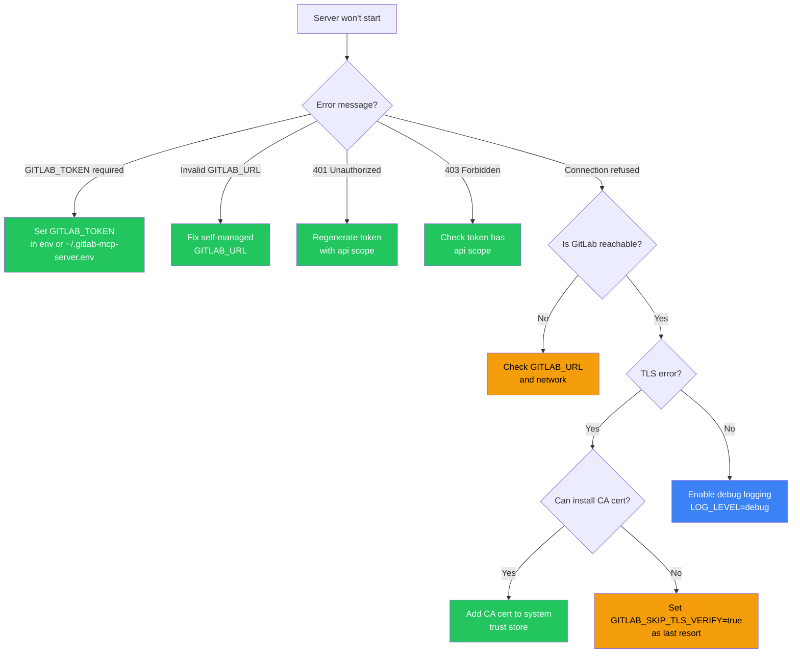

import { Tabs, TabItem, Steps } from "@astrojs/starlight/components";
import FAQ from "../../../components/FAQ.astro";
import stats from "../../../data/stats.json";

## Connection and authentication


```mermaid
flowchart TD
    A[Server won't start] --> B{Error message?}
    B -->|GITLAB_TOKEN required| C[Set GITLAB_TOKEN<br/>in env or ~/.gitlab-mcp-server.env]
    B -->|Invalid GITLAB_URL| D[Fix self-managed<br/>GITLAB_URL]
    B -->|401 Unauthorized| E[Regenerate token<br/>with api scope]
    B -->|403 Forbidden| F[Check token has<br/>api scope]
    B -->|Connection refused| G{Is GitLab reachable?}
    G -->|No| H[Check GITLAB_URL<br/>and network]
    G -->|Yes| I{TLS error?}
    I -->|Yes| J{Can install CA cert?}
    J -->|Yes| J1[Add CA cert to system<br/>trust store]
    J -->|No| J2[Set GITLAB_SKIP_TLS_VERIFY=true<br/>as last resort]
    I -->|No| K[Enable debug logging<br/>LOG_LEVEL=debug]

    style C fill:#22c55e,color:#fff
    style D fill:#22c55e,color:#fff
    style E fill:#22c55e,color:#fff
    style F fill:#22c55e,color:#fff
    style H fill:#f59e0b,color:#000
    style J1 fill:#22c55e,color:#fff
    style J2 fill:#f59e0b,color:#000
    style K fill:#3b82f6,color:#fff
```

| Symptom                                    | Cause                       | Solution                                                                                                                                                          |
| ------------------------------------------ | --------------------------- | ----------------------------------------------------------------------------------------------------------------------------------------------------------------- |
| `GITLAB_TOKEN is required` at startup      | Token not set               | Set `GITLAB_TOKEN` in the environment or in `~/.gitlab-mcp-server.env`; a working-directory `.env` is not read, and one that exists is named at `WARN` on startup |
| `GITLAB_URL is not a valid URL` at startup | URL has invalid syntax      | Fix `GITLAB_URL` or omit it to use `https://gitlab.com` in stdio mode                                                                                             |
| `401 Unauthorized` from GitLab API         | Invalid or expired PAT      | Generate a new token with `api` scope at GitLab → Preferences → Access Tokens                                                                                     |
| `403 Forbidden` on specific operations     | Token lacks required scope  | Ensure the token has `api` scope (not just `read_api`)                                                                                                            |
| Connection refused or timeout              | GitLab instance unreachable | Verify `GITLAB_URL` is reachable: `curl -s $GITLAB_URL/api/v4/version`                                                                                            |

## TLS and certificates

| Symptom                                         | Cause                   | Solution                                                                                                                                                                                                           |
| ----------------------------------------------- | ----------------------- | ------------------------------------------------------------------------------------------------------------------------------------------------------------------------------------------------------------------ |
| `x509: certificate signed by unknown authority` | Self-signed certificate | First try adding the CA certificate to your system trust store. If that's not possible, set `GITLAB_SKIP_TLS_VERIFY=true` in the environment or in `~/.gitlab-mcp-server.env`, or `--skip-tls-verify` in HTTP mode |
| `x509: certificate has expired`                 | Expired TLS certificate | Renew the certificate on the GitLab server, or use `GITLAB_SKIP_TLS_VERIFY=true` temporarily                                                                                                                       |

:::caution
`GITLAB_SKIP_TLS_VERIFY=true` disables TLS verification entirely. Use it only for self-hosted instances with self-signed certificates, and never in production environments with public-facing GitLab instances.
:::

## Network and proxy

### DNS resolution

If the server cannot resolve your GitLab hostname:

```bash
# Verify DNS from the machine running the MCP server
nslookup gitlab.example.com
# or
dig gitlab.example.com +short
```

In Docker containers, ensure your compose file or `docker run` command uses `--dns` or a custom network with proper DNS configuration. Inside Kubernetes, check CoreDNS logs and `resolv.conf` in the pod.

### Corporate proxies

Go's `net/http` honours the standard proxy environment variables. Set them before launching the server:

```bash
export HTTPS_PROXY=http://proxy.corp.example.com:8080
export HTTP_PROXY=http://proxy.corp.example.com:8080
export NO_PROXY=localhost,127.0.0.1,.internal.corp
```

| Symptom                                       | Cause                                         | Solution                                                                                                             |
| --------------------------------------------- | --------------------------------------------- | -------------------------------------------------------------------------------------------------------------------- |
| Connection timeout behind corporate network   | Proxy not configured                          | Set `HTTPS_PROXY` / `HTTP_PROXY`                                                                                     |
| Proxy works for `curl` but not for the server | Env vars not exported into the server process | Pass them in the client's `env` block, `~/.gitlab-mcp-server.env`, Docker `environment:`, or your platform's secrets |
| Internal GitLab routed through external proxy | `NO_PROXY` missing                            | Add your GitLab hostname to `NO_PROXY`                                                                               |

### Reverse proxy (HTTP mode)

When running the MCP server behind nginx, Caddy, or a cloud load balancer:

| Symptom                                        | Cause                                            | Solution                                                                                                |
| ---------------------------------------------- | ------------------------------------------------ | ------------------------------------------------------------------------------------------------------- |
| Rate limiter counts all requests as one client | Reads load-balancer IP instead of real client IP | Set `--trusted-proxy-header` to the header your proxy sets (e.g. `X-Forwarded-For`, `CF-Connecting-IP`) |
| WebSocket or SSE disconnected                  | Proxy read timeout too short                     | Increase proxy read timeout to at least 120s for long-running MCP streams                               |
| `502 Bad Gateway`                              | Server not listening yet                         | Add a startup probe or retry; the server needs a few seconds to initialize on first request             |

## Tool discovery

| Symptom                                                                    | Cause                                       | Solution                                                                                                                                                                                                                                                                                                                                                  |
| -------------------------------------------------------------------------- | ------------------------------------------- | --------------------------------------------------------------------------------------------------------------------------------------------------------------------------------------------------------------------------------------------------------------------------------------------------------------------------------------------------------- |
| Only two tools appear: `gitlab_find_action` and `gitlab_execute_action`    | Expected — `dynamic` is the default surface | Not a failure. Ask for what you want in plain language; the assistant finds the action and its schema, then executes it. Set `TOOL_SURFACE=meta` or `TOOL_SURFACE=individual` if you want a browsable tool list                                                                                                                                           |
| MCP client shows hundreds of individual tools instead of {stats.meta.base} | Individual surface selected                 | Set `TOOL_SURFACE=meta` to consolidate into domain meta-tools                                                                                                                                                                                                                                                                                             |
| Tool not found in `tools/list`                                             | Tool surface mismatch                       | Individual mode uses `gitlab_issue_create`, meta mode uses `gitlab_issue` with `action: create`, and dynamic mode exposes `gitlab_find_action` and `gitlab_execute_action`                                                                                                                                                                                |
| `unknown action` in meta-tool call                                         | Invalid action parameter                    | Check valid actions in the [Tools Overview](/gitlab-mcp-server/tools/overview/)                                                                                                                                                                                                                                                                           |
| `json: unknown field "<name>"` from a meta-tool                            | Misspelled or stale parameter in `params`   | Meta-tools reject unknown keys. Use the exact parameter names for the chosen `action` (e.g. `merge_request_iid`, `issue_iid`, `epic_iid`, `work_item_iid`, `snippet_id`)                                                                                                                                                                                  |
| Enterprise tools missing                                                   | Enterprise catalog disabled                 | In stdio mode, set `GITLAB_TIER=premium` or `GITLAB_TIER=ultimate`. In HTTP mode, set `--tier=premium`/`--tier=ultimate` to force the catalog or let CE/EE auto-detection enable it when GitLab reports edition. The deprecated `GITLAB_ENTERPRISE=true` variable still works when `GITLAB_TIER` is unset; there is no `--enterprise` flag — use `--tier` |

## npm / npx installs

| Symptom                                                             | Cause                                                                                                                                                                                                                                                                                   | Solution                                                                                                                                                                                                                                              |
| ------------------------------------------------------------------- | --------------------------------------------------------------------------------------------------------------------------------------------------------------------------------------------------------------------------------------------------------------------------------------- | ----------------------------------------------------------------------------------------------------------------------------------------------------------------------------------------------------------------------------------------------------- |
| `the @jmrp.io/gitlab-mcp-server-linux-x64 package is not installed` | On Alpine this is deliberate: the linux packages declare `libc: glibc` and the released binaries need the glibc dynamic loader, so npm skips them on musl. On a glibc distro it means the install skipped optional dependencies (`--no-optional`, or a lockfile resolved on another OS) | On musl, use the container image `ghcr.io/jmrplens/gitlab-mcp-server` (built against musl) or build from source — the publish is not broken. On glibc, reinstall without `--no-optional`, or delete `node_modules` and the lockfile and install again |
| Updates never arrive under `npx`                                    | The server never updates itself, and npm owns the binary                                                                                                                                                                                                                                | Expected. Upgrade with npm, or add `@latest` to the `npx` spec so it resolves afresh instead of reusing its cache                                                                                                                                     |

## Upgrading

The server never updates itself, so an upgrade is whatever your install channel does plus a restart.

| Symptom                                       | Cause                                | Solution                                                                                            |
| --------------------------------------------- | ------------------------------------ | --------------------------------------------------------------------------------------------------- |
| Still running the old version after upgrading | The old process was never restarted  | Restart the server, or run `gitlab-mcp-server --shutdown` to terminate every running instance first |
| Cannot replace the binary (file locked)       | Running instances hold the file open | Run `gitlab-mcp-server --shutdown` to terminate every instance, then replace it                     |

## HTTP server mode

| Symptom                                                                   | Cause                                                                              | Solution                                                                                                                                                                                                                                                                                                                                                                                                                                      |
| ------------------------------------------------------------------------- | ---------------------------------------------------------------------------------- | --------------------------------------------------------------------------------------------------------------------------------------------------------------------------------------------------------------------------------------------------------------------------------------------------------------------------------------------------------------------------------------------------------------------------------------------- |
| `401 Unauthorized` with `WWW-Authenticate: Bearer`                        | Missing or empty token header                                                      | Send `PRIVATE-TOKEN` or `Authorization: Bearer <token>` header with every request. The JSON body names both accepted headers                                                                                                                                                                                                                                                                                                                  |
| `400 Bad Request` with `no server available` in plain text                | A build older than 2.6.6 received a request it could not route                     | Not a crash and not emitted by this project — it comes from the MCP SDK when server selection finds no server. Upgrade: those cases are now `401`, `400`, `429` and `503` with a JSON-RPC body                                                                                                                                                                                                                                                |
| `400 Bad Request` naming `GITLAB-URL`                                     | The per-request `GITLAB-URL` header is not a parseable URL                         | Send an absolute URL such as `https://gitlab.example.com`, or omit the header when the server runs with `--gitlab-url`                                                                                                                                                                                                                                                                                                                        |
| `400`/`403` saying the deployment does not serve that GitLab instance     | `--gitlab-url` names more than one instance, so it publishes an allow-list         | Send a `GITLAB-URL` the server publishes, or omit the header to get the default. In OAuth mode the error names the published instances — the same list its RFC 9728 metadata already serves unauthenticated — and answers `403` before the token is used anywhere. Legacy mode answers `400` and does **not** name them: it publishes no metadata document and reaches this rejection before the credential is validated, so ask the operator |
| `429 Too Many Requests` with `Retry-After`                                | More than 10 failed authentications from one client IP within a minute             | Wait for the window to pass and retry with a valid token. Behind a reverse proxy, set `--trusted-proxy-header` so the limit counts real client IPs                                                                                                                                                                                                                                                                                            |
| `503 Service Unavailable`                                                 | The GitLab instance was unreachable while building the session for that token      | Check `GITLAB-URL` / `--gitlab-url` and instance reachability; the server logs the underlying error                                                                                                                                                                                                                                                                                                                                           |
| Pool eviction too frequent                                                | Too many unique tokens                                                             | Increase `--max-http-clients` (default: 100)                                                                                                                                                                                                                                                                                                                                                                                                  |
| Sessions expiring unexpectedly                                            | MCP idle timeout too short                                                         | Increase `--session-timeout` (default: 30m)                                                                                                                                                                                                                                                                                                                                                                                                   |
| MCP sessions drop every ~2 min / `keepalive ping failed; closing session` | A low `--http-idle-timeout` (or a proxy timeout) is closing long-lived SSE streams | Default `--http-idle-timeout=0` disables HTTP-layer idle closure; if you set a low value, raise it or use `0`. Behind a reverse proxy, also raise its read/idle timeout                                                                                                                                                                                                                                                                       |

## OAuth mode (`--auth-mode=oauth`)

| Symptom                                          | Cause                                        | Solution                                                                                                                     |
| ------------------------------------------------ | -------------------------------------------- | ---------------------------------------------------------------------------------------------------------------------------- |
| `401 Unauthorized` with valid OAuth token        | Token expired or GitLab rejected it          | Re-authorize through the OAuth flow; check that the GitLab OAuth app is still active                                         |
| High latency on first request after cache expiry | Token re-validation against GitLab API       | Expected behavior — increase `--oauth-cache-ttl` (default: 15m, max: 2h) to reduce validation frequency                      |
| `404` on `/.well-known/oauth-protected-resource` | OAuth mode not enabled                       | Start the server with `--auth-mode=oauth`                                                                                    |
| Client doesn't start OAuth flow                  | Client lacks OAuth 2.1 support               | Send a personal access token as `Authorization: Bearer <glpat-...>` — verified the same way as an OAuth token                |
| `401` when sending `PRIVATE-TOKEN` in OAuth mode | OAuth mode is Bearer-only, by design         | Move the token to `Authorization: Bearer <token>`; `PRIVATE-TOKEN` is accepted only in `--auth-mode=legacy`                  |
| Operations fail with insufficient `mcp` scope    | DCR fallback assigned `mcp` instead of `api` | Configure `clientId` explicitly in the MCP client config. See [HTTP Server Mode](/gitlab-mcp-server/operations/http-server/) |

## Pagination

| Symptom                        | Cause                    | Solution                                                    |
| ------------------------------ | ------------------------ | ----------------------------------------------------------- |
| List results truncated         | Default `per_page` limit | Pass `per_page` (max 100) and `page` parameters to paginate |
| `nextPage` missing in response | Last page reached        | No more results — this is expected behavior                 |

## IDE-specific issues

<Tabs>
  <TabItem label="VS Code / GitHub Copilot">
| Symptom                                                     | Solution                                                                                                                                                                                                                                                                                                                                                                                                                                                                                                                                                                                        |
| ----------------------------------------------------------- | ----------------------------------------------------------------------------------------------------------------------------------------------------------------------------------------------------------------------------------------------------------------------------------------------------------------------------------------------------------------------------------------------------------------------------------------------------------------------------------------------------------------------------------------------------------------------------------------------- |
| "Tool not found" in Copilot Chat                            | Check Output panel → **MCP Logs** for errors. Verify `.vscode/mcp.json` path                                                                                                                                                                                                                                                                                                                                                                                                                                                                                                                    |
| Server not appearing in MCP status                          | Run `Ctrl+Shift+P` → **MCP: List Servers** to verify configuration                                                                                                                                                                                                                                                                                                                                                                                                                                                                                                                              |
| "Permission denied" on startup                              | Run `chmod +x /path/to/gitlab-mcp-server` (Linux/macOS)                                                                                                                                                                                                                                                                                                                                                                                                                                                                                                                                         |
| Server restarts repeatedly                                  | Check MCP Logs for missing `GITLAB_URL` or `GITLAB_TOKEN`                                                                                                                                                                                                                                                                                                                                                                                                                                                                                                                                       |
| Waiting for `initialize` with Docker logs showing HTTP mode | Add `-i` to the `docker run` args so the container gets a pipe to speak on and infers stdio (JSON-RPC over stdin/stdout, no port needed), and `docker pull` the image if it predates the release that made `--transport auto` its command. Alternatively, run the container in HTTP mode with `-p 8080:8080` and an instance to serve (`-e GITLAB_URL=https://gitlab.com`, without which it exits with `--gitlab-url is required in HTTP mode`), then configure the MCP client as HTTP pointing to `http://host:8080/mcp` — this only works if the server is running and the port is reachable. |
  </TabItem>
  <TabItem label="Cursor">
| Symptom                    | Solution                                                                   |
| -------------------------- | -------------------------------------------------------------------------- |
| Tools not listed           | Verify `.cursor/mcp.json` exists and uses `mcpServers` key (not `servers`) |
| `${input:...}` not working | Not supported by Cursor — use environment variables instead                |
  </TabItem>
</Tabs>

## Debug mode

Enable verbose logging to diagnose issues:

<Steps>

1. **Set the log level** to `debug`:

   ```bash
   # Stdio mode
   LOG_LEVEL=debug ./gitlab-mcp-server 2>debug.log

   # HTTP mode (logs interleaved with server output)
   LOG_LEVEL=debug ./gitlab-mcp-server --http --gitlab-url=https://gitlab.com 2>debug.log
   ```

2. **Reproduce the issue** by running the same operation that failed.

3. **Examine the logs** — debug logs include:
   - Every tool call with input parameters
   - GitLab API request/response details
   - Token validation events (last 4 characters only)
   - Session pool operations (HTTP mode)

</Steps>

:::tip
Logs go to **stderr**, JSON-RPC messages go to **stdout**. Always redirect stderr when capturing debug logs to avoid mixing with MCP protocol messages.
:::

## Getting help

If you cannot resolve an issue:

<Steps>

1. **Enable debug logging** (`LOG_LEVEL=debug`) and capture the output
2. **Check the [GitHub Issues](https://github.com/jmrplens/gitlab-mcp-server/issues)** for known problems
3. **Open a new issue** with:
   - Server version (`gitlab-mcp-server --version` or check startup logs)
   - Operating system and architecture
   - MCP client name and version
   - Redacted debug logs (remove any tokens or sensitive data)
   - Steps to reproduce the issue

</Steps>

<FAQ />

## Source reference

:::note[Developer Documentation]
For the complete technical reference, see [`docs/troubleshooting.md`](https://github.com/jmrplens/gitlab-mcp-server/blob/main/docs/guides/troubleshooting.md) in the repository.
:::
