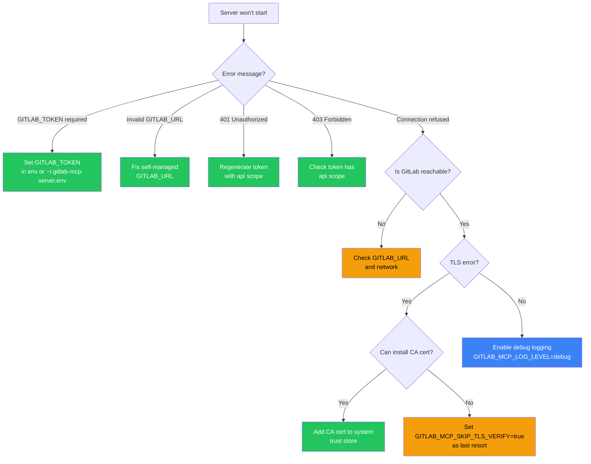

import { Tabs, TabItem, Steps } from "@astrojs/starlight/components";
import FAQ from "../../../components/FAQ.astro";
import stats from "../../../data/stats.json";

## Connection and authentication


```mermaid
flowchart TD
    A[Server won't start] --> B{Error message?}
    B -->|GITLAB_TOKEN required| C[Set GITLAB_TOKEN<br/>in env or ~/.gitlab-mcp-server.env]
    B -->|Invalid GITLAB_URL| D[Fix self-managed<br/>GITLAB_URL]
    B -->|401 Unauthorized| E[Regenerate token<br/>with api scope]
    B -->|403 Forbidden| F[Check token has<br/>api scope]
    B -->|Connection refused| G{Is GitLab reachable?}
    G -->|No| H[Check GITLAB_URL<br/>and network]
    G -->|Yes| I{TLS error?}
    I -->|Yes| J{Can install CA cert?}
    J -->|Yes| J1[Add CA cert to system<br/>trust store]
    J -->|No| J2[Set GITLAB_MCP_SKIP_TLS_VERIFY=true<br/>as last resort]
    I -->|No| K[Enable debug logging<br/>GITLAB_MCP_LOG_LEVEL=debug]

    style C fill:#22c55e,color:#fff
    style D fill:#22c55e,color:#fff
    style E fill:#22c55e,color:#fff
    style F fill:#22c55e,color:#fff
    style H fill:#f59e0b,color:#000
    style J1 fill:#22c55e,color:#fff
    style J2 fill:#f59e0b,color:#000
    style K fill:#3b82f6,color:#fff
```

| Symptom                                                                                                                                                                                                           | Cause                                                                                                                                                                                                                                                                                                   | Solution                                                                                                                                                                                                                                                                                 |
| ----------------------------------------------------------------------------------------------------------------------------------------------------------------------------------------------------------------- | ------------------------------------------------------------------------------------------------------------------------------------------------------------------------------------------------------------------------------------------------------------------------------------------------------- | ---------------------------------------------------------------------------------------------------------------------------------------------------------------------------------------------------------------------------------------------------------------------------------------- |
| `GITLAB_TOKEN is required` at startup                                                                                                                                                                             | Token not set                                                                                                                                                                                                                                                                                           | Set `GITLAB_TOKEN` in the environment or in `~/.gitlab-mcp-server.env`; a working-directory `.env` is not read, and one that exists is named at `WARN` on startup                                                                                                                        |
| `GITLAB_URL is not a valid URL` at startup                                                                                                                                                                        | URL has invalid syntax                                                                                                                                                                                                                                                                                  | Fix `GITLAB_URL` or omit it to use `https://gitlab.com` in stdio mode                                                                                                                                                                                                                    |
| stdio exits 1: `a flag withholding part of what this server serves was passed to a stdio server`                                                                                                                  | The client's `args` carry `--read-only`, `--safe-mode` or `--exclude-tools`, which only HTTP mode reads                                                                                                                                                                                                 | Move the setting to the client's `env` block under the variable the `set_instead` field names (`GITLAB_MCP_READ_ONLY=true` and the like) and remove the flag; the flag is refused even when that variable is already set                                                                 |
| stdio exits 1: `--gitlab-url names no instance this stdio server connects to`                                                                                                                                     | The client's `args` carry `--gitlab-url`, which only HTTP mode reads, and `GITLAB_URL` names another instance or none, which means `https://gitlab.com`                                                                                                                                                 | Set `GITLAB_URL` to the instance in the client's `env` block and remove the flag, so the token goes where the configuration says                                                                                                                                                         |
| stdio: every `tools/list`, `tools/call`, resource and prompt request fails with JSON-RPC `-40300`, `GitLab accepted the token this server was started with, which carries neither the read_api nor the api scope` | The token in `GITLAB_TOKEN` is genuine and below the minimum: it carries `read_user` alone, or only scopes outside the API such as `read_repository` or `self_rotate`. The server keeps answering the handshake and logs the verdict once at ERROR, with the token's scopes where GitLab described them | Create a token with `read_api`, or `api` to write as well, and restart the server with it: a token's scopes cannot be changed after it is created. `GITLAB_MCP_IGNORE_SCOPES` does not lift the minimum                                                                                  |
| HTTP, legacy mode: `403 Forbidden`, JSON-RPC `-40300`, `GitLab accepted this token, which carries neither the read_api nor the api scope`                                                                         | The same token sent to a server in HTTP legacy mode; with `--auth-mode=oauth` it is refused `403` with an `insufficient_scope` challenge instead                                                                                                                                                        | Send a token with `read_api` or `api`. The refusal is not charged to the address's failure budget and is remembered for five minutes, so retrying the same token changes nothing                                                                                                         |
| stdio or HTTP exits 1: `... is no longer read (removed in 3.1.0) ... will not be started under a capability it did not ask for`                                                                                   | The environment, or a dotenv file the server loads, still sets `GITLAB_READ_ONLY`, `GITLAB_SAFE_MODE` or `EXCLUDE_TOOLS`, spellings 3.1.0 stopped reading, so ignoring one would serve what it withheld                                                                                                 | Rename it to the variable the line names (`GITLAB_MCP_EXCLUDE_TOOLS` and the like). When a bare `EXCLUDE_TOOLS` belongs to another tool, remove it from the environment this server starts in (`env -u EXCLUDE_TOOLS`): set to empty, it is still set and still refused                  |
| `401 Unauthorized` from GitLab API                                                                                                                                                                                | Invalid or expired PAT, or a permission refusal GitLab answers with 401                                                                                                                                                                                                                                 | If other calls with the same token work, check the role the action needs (approving your own merge request, merging without push access); otherwise generate a new token with `api` scope under your avatar > **Edit profile** > **Access** > **Personal access tokens** on the instance |
| Tool calls fail after connecting, with `authentication failed: GitLab rejected the token (GITLAB_TOKEN) itself as invalid, expired, revoked or without the api or read_api scope, so renew or replace it`         | The token expired or was revoked after the server admitted it: GitLab's `401` named the credential itself rather than a missing permission                                                                                                                                                              | Check the token's expiry date and that it carries `api`, or `read_api` for read-only use, then replace it: restart a stdio server with the new `GITLAB_TOKEN`, or send the new token from the HTTP client                                                                                |
| `403 Forbidden` on specific operations                                                                                                                                                                            | The token lacks a scope the operation needs, your role in the project or group is too low (some operations need Maintainer or Owner), the instance's settings restrict the feature, or a fine-grained token's grant lacks the permission the operation needs                                            | A write needs a token with `api`, not just `read_api`; otherwise ask for the role the operation needs. For a fine-grained token, see [Fine-grained tokens](#fine-grained-tokens)                                                                                                         |
| Connection refused or timeout                                                                                                                                                                                     | GitLab instance unreachable                                                                                                                                                                                                                                                                             | Verify `GITLAB_URL` is reachable: `curl -s $GITLAB_URL/api/v4/version`                                                                                                                                                                                                                   |

## TLS and certificates

| Symptom                                         | Cause                   | Solution                                                                                                                                                                                                                                                                                                                                           |
| ----------------------------------------------- | ----------------------- | -------------------------------------------------------------------------------------------------------------------------------------------------------------------------------------------------------------------------------------------------------------------------------------------------------------------------------------------------- |
| `x509: certificate signed by unknown authority` | Self-signed certificate | First try adding the CA certificate to your system trust store. If that's not possible, set `GITLAB_MCP_SKIP_TLS_VERIFY=true` in the environment or in `~/.gitlab-mcp-server.env`, or `--skip-tls-verify` in HTTP mode; `--auth-mode=oauth` refuses it for a non-loopback instance, so install the CA (or point `SSL_CERT_FILE` at a bundle) there |
| `x509: certificate has expired`                 | Expired TLS certificate | Renew the certificate on the GitLab server. `GITLAB_MCP_SKIP_TLS_VERIFY=true` works around it temporarily; `--auth-mode=oauth` accepts it only for a loopback instance                                                                                                                                                                             |

:::caution
`GITLAB_MCP_SKIP_TLS_VERIFY=true` disables TLS verification entirely. Use it only for self-hosted instances with self-signed certificates, and never in production environments with public-facing GitLab instances.
:::

## Network and proxy

### DNS resolution

If the server cannot resolve your GitLab hostname:

```bash
# Verify DNS from the machine running the MCP server
nslookup gitlab.example.com
# or
dig gitlab.example.com +short
```

In Docker containers, ensure your compose file or `docker run` command uses `--dns` or a custom network with proper DNS configuration. Inside Kubernetes, check CoreDNS logs and `resolv.conf` in the pod.

### Corporate proxies

Go's `net/http` honours the standard proxy environment variables. Set them before launching the server:

```bash
export HTTPS_PROXY=http://proxy.corp.example.com:8080
export HTTP_PROXY=http://proxy.corp.example.com:8080
export NO_PROXY=localhost,127.0.0.1,.internal.corp
```

| Symptom                                       | Cause                                         | Solution                                                                                                             |
| --------------------------------------------- | --------------------------------------------- | -------------------------------------------------------------------------------------------------------------------- |
| Connection timeout behind corporate network   | Proxy not configured                          | Set `HTTPS_PROXY` / `HTTP_PROXY`                                                                                     |
| Proxy works for `curl` but not for the server | Env vars not exported into the server process | Pass them in the client's `env` block, `~/.gitlab-mcp-server.env`, Docker `environment:`, or your platform's secrets |
| Internal GitLab routed through external proxy | `NO_PROXY` missing                            | Add your GitLab hostname to `NO_PROXY`                                                                               |

### Reverse proxy (HTTP mode)

When running the MCP server behind nginx, Caddy, or a cloud load balancer:

| Symptom                                               | Cause                                                                                                   | Solution                                                                                                                                                                                                           |
| ----------------------------------------------------- | ------------------------------------------------------------------------------------------------------- | ------------------------------------------------------------------------------------------------------------------------------------------------------------------------------------------------------------------ |
| `429` after a few failed logins from different people | The authentication-failure limit (10 per address per minute) sees the proxy's address, not the client's | Set `--trusted-proxy-header` to the header your proxy sets (e.g. `X-Forwarded-For`, `CF-Connecting-IP`) and `--trusted-proxies` to the proxy's address; the per-call rate limiter is keyed by token and unaffected |
| SSE stream disconnected                               | Proxy read or idle timeout shorter than the stream's silence                                            | Raise the proxy read timeout; the server's 25-second SSE keep-alive holds an idle stream open across nginx's 60-second default, so a tighter edge is what cuts it                                                  |
| `502 Bad Gateway`                                     | Server not listening yet                                                                                | Add a startup probe or retry; the server needs a few seconds to initialize on first request                                                                                                                        |

## Tool discovery

| Symptom                                                                    | Cause                                                                                                                                     | Solution                                                                                                                                                                                                                                                                                                                                                                                                                                                                                      |
| -------------------------------------------------------------------------- | ----------------------------------------------------------------------------------------------------------------------------------------- | --------------------------------------------------------------------------------------------------------------------------------------------------------------------------------------------------------------------------------------------------------------------------------------------------------------------------------------------------------------------------------------------------------------------------------------------------------------------------------------------- |
| Only two tools appear: `gitlab_find_action` and `gitlab_execute_action`    | Expected: `dynamic` is the default surface                                                                                                | Not a failure: those two reach the whole catalog. `gitlab_find_action` returns the matching canonical `domain.action` ID with its exact schema, and `gitlab_execute_action` runs it, so ask for what you want in plain language. Set `GITLAB_MCP_TOOL_SURFACE=meta` or `GITLAB_MCP_TOOL_SURFACE=individual` if you want a browsable tool list. See [Dynamic toolset](/gitlab-mcp-server/tools/dynamic-tools/)                                                                                 |
| MCP client shows hundreds of individual tools instead of {stats.meta.base} | Individual surface selected                                                                                                               | Set `GITLAB_MCP_TOOL_SURFACE=meta` to consolidate into domain meta-tools: {stats.meta.base} on Free, and the Premium and Ultimate counts are in [Meta-tools](/gitlab-mcp-server/tools/meta-tools/#enterprise-mode)                                                                                                                                                                                                                                                                            |
| Tool not found in `tools/list`                                             | Tool surface mismatch: each surface names its tools differently                                                                           | Check `GITLAB_MCP_TOOL_SURFACE`. `dynamic`, the default, registers only `gitlab_find_action` and `gitlab_execute_action`; `meta` registers domain meta-tools, so creating an issue is `gitlab_issue` with `action: create`; `individual` registers one tool per operation, such as `gitlab_issue_create`. It is the only selector: `META_TOOLS`, under either spelling, was removed in 3.0.0. See [Configuration](/gitlab-mcp-server/configuration/)                                          |
| `unknown action` in meta-tool call                                         | The `action` value names no action of that meta-tool                                                                                      | The error lists the valid ones (`gitlab_issue: unknown action "x". Valid actions: ...` on the meta surface): pick one of those, or see [Meta-tools](/gitlab-mcp-server/tools/meta-tools/)                                                                                                                                                                                                                                                                                                     |
| `json: unknown field "<name>"` from a meta-tool                            | Misspelled or stale parameter in `params`                                                                                                 | Meta-tools decode `params` strictly and reject unknown keys. Use the exact parameter names for the chosen `action` (e.g. `merge_request_iid`, `issue_iid`, `epic_iid`, `work_item_iid`, `snippet_id`); [Meta-tools](/gitlab-mcp-server/tools/meta-tools/#how-do-i-discover-action-parameters) shows where to read them                                                                                                                                                                        |
| Reads work but every create, update and delete action is missing           | The token carries `read_api` and not `api`, so the server serves it a read-only surface: once at startup on stdio, per token in HTTP mode | Working as designed, and `--read-only` was not set. Use a token with `api`, or in OAuth mode reauthorize with `api`, for the full surface. The log line `token cannot write; serving a read-only tool surface for it` confirms it, and on the dynamic surface `gitlab_execute_action` answers a write with `... exists but is not available to this session: the credential in use does not carry a GitLab scope that covers it ...`. In HTTP mode another client's `api` token is unaffected |
| Enterprise tools missing                                                   | Enterprise catalog disabled                                                                                                               | In stdio mode, set `GITLAB_MCP_TIER=premium` or `GITLAB_MCP_TIER=ultimate`. In HTTP mode, set `--tier=premium`/`--tier=ultimate` to force the catalog or let detection enable it when the instance license, or a namespace the token administers, is on a Premium or Ultimate plan. `GITLAB_ENTERPRISE` was removed in 3.0.0 and is ignored; there is no `--enterprise` flag, so use `--tier`                                                                                                 |

## npm / npx installs

| Symptom                                                             | Cause                                                                                                                                                                                                                                                                                   | Solution                                                                                                                                                                                                                                              |
| ------------------------------------------------------------------- | --------------------------------------------------------------------------------------------------------------------------------------------------------------------------------------------------------------------------------------------------------------------------------------- | ----------------------------------------------------------------------------------------------------------------------------------------------------------------------------------------------------------------------------------------------------- |
| `the @jmrp.io/gitlab-mcp-server-linux-x64 package is not installed` | On Alpine this is deliberate: the linux packages declare `libc: glibc` and the released binaries need the glibc dynamic loader, so npm skips them on musl. On a glibc distro it means the install skipped optional dependencies (`--no-optional`, or a lockfile resolved on another OS) | On musl, use the container image `ghcr.io/jmrplens/gitlab-mcp-server` (built against musl) or build from source — the publish is not broken. On glibc, reinstall without `--no-optional`, or delete `node_modules` and the lockfile and install again |
| Updates never arrive under `npx`                                    | The server never updates itself, and npm owns the binary                                                                                                                                                                                                                                | Expected. Upgrade with npm, or add `@latest` to the `npx` spec so it resolves afresh instead of reusing its cache                                                                                                                                     |

## Upgrading

The server never updates itself, so an upgrade is whatever your install channel does plus a restart.

| Symptom                                       | Cause                                | Solution                                                                                            |
| --------------------------------------------- | ------------------------------------ | --------------------------------------------------------------------------------------------------- |
| Still running the old version after upgrading | The old process was never restarted  | Restart the server, or run `gitlab-mcp-server --shutdown` to terminate every running instance first |
| Cannot replace the binary (file locked)       | Running instances hold the file open | Run `gitlab-mcp-server --shutdown` to terminate every instance, then replace it                     |

## Stdio transport

| Symptom                                                                                   | Cause                                                                                                                                                                                                | Solution                                                                                                                                                                                                                                                                                                                                                                                                                                                                                                                                                                                                                                                             |
| ----------------------------------------------------------------------------------------- | ---------------------------------------------------------------------------------------------------------------------------------------------------------------------------------------------------- | -------------------------------------------------------------------------------------------------------------------------------------------------------------------------------------------------------------------------------------------------------------------------------------------------------------------------------------------------------------------------------------------------------------------------------------------------------------------------------------------------------------------------------------------------------------------------------------------------------------------------------------------------------------------- |
| No output from the server                                                                 | The client is not sending JSON-RPC on the server's stdin                                                                                                                                             | Check that the client is configured for the stdio transport and sends `initialize` as its first message. The server writes JSON-RPC to stdout and its logs to stderr                                                                                                                                                                                                                                                                                                                                                                                                                                                                                                 |
| The server exits immediately                                                              | Its stdin was closed                                                                                                                                                                                 | The server ends when the client closes the pipe, so make sure the client keeps it open                                                                                                                                                                                                                                                                                                                                                                                                                                                                                                                                                                               |
| VS Code waits on `initialize` and the Docker logs show `starting MCP server in HTTP mode` | The container got no stdin, so the image, whose command is `--transport auto`, inferred HTTP. An image published before `--transport auto` became its command serves HTTP whatever stdin it is given | Add `-i` to the `docker run` arguments so the container gets a pipe to speak on and infers stdio (JSON-RPC over stdin and stdout, no port needed), and run `docker pull ghcr.io/jmrplens/gitlab-mcp-server:latest` if the image predates that release. To stay on HTTP instead, give the container an instance to serve (`docker run --rm -p 8080:8080 -e GITLAB_URL=https://gitlab.com ghcr.io/jmrplens/gitlab-mcp-server:latest`, since HTTP mode exits with `--gitlab-url is required in HTTP mode` when none is named) and configure the client as HTTP pointing at `http://host:8080/mcp`, which works only while that container runs and its port is reachable |

A stdio server that refuses to start (a flag only HTTP mode reads, a retired variable) and one started with a token below the `read_api` minimum are under [Connection and authentication](#connection-and-authentication).

## HTTP server mode

| Symptom                                                                                                                                         | Cause                                                                                                                                                                                                                                                                                                                                                      | Solution                                                                                                                                                                                                                                                                                                                                                                                                                                                                                                        |
| ----------------------------------------------------------------------------------------------------------------------------------------------- | ---------------------------------------------------------------------------------------------------------------------------------------------------------------------------------------------------------------------------------------------------------------------------------------------------------------------------------------------------------- | --------------------------------------------------------------------------------------------------------------------------------------------------------------------------------------------------------------------------------------------------------------------------------------------------------------------------------------------------------------------------------------------------------------------------------------------------------------------------------------------------------------- |
| `401 Unauthorized` with `WWW-Authenticate: Bearer`                                                                                              | Missing or empty token header                                                                                                                                                                                                                                                                                                                              | Send `PRIVATE-TOKEN` or `Authorization: Bearer <token>` header with every request; in legacy mode the JSON body names both accepted headers, and `--auth-mode=oauth` reads only `Authorization: Bearer`                                                                                                                                                                                                                                                                                                         |
| `401 Unauthorized`: `GitLab rejected this token. Check that it is valid, unexpired, and issued by the target instance.`                         | GitLab refused the token when the server checked it with `GET /api/v4/user` before building a session for it                                                                                                                                                                                                                                               | Check that the token is valid, unexpired, and issued by the instance the request names. The check runs when the server builds a session for a token, not on every request, and the refusal is charged to the address's failure budget                                                                                                                                                                                                                                                                           |
| `400 Bad Request` with `no server available` in plain text                                                                                      | A build older than 2.6.6 received a request with no token, an unparseable `GITLAB-URL` header, or a backend it could not reach                                                                                                                                                                                                                             | Not a crash and not emitted by this project: it comes from the MCP SDK (`go-sdk/mcp/streamable.go`) when server selection finds no server. Upgrade: those cases are now `401`, `400`, `429` and `503` with a JSON-RPC body                                                                                                                                                                                                                                                                                      |
| `400 Bad Request` naming `GITLAB-URL`                                                                                                           | The per-request `GITLAB-URL` header is not a parseable URL                                                                                                                                                                                                                                                                                                 | Send an absolute URL such as `https://gitlab.example.com`, or omit the header when the server runs with `--gitlab-url`                                                                                                                                                                                                                                                                                                                                                                                          |
| `400`/`403` saying the deployment does not serve that GitLab instance                                                                           | `--gitlab-url` names more than one instance, so it publishes an allow-list                                                                                                                                                                                                                                                                                 | Send a `GITLAB-URL` the server publishes; omitting the header is refused too (`400`), never resolved to the first instance. In OAuth mode the error names the published instances (the same list its RFC 9728 metadata already serves unauthenticated) and answers `403` before the token is used anywhere. Legacy mode answers `400` and does **not** name them: it publishes no metadata document and reaches this rejection before the credential is validated, so ask the operator                          |
| `429 Too Many Requests` with `Retry-After`: `Too many failed authentication attempts from this address. Retry later with a valid token.`        | 10 failed authentications from one address within a minute, or 50 distinct refused credentials within 10 minutes (the defaults), for a credential this deployment does not already hold                                                                                                                                                                    | Wait out the `Retry-After` and retry with a valid token. A token the server already holds (a pooled session in legacy mode, a cached identity with a pooled session in OAuth mode) keeps working from a blocked address, so a sprayer behind a shared address does not cut off its neighbours; what stays refused is every credential the server does not already hold. Behind a reverse proxy, set `--trusted-proxy-header` and `--trusted-proxies` so the limit counts real client IPs instead of the proxy's |
| `503 Service Unavailable`: `Could not initialize a GitLab session for this token. The instance may be unreachable; retry shortly.`              | The server could not build a session for the token: no credential-check slot came free within five seconds (16 run at once across the process), the server was shutting down, or building the session failed. An instance that does not answer is not the cause: the token is then admitted, and the tool calls themselves report the instance unreachable | Retry shortly; the refusal is not charged to the address's failure budget. The log line `failed to create server for token` carries the error, `credential verification is saturated, retry shortly` when no slot came free. When tool calls report `GitLab server is unreachable (connection refused)`, check `GITLAB-URL` / `--gitlab-url` and the network path from the server                                                                                                                               |
| "This server is busy. Retry later." (a `503` with `Retry-After`, or a tool error)                                                               | Every call slot the descriptor limit allows is held across the process, typically by calls waiting on GitLab or on a pipeline (192 under a hard limit of 1024; the startup line's `held_requests_per_process` says how many)                                                                                                                               | Retry after the advertised delay. The ceiling counts every credential together and no flag moves it; the log line `request refused: too many requests held across the process` confirms it. A deployment that needs more calls in flight at once raises its hard descriptor limit or runs more replicas behind a balancer. See [HTTP Server Mode](/gitlab-mcp-server/operations/http-server/) for how the ceiling is sized                                                                                      |
| "This server is busy. Retry later." on `initialize`, `--stateless=false`                                                                        | Every stateful session slot is taken across the process, often by sessions no client deleted, which with `--session-timeout=0` never expire (96 under a hard limit of 1024; the startup line's `stateful_sessions_per_process` says how many)                                                                                                              | The log line `request refused: too many stateful sessions across the process` confirms it. Have clients delete their sessions when done, shorten `--session-timeout`, raise the hard descriptor limit, or move clients to the default stateless transport, which keeps no sessions. See [HTTP Server Mode](/gitlab-mcp-server/operations/http-server/) for how the ceiling is sized                                                                                                                             |
| `403 Forbidden`: `Cross-origin request refused: the Origin header names an origin this deployment does not trust.`                              | A browser sent an `Origin` this deployment does not trust, or said `Sec-Fetch-Site: cross-site`, and the request was refused before MCP handling                                                                                                                                                                                                           | Allow the origin with `--trusted-origins=https://app.example.com` (`*` accepts any origin and turns the protection off); the `--public-url` origin is trusted on its own. Clients that send no `Origin` are unaffected. See [Cross-origin protection](/gitlab-mcp-server/operations/security/#cross-origin-protection)                                                                                                                                                                                          |
| A browser client still fails after `--trusted-origins` was set                                                                                  | Builds up to 2.7.4 refused the preflight `OPTIONS`, so the browser never sent the real request                                                                                                                                                                                                                                                             | Upgrade: a preflight from a trusted origin is now answered `204` with the CORS headers. On an older build, put a reverse proxy in front that answers `OPTIONS` itself                                                                                                                                                                                                                                                                                                                                           |
| Pool eviction too frequent                                                                                                                      | Too many unique tokens                                                                                                                                                                                                                                                                                                                                     | Increase `--max-http-clients` (default: 100)                                                                                                                                                                                                                                                                                                                                                                                                                                                                    |
| Sessions expiring unexpectedly                                                                                                                  | MCP idle timeout too short                                                                                                                                                                                                                                                                                                                                 | Increase `--session-timeout` (default: 30m); it applies to `--stateless=false` only, the default stateless transport has no session to expire                                                                                                                                                                                                                                                                                                                                                                   |
| MCP sessions drop every ~2 min (older builds also logged `keepalive ping failed; closing session`; the SDK's ping is now off for HTTP sessions) | A low `--http-idle-timeout` (or a proxy timeout) is closing long-lived SSE streams                                                                                                                                                                                                                                                                         | Default `--http-idle-timeout=0` disables HTTP-layer idle closure; if you set a low value, raise it or use `0`. Behind a reverse proxy, also raise its read and idle timeouts to at least a few minutes, well above the server's 25-second SSE keep-alive                                                                                                                                                                                                                                                        |

See [HTTP Server Mode](/gitlab-mcp-server/operations/http-server/) for the architecture, every status code and the configuration.

## OAuth mode (`--auth-mode=oauth`)

| Symptom                                                                                                                                                                          | Cause                                                                                                                                                                                                                                                                                                                                                                                                                                                                            | Solution                                                                                                                                                                                                                                                                                                                                                                                                                                                                                                                                                                                                                                                                                                                                                       |
| -------------------------------------------------------------------------------------------------------------------------------------------------------------------------------- | -------------------------------------------------------------------------------------------------------------------------------------------------------------------------------------------------------------------------------------------------------------------------------------------------------------------------------------------------------------------------------------------------------------------------------------------------------------------------------- | -------------------------------------------------------------------------------------------------------------------------------------------------------------------------------------------------------------------------------------------------------------------------------------------------------------------------------------------------------------------------------------------------------------------------------------------------------------------------------------------------------------------------------------------------------------------------------------------------------------------------------------------------------------------------------------------------------------------------------------------------------------- |
| `401 Unauthorized` on every request: `GitLab rejected this token. Check that it is valid, unexpired, and issued by the target instance.`                                         | GitLab refused the token when the server verified it with `GET /api/v4/user`; the challenge carries `error="invalid_token"`                                                                                                                                                                                                                                                                                                                                                      | Check the token outside the server: `curl -H "Authorization: Bearer $TOKEN" $GITLAB_URL/api/v4/user`. An OAuth token is renewed by the client's refresh, or by authorizing again through the OAuth flow; check that the GitLab OAuth application is still active                                                                                                                                                                                                                                                                                                                                                                                                                                                                                               |
| `401` after working for a while                                                                                                                                                  | The token expired or was revoked. The first call GitLab refuses ends the token's pool entry, and from the next request the server's own `GET /api/v4/user` probe of the token is refused, so the request is answered `401` although the verified identity stays cached until `--oauth-cache-ttl` or the token's own expiry passes                                                                                                                                                | Expected with GitLab's two-hour OAuth tokens on a client that does not refresh them: authorize again. A personal access token needs replacing. See [the server's identity cache](/gitlab-mcp-server/operations/oauth-app/#the-servers-identity-cache)                                                                                                                                                                                                                                                                                                                                                                                                                                                                                                          |
| High latency on the first request, or the first after the cache expires                                                                                                          | A cache miss: the token is verified against the GitLab API                                                                                                                                                                                                                                                                                                                                                                                                                       | Expected. Requests within `--oauth-cache-ttl` (default `15m`, from `1m` to `2h`) are answered from the cache                                                                                                                                                                                                                                                                                                                                                                                                                                                                                                                                                                                                                                                   |
| Frequent re-verifications despite the cache                                                                                                                                      | `--oauth-cache-ttl` set low, or more than 10,000 distinct credentials in rotation                                                                                                                                                                                                                                                                                                                                                                                                | Raise `--oauth-cache-ttl` (at most `2h`). The identity cache holds at most 10,000 identities (not configurable) and, when full, drops an expired one or else the one used least recently, so near that size each new credential pushes out the one unused longest                                                                                                                                                                                                                                                                                                                                                                                                                                                                                              |
| `503` with `Retry-After` on a new token: `GitLab could not verify this token right now ... The token itself has not been rejected.`                                              | GitLab throttled or could not answer the verification, or every verification slot stayed busy for five seconds                                                                                                                                                                                                                                                                                                                                                                   | The token has **not** been rejected, so do not reauthorize: retry after the delay. The server log says which: `token verification unavailable` or `token verification failed` is GitLab (a persistent one means the instance is unreachable from the server), while `token verification refused: every verification slot stayed busy` means 16 verifications of new tokens were already running, typically a flood of invented tokens. Credentials the server already holds never wait for a slot, while the process has descriptors and memory left for the requests waiting beside them. A new one is served only if a slot frees within its five seconds, so during a flood it may take several retries, and every new token is served once the flood stops |
| `404` on `/.well-known/oauth-protected-resource`                                                                                                                                 | OAuth mode not enabled, or `--public-url` carries a path                                                                                                                                                                                                                                                                                                                                                                                                                         | Start the server with `--auth-mode=oauth`: the document is served only in OAuth mode. When `--public-url` has a path, the well-known segment goes between the host and that path, so `--public-url=https://mcp.example.com/gitlab` publishes its document at `https://mcp.example.com/.well-known/oauth-protected-resource/gitlab`, at the root of the host, and the bare path answers `404` on purpose                                                                                                                                                                                                                                                                                                                                                        |
| The client does not start the OAuth flow                                                                                                                                         | The client does not implement RFC 9728 discovery, or it has no Application ID to authorize with                                                                                                                                                                                                                                                                                                                                                                                  | Configure the GitLab OAuth application's Application ID as the client's `clientId` ([Step 4 of OAuth application](/gitlab-mcp-server/operations/oauth-app/#step-4-configure-the-clients)). A client with no OAuth support can send a personal access token as `Authorization: Bearer <glpat-...>`, which is verified the same way, unless the deployment sets `--oauth-client-uid`                                                                                                                                                                                                                                                                                                                                                                             |
| `401` when sending `PRIVATE-TOKEN` in OAuth mode                                                                                                                                 | OAuth mode is Bearer-only, by design                                                                                                                                                                                                                                                                                                                                                                                                                                             | Move the token to `Authorization: Bearer <token>`; `PRIVATE-TOKEN` is accepted only in `--auth-mode=legacy`                                                                                                                                                                                                                                                                                                                                                                                                                                                                                                                                                                                                                                                    |
| `403 Forbidden` with `error="insufficient_scope"`, the body naming the scopes the token carries or opening `GitLab rejected this token for lacking the scope this request needs` | The token is genuine but carries neither `read_api` nor `api`: `read_user` alone, only scopes outside the API such as `read_repository`, or GitLab's own `mcp` scope, which a client that registered itself through Dynamic Client Registration is given. A fine-grained token without User: Read gets a challenge with the same `error="insufficient_scope"` and `scope="read_api"` but its own `error_description` and body, under [Fine-grained tokens](#fine-grained-tokens) | Reauthorize with the scope the challenge's `scope` parameter names, `read_api`, the least any action needs: a `read_api` token is served the read-only surface, and `api` the full one. A client that registered itself needs the `clientId` of an OAuth application with `api` or `read_api` ([Dynamic client registration and the `mcp` scope](/gitlab-mcp-server/operations/oauth-app/#dynamic-client-registration-and-the-mcp-scope)). A personal access token cannot be reauthorized: create one with either scope. The refusal is not charged to the address's failure budget                                                                                                                                                                            |
| The same token keeps getting `401` after it was fixed in GitLab                                                                                                                  | A refusal is remembered for five minutes, so replays do not reach GitLab                                                                                                                                                                                                                                                                                                                                                                                                         | Wait for the entry to expire, or restart the server. Only definitive refusals are remembered, never a throttled or unanswered verification, and a refusal counts only against the instance that issued it                                                                                                                                                                                                                                                                                                                                                                                                                                                                                                                                                      |

The errors GitLab returns while authorizing (`redirect_uri_mismatch`, `invalid_client`, `invalid_scope`, `access_denied`) and a `401` carrying `error_uri` from a deployment that sets `--oauth-client-uid` are in [OAuth application](/gitlab-mcp-server/operations/oauth-app/#troubleshooting). A `429` is the same budget as in [HTTP server mode](#http-server-mode).

## Fine-grained tokens

A fine-grained token's grant is fixed when the token is created, so every way out of a missing permission below is a new token, never an edit. See [Fine-grained Tokens](/gitlab-mcp-server/operations/fine-grained-tokens/) for what to grant.

**GitLab's own refusals.** GitLab refuses a fine-grained token in four texts, all from one service (`Authz::Tokens::AuthorizeGranularScopesService` at 19.4.1). Over REST the first three are the `error_description` of a `403` whose code is `insufficient_granular_scope`, and the fourth becomes GitLab's ordinary `404 Not Found`; over GraphQL a mutation outside the grant answers `200` with the field `null` and the text as one `errors[]` entry. A GraphQL mutation that declares no fine-grained permission at all is refused instead with GitLab's generic resource-access error, `The resource that you are attempting to access does not exist or you don't have permission to perform this action`, which does not come from that service and is the same text a classic token gets for a missing permission. The server quotes the service's texts and puts what each means in front of it:

| GitLab's text                                                                                                                          | What it means                                                                                                                                                                                                                              | What to do                                                                                               |
| -------------------------------------------------------------------------------------------------------------------------------------- | ------------------------------------------------------------------------------------------------------------------------------------------------------------------------------------------------------------------------------------------ | -------------------------------------------------------------------------------------------------------- |
| `Access denied: This operation requires a fine-grained personal access token with the following project permissions: [Project: Read].` | The call needs the permissions listed, at the boundary named (project, group, user, instance or personal projects), and the token was not granted them. A classic token gets the same text under a group that requires fine-grained tokens | Create a fine-grained token that grants them, or use a classic token where the group does not refuse one |
| `Access denied: This operation doesn't support fine-grained personal access tokens.`                                                   | GitLab declares no fine-grained permission for the operation, so no fine-grained token can call it on this instance                                                                                                                        | Use a classic token                                                                                      |
| `Access denied: Fine-grained personal access tokens are not yet supported.`                                                            | Fine-grained tokens are not enabled for the token's user (GitLab's `granular_personal_access_tokens` feature flag), so every call the token makes is refused                                                                               | Use a classic token, or ask the instance's administrator to enable them                                  |
| `404 Not Found`, as a GraphQL `errors[]` entry (over REST, a plain `404`)                                                              | What the call names was not found, or sits outside what the token may see                                                                                                                                                                  | Check the ID or path, and that the grant covers its project or group                                     |

A list can name a permission the token creation page does not offer: for sixteen raw permissions GitLab's lookup prefers the label of a deprecated definition (`[Webhook: Test]` where the page offers Webhook: Trigger). That is read from GitLab's source and not yet seen on a running instance ([upstream-bugs row 85](https://github.com/jmrplens/gitlab-mcp-server/blob/main/docs/development/upstream-bugs.md#the-fine-grained-refusal-can-name-a-deprecated-permissions-label)). The [fine-grained permissions reference](https://github.com/jmrplens/gitlab-mcp-server/blob/main/docs/reference/fine-grained-permissions.md) names the permission the page offers for every action this server runs.

**The server's own answers.**

| Symptom                                                                                                                                                         | Cause                                                                                                                                                                                 | Solution                                                                                                                            |
| --------------------------------------------------------------------------------------------------------------------------------------------------------------- | ------------------------------------------------------------------------------------------------------------------------------------------------------------------------------------- | ----------------------------------------------------------------------------------------------------------------------------------- |
| HTTP mode answers `403`: `GitLab accepted this token and refused it the permission to read its own user.`                                                       | The token lacks User: Read, which the door's `GET /api/v4/user` needs. It is not charged to the address's failure budget, and the same token is answered from memory for five minutes | Create a token that also grants User: Read, or use a classic token with `read_api` or `api`                                         |
| stdio logs once at `WARN`: `GitLab refused this token GET /api/v4/version, which a fine-grained personal access token reads only when it grants Metadata: Read` | The token lacks Metadata: Read, so the server runs without the instance version and edition, and the grant is not evaluated                                                           | Create a token that also grants Metadata: Read; meanwhile set `GITLAB_MCP_TIER` if the instance is licensed and the tier reads Free |
| A call answers `action "..." exists but this fine-grained personal access token was not granted what it needs: ...`                                             | The grant does not reach the action, read by the server before anything was sent                                                                                                      | Create a token that grants the permissions the answer names, or use a classic token                                                 |
| A call answers `action "..." exists but is not available to a fine-grained personal access token: ...`                                                          | No fine-grained token reaches the action at the GitLab release the answer names, or the grant was not evaluated and the answer says why                                               | Use a classic token, or grant what the answer says the server needs to read the grant                                               |
| An action you expected is missing from `tools/list` or from `gitlab_find_action`                                                                                | A fine-grained session is listed what its grant reaches                                                                                                                               | Read `gitlab://tools/{id}` of the action: its `withheld` block says why, and its `fine_grained` block what it needs                 |
| A GraphQL read answers null, not found or an empty list with no error                                                                                           | GitLab answers a part the grant does not reach that way; the answer carries a note saying so                                                                                          | Read the note; a token granted what it names, or a classic token, reads the rest                                                    |
| On gitlab-mcp-server 3.1.0 and earlier, every write was missing for a fine-grained token                                                                        | Those releases read the token's one scope, `granular`, as one that cannot write, and served the read-only surface                                                                     | Upgrade; the token is now read as unknown authority and its grant decides                                                           |

## Pagination

| Symptom                                      | Cause                    | Solution                                                    |
| -------------------------------------------- | ------------------------ | ----------------------------------------------------------- |
| List results truncated                       | Default `per_page` limit | Pass `per_page` (max 100) and `page` parameters to paginate |
| `next_page` is `0` and `has_more` is `false` | Last page reached        | No more results: this is expected behavior                  |

## Resource subscriptions

A subscription that "succeeded" but never fires is often one that was refused. **When no notifications arrive**, check in order:

- The server runs `GITLAB_MCP_CAPABILITY_SURFACE=full`, the default: `minimal` does not advertise `resources.subscribe`.
- The URI names one object, not a collection: `gitlab://project/42/pipeline/99` can be watched, `gitlab://project/42/issues` is refused.
- In HTTP mode with the default `--stateless=true`, the legacy `resources/subscribe` is refused outright, and only `subscriptions/listen` (protocol 2026-07-28) works there.
- On protocol 2026-07-28 a refusal may never reach the client: the Go SDK client (v1.8.0) sends `subscriptions/listen` without waiting for its answer.

**When notifications arrive slowly**, two different slowdowns look alike from outside. A settled resource, a finished pipeline or a closed issue, is polled every 60 seconds by design, four times the 15-second default. Separately, a watch whose session has had no request for 30 minutes drops to a 10-minute poll, and any tool call or resource read on that session restores full speed. The `io.github.jmrplens/watch` entry in each notification's `_meta` reports the watch's state and its current poll interval.

**When a watch stops by itself**, the answer that ends it says why. The reasons, the caps behind them and what to do about each are in [Resource subscriptions](/gitlab-mcp-server/capabilities/subscriptions/#why-a-subscription-ended).

## Output format

| Symptom                                        | Cause                                                                                              | Solution                                                                                                                                                                         |
| ---------------------------------------------- | -------------------------------------------------------------------------------------------------- | -------------------------------------------------------------------------------------------------------------------------------------------------------------------------------- |
| Links are not clickable in the IDE             | The client does not render Markdown links in tool results                                          | The links are in the result's Markdown, and a list result asks the assistant to keep them as `[text](url)` links when it presents the results, so ask the assistant for the link |
| Raw Markdown shown beside the formatted output | The client shows both `content` and `structuredContent`                                            | A tool result marks its Markdown `audience: ["assistant"]`, so a client that honours annotations does not show it to the user; update the client to its latest version           |
| No `next_steps` in the structured result       | The action's output type declares no `next_steps` field, or the action has no next step to suggest | The hints are in the Markdown under its **Next steps** heading, on every surface; the structured result carries `next_steps` only where the output type declares it              |
| The error message suggests no fix              | Not every error has a known corrective action                                                      | An error with a known fix carries `Suggestion:` followed by the action to take, named by its canonical ID. See [Error handling](/gitlab-mcp-server/operations/error-handling/)   |

## IDE-specific issues

<Tabs>
  <TabItem label="VS Code / GitHub Copilot">
| Symptom                                                     | Cause                                                             | Solution                                                                                                                |
| ----------------------------------------------------------- | ----------------------------------------------------------------- | ----------------------------------------------------------------------------------------------------------------------- |
| "Tool not found" in Copilot Chat                            | The server did not start, or the MCP configuration is wrong       | Check the Output panel → **MCP Logs** for errors, and that `.vscode/mcp.json` has the right `command` path              |
| Server not appearing in MCP status                          | The configuration was not loaded                                  | Run `Ctrl+Shift+P` → **MCP: List Servers** to verify it, and check that the binary path is absolute and the file exists |
| "Permission denied" on startup (Linux/macOS)                | The binary is not executable                                      | Run `chmod +x /path/to/gitlab-mcp-server`                                                                               |
| The token prompt does not appear                            | `${input:...}` is misconfigured                                   | Put the `inputs` array at the top level of `mcp.json`, not inside `servers`                                             |
| Server restarts repeatedly                                  | It exits at startup, most often because `GITLAB_TOKEN` is not set | Check **MCP Logs** for `GITLAB_TOKEN is required` or another startup error                                              |
| Waiting for `initialize` with Docker logs showing HTTP mode | The container got no stdin, so the image inferred HTTP            | Add `-i` to the `docker run` arguments; the rest is under [Stdio transport](#stdio-transport)                           |
  </TabItem>
  <TabItem label="Cursor">
| Symptom                    | Cause                                | Solution                                                                                          |
| -------------------------- | ------------------------------------ | ------------------------------------------------------------------------------------------------- |
| Tools not listed           | The configuration file was not found | Check that `.cursor/mcp.json` exists and uses the `mcpServers` key (not `servers`)                |
| `${input:...}` not working | Cursor does not support it           | Use system environment variables, or write the token in the `env` block of the configuration file |
  </TabItem>
</Tabs>

### General IDE tips

- **View the server's logs.** Most MCP clients show what the server writes to stderr in a log panel. In VS Code: `Ctrl+Shift+P` → **MCP: List Servers**, select the server, then **Show Output**.
- **Restart after a configuration change.** Restart the MCP server from the IDE; in VS Code, `Ctrl+Shift+P` → **MCP: Restart Server**.
- **The server starts but tools fail.** The GitLab URL or the token is likely wrong; see [Connection and authentication](#connection-and-authentication).

## Debug mode

Enable verbose logging to diagnose issues:

<Steps>

1. **Set the log level** to `debug`:

   ```bash
   # Stdio mode
   GITLAB_MCP_LOG_LEVEL=debug ./gitlab-mcp-server 2>debug.log

   # HTTP mode (logs interleaved with server output)
   GITLAB_MCP_LOG_LEVEL=debug ./gitlab-mcp-server --http --gitlab-url=https://gitlab.com 2>debug.log
   ```

2. **Reproduce the issue** by running the same operation that failed.

3. **Examine the logs** — debug logs include:
   - Every tool call with its tool name, duration and error, never its arguments
   - Tier detection, destructive-action confirmations and fine-grained decisions
   - Token validation events (last 4 characters only)
   - Session pool operations (HTTP mode)

   GitLab API requests and responses are not logged.

</Steps>

:::tip
Logs go to **stderr**, JSON-RPC messages go to **stdout**. Always redirect stderr when capturing debug logs to avoid mixing with MCP protocol messages.
:::

## Diagnostic commands

Check the GitLab connection and the token, then drive an HTTP server by hand. Start each server in one terminal and run its `curl` lines in another:

```bash
# GitLab answers, and the token works
curl -s --header "PRIVATE-TOKEN: $GITLAB_TOKEN" "$GITLAB_URL/api/v4/version"

# HTTP mode, legacy authentication
./gitlab-mcp-server --http --http-addr=localhost:8080 --gitlab-url=$GITLAB_URL
curl -X POST http://localhost:8080/mcp \
  -H "Content-Type: application/json" \
  -H "Accept: application/json, text/event-stream" \
  -H "PRIVATE-TOKEN: $GITLAB_TOKEN" \
  -d '{"jsonrpc":"2.0","method":"tools/list","id":1}'

# HTTP mode, OAuth (an https GITLAB_URL; http is accepted for a loopback instance only)
./gitlab-mcp-server --http --http-addr=localhost:8080 --gitlab-url=$GITLAB_URL --auth-mode=oauth --public-url=http://localhost:8080
curl -s http://localhost:8080/.well-known/oauth-protected-resource | jq .
curl -X POST http://localhost:8080/mcp \
  -H "Content-Type: application/json" \
  -H "Accept: application/json, text/event-stream" \
  -H "Authorization: Bearer $GITLAB_TOKEN" \
  -d '{"jsonrpc":"2.0","method":"tools/list","id":1}'
```

### Reading a 401 challenge

In OAuth mode a request that carries no credential is answered with an RFC 6750 challenge that tells a client where to go. Ask for the headers alone:

```bash
curl -si -X POST https://mcp.example.com/mcp \
  -H 'Content-Type: application/json' \
  -d '{"jsonrpc":"2.0","method":"tools/list","id":1}' | head -20
```

The `WWW-Authenticate: Bearer` header carries a `resource_metadata` URL. Fetch it as written; for a deployment started with `--public-url=https://mcp.example.com/mcp` it is:

```bash
curl -s https://mcp.example.com/.well-known/oauth-protected-resource/mcp | jq .
```

Read the fields rather than hard-coding them: `resource` is the identifier this deployment is known by, `authorization_servers` names the GitLab instances to authorize against, `scopes_supported` names the one scope a client should ask for (`api`, or `read_api` on a deployment started with `--read-only` or `--safe-mode`), and `resource_documentation` links a page about the deployment (this project's HTTP server page unless the operator sets `--resource-documentation`). A client that never fetches that document does not implement RFC 9728 discovery: send it a personal access token as `Authorization: Bearer glpat-...` instead, which is verified the same way. [The 401 challenge](/gitlab-mcp-server/operations/oauth-app/#the-401-challenge) explains the `scope` parameter the challenge carries.

The public instance at `https://mcp.jmrp.io/gitlab` answers exactly this way, so it is a working reference to compare a deployment against; its metadata is at `https://mcp.jmrp.io/.well-known/oauth-protected-resource/gitlab`.

## Getting help

If you cannot resolve an issue:

<Steps>

1. **Enable debug logging** (`GITLAB_MCP_LOG_LEVEL=debug`) and capture the output
2. **Check the [GitHub Issues](https://github.com/jmrplens/gitlab-mcp-server/issues)** for known problems
3. **Open a new issue** with:
   - Server version (`gitlab-mcp-server --version` or check startup logs)
   - Operating system and architecture
   - MCP client name and version
   - Redacted debug logs (remove any tokens or sensitive data)
   - Steps to reproduce the issue

</Steps>

<FAQ />

## Source reference

:::note[Developer Documentation]
For the complete technical reference, see [`docs/guides/troubleshooting.md`](https://github.com/jmrplens/gitlab-mcp-server/blob/main/docs/guides/troubleshooting.md) in the repository.
:::
