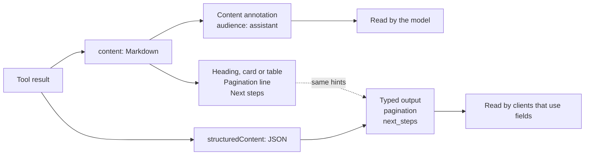

A successful tool call answers with the same result twice: as Markdown written for the model, and as JSON for a client that reads fields. This page describes both, what each one carries, how the server marks them for the client, and what a get result, a refusal and a fine-grained session add. It holds on every tool surface (dynamic, meta and individual), because all three finish a result through the same code.

## What a result carries

| Part                        | What it holds                                                                                                                                                      | Written for                                       |
| --------------------------- | ------------------------------------------------------------------------------------------------------------------------------------------------------------------ | ------------------------------------------------- |
| `content`, a text block     | The Markdown rendering: a heading, a card or a table, the pagination line of a list, and the next steps                                                            | The model (`audience: ["assistant"]`)             |
| `structuredContent`         | The action's typed output as JSON: GitLab's fields, `pagination` on a list, and `next_steps` where the output type declares it                                     | A client that reads fields                        |
| `content`, an image block   | The image of an upload or a visualization, for a client that can show it                                                                                           | The user (`audience: ["user"]`)                   |
| `content`, a resource block | The canonical `gitlab://` URI of the object a get returned, with the same JSON, on the 22 get actions that declare one ([Embedded resources](#embedded-resources)) | The model and a client that follows resource URIs |
| `isError`                   | `true` on a refusal, a not-found answer or a failed call; such a result carries its text and no `structuredContent`                                                | The model and the client                          |



## The Markdown

### Cards and tables

A result about **one** object is a card: an H2 heading, then one `- **Label**: value` row per field GitLab sent, then its long text and nested objects, and the next steps last. A field GitLab did not send writes no row, so a card never shows a label with nothing after it. A result about **several** objects is a table under a `## Title (N)` heading. One writer produces every card, and a row written by hand fails the repository's escaping gate ([the card contract](https://github.com/jmrplens/gitlab-mcp-server/blob/main/docs/development/markdown-card.md)).

The count in a list heading is what the response can vouch for:

| Heading                                  | When                                                                                                     |
| ---------------------------------------- | -------------------------------------------------------------------------------------------------------- |
| `## Branches (45)`                       | GitLab sent a total                                                                                      |
| `## Branches (20 shown, more available)` | GitLab sent no total and more pages follow (it leaves the total out of a list of more than 10,000 items) |
| `## Branches (3)`                        | Otherwise: the number of rows shown                                                                      |

When GitLab reports more than one page, a summary line follows the heading: `Showing 20 of 45 results (page 1 of 3)`, or `Showing 20 results (page 1 of 3)` when it sent a page count and no item total. An empty list is one sentence with no heading: `No branches found.`

### Clickable links

Where GitLab sent a web URL, the cell or the row links to it: the IID of a merge request in a list, a branch name to its tree, a pipeline number to the pipeline, and the `URL` row of a card to the address itself.

```markdown
| IID | Title | State | Author | Project | Source -> Target |
| --- | --- | --- | --- | --- | --- |
| [!243](https://gitlab.example.com/group/project/-/merge_requests/243) | Fix login bug | 🟢 opened | @alice | group/project | feature/fix-login -> main |
```

Both halves of a link are escaped, so a title cannot close the link or open one of its own, and an address that is not `http` or `https` is shown as code instead of being linked. A list whose table carries links opens its next steps with one more line, written for the model:

```text
When presenting these results, always include the clickable [text](url) links from the table so the user can navigate to GitLab
```

### Next steps

A result that has something to suggest ends with a guidance section: a rule, the heading, and one bullet per suggestion.

```markdown
---
💡 **Next steps:**
- Use action 'branch.get' to see one branch in full
- Use action 'branch.create' to create a new branch
- Use action 'branch.protect' to protect a branch
```

A suggestion names another action by its canonical ID, which `gitlab_execute_action` runs as it is and which the meta and individual surfaces map to the tool they register for it; `gitlab://tools/{id}` gives the call shape on the current surface ([Resources & Prompts](/gitlab-mcp-server/tools/resources-prompts/)). The same bullets are copied into `next_steps` in `structuredContent` when the action's output type declares that field; an action whose type does not declare it carries them in the Markdown alone.

The section is read back only where the server writes it, at the start or at the end of the response. A `💡 **Next steps:**` heading inside text GitLab returned, such as a README, a job log or a description, is rewritten as `&#128161; **Next steps:**`, which renders the same and can never reach `next_steps` ([Content written by other people](/gitlab-mcp-server/operations/security/#content-written-by-other-people)).

### Dates

A timestamp is shown in UTC as `15 Jan 2025 10:30 UTC`, and a date GitLab sends without a time as `15 Jan 2025`. A value that is neither is shown as GitLab sent it, escaped. `structuredContent` keeps the machine form GitLab uses (`2025-01-15T10:30:00Z`, or `2025-01-15` for a date), which a client can parse.

### Status markers

| Marker               | Where                                                                       | Meaning                                                                                                                                                                 |
| -------------------- | --------------------------------------------------------------------------- | ----------------------------------------------------------------------------------------------------------------------------------------------------------------------- |
| ✅ ❌                  | A yes or no field (`Protected`, `Default`, `Merged`)                        | Yes, no                                                                                                                                                                 |
| ⚠️                   | A condition worth a warning (`Has conflicts`, `Discussion locked`, revoked) | The condition holds                                                                                                                                                     |
| 🟢 🟣 🔴                | The state of a merge request or an issue                                    | `opened`, `merged`, `closed`                                                                                                                                            |
| ✅ ❌ 🔵 🟡 ⛔ ⏭️ 🆕 ✋ 📅 🔄 | The status of a pipeline or a job                                           | `success`, `failed`, `running`, `pending`, `canceled` or `canceling`, `skipped`, `created`, `manual`, `scheduled`, `preparing` or one of the two `waiting_for_*` states |
| 🔴 🟠 🟡 🔵 ℹ️           | The severity of a vulnerability or a finding, beside the level in capitals  | `CRITICAL`, `HIGH`, `MEDIUM`, `LOW`, `INFO`                                                                                                                             |
| 📝 🔒                  | The title or heading of a merge request or an issue                         | Draft, confidential                                                                                                                                                     |
| ❓                    | In place of any state above                                                 | A state the server does not know                                                                                                                                        |

### The pagination line

A list closes its table with one line saying what GitLab told the server about the pages, and only what it told:

```text
Page 1 of 3 | 45 items total | 20 per page
Page 1 | 20 per page | more pages available
Page 1 | 20 per page | no more pages
Showing 20 items | next page cursor: `eyJpZCI6IjQyIn0`
Showing 20 items | no more pages
```

- The first line is offset pagination with a total.
- The second and third have no total, which is what GitLab sends for a list of more than 10,000 items, and say whether another page follows.
- The last two are a list read over GraphQL, which pages by cursor; a list that also pages backward adds `prev page cursor: ...`.

A pagination that says nothing (no page, no total, no page size) writes no line at all.

## The structured JSON

`structuredContent` is the action's output type serialized as JSON: the same type on every surface, with GitLab's field names. It opens with `next_steps` when the type declares it. A list carries a `pagination` object, in one of two shapes.

A list read over REST:

| Field         | Meaning                                               |
| ------------- | ----------------------------------------------------- |
| `page`        | The page returned, counted from 1                     |
| `per_page`    | Items per page                                        |
| `total_items` | Items across all pages, `0` when GitLab sent no total |
| `total_pages` | Pages in all, `0` when GitLab sent no total           |
| `next_page`   | The page to ask for next, `0` on the last page        |
| `prev_page`   | The page before this one, `0` on the first            |
| `has_more`    | `true` when another page follows                      |

All seven fields are always present. To read on, call the same action with `page` set to `next_page`; `per_page` takes at most 100.

Search is the exception to the `0`: GitLab's search API sends no totals, so there `total_items` is the number of items on this page and `total_pages` is `next_page`, or `page` on the last one. Both are a lower bound inferred from what arrived, not a count of the whole result.

A list asked for with `pagination: "keyset"` cannot be followed past its first page today: GitLab answers it with a link to the next page that the block does not carry, so `has_more` reads `false` even when more follow ([issue 1165](https://github.com/jmrplens/gitlab-mcp-server/issues/1165)). Leave `pagination` at its default to read a long list page by page.

A list read over GraphQL:

| Field               | Meaning                                                                 |
| ------------------- | ----------------------------------------------------------------------- |
| `has_next_page`     | `true` when another page follows                                        |
| `end_cursor`        | The cursor to pass as `after` for the next page                         |
| `has_previous_page` | `true` when a page comes before this one, on a list that pages backward |
| `start_cursor`      | The cursor to pass as `before`, on a list that pages backward           |

Such a list takes `first` (20 by default, at most 100) and `after`, and `last` and `before` where it pages backward.

## How clients consume a result

The server sends both parts on every successful call and leaves the choice to the client. MCP requires a client to ignore what it does not understand, so nothing is held back for one client and given to another ([Compatibility](/gitlab-mcp-server/compatibility/)). What a client gets depends on what it reads:

| A client that reads          | Gets                                                                  | Gets the next steps as                     |
| ---------------------------- | --------------------------------------------------------------------- | ------------------------------------------ |
| `content` only               | The Markdown: heading, card or table, pagination line                 | The `💡 Next steps` section                 |
| `structuredContent` only     | The typed JSON, with `pagination` on a list                           | `next_steps`, where the output type has it |
| Both, and honours `audience` | Both, with the Markdown kept for the model and out of the user's view | Both                                       |
| Both, and ignores `audience` | Both, with the Markdown shown as raw text beside the formatted data   | Both                                       |

The next steps are written into both parts so that a client reading either one gets them. Two client behaviours are known and handled:

- When a result carries `structuredContent`, Codex hands its model only that JSON and drops the Markdown ([openai/codex#10334](https://github.com/openai/codex/issues/10334)), which is one more reason the next steps are in the JSON too ([OpenAI Codex](/gitlab-mcp-server/install/clients/#openai-codex)).
- The Codex builds bundled with ChatGPT.app refuse a fractional `priority`, so for a session that identifies itself as Codex the server rounds every priority to `0` or `1`; `GITLAB_MCP_CLIENT_COMPAT=off` turns that off.

## Content annotations

Every text block the server annotates carries two [MCP annotations](https://modelcontextprotocol.io/specification/2025-11-25/server/utilities/annotations): `audience`, who the block is for, and `priority`, from 0 to 1, how much it matters beside the rest of the result.

| Annotation              | Audience    | Priority | Carried by                                                                                                                                         |
| ----------------------- | ----------- | -------- | -------------------------------------------------------------------------------------------------------------------------------------------------- |
| `ContentList`           | `assistant` | 0.4      | The text of an action that declares the `list` content kind                                                                                        |
| `ContentDetail`         | `assistant` | 0.6      | The text of an action that declares `detail`, and every not-found answer                                                                           |
| `ContentMutate`         | `assistant` | 0.8      | The text of an action that declares `mutate`, and the refusals the server writes itself, such as a withheld action or a missing required parameter |
| `ContentAssistant`      | `assistant` | 0.7      | The text of every other action: one that declares `assistant` or `image`, or no kind at all                                                        |
| `ContentUser`           | `user`      | 0.8      | The image block of an upload or a visualization                                                                                                    |
| `ResourceMachineDetail` | `assistant` | 0.6      | The resource block a get embeds                                                                                                                    |

The annotation of a successful result's text is decided by the action, not by its formatter: an action's catalog entry may declare a content kind (`list`, `detail`, `mutate`, `assistant` or `image`), and every dispatcher annotates the text with the preset for that kind. Few actions declare one today, and an action that declares none carries `ContentAssistant`. An error result keeps the annotation it was written with.

### What `audience: ["assistant"]` means

The Markdown is for the model to reason over, not for display. A client that shows tool results and honours the annotation keeps it out of the user's view, so the same data is not shown twice, once as Markdown and once from `structuredContent`, while the model still reads it. Every text block is for the assistant; only the image block of an upload or a visualization is marked for the user.

### What priority means

`priority` says how much a block matters relative to the other blocks of the same result, higher meaning more. The presets rank the kinds of answer, a refusal or the result of an action declared `mutate` at 0.8 above a list at 0.4, and a client may use the value or ignore it.

## Tool annotations

Content annotations describe a block of one result. Tool annotations describe what calling a tool does, and every tool lists the four hints MCP defines:

| Hint              | Value             | Meaning                                                                                                                         |
| ----------------- | ----------------- | ------------------------------------------------------------------------------------------------------------------------------- |
| `readOnlyHint`    | `true` or `false` | The tool only reads; it changes nothing on GitLab                                                                               |
| `destructiveHint` | `true` or `false` | The tool may do something its opposite cannot undo: a delete, or a push mirror that gives another host a copy of the repository |
| `idempotentHint`  | `true` or `false` | Calling it again with the same arguments has no further effect                                                                  |
| `openWorldHint`   | `true` or `false` | The tool reaches a system outside the server, here GitLab                                                                       |

How each surface sets them:

- **Individual**: one tool per action, with the hints of that action's own classification in the catalog.
- **Meta**: one tool per domain, with the most cautious combination of its actions: `destructiveHint: true` when any action of the tool is destructive, and `readOnlyHint: true` only when every action only reads.
- **Dynamic**: `gitlab_find_action` is read-only. `gitlab_execute_action` is destructive unless every action the session can reach only reads, as in read-only mode, where it is read-only too.

The server acts on the same classification itself, whatever a client does with the hints: read-only mode removes what does not only read, safe mode answers it with a preview, and a destructive action asks for confirmation on the server ([Destructive actions](/gitlab-mcp-server/operations/security/#destructive-actions)). A client or a gateway may ask before a destructive tool and allow a read-only one without asking, which is why an action can never be declared read-only or idempotent on one surface when the catalog says it is not.

## Response examples

### A list

`branch.list` on the first page of a project with 45 branches, three per page. The Markdown, for the model:

```markdown
## Branches (45)

Showing 3 of 45 results (page 1 of 15)

| Name | Protected | Default | Merged |
| --- | --- | --- | --- |
| [main](https://gitlab.example.com/group/project/-/tree/main) | ✅ | ✅ | ❌ |
| [develop](https://gitlab.example.com/group/project/-/tree/develop) | ✅ | ❌ | ❌ |
| [feature/login](https://gitlab.example.com/group/project/-/tree/feature/login) | ❌ | ❌ | ❌ |

Page 1 of 15 | 45 items total | 3 per page

---
💡 **Next steps:**
- When presenting these results, always include the clickable [text](url) links from the table so the user can navigate to GitLab
- Use action 'branch.get' to see one branch in full
- Use action 'branch.create' to create a new branch
- Use action 'branch.protect' to protect a branch
```

The `structuredContent` of the same call, with each branch's head `commit` left out here for brevity:

```json
{
  "next_steps": [
    "When presenting these results, always include the clickable [text](url) links from the table so the user can navigate to GitLab",
    "Use action 'branch.get' to see one branch in full",
    "Use action 'branch.create' to create a new branch",
    "Use action 'branch.protect' to protect a branch"
  ],
  "branches": [
    { "name": "main", "merged": false, "protected": true, "default": true, "web_url": "https://gitlab.example.com/group/project/-/tree/main", "can_push": true, "developers_can_push": false, "developers_can_merge": true },
    { "name": "develop", "merged": false, "protected": true, "default": false, "web_url": "https://gitlab.example.com/group/project/-/tree/develop", "can_push": true, "developers_can_push": true, "developers_can_merge": true },
    { "name": "feature/login", "merged": false, "protected": false, "default": false, "web_url": "https://gitlab.example.com/group/project/-/tree/feature/login", "can_push": true, "developers_can_push": false, "developers_can_merge": false }
  ],
  "pagination": { "page": 1, "per_page": 3, "total_items": 45, "total_pages": 15, "next_page": 2, "prev_page": 0, "has_more": true }
}
```

### One object

`merge_request.get` for an open merge request:

```markdown
## 🟢 MR !243: Fix login bug

- **Project**: group/project
- **State**: 🟢 opened
- **Source**: feature/fix-login
- **Target**: main
- **Merge Status**: mergeable
- **Author**: @alice
- **Reviewers**: @bob
- **Labels**: bug
- **Pipeline**: [#1207](https://gitlab.example.com/group/project/-/pipelines/1207) ✅ success
- **Changes**: 3 files
- **Created**: 15 Mar 2025 10:30 UTC
- **Comments**: 2
- **URL**: [https://gitlab.example.com/group/project/-/merge_requests/243](https://gitlab.example.com/group/project/-/merge_requests/243)

---
💡 **Next steps:**
- Use action 'mr_review.changes_get' to see the diff of this merge request
- Use action 'mr_review.discussion_list' to see its review threads
- Use action 'merge_request.pipelines' to check its CI status
- Use action 'merge_request.approve' to approve it
- Use action 'merge_request.merge' to merge it
```

A merge request carrying a description adds it after the `URL` row, and a merged or closed one says who ended it and when. The result also embeds `gitlab://project/group%2Fproject/mr/243` when the call named the project as `group/project` ([Embedded resources](#embedded-resources)).

### A write

A write answers with the object as it now stands. `issue.create` answers with the same card `issue.get` shows:

```markdown
## 🟢 Issue #42: Fix the login page

- **Reference**: group/project#42
- **State**: 🟢 opened
- **Author**: @alice
- **Created**: 21 Mar 2025 09:00 UTC
- **URL**: [https://gitlab.example.com/group/project/-/issues/42](https://gitlab.example.com/group/project/-/issues/42)

---
💡 **Next steps:**
- Use action 'issue.note_list' to see comments on this issue
- Use action 'issue.update' to change title, labels, assignees, or milestone
- Use action 'issue.mrs_related' to find linked MRs
```

An action that leaves nothing to show answers with one line. `branch.delete` answers `✅ Action completed successfully.`, and its `structuredContent` is `{"status": "success", "message": "Action completed successfully."}`.

### Not found

A get whose object does not exist, or that the token cannot see, is answered with a card rather than an opaque error:

```markdown
## ❓ Branch Not Found

The branch **"nonexistent" in project 42** does not exist or is not accessible with your current permissions.

---
💡 **Next steps:**
- Use action 'branch.list' to list the project's branches
- Verify the branch name is spelled correctly (case-sensitive)
```

The result has `isError: true`, carries no `structuredContent` and is annotated `ContentDetail`; its next steps let the model correct itself. The server logs it at `INFO` rather than `ERROR`. The get actions of 22 domains answer a 404 this way, each with hints of its own. Every other failure is described in [Error Handling](/gitlab-mcp-server/operations/error-handling/).

## Fine-grained token responses

A session on a fine-grained personal access token can get two answers a classic token never does ([Fine-grained Tokens](/gitlab-mcp-server/operations/fine-grained-tokens/#reading-a-withheld-answer)).

**A withheld call** is answered with `isError: true` and one sentence, before anything is sent to GitLab and before a confirmation or a safe-mode preview is offered. The sentence names the action by its canonical ID, and what follows the ID is one of two stable texts a client can match:

| Text after `action "<id>"`                                                         | Means                                                                         |
| ---------------------------------------------------------------------------------- | ----------------------------------------------------------------------------- |
| `exists but this fine-grained personal access token was not granted what it needs` | The grant lacks a permission, named in the words the token creation page uses |
| `exists but is not available to a fine-grained personal access token`              | No fine-grained token reaches the action at the GitLab release named          |

Both end with `Do not report the capability as missing.` On the dynamic surface the sentence is prefixed with `gitlab_execute_action:` and a space. The server logs the refusal with the reason class `fine_grained`.

**A note beside an answer it served**, where GitLab's GraphQL answer can be empty for the credential with no error. The note is added to the answer's next steps, and so to `next_steps` on a served answer:

| On                                                     | The note                                                                                                                                                                                                                                                      |
| ------------------------------------------------------ | ------------------------------------------------------------------------------------------------------------------------------------------------------------------------------------------------------------------------------------------------------------- |
| An answer GitLab leaves partly empty for the token     | `GitLab 19.4.1 leaves part of this answer empty for a fine-grained personal access token, with no error: ...`, naming each part, and ending `Empty there does not mean there is nothing.`                                                                     |
| A not-found answer of an action that reads GraphQL     | `Over GraphQL, GitLab answers null with no error for an object a fine-grained personal access token is not granted, or that sits in a project or group outside its grant, so not found may mean this token cannot see it rather than that it does not exist.` |
| An empty list from an action that reads a GraphQL list | `Over GraphQL, GitLab leaves out of a list, with no error, the items a fine-grained personal access token is not granted, so an empty answer may mean this token cannot see them rather than that there are none.`                                            |

A not-found answer carries no `next_steps`, so its note is in the Markdown's next steps, or after the error message when the action reports the not-found as an error. A safe-mode preview carries none of the notes, since nothing was sent to GitLab.

## Embedded resources

A get result can add a content block of type `resource` carrying the canonical MCP resource URI of the object it returned. A client that renders only `content` and ignores `structuredContent` still gets a stable identifier, which the model or the user can pass to `resources/read` or to a later call.

The block's `mimeType` is `application/json` and its `text` is the same JSON as `structuredContent`, next steps included, so a simpler client loses nothing. It is added after a successful call only: an error or a not-found answer embeds nothing, and neither does a call that left out one of the URI's parameters. The block is annotated `ResourceMachineDetail` (`assistant`, 0.6).

Each action declares the resource it returns as a URI template written with its own parameter names, and the catalog refuses a template naming a parameter the action does not accept. All three surfaces expand the template from the call's parameters, so a get embeds the same block whether it was reached as an individual tool, through a meta-tool `action` or through `gitlab_execute_action`. These are the 22 actions that declare one:

| Action                           | Canonical URI                                                |
| -------------------------------- | ------------------------------------------------------------ |
| `project.get`                    | `gitlab://project/{project_id}`                              |
| `project.board_get`              | `gitlab://project/{project_id}/board/{board_id}`             |
| `project.label_get`              | `gitlab://project/{project_id}/label/{label_id}`             |
| `project.milestone_get`          | `gitlab://project/{project_id}/milestone/{milestone_iid}`    |
| `group.get`                      | `gitlab://group/{group_id}`                                  |
| `group.group_label_get`          | `gitlab://group/{group_id}/label/{label_id}`                 |
| `group.group_milestone_get`      | `gitlab://group/{group_id}/milestone/{milestone_iid}`        |
| `issue.get`                      | `gitlab://project/{project_id}/issue/{issue_iid}`            |
| `merge_request.get`              | `gitlab://project/{project_id}/mr/{merge_request_iid}`       |
| `pipeline.get`                   | `gitlab://project/{project_id}/pipeline/{pipeline_id}`       |
| `job.get`                        | `gitlab://project/{project_id}/job/{job_id}`                 |
| `branch.get`                     | `gitlab://project/{project_id}/branch/{branch_name}`         |
| `tag.get`                        | `gitlab://project/{project_id}/tag/{tag_name}`               |
| `release.get`                    | `gitlab://project/{project_id}/release/{tag_name}`           |
| `repository.commit_get`          | `gitlab://project/{project_id}/commit/{sha}`                 |
| `environment.get`                | `gitlab://project/{project_id}/environment/{environment_id}` |
| `environment.deployment_get`     | `gitlab://project/{project_id}/deployment/{deployment_id}`   |
| `feature_flags.feature_flag_get` | `gitlab://project/{project_id}/feature_flag/{name}`          |
| `access.deploy_key_get`          | `gitlab://project/{project_id}/deploy_key/{deploy_key_id}`   |
| `wiki.get`                       | `gitlab://project/{project_id}/wiki/{slug}`                  |
| `snippet.get`                    | `gitlab://snippet/{snippet_id}`                              |
| `snippet.project_get`            | `gitlab://project/{project_id}/snippet/{snippet_id}`         |

A value is escaped the way an RFC 6570 simple expansion escapes it, every character outside `A-Z a-z 0-9 - . _ ~` percent-encoded: `project_id: "group/project"` lands as `gitlab://project/group%2Fproject`, and a scoped label `priority::high` as `priority%3A%3Ahigh`, which is the form the resource templates accept. The URI is built from the parameters as the handler read them: a project sent URL-encoded (`group%2Fproject`) embeds the same URI as one sent plainly, on every surface. A project sent through the `project_path` alias does so where the surface accepts the alias, which is the dynamic surface and the meta surface under the `opaque` or `compact` parameter schema; an individual tool, and a meta-tool under `full`, refuse the alias before the call runs.

Embedding is on by default. A client that does not tolerate the extra block can have it turned off with `GITLAB_MCP_EMBEDDED_RESOURCES=false`, or `--embedded-resources=false` in HTTP mode ([Configuration](/gitlab-mcp-server/configuration/)).

## Output schemas

Every action publishes the JSON Schema of its output, and where to read it depends on the surface:

| Surface    | Where the action's output schema is                                                                                                                                                                                                                                   |
| ---------- | --------------------------------------------------------------------------------------------------------------------------------------------------------------------------------------------------------------------------------------------------------------------- |
| Individual | The `outputSchema` of the action's tool in `tools/list`                                                                                                                                                                                                               |
| Meta       | The tool's `outputSchema` is a shared envelope (`next_steps`, `pagination` and any other field). Each action's own schema is published in [llms-full-meta-tools.txt](https://jmrp.io/docs/gitlab-mcp-server/llms-full-meta-tools.txt) under **Action Output Schemas** |
| Dynamic    | `gitlab_execute_action` declares the same envelope, and `gitlab_find_action` returns each matched action's schema as `output_schema`, beside its `input_schema` ([Dynamic toolset](/gitlab-mcp-server/tools/dynamic-tools/))                                          |

The envelope's `pagination` object declares the seven fields of a list read over REST, named as in [The structured JSON](#the-structured-json), and its description names the cursor fields a list read over GraphQL carries in their place. It requires none of them and accepts others, since both shapes travel under the same key.

The schemas follow the instance tier. On a lower tier a field that only a higher tier fills is left out of the output schema, while the output itself is not filtered, so a field GitLab sends anyway still arrives.

How an action gets its schema, from the typed route constructors to the audit that reports a route without one, is contributor material: see [Output schemas per action](https://github.com/jmrplens/gitlab-mcp-server/blob/main/docs/development/architecture.md#output-schemas-per-action) in the repository's internal architecture page.

## Further reading

- [Error Handling](/gitlab-mcp-server/operations/error-handling/): what a failed call answers
- [Fine-grained Tokens](/gitlab-mcp-server/operations/fine-grained-tokens/): withheld actions and the notes beside a served answer
- [Resources & Prompts](/gitlab-mcp-server/tools/resources-prompts/): the `gitlab://` resources an embedded URI points to
- [Troubleshooting](/gitlab-mcp-server/operations/troubleshooting/#output-format): links, raw Markdown and missing next steps
- [MCP specification: annotations](https://modelcontextprotocol.io/specification/2025-11-25/server/utilities/annotations)
