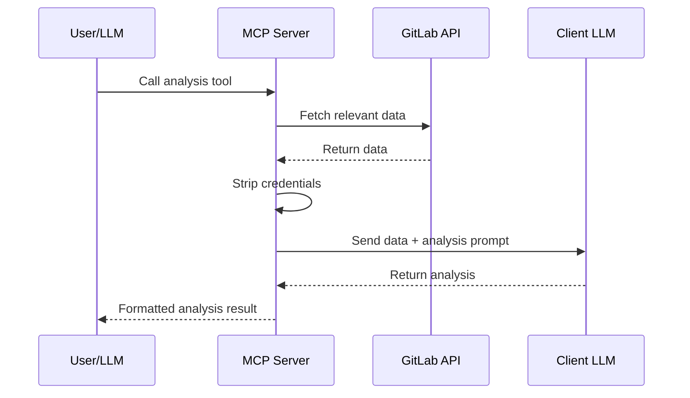

GitLab MCP Server includes **11 sampling-based analysis tools** that leverage the AI client's own LLM to perform deep analysis of GitLab data. Unlike regular tools that return raw API data, analysis tools collect relevant context from GitLab and send it to the client's language model for intelligent interpretation.

## How Sampling Works

MCP sampling is a protocol capability where the **server requests the client's LLM to process data**. The workflow is:



1. The user (or LLM) invokes an analysis tool
2. The server fetches all relevant data from GitLab's API
3. Sensitive credentials are stripped from the data
4. The data is packaged with an analysis prompt and sent to the client's LLM via MCP sampling
5. The client's LLM generates the analysis
6. The server formats and returns the result

:::caution
Analysis tools require the MCP client to support the **sampling capability**. Not all MCP clients implement this. Check your client's documentation for sampling support.
:::

## Available Analysis Tools

### Merge Request Analysis

| Tool                         | Description                                                                                                                                                     |
| ---------------------------- | --------------------------------------------------------------------------------------------------------------------------------------------------------------- |
| `gitlab_analyze_mr_changes`  | Analyzes merge request diffs for code quality, potential bugs, security issues, and architectural concerns. Provides a structured review with severity ratings. |
| `gitlab_summarize_mr_review` | Summarizes all review comments, threads, and discussions on a merge request. Identifies consensus, unresolved items, and key decisions.                         |
| `gitlab_review_mr_security`  | Focused security review of MR changes. Checks for common vulnerabilities, exposed secrets, injection risks, and OWASP Top 10 issues.                            |

### Issue Analysis

| Tool                         | Description                                                                                                                                                  |
| ---------------------------- | ------------------------------------------------------------------------------------------------------------------------------------------------------------ |
| `gitlab_summarize_issue`     | Generates a concise summary of an issue including its full context, labels, assignees, related merge requests, and discussion highlights.                    |
| `gitlab_analyze_issue_scope` | Estimates the complexity and scope of an issue. Considers sub-tasks, related issues, labels, and discussion to provide effort estimates and risk assessment. |

### CI/CD Analysis

| Tool                              | Description                                                                                                             |
| --------------------------------- | ----------------------------------------------------------------------------------------------------------------------- |
| `gitlab_analyze_pipeline_failure` | Performs root cause analysis on failed pipelines. Examines job logs, failure patterns, and suggests fixes.              |
| `gitlab_analyze_ci_configuration` | Reviews `.gitlab-ci.yml` for best practices, optimization opportunities, security concerns, and potential improvements. |

### Project & Release Analysis

| Tool                               | Description                                                                                                                           |
| ---------------------------------- | ------------------------------------------------------------------------------------------------------------------------------------- |
| `gitlab_generate_release_notes`    | Generates comprehensive release notes from issues and merge requests associated with a milestone or tag. Categorizes changes by type. |
| `gitlab_generate_milestone_report` | Creates a progress report for a milestone including completion percentage, burndown analysis, and risk assessment for overdue items.  |
| `gitlab_find_technical_debt`       | Scans project issues, MRs, and code patterns to identify and categorize technical debt. Suggests prioritization strategies.           |

### Deployment Analysis

| Tool                                | Description                                                                                                                              |
| ----------------------------------- | ---------------------------------------------------------------------------------------------------------------------------------------- |
| `gitlab_analyze_deployment_history` | Analyzes deployment patterns, frequency, failure rates, and rollback incidents. Provides DORA-style metrics and improvement suggestions. |

## Example: Pipeline Failure Analysis

```json
{
	"tool": "gitlab_analyze_pipeline_failure",
	"arguments": {
		"project": "my-group/backend-api",
		"pipeline_id": 12345
	}
}
```

The tool will:

1. Fetch the pipeline details and all job statuses
2. Download logs from failed jobs
3. Collect the `.gitlab-ci.yml` configuration
4. Strip any credentials from the collected data
5. Send everything to the client's LLM with an analysis prompt
6. Return a structured analysis including:
   - **Root cause** identification
   - **Affected jobs** and their failure modes
   - **Suggested fixes** with specific actions
   - **Prevention** recommendations

## Example: MR Security Review

```json
{
	"tool": "gitlab_review_mr_security",
	"arguments": {
		"project": "my-group/backend-api",
		"mr_iid": 87
	}
}
```

Returns a security-focused analysis covering:

- Hardcoded secrets or tokens in diffs
- SQL injection or XSS vulnerabilities
- Authentication/authorization issues
- Dependency security concerns
- OWASP Top 10 compliance

## Security: Credential Stripping

Before any data is sent to the client's LLM for sampling, the server applies **automatic credential stripping**. This removes sensitive patterns from the data including:

- GitLab personal access tokens (`glpat-*`)
- GitLab pipeline tokens (`glptt-*`)
- AWS access keys and secret keys
- Slack tokens and webhook URLs
- JWT tokens
- Generic API key patterns
- Private SSH keys

:::tip
Credential stripping is a defense-in-depth measure. Always follow the principle of least privilege when configuring your GitLab token — use tokens with only the scopes necessary for your workflow.
:::

## Requirements

| Requirement  | Details                                              |
| ------------ | ---------------------------------------------------- |
| MCP Client   | Must support the `sampling` capability               |
| GitLab Token | Read access to the resources being analyzed          |
| Network      | Server must reach both GitLab API and the MCP client |

Analysis tools are registered in both individual and meta-tool modes. In meta-tool mode, they appear as standalone tools (not grouped under a domain meta-tool) because each analysis tool has a unique, specialized prompt.
