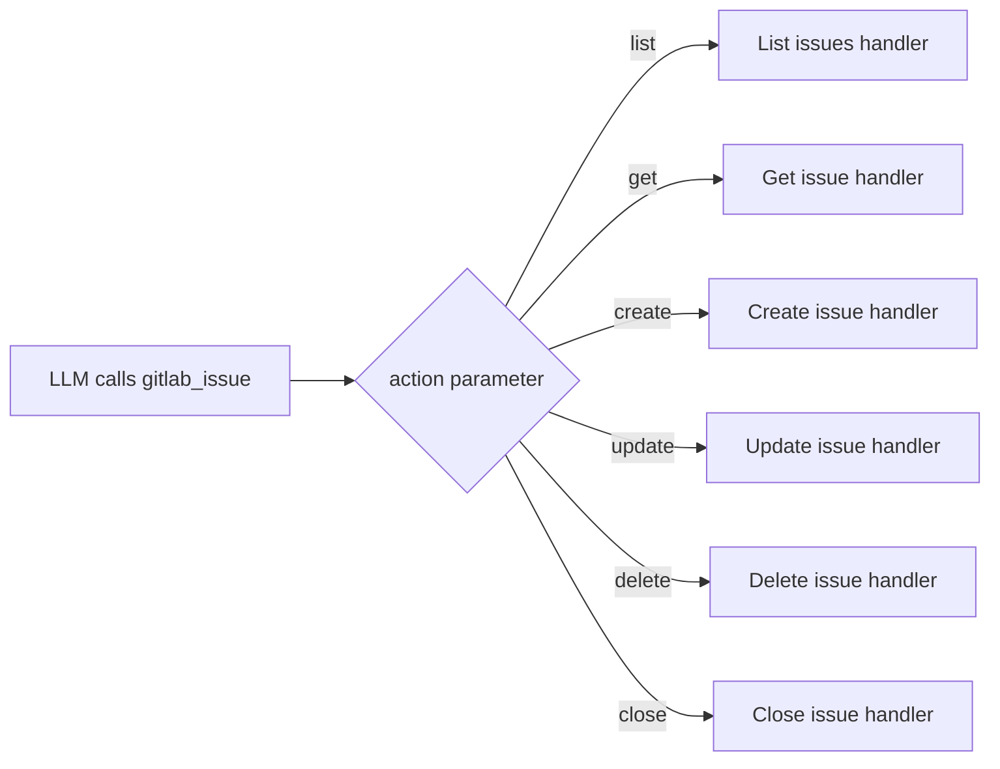

:::note[Developer Documentation]
For the complete technical reference, see [`docs/meta-tools.md`](https://github.com/jmrplens/gitlab-mcp-server/blob/main/docs/meta-tools.md) in the repository.
:::

Meta-tools are the default operating mode of GitLab MCP Server. Instead of exposing each GitLab API operation as a separate MCP tool, meta-tools **group related operations under a single tool** with an `action` parameter that dispatches to the correct handler.

## Why meta-tools?

LLMs have limited context windows. When an MCP server registers 1004 individual tools, the tool descriptions alone consume a large portion of the available tokens, leaving less room for the actual conversation.

| Mode              | Tool Count | Token Overhead | Functionality           |
| ----------------- | ---------- | -------------- | ----------------------- |
| Individual        | 1004       | Very high      | Full                    |
| Meta (base)       | 40         | Low            | Full                    |
| Meta (enterprise) | 59         | Low            | Full + Premium/Ultimate |

Meta-tools reduce the tool count by **96%** while preserving 100% of the functionality. Every individual tool operation is available as an action within one of the domain meta-tools.

## How meta-tools work

Each meta-tool defines an `action` enum that lists all available operations. The server validates the action and dispatches to the corresponding handler function internally.



The action parameter is always required and must be one of the enumerated values. Additional parameters depend on the chosen action.

## Example usage

### Creating an issue

```json
{
	"tool": "gitlab_issue",
	"arguments": {
		"action": "create",
		"project": "my-group/my-project",
		"title": "Update API documentation",
		"description": "The REST API docs are missing the new v2 endpoints",
		"labels": "documentation,api",
		"assignee_ids": "42",
		"milestone_id": 7
	}
}
```

### Listing merge requests

```json
{
	"tool": "gitlab_merge_request",
	"arguments": {
		"action": "list",
		"project": "my-group/my-project",
		"state": "opened",
		"order_by": "updated_at",
		"per_page": 20
	}
}
```

### Searching Code

```json
{
	"tool": "gitlab_search",
	"arguments": {
		"action": "code",
		"search": "func handleWebhook",
		"project": "my-group/my-project"
	}
}
```

## Key meta-tools reference

### `gitlab_project`

Manages project lifecycle and configuration.

**Actions**: `list`, `get`, `create`, `update`, `delete`, `archive`, `unarchive`, `fork`, `star`, `unstar`, `transfer`, `languages`, `users`, `forks`, `starrers`, `hooks`, `create_hook`, `update_hook`, `delete_hook`

### `gitlab_issue`

Full issue lifecycle management including labels, assignees, and state transitions.

**Actions**: `list`, `get`, `create`, `update`, `delete`, `close`, `reopen`, `subscribe`, `unsubscribe`, `move`, `clone`, `add_label`, `remove_label`, `set_assignees`, `add_time_spent`, `reset_time_spent`, `set_time_estimate`, `reset_time_estimate`

### `gitlab_merge_request`

Complete merge request workflow from creation to merge.

**Actions**: `list`, `get`, `create`, `update`, `merge`, `close`, `reopen`, `rebase`, `approve`, `unapprove`, `subscribe`, `unsubscribe`, `add_label`, `remove_label`, `set_assignees`, `set_reviewers`, `add_time_spent`, `reset_time_spent`

### `gitlab_pipeline`

Pipeline management and monitoring.

**Actions**: `list`, `get`, `create`, `cancel`, `retry`, `delete`, `variables`, `test_report`, `bridges`, `wait`

### `gitlab_job`

CI/CD job management.

**Actions**: `list`, `get`, `play`, `cancel`, `retry`, `erase`, `trace`, `artifacts`, `download_artifact`, `delete_artifacts`, `delete_project_artifacts`, `wait`

### `gitlab_branch`

Branch operations.

**Actions**: `list`, `get`, `create`, `delete`, `merged`

### `gitlab_commit`

Commit operations and history.

**Actions**: `list`, `get`, `diff`, `refs`, `cherry_pick`, `revert`, `comments`, `create_comment`, `statuses`, `merge_requests`

### `gitlab_tag`

Tag management.

**Actions**: `list`, `get`, `create`, `delete`

### `gitlab_release`

Release lifecycle management.

**Actions**: `list`, `get`, `create`, `update`, `delete`, `evidences`

### `gitlab_label`

Label management for projects and groups.

**Actions**: `list`, `get`, `create`, `update`, `delete`, `subscribe`, `unsubscribe`

### `gitlab_milestone`

Milestone tracking.

**Actions**: `list`, `get`, `create`, `update`, `delete`, `issues`, `merge_requests`

### `gitlab_member`

Project and group membership.

**Actions**: `list`, `get`, `add`, `update`, `remove`, `all`

### `gitlab_group`

Group and subgroup management.

**Actions**: `list`, `get`, `create`, `update`, `delete`, `projects`, `subgroups`, `members`, `labels`, `milestones`, `hooks`

### `gitlab_search`

Cross-resource search across your GitLab instance.

**Actions**: `code`, `issues`, `merge_requests`, `projects`, `users`, `commits`, `blobs`, `notes`, `milestones`, `wiki_blobs`

### `gitlab_user`

User information and lookup.

**Actions**: `get`, `current`, `list`, `status`, `activities`

### `gitlab_wiki`

Wiki page management.

**Actions**: `list`, `get`, `create`, `update`, `delete`

### `gitlab_todo`

Personal todo/task list.

**Actions**: `list`, `mark_done`, `mark_all_done`

## Enterprise mode

Setting `GITLAB_ENTERPRISE=true` enables 15 additional meta-tools that expose GitLab Premium and Ultimate features. Additionally, 6 enterprise-only action routes are added to existing base meta-tools:

- **Iterations** → routed through `gitlab_issue`
- **Project mirrors** → routed through `gitlab_project`
- **SSH certificates** → routed through `gitlab_group`
- **Security settings** → split between `gitlab_project` and `gitlab_group`
- **Group credentials** → routed through `gitlab_group`
- **Group analytics** → routed through `gitlab_group`

:::tip
You can check which tools your server has registered by looking at the startup log output or by calling the `tools/list` MCP method.
:::

## Configuration

| Variable            | Default | Description                                                    |
| ------------------- | ------- | -------------------------------------------------------------- |
| `META_TOOLS`        | `true`  | Enable meta-tool mode. Set to `false` for individual tools.    |
| `GITLAB_ENTERPRISE` | `false` | Enable enterprise-only meta-tools (requires Premium/Ultimate). |
