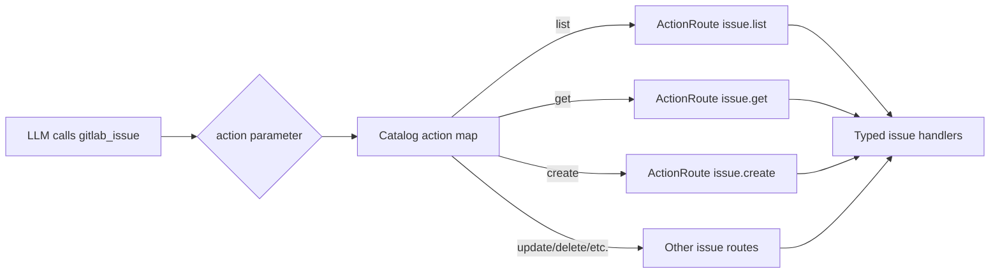

import stats from "../../../data/stats.json";

:::note[Developer Documentation]
For the complete technical reference, see [`docs/meta-tools.md`](https://github.com/jmrplens/gitlab-mcp-server/blob/main/docs/concepts/meta-tools.md) in the repository.
:::

Meta-tools are an explicit operating mode of GitLab MCP Server, enabled with `TOOL_SURFACE=meta`. Instead of exposing each GitLab API operation as a separate MCP tool, meta-tools **group related operations under a single tool** with an `action` parameter that dispatches to the correct handler. The result is a small, browsable tool list — a handful of domain-level tools such as `gitlab_issue`, `gitlab_project`, and `gitlab_pipeline` — that still reaches every GitLab operation.

## Why use meta-tools?

Meta-tools exist to fit a complete GitLab API surface into a limited LLM context window. When an MCP server registers hundreds of individual tools (up to {stats.tools.gitlab_com} on GitLab.com Enterprise/Premium with Orbit), the tool descriptions alone consume a large portion of the available tokens, leaving less room for the actual conversation. Meta-tool mode collapses those operations into domain-level tools, so the tool list stays small while functionality stays complete.

| Mode              | Tool Count                                                                          | Token Overhead | Functionality           |
| ----------------- | ----------------------------------------------------------------------------------- | -------------- | ----------------------- |
| Individual        | {stats.tools.free} / {stats.tools.ultimate_self_managed} / {stats.tools.gitlab_com} | Very high      | Full                    |
| Meta (base)       | {stats.meta.base}                                                                   | Low            | Full                    |
| Meta (enterprise) | {stats.meta.self_managed_enterprise} / {stats.meta.gitlab_com}                      | Low            | Full + Premium/Ultimate |

Meta-tools reduce the tool count by **more than 95%** while preserving 100% of the functionality. Every individual tool operation is available as an action within one of the domain meta-tools.

The `gitlab_server` update helper can appear separately for server maintenance actions and is not included in the {stats.meta.base}/{stats.meta.self_managed_enterprise}/{stats.meta.gitlab_com} GitLab action catalog counts.

:::note[Client compatibility]
Some AI clients impose tool count limits (e.g., JetBrains AI Assistant limits MCP servers to 100 tools). Meta-tool mode ({stats.meta.base} base tools, {stats.meta.self_managed_enterprise} self-managed enterprise tools, or {stats.meta.gitlab_com} GitLab.com Enterprise tools with Orbit) works within these constraints. If you select individual tools with `TOOL_SURFACE=individual`, clients with such limits will only see a subset of the complete individual tool set.
:::

## How do meta-tools work?

Each meta-tool defines an `action` enum that lists every operation it supports, then validates the chosen action and dispatches to the corresponding handler function internally. The `action` parameter is always required and must be one of the enumerated values; additional parameters depend on the chosen action. This is why one tool such as `gitlab_issue` can cover an entire domain without exposing a separate tool per operation.


```mermaid
flowchart LR
	A[LLM calls gitlab_issue] --> B{action parameter}
	B --> C[Catalog action map]
	C -->|list| D[ActionRoute issue.list]
	C -->|get| E[ActionRoute issue.get]
	C -->|create| F[ActionRoute issue.create]
	C -->|update/delete/etc.| G[Other issue routes]
	D --> H[Typed issue handlers]
	E --> H
	F --> H
	G --> H
```

The action parameter is always required and must be one of the enumerated values. Additional parameters depend on the chosen action.

## How do I discover action parameters?

Meta-tools use a common envelope, and the exact `params` shape for any action is discoverable through the tool manifest resources rather than inlined into every tool schema. By default, `META_PARAM_SCHEMA=opaque` keeps the tool schema small: clients see the valid `action` enum, while `params` remains an action-specific object.

```json
{
	"action": "create",
	"params": {
		"project_id": "42"
	}
}
```

To discover the exact shape for a specific action, read the tool manifest resources:

| Resource              | Use                                                                                          |
| --------------------- | -------------------------------------------------------------------------------------------- |
| `gitlab://tools`      | Lists visible tools and executable entries for the active surface                            |
| `gitlab://tools/{id}` | Returns the accepted call shape and JSON Schema for one action, such as `gitlab_project.get` |

Example resource reads:

```json
{
	"method": "resources/read",
	"params": {
		"uri": "gitlab://tools"
	}
}
```

```json
{
	"method": "resources/read",
	"params": {
		"uri": "gitlab://tools/gitlab_merge_request.create"
	}
}
```

The per-action detail response includes the `params` schema and the final call shape. These resources remain available for meta-tools when `CAPABILITY_SURFACE=minimal` is enabled, while optional GitLab data resources, prompts, and workflow guides are omitted. Dynamic deployments can still use `gitlab_find_action` for inline schemas; meta-tool deployments can keep `META_PARAM_SCHEMA=opaque` and read `gitlab://tools/{id}` instead of inlining schemas in `tools/list`. Current audit metrics show `compact` is 6.5x larger than `opaque`, and `full` is 11.9x larger.

## Example usage

### Creating an issue

```json
{
	"tool": "gitlab_issue",
	"arguments": {
		"action": "create",
		"params": {
			"project_id": "my-group/my-project",
			"title": "Update API documentation",
			"description": "The REST API docs are missing the new v2 endpoints",
			"labels": "documentation,api",
			"assignee_ids": "42",
			"milestone_id": 7
		}
	}
}
```

### Listing merge requests

```json
{
	"tool": "gitlab_merge_request",
	"arguments": {
		"action": "list",
		"params": {
			"project_id": "my-group/my-project",
			"state": "opened",
			"order_by": "updated_at",
			"per_page": 20
		}
	}
}
```

### Searching Code

```json
{
	"tool": "gitlab_search",
	"arguments": {
		"action": "code",
		"params": {
			"search": "func handleWebhook",
			"project_id": "my-group/my-project"
		}
	}
}
```

### Checking Orbit availability

```json
{
	"tool": "gitlab_orbit",
	"arguments": {
		"action": "status",
		"params": {
			"response_format": "llm"
		}
	}
}
```

`gitlab_orbit` is registered only for GitLab.com Enterprise/Premium connections and exposes six read-only Knowledge Graph actions: `status`, `schema`, `tools`, `dsl`, `query`, and `graph_status`.

## Key meta-tools reference

### `gitlab_project`

Manages project lifecycle and configuration.

**Actions**: `list`, `get`, `create`, `update`, `delete`, `archive`, `unarchive`, `fork`, `star`, `unstar`, `transfer`, `languages`, `users`, `forks`, `starrers`, `hooks`, `create_hook`, `update_hook`, `delete_hook`

### `gitlab_issue`

Full issue lifecycle management including labels, assignees, and state transitions.

**Actions**: `list`, `get`, `create`, `update`, `delete`, `close`, `reopen`, `subscribe`, `unsubscribe`, `move`, `clone`, `add_label`, `remove_label`, `set_assignees`, `add_time_spent`, `reset_time_spent`, `set_time_estimate`, `reset_time_estimate`

### `gitlab_merge_request`

Complete merge request workflow from creation to merge.

**Actions**: `list`, `get`, `create`, `update`, `merge`, `close`, `reopen`, `rebase`, `approve`, `unapprove`, `subscribe`, `unsubscribe`, `add_label`, `remove_label`, `set_assignees`, `set_reviewers`, `add_time_spent`, `reset_time_spent`

### `gitlab_pipeline`

Pipeline management and monitoring.

**Actions**: `list`, `get`, `create`, `cancel`, `retry`, `delete`, `variables`, `test_report`, `bridges`, `wait`

### `gitlab_job`

CI/CD job management.

**Actions**: `list`, `get`, `play`, `cancel`, `retry`, `erase`, `trace`, `artifacts`, `download_artifact`, `delete_artifacts`, `delete_project_artifacts`, `wait`

### `gitlab_branch`

Branch operations.

**Actions**: `list`, `get`, `create`, `delete`, `merged`

### `gitlab_commit`

Commit operations and history.

**Actions**: `list`, `get`, `diff`, `refs`, `cherry_pick`, `revert`, `comments`, `create_comment`, `statuses`, `merge_requests`

### `gitlab_tag`

Tag management.

**Actions**: `list`, `get`, `create`, `delete`

### `gitlab_release`

Release lifecycle management.

**Actions**: `list`, `get`, `create`, `update`, `delete`, `evidences`

### `gitlab_label`

Label management for projects and groups.

**Actions**: `list`, `get`, `create`, `update`, `delete`, `subscribe`, `unsubscribe`

### `gitlab_milestone`

Milestone tracking.

**Actions**: `list`, `get`, `create`, `update`, `delete`, `issues`, `merge_requests`

### `gitlab_member`

Project and group membership.

**Actions**: `list`, `get`, `add`, `update`, `remove`, `all`

### `gitlab_group`

Group and subgroup management.

**Actions**: `list`, `get`, `create`, `update`, `delete`, `projects`, `subgroups`, `members`, `labels`, `milestones`, `hooks`

### `gitlab_search`

Cross-resource search across your GitLab instance.

**Actions**: `code`, `issues`, `merge_requests`, `commits`, `milestones`, `notes`, `projects`, `snippets`, `users`, `wiki`

### `gitlab_user`

User information and lookup.

**Actions**: `get`, `current`, `list`, `status`, `activities`

### `gitlab_wiki`

Wiki page management.

**Actions**: `list`, `get`, `create`, `update`, `delete`

### `gitlab_todo`

Personal todo/task list.

**Actions**: `list`, `mark_done`, `mark_all_done`

## Enterprise mode

The Enterprise/Premium catalog enables 16 additional meta-tools that expose GitLab Premium and Ultimate features. In stdio mode, set `GITLAB_TIER=premium` or `GITLAB_TIER=ultimate`; in HTTP mode, use `--tier=premium` (or `--tier=ultimate`) to force the catalog, or omit it to allow CE/EE auto-detection per token+URL entry. The legacy boolean `GITLAB_ENTERPRISE=true` (stdio) and `--enterprise` (HTTP) flags are still honored as a fallback when `GITLAB_TIER`/`--tier` is unset, but are deprecated. Tier-gating also prunes per-field schema entries via `pruneSchemaFieldsByTier` (see `internal/tools/action_catalog.go`). Additionally, enterprise-only action routes are added to existing base meta-tools:

- **Iterations** → routed through `gitlab_issue`
- **Project mirrors** → routed through `gitlab_project`
- **SSH certificates** → routed through `gitlab_group`
- **Security settings** → split between `gitlab_project` and `gitlab_group`
- **Group credentials** → routed through `gitlab_group`
- **Group analytics** → routed through `gitlab_group`

:::tip
You can check which tools your server has registered by looking at the startup log output or by calling the `tools/list` MCP method.
:::

## Configuration

| Variable             | Default         | Description                                                                                                                                                                        |
| -------------------- | --------------- | ---------------------------------------------------------------------------------------------------------------------------------------------------------------------------------- |
| `TOOL_SURFACE`       | `meta`          | Canonical selector for this mode: set `meta` to use meta-tools. Set `individual` only when you intentionally want one MCP tool per GitLab operation.                               |
| `META_TOOLS`         | legacy          | Deprecated compatibility selector: `true` maps to `meta`, and `false` maps to `individual` when `TOOL_SURFACE` is absent.                                                          |
| `CAPABILITY_SURFACE` | `full`          | Resource and prompt catalog selector: `full` or `minimal`. Minimal keeps the `gitlab://tools` manifest, and omits optional resources, guides, and prompts.                         |
| `META_PARAM_SCHEMA`  | `opaque`        | Controls how much per-action `params` schema is inlined in `tools/list`: `opaque`, `compact`, or `full`. Exact action schemas are available through `gitlab://tools/{id}`.         |
| `GITLAB_TIER`        | _(auto-detect)_ | Edition selector: `free`/`ce`, `premium`, or `ultimate`. When unset, the tier is detected from `GET /license` (fallback `free`). Replaces the deprecated `GITLAB_ENTERPRISE` flag. |
| `--tier`             | _(auto-detect)_ | HTTP-mode edition flag: `free`/`ce`, `premium`, or `ultimate`. Replaces the deprecated `--enterprise` flag.                                                                        |

## Discovery metadata

Each meta-tool action carries discovery metadata (aliases, usage, parameter guidance, related actions) that helps models choose the correct action and shape parameters. Run `go run ./cmd/audit_discovery_completeness/` to score the catalog; the auditor produces a prioritized backlog used by domain agents to fill gaps following the link-create-batch gold standard.

## Frequently asked questions

### How much do meta-tools reduce the tool count?

Meta-tools reduce the registered tool count by **more than 95%** while preserving 100% of the functionality. Individual mode can register hundreds of tools — {stats.tools.free} on CE, up to {stats.tools.gitlab_com} on GitLab.com Enterprise/Premium with Orbit — whereas meta-tool mode exposes {stats.meta.base} base domain tools (more with the Enterprise catalog). Every individual operation is still reachable as an action inside a domain meta-tool, so no capability is lost; only the token overhead of the tool list drops sharply.

### What is the action parameter?

The `action` parameter is the required field on every meta-tool. Each meta-tool defines an `action` enum listing the operations it supports, and the server validates the chosen action before dispatching to the corresponding handler. For example, `gitlab_issue` accepts `list`, `get`, `create`, `update`, `delete`, and more. The `action` is always required and must be one of the enumerated values; the remaining parameters live under `params` and depend on the action you choose.

### How do I find the exact parameters for an action?

By default `META_PARAM_SCHEMA=opaque` keeps each meta-tool schema small, so the exact `params` shape is discovered through the tool manifest resources. Read `gitlab://tools` to list visible tools and executable entries for the active surface, then read `gitlab://tools/{id}` — for example `gitlab://tools/gitlab_merge_request.create` — to get the accepted call shape and JSON Schema for one action. These manifest resources stay available even when `CAPABILITY_SURFACE=minimal`. Dynamic deployments can instead use `gitlab_find_action` for inline schemas.

### How do I enable Enterprise meta-tools?

The Enterprise/Premium catalog enables 16 additional meta-tools for GitLab Premium and Ultimate features. In stdio mode, set `GITLAB_TIER=premium` or `GITLAB_TIER=ultimate`; in HTTP mode, use `--tier=premium` (or `--tier=ultimate`) to force the catalog, or omit it to allow CE/EE auto-detection per token+URL entry. The legacy `GITLAB_ENTERPRISE=true` and `--enterprise` flags are still honored as a fallback when the tier is unset, but are deprecated. Enabling the tier also adds enterprise-only routes (such as iterations, project mirrors, and SSH certificates) to existing base meta-tools.

### Why do some clients need meta-tool mode?

Some AI clients impose tool-count limits — for example, JetBrains AI Assistant limits MCP servers to 100 tools. Meta-tool mode keeps the visible tool list well within such constraints because it consolidates hundreds of operations into {stats.meta.base} base domain tools (or {stats.meta.self_managed_enterprise}/{stats.meta.gitlab_com} with the Enterprise catalog). If you instead select individual tools with `TOOL_SURFACE=individual`, clients with such limits will only see a subset of the complete individual tool set, hiding some operations.
