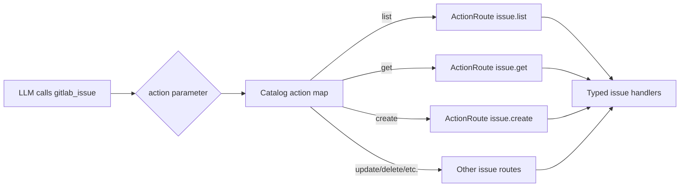

import stats from "../../../data/stats.json";
import FAQ from "../../../components/FAQ.astro";

:::tip[At a glance]

- **`GITLAB_MCP_TOOL_SURFACE=meta` groups operations into {stats.meta.base} domain tools** that route on an `action` parameter, instead of one tool per operation.
- **No capability is lost.** Every individual operation remains reachable as an action inside a domain meta-tool.
- **Schemas are opaque by default.** Read `gitlab://tools/{id}` to get the exact call shape for one action without inflating the tool list.

:::

Meta-tools are an explicit operating mode of GitLab MCP Server, enabled with `GITLAB_MCP_TOOL_SURFACE=meta`. Instead of exposing each GitLab API operation as a separate MCP tool, meta-tools **group related operations under a single tool** with an `action` parameter that dispatches to the correct handler. The result is a small, browsable tool list — a handful of domain-level tools such as `gitlab_issue`, `gitlab_project`, and `gitlab_pipeline` — that still reaches every GitLab operation.

## Why use meta-tools?

Meta-tools exist to fit a complete GitLab API surface into a limited LLM context window. When an MCP server registers hundreds of individual tools (up to {stats.tools.gitlab_com} on GitLab.com Enterprise/Premium with Orbit), the tool descriptions alone consume a large portion of the available tokens, leaving less room for the actual conversation. Meta-tool mode collapses those operations into domain-level tools, so the tool list stays small while functionality stays complete.

| Mode              | Tool Count                                                                          | Token Overhead | Functionality           |
| ----------------- | ----------------------------------------------------------------------------------- | -------------- | ----------------------- |
| Individual        | {stats.tools.free} / {stats.tools.ultimate_self_managed} / {stats.tools.gitlab_com} | Very high      | Full                    |
| Meta (base)       | {stats.meta.base}                                                                   | Low            | Full                    |
| Meta (enterprise) | {stats.meta.self_managed_enterprise} / {stats.meta.gitlab_com}                      | Low            | Full + Premium/Ultimate |

Meta-tools reduce the tool count by **more than 95%** while preserving 100% of the functionality. Every individual tool operation is available as an action within one of the domain meta-tools.

The `gitlab_server` diagnostics tool (read-only actions `status` and `health_check`) is registered separately and is not included in the {stats.meta.base}/{stats.meta.self_managed_enterprise}/{stats.meta.gitlab_com} GitLab action catalog counts.

:::note[Client compatibility]
Some AI clients impose tool count limits (e.g., JetBrains AI Assistant limits MCP servers to 100 tools). Meta-tool mode ({stats.meta.base} base tools, {stats.meta.self_managed_enterprise} self-managed enterprise tools, or {stats.meta.gitlab_com} GitLab.com Enterprise tools with Orbit) works within these constraints. If you select individual tools with `GITLAB_MCP_TOOL_SURFACE=individual`, clients with such limits will only see a subset of the complete individual tool set.
:::

## How do meta-tools work?

Each meta-tool defines an `action` enum that lists every operation it supports, then validates the chosen action and dispatches to the corresponding handler function internally. The `action` parameter is always required and must be one of the enumerated values; additional parameters depend on the chosen action. This is why one tool such as `gitlab_issue` can cover an entire domain without exposing a separate tool per operation.


```mermaid
flowchart LR
	A[LLM calls gitlab_issue] --> B{action parameter}
	B --> C[Catalog action map]
	C -->|list| D[ActionRoute issue.list]
	C -->|get| E[ActionRoute issue.get]
	C -->|create| F[ActionRoute issue.create]
	C -->|update/delete/etc.| G[Other issue routes]
	D --> H[Typed issue handlers]
	E --> H
	F --> H
	G --> H
```

The action parameter is always required and must be one of the enumerated values. Additional parameters depend on the chosen action.

## How do I discover action parameters?

Meta-tools use a common envelope, and the exact `params` shape for any action is discoverable through the tool manifest resources rather than inlined into every tool schema. By default, `GITLAB_MCP_META_PARAM_SCHEMA=opaque` keeps the tool schema small: clients see the valid `action` enum, while `params` remains an action-specific object.

```json
{
  "action": "create",
  "params": {
    "project_id": "42"
  }
}
```

To discover the exact shape for a specific action, read the tool manifest resources:

| Resource              | Use                                                                                          |
| --------------------- | -------------------------------------------------------------------------------------------- |
| `gitlab://tools`      | Lists visible tools and executable entries for the active surface                            |
| `gitlab://tools/{id}` | Returns the accepted call shape and JSON Schema for one action, such as `gitlab_project.get` |

Example resource reads:

```json
{
  "method": "resources/read",
  "params": {
    "uri": "gitlab://tools"
  }
}
```

```json
{
  "method": "resources/read",
  "params": {
    "uri": "gitlab://tools/gitlab_merge_request.create"
  }
}
```

The per-action detail response includes the `params` schema and the final call shape. These resources remain available for meta-tools when `GITLAB_MCP_CAPABILITY_SURFACE=minimal` is enabled, while optional GitLab data resources, prompts, and workflow guides are omitted. Dynamic deployments can still use `gitlab_find_action` for inline schemas; meta-tool deployments can keep `GITLAB_MCP_META_PARAM_SCHEMA=opaque` and read `gitlab://tools/{id}` instead of inlining schemas in `tools/list`. As measured today, `compact` is about 8x the size of `opaque` and `full` about 18x; re-measure with `go run ./cmd/audit_tokens --compare-schemas`.

## Example usage

### Creating an issue

```json
{
  "tool": "gitlab_issue",
  "arguments": {
    "action": "create",
    "params": {
      "project_id": "my-group/my-project",
      "title": "Update API documentation",
      "description": "The REST API docs are missing the new v2 endpoints",
      "labels": ["documentation", "api"],
      "assignee_ids": [42],
      "milestone_id": 7
    }
  }
}
```

### Listing merge requests

```json
{
  "tool": "gitlab_merge_request",
  "arguments": {
    "action": "list",
    "params": {
      "project_id": "my-group/my-project",
      "state": "opened",
      "order_by": "updated_at",
      "per_page": 20
    }
  }
}
```

### Searching Code

```json
{
  "tool": "gitlab_search",
  "arguments": {
    "action": "code",
    "params": {
      "query": "func handleWebhook",
      "project_id": "my-group/my-project"
    }
  }
}
```

### Checking Orbit availability

```json
{
  "tool": "gitlab_orbit",
  "arguments": {
    "action": "status",
    "params": {
      "response_format": "llm"
    }
  }
}
```

`gitlab_orbit` is registered only for `https://gitlab.com` connections on the Premium or Ultimate tier and exposes six read-only Knowledge Graph actions: `status`, `schema`, `tools`, `dsl`, `query`, and `graph_status`.

## Key meta-tools reference

The action lists below are a representative selection, not the full set. `gitlab://tools` lists every visible tool and executable entry for the active surface, and `gitlab://tools/{id}` returns the complete action list and JSON Schema for one of them.

### `gitlab_project`

Project lifecycle and configuration, plus the labels, milestones, members, badges, boards, integrations and uploads scoped to a project.

**Actions**: `list`, `get`, `create`, `update`, `delete`, `restore`, `archive`, `unarchive`, `fork`, `star`, `unstar`, `transfer`, `languages`, `list_users`, `list_forks`, `list_starrers`, `hook_list`, `hook_add`, `hook_edit`, `hook_delete`, `label_*`, `milestone_*`, `members`, `member_*`, `badge_*`, `board_*`, `upload`

### `gitlab_issue`

Full issue lifecycle, including notes, discussions, links and time tracking.

**Actions**: `list`, `list_all`, `list_group`, `get`, `create`, `update`, `delete`, `move`, `reorder`, `subscribe`, `unsubscribe`, `create_todo`, `participants`, `time_estimate_set`, `spent_time_add`, `note_*`, `discussion_*`, `link_*`

### `gitlab_merge_request`

Complete merge request workflow from creation to merge.

**Actions**: `list`, `list_global`, `list_group`, `get`, `create`, `update`, `merge`, `rebase`, `approve`, `unapprove`, `subscribe`, `unsubscribe`, `commits`, `pipelines`, `reviewers`, `participants`, `cancel_auto_merge`, `approval_*`, `time_estimate_set`, `spent_time_add`

### `gitlab_mr_review`

The merge request review surface: notes, threaded discussions, draft notes and diffs.

**Actions**: `note_list`, `note_get`, `note_create`, `note_update`, `note_delete`, `discussion_list`, `discussion_get`, `discussion_create`, `discussion_reply`, `discussion_resolve`, `draft_note_*`, `changes_get`, `raw_diffs`, `diff_versions_list`, `diff_version_get`

### `gitlab_pipeline`

Pipeline management and monitoring, plus schedules and trigger tokens.

**Actions**: `list`, `get`, `latest`, `create`, `cancel`, `retry`, `delete`, `variables`, `test_report`, `test_report_summary`, `update_metadata`, `wait`, `schedule_*`, `trigger_*`

### `gitlab_job`

CI/CD job management.

**Actions**: `list`, `list_project`, `get`, `play`, `cancel`, `retry`, `erase`, `trace`, `artifacts`, `download_artifacts`, `keep_artifacts`, `delete_artifacts`, `delete_project_artifacts`, `list_bridges`, `wait`

### `gitlab_branch`

Branch operations and protection rules.

**Actions**: `list`, `get`, `create`, `delete`, `delete_merged`, `protect`, `unprotect`, `list_protected`, `get_protected`, `update_protected`

### `gitlab_repository`

Repository trees, files, commits, diffs and history. Commits have no dispatcher of their own — commit operations are actions here.

**Actions**: `tree`, `compare`, `merge_base`, `contributors`, `blob`, `raw_blob`, `archive`, `changelog_generate`, `changelog_add`, `file_get`, `file_create`, `file_update`, `file_delete`, `file_blame`, `file_raw`, `commit_list`, `commit_get`, `commit_diff`, `commit_refs`, `commit_cherry_pick`, `commit_revert`, `commit_comments`, `commit_comment_create`, `commit_statuses`, `commit_merge_requests`

### `gitlab_tag`

Tag management and protection rules.

**Actions**: `list`, `get`, `create`, `delete`, `get_signature`, `protect`, `unprotect`, `list_protected`, `get_protected`

### `gitlab_release`

Release lifecycle management and release asset links.

**Actions**: `list`, `get`, `get_latest`, `create`, `update`, `delete`, `link_list`, `link_get`, `link_create`, `link_create_batch`, `link_update`, `link_delete`

### Labels, milestones and members

Labels, milestones and members have no dispatchers of their own. They are actions on the project and group dispatchers:

- Through `gitlab_project`: `label_list`, `label_get`, `label_create`, `label_update`, `label_delete`, `label_subscribe`, `label_unsubscribe`, `label_promote`, `milestone_list`, `milestone_get`, `milestone_create`, `milestone_update`, `milestone_delete`, `milestone_issues`, `milestone_merge_requests`, `members`, `member_get`, `member_add`, `member_edit`, `member_delete`
- Through `gitlab_group`: the same operations with a `group_` prefix — `group_label_*`, `group_milestone_*`, `group_member_*`

### `gitlab_group`

Group and subgroup management.

**Actions**: `list`, `get`, `create`, `update`, `delete`, `restore`, `archive`, `unarchive`, `projects`, `subgroups`, `members`, `shared_with`, `invited_groups`, `transfer`, `transfer_project`, `share_with_group`, `unshare_from_group`, `hook_*`

### `gitlab_search`

Cross-resource search across your GitLab instance.

**Actions**: `code`, `issues`, `merge_requests`, `commits`, `milestones`, `notes`, `projects`, `snippets`, `users`, `wiki`

### `gitlab_user`

User information and lookup, plus the authenticated user's to-do list, which has no dispatcher of its own.

**Actions**: `current`, `get`, `list`, `create`, `modify`, `get_status`, `set_status`, `ssh_keys`, `emails`, `contribution_events`, `block`, `unblock`, `ban`, `unban`, `activate`, `deactivate`, `todo_list`, `todo_mark_done`, `todo_mark_all_done`

### `gitlab_wiki`

Wiki page management.

**Actions**: `list`, `get`, `create`, `update`, `delete`, `upload_attachment`

## Enterprise mode

The Enterprise/Premium catalog enables {stats.meta.self_managed_enterprise - stats.meta.base} additional meta-tools that expose GitLab Premium and Ultimate features: six arrive with Premium (38 tools) and eleven more with Ultimate ({stats.meta.self_managed_enterprise}). In stdio mode, set `GITLAB_TIER=premium` or `GITLAB_TIER=ultimate`; in HTTP mode, use `--tier=premium` (or `--tier=ultimate`) to force the catalog, or omit it to allow auto-detection from the instance license per token+URL entry. The legacy boolean `GITLAB_ENTERPRISE=true` is still honored as a fallback when `GITLAB_TIER` is unset, but is deprecated. HTTP mode reads both variables from its environment as well, but only when `--tier` is not passed on the command line. Tier-gating also prunes per-field schema entries via `pruneSchemaFieldsByTier` (see `internal/tools/action_catalog.go`). Additionally, enterprise-only action routes are added to existing base meta-tools:

- **Iterations** → routed through `gitlab_issue`
- **Project mirrors** → routed through `gitlab_project`
- **SSH certificates** → routed through `gitlab_group`
- **Security settings** → split between `gitlab_project` and `gitlab_group`
- **Group credentials** → routed through `gitlab_group`
- **Group analytics** → routed through `gitlab_group`

:::tip
You can check which tools your server has registered by looking at the startup log output or by calling the `tools/list` MCP method.
:::

## Configuration

| Variable                        | Default         | Description                                                                                                                                                                        |
| ------------------------------- | --------------- | ---------------------------------------------------------------------------------------------------------------------------------------------------------------------------------- |
| `GITLAB_MCP_TOOL_SURFACE`       | `dynamic`       | Canonical selector: set `meta` to use meta-tools. Set `individual` only when you intentionally want one MCP tool per GitLab operation; unset, the default dynamic surface is used. |
| `GITLAB_MCP_META_TOOLS`         | legacy          | Deprecated compatibility selector, read only when `GITLAB_MCP_TOOL_SURFACE` is absent: `true` maps to `meta`, `false` to `individual`, and `dynamic` is accepted as well.          |
| `GITLAB_MCP_CAPABILITY_SURFACE` | `full`          | Resource and prompt catalog selector: `full` or `minimal`. Minimal keeps the `gitlab://tools` manifest, and omits optional resources, guides, and prompts.                         |
| `GITLAB_MCP_META_PARAM_SCHEMA`  | `opaque`        | Controls how much per-action `params` schema is inlined in `tools/list`: `opaque`, `compact`, or `full`. Exact action schemas are available through `gitlab://tools/{id}`.         |
| `GITLAB_TIER`                   | _(auto-detect)_ | Edition selector: `free`/`ce`, `premium`, or `ultimate`. When unset, the tier is detected from `GET /license` (fallback `free`). Replaces the deprecated `GITLAB_ENTERPRISE` flag. |
| `--tier`                        | _(auto-detect)_ | HTTP-mode edition flag: `free`/`ce`, `premium`, or `ultimate`. When it is not passed, `GITLAB_TIER` (or the deprecated `GITLAB_ENTERPRISE`) from the environment is used instead.  |

## Discovery metadata

Each meta-tool action carries discovery metadata (aliases, usage, parameter guidance, related actions) that helps models choose the correct action and shape parameters. Run `go run ./cmd/audit_discovery_completeness/` to score the catalog; the auditor produces a prioritized backlog used by domain agents to fill gaps following the link-create-batch gold standard.

<FAQ />

## Source reference

:::note[Developer Documentation]
For the complete technical reference, see [`docs/concepts/meta-tools.md`](https://github.com/jmrplens/gitlab-mcp-server/blob/main/docs/concepts/meta-tools.md) in the repository.
:::
