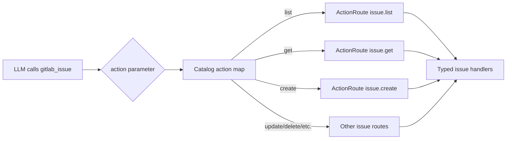

import stats from "../../../data/stats.json";
import FAQ from "../../../components/FAQ.astro";

:::tip[At a glance]

- **`GITLAB_MCP_TOOL_SURFACE=meta` groups operations into {stats.meta.base} tools on Free/CE** (40 on self-managed Premium, up to {stats.meta.gitlab_com} on GitLab.com Ultimate) that route on an `action` parameter, instead of one tool per operation.
- **No capability is lost.** Every individual operation remains reachable as an action inside a domain meta-tool.
- **Schemas are opaque by default.** Read `gitlab://tools/{id}` to get the exact call shape for one action without inflating the tool list.

:::

Meta-tools are an explicit operating mode of GitLab MCP Server, enabled with `GITLAB_MCP_TOOL_SURFACE=meta`. Instead of exposing each GitLab API operation as a separate MCP tool, meta-tools **group related operations under a single tool** with an `action` parameter that dispatches to the correct handler. The result is a small, browsable tool list — a handful of domain-level tools such as `gitlab_issue`, `gitlab_project`, and `gitlab_pipeline` — that still reaches every GitLab operation.

## Why use meta-tools?

Meta-tools exist to fit a complete GitLab API surface into a limited LLM context window. When an MCP server registers hundreds of individual tools (up to {stats.tools.gitlab_com} on GitLab.com Ultimate with Orbit), the tool descriptions alone consume a large portion of the available tokens, leaving less room for the actual conversation. Meta-tool mode collapses those operations into domain-level tools, so the tool list stays small while functionality stays complete.

Consolidating answers three costs that a long tool list carries, which is why the server groups operations by domain rather than by package ([ADR-0005](https://github.com/jmrplens/gitlab-mcp-server/blob/main/docs/development/adr/adr-0005-meta-tool-consolidation.md)):

- **Tokens.** The client sends the tool list to the model as context, so every tool's description and schema is paid for on every request.
- **Selection.** A model choosing among many similar tools picks the wrong one more often than a model choosing among a few clearly distinct domains.
- **Rendering.** Every client draws its tool palette differently, and a short, well-organized list reads better in all of them.

| Mode                | Free/CE            | Premium, self-managed | Ultimate, self-managed               | Ultimate, GitLab.com     | Token overhead |
| ------------------- | ------------------ | --------------------- | ------------------------------------ | ------------------------ | -------------- |
| Dynamic _(default)_ | {stats.dynamic}    | {stats.dynamic}       | {stats.dynamic}                      | {stats.dynamic}          | Lowest         |
| Meta                | {stats.meta.base}  | 40                    | {stats.meta.self_managed_enterprise} | {stats.meta.gitlab_com}  | Medium         |
| Individual          | {stats.tools.free} | {stats.tools.premium} | {stats.tools.ultimate_self_managed}  | {stats.tools.gitlab_com} | Highest        |

All three modes reach every action the tier allows; only the packaging differs. On GitLab.com, Premium gains Orbit as well: the `gitlab_orbit` meta-tool on this surface, or its six tools on the individual one. A token's scopes can lower these counts: without `admin_mode`, the groups that need it are left out ([Scope-based tool filtering](/gitlab-mcp-server/operations/security/#scope-based-tool-filtering)).

Meta-tools reduce the tool count by **more than 95%** while preserving 100% of the functionality. Every individual tool operation is available as an action within one of the domain meta-tools.

The {stats.meta.base} tools on Free/CE are 28 GitLab domain dispatchers, the `gitlab_server` diagnostics tool, `gitlab_discover_project` and the four `gitlab_interactive_*` creation flows. `gitlab_server` (read-only actions `status` and `health_check`) is registered on every tier and is counted in every figure above; the dynamic surface reaches the same two actions as `server.status` and `server.health_check`.

:::note[Client compatibility]
Some AI clients impose tool count limits: Windsurf allows 100 tools across all servers, and OpenAI-backed clients send at most 128 per model request ([Client limits worth knowing](/gitlab-mcp-server/compatibility/#client-limits-worth-knowing)). Meta-tool mode ({stats.meta.base} tools on Free/CE, 40 on self-managed Premium, {stats.meta.self_managed_enterprise} on self-managed Ultimate, or {stats.meta.gitlab_com} on GitLab.com Ultimate with Orbit) works within these constraints. If you select individual tools with `GITLAB_MCP_TOOL_SURFACE=individual`, clients with such limits will only see a subset of the complete individual tool set.
:::

## How do meta-tools work?

Each meta-tool defines an `action` enum that lists every operation it supports, then validates the chosen action and dispatches to the corresponding handler function internally. The `action` parameter is always required and must be one of the enumerated values; additional parameters depend on the chosen action. This is why one tool such as `gitlab_issue` can cover an entire domain without exposing a separate tool per operation.


```mermaid
flowchart LR
	A[LLM calls gitlab_issue] --> B{action parameter}
	B --> C[Catalog action map]
	C -->|list| D[ActionRoute issue.list]
	C -->|get| E[ActionRoute issue.get]
	C -->|create| F[ActionRoute issue.create]
	C -->|update/delete/etc.| G[Other issue routes]
	D --> H[Typed issue handlers]
	E --> H
	F --> H
	G --> H
```

### The `params` argument

A meta-tool takes exactly two top-level arguments, `action` and `params`. `params` is an object holding the chosen action's own arguments: the same arguments the action's tool takes on the individual surface, and the same `params` that `gitlab_execute_action` takes on the dynamic surface, so a call moves between surfaces without renaming a field. A destructive action also accepts `confirm` inside `params` ([Deleting a branch](#deleting-a-branch-with-confirmation)).

```json
{
  "action": "list",
  "params": {
    "project_id": "my-group/my-project",
    "per_page": 20
  }
}
```

Before it calls GitLab, the server checks the envelope: a call naming an action the tool does not have is refused with the list of valid actions, and one that leaves out a required parameter is refused with the names it needs, unless `params` also carries a name the schema does not list, which may be a parameter alias the action resolves. An action with no required parameters takes an empty object, `"params": {}`, or no `params` at all.

## How many actions does each meta-tool have?

Each count is what the catalog builds for that tier: the actions in the dispatcher's `action` enum, less those that declare a higher minimum tier. Read the live list for your deployment from `gitlab://tools`, because the token's scopes, read-only mode and `GITLAB_MCP_EXCLUDE_TOOLS` narrow it further. Ultimate is the same on a self-managed instance and on GitLab.com for these 29 dispatchers.

| Meta-tool               | Free/CE | Premium | Ultimate | Covers                                                                                                                                                                                                                                                                                                                                                                             |
| ----------------------- | ------: | ------: | -------: | ---------------------------------------------------------------------------------------------------------------------------------------------------------------------------------------------------------------------------------------------------------------------------------------------------------------------------------------------------------------------------------- |
| `gitlab_access`         |      48 |      48 |       48 | Project, group and personal access tokens (rotation and self-rotation included), deploy keys and deploy tokens at every scope, access requests and invitations                                                                                                                                                                                                                     |
| `gitlab_achievement`    |      12 |      12 |       12 | The achievements a group or project namespace defines and the awards made from them, read and written over GraphQL with cursor pagination                                                                                                                                                                                                                                          |
| `gitlab_admin`          |      92 |      92 |       92 | Instance administration: settings, appearance, license, broadcast messages, instance feature flags, system hooks, Sidekiq metrics, plan limits, topics, OAuth applications, custom attributes, usage data, imports from GitHub, Bitbucket and other GitLab instances, error tracking, alert metric images, secure files, Terraform states, cluster agents and the dependency proxy |
| `gitlab_branch`         |      11 |      11 |       11 | Branches, protected branches and branch rules (GraphQL)                                                                                                                                                                                                                                                                                                                            |
| `gitlab_ci_catalog`     |       2 |       2 |        2 | CI/CD Catalog resources (GraphQL)                                                                                                                                                                                                                                                                                                                                                  |
| `gitlab_ci_variable`    |      15 |      15 |       15 | CI/CD variables at project, group and instance scope                                                                                                                                                                                                                                                                                                                               |
| `gitlab_custom_emoji`   |       3 |       3 |        3 | A group's custom emoji (GraphQL)                                                                                                                                                                                                                                                                                                                                                   |
| `gitlab_environment`    |      18 |      23 |       23 | Environments, deployments with their approvals and merge requests, and deploy freeze periods; protected environments from Premium                                                                                                                                                                                                                                                  |
| `gitlab_feature_flags`  |      10 |      10 |       10 | Project feature flags and their user lists                                                                                                                                                                                                                                                                                                                                         |
| `gitlab_group`          |      75 |     153 |      158 | Groups and subgroups with their members, labels, milestones, boards, badges, uploads, export and import, sharing, transfer and service accounts; from Premium, epics, wikis, webhooks, push rules, protected branches and environments, LDAP and SAML, SSH certificates and analytics; from Ultimate, credentials and security settings                                            |
| `gitlab_issue`          |      66 |      71 |       71 | Issues with their notes, discussions, links, award emoji, resource events, statistics, time tracking, work items and saved views; iterations from Premium                                                                                                                                                                                                                          |
| `gitlab_job`            |      25 |      25 |       25 | Jobs, logs, artifacts, bridges and the CI/CD job token scope                                                                                                                                                                                                                                                                                                                       |
| `gitlab_merge_request`  |      46 |      58 |       58 | Merge requests, approvals, context commits, award emoji, resource events and time tracking; from Premium, approval rules, approval settings and dependencies                                                                                                                                                                                                                       |
| `gitlab_model_registry` |       1 |       1 |        1 | Downloading a model package file from the model registry                                                                                                                                                                                                                                                                                                                           |
| `gitlab_mr_review`      |      23 |      23 |       23 | Merge request notes, discussions, draft notes, changes and diff versions                                                                                                                                                                                                                                                                                                           |
| `gitlab_package`        |      30 |      30 |       30 | Package registry, generic package publish and download, container registry, and the protection rules of both                                                                                                                                                                                                                                                                       |
| `gitlab_pipeline`       |      33 |      33 |       33 | Pipelines, test reports, trigger tokens, resource groups and pipeline schedules                                                                                                                                                                                                                                                                                                    |
| `gitlab_project`        |     124 |     142 |      144 | Projects with their settings, forks, stars, members, labels, milestones, boards, badges, webhooks, integrations, uploads, export and import, push mirrors, Pages and service accounts; from Premium, approval rules, pull mirroring, push rules, target branch rules and the Dependency Firewall; from Ultimate, security settings                                                 |
| `gitlab_release`        |      12 |      12 |       12 | Releases and their asset links                                                                                                                                                                                                                                                                                                                                                     |
| `gitlab_repository`     |      41 |      41 |       41 | Repository tree, files, blame, commits with their discussions, statuses and signatures, compare, cherry-pick and revert, submodules, changelogs, archives and Markdown rendering                                                                                                                                                                                                   |
| `gitlab_runner`         |      19 |      19 |       34 | Runners, their registration and authentication tokens, runner managers and jobs; runner controllers from Ultimate                                                                                                                                                                                                                                                                  |
| `gitlab_search`         |      10 |      10 |       10 | Search across the instance, a group or a project                                                                                                                                                                                                                                                                                                                                   |
| `gitlab_server`         |       2 |       2 |        2 | Server diagnostics: GitLab connectivity, versions and the authenticated user                                                                                                                                                                                                                                                                                                       |
| `gitlab_snippet`        |      34 |      34 |       34 | Personal and project snippets with their notes, discussions and award emoji                                                                                                                                                                                                                                                                                                        |
| `gitlab_storage_move`   |      12 |      18 |       18 | Repository storage moves of projects and snippets; group moves from Premium                                                                                                                                                                                                                                                                                                        |
| `gitlab_tag`            |       9 |       9 |        9 | Tags, protected tags and tag signatures                                                                                                                                                                                                                                                                                                                                            |
| `gitlab_template`       |      12 |      12 |       12 | Gitignore, CI YAML, Dockerfile, license and project templates, and CI lint                                                                                                                                                                                                                                                                                                         |
| `gitlab_user`           |      76 |      76 |       76 | Users and the current user: status, SSH and GPG keys, emails, events, memberships, notification settings, namespaces, avatars, to-do items, impersonation and personal access tokens, service accounts, and user administration (block, ban, approve)                                                                                                                              |
| `gitlab_wiki`           |       6 |       6 |        6 | Project wiki pages and attachments                                                                                                                                                                                                                                                                                                                                                 |

`gitlab_admin` and `gitlab_storage_move` are listed only to a token that carries the `admin_mode` scope, or whose scopes the server could not read ([Scope-based tool filtering](/gitlab-mcp-server/operations/security/#scope-based-tool-filtering)). The other five of the {stats.meta.base} tools take their arguments directly rather than through `action` and `params`: `gitlab_discover_project` and the four `gitlab_interactive_*` flows, which the dynamic surface reaches as `discover_project.resolve`, `interactive.issue_create`, `interactive.mr_create`, `interactive.project_create` and `interactive.release_create`. The tools Premium and Ultimate add are under [Enterprise mode](#enterprise-mode).

## How do I discover action parameters?

Meta-tools use a common envelope, and the exact `params` shape for any action is discoverable through the tool manifest resources rather than inlined into every tool schema. By default, `GITLAB_MCP_META_PARAM_SCHEMA=opaque` keeps the tool schema small: clients see the valid `action` enum, while `params` remains an action-specific object.

```json
{
  "action": "create",
  "params": {
    "project_id": "42"
  }
}
```

To discover the exact shape for a specific action, read the tool manifest resources:

| Resource              | Use                                                                                          |
| --------------------- | -------------------------------------------------------------------------------------------- |
| `gitlab://tools`      | Lists visible tools and executable entries for the active surface                            |
| `gitlab://tools/{id}` | Returns the accepted call shape and JSON Schema for one action, such as `gitlab_project.get` |

Example resource reads:

```json
{
  "method": "resources/read",
  "params": {
    "uri": "gitlab://tools"
  }
}
```

```json
{
  "method": "resources/read",
  "params": {
    "uri": "gitlab://tools/gitlab_merge_request.create"
  }
}
```

The per-action detail response includes the `params` schema and the final call shape. These resources remain available for meta-tools when `GITLAB_MCP_CAPABILITY_SURFACE=minimal` is enabled, while optional GitLab data resources, prompts, and workflow guides are omitted. Dynamic deployments can still use `gitlab_find_action` for inline schemas; meta-tool deployments can keep `GITLAB_MCP_META_PARAM_SCHEMA=opaque` and read `gitlab://tools/{id}` instead of inlining schemas in `tools/list`. As measured today, the meta-tools' input schemas under `compact` are about 8x their size under `opaque`, and under `full` about 18x; re-measure with `go run ./cmd/audit_tokens --compare-schemas`. The whole `tools/list` grows less, since the descriptions do not change: on Free/CE about 1.6x under `compact` and 2.3x under `full`, by the [token footprint reference](https://github.com/jmrplens/gitlab-mcp-server/blob/main/docs/development/token-footprint.md).

### The `gitlab://tools` manifest on the meta surface

On the meta surface the manifest lists one `meta_action` entry per action of every visible dispatcher, keyed `<tool>.<action>`, and one `visible_tool` entry for each tool that takes its arguments directly (`gitlab_discover_project` and the guided creation flows). `visible_tool_count` counts every tool `tools/list` returns, `gitlab_server` included. An abridged read on Free/CE, with one visible tool and one entry shown:

```json
{
  "surface": "meta",
  "uri_template": "gitlab://tools/{id}",
  "visible_tool_count": 34,
  "entry_count": 872,
  "visible_tools": [
    {
      "name": "gitlab_merge_request",
      "title": "Merge Request",
      "detail_uri": "gitlab://tools/gitlab_merge_request",
      "read_only": false,
      "destructive": true
    }
  ],
  "entries": [
    {
      "id": "gitlab_merge_request.create",
      "kind": "meta_action",
      "tool": "gitlab_merge_request",
      "action": "create",
      "domain": "merge_request",
      "detail_uri": "gitlab://tools/gitlab_merge_request.create",
      "destructive": false,
      "read_only": false,
      "required_params": [
        { "name": "project_id", "type": "string|integer" },
        { "name": "source_branch", "type": "string" },
        { "name": "target_branch", "type": "string" },
        { "name": "title", "type": "string" }
      ]
    }
  ]
}
```

The entries also carry a `title` and a `description`. `required_params` names only the parameters the action always requires, each with its JSON type; when an action accepts one of several groups instead, they are in `required_params_any_of`. On the `full` capability surface the manifest also carries a `subscriptions` block naming the resources that accept `resources/subscribe` ([Resource subscriptions](/gitlab-mcp-server/capabilities/subscriptions/)). The detail resource answers the canonical action ID too, so `gitlab://tools/merge_request.create` returns the same detail as `gitlab://tools/gitlab_merge_request.create`.

### Inlining the schemas with `compact` or `full`

`GITLAB_MCP_META_PARAM_SCHEMA` decides how much of each action's schema reaches `tools/list`:

- **`opaque`** (default): the tool's `inputSchema` is the envelope alone, an `action` enum and an open `params` object. The exact schema of each action is read from `gitlab://tools/{id}`.
- **`full`**: the envelope gains a `oneOf` with one branch per action. Each branch fixes `action` to that action's name with `const`, requires `params`, and inlines the action's whole parameter schema, so a client that validates against `oneOf` picks the branch by `action`. Each action's parameters are closed in this mode, so a parameter alias that `opaque` and `compact` accept is refused before the action runs.
- **`compact`**: the same `oneOf`, with each action's parameters cut down to their names, types and enum values; descriptions and the parameter's own `required` list are left out.

Keep `opaque` unless your MCP client cannot read resources: the call is dispatched the same way in all three modes, and only the schema sent to the model changes, except that `full` refuses a parameter alias before the handler sees it.

## What does a meta-tool return?

A successful call returns the result twice: as Markdown in `content`, and as the action's typed output in `structuredContent`. When the output type declares a `next_steps` field, the server copies the suggestions that close the Markdown into it, so a client that reads only the JSON still gets them (Codex, for one, hands its model only `structuredContent` when a result carries it). Every surface does this, since the meta, individual and dynamic dispatchers finish a result the same way; an output type without the field carries its suggestions in the Markdown alone, and a refused or failed call carries its text and no `structuredContent`. The structured output of `gitlab_branch` with `action: "list"`, abridged to one branch:

```json
{
  "next_steps": [
    "When presenting these results, always include the clickable [text](url) links from the table so the user can navigate to GitLab",
    "Use action 'branch.get' to see one branch in full",
    "Use action 'branch.create' to create a new branch",
    "Use action 'branch.protect' to protect a branch"
  ],
  "branches": [
    {
      "name": "main",
      "merged": false,
      "protected": true,
      "default": true,
      "web_url": "https://gitlab.example.com/my-group/my-project/-/tree/main",
      "can_push": true,
      "developers_can_push": false,
      "developers_can_merge": false
    }
  ],
  "pagination": {
    "page": 1,
    "per_page": 20,
    "total_items": 23,
    "total_pages": 2,
    "next_page": 2,
    "prev_page": 0,
    "has_more": true
  }
}
```

The first suggestion opens the next steps of every list whose table links to GitLab: it asks the model to keep those clickable links when it answers. The others name actions by their canonical ID, which `gitlab://tools/{id}` resolves on any surface. [Output format](/gitlab-mcp-server/reference/output-format/) describes the whole response.

## Example usage

### Creating an issue

```json
{
  "tool": "gitlab_issue",
  "arguments": {
    "action": "create",
    "params": {
      "project_id": "my-group/my-project",
      "title": "Update API documentation",
      "description": "The REST API docs are missing the new v2 endpoints",
      "labels": ["documentation", "api"],
      "assignee_ids": [42],
      "milestone_id": 7
    }
  }
}
```

### Listing merge requests

```json
{
  "tool": "gitlab_merge_request",
  "arguments": {
    "action": "list",
    "params": {
      "project_id": "my-group/my-project",
      "state": "opened",
      "order_by": "updated_at",
      "per_page": 20
    }
  }
}
```

### Searching Code

```json
{
  "tool": "gitlab_search",
  "arguments": {
    "action": "code",
    "params": {
      "query": "func handleWebhook",
      "project_id": "my-group/my-project"
    }
  }
}
```

### Deleting a branch (with confirmation)

```json
{
  "tool": "gitlab_branch",
  "arguments": {
    "action": "delete",
    "params": {
      "project_id": "42",
      "branch_name": "feature/old-branch"
    }
  }
}
```

`delete` is a destructive action, so the server settles whether it may run before it calls GitLab, in this order:

1. **YOLO mode.** When `GITLAB_MCP_YOLO_MODE` is truthy (`1`, `true` or `yes`), the action runs without asking. `AUTOPILOT` counts the same way, but only while `GITLAB_MCP_YOLO_MODE` is unset, so `GITLAB_MCP_YOLO_MODE=false` overrides an inherited `AUTOPILOT=true`.
2. **An explicit confirmation.** `"confirm": true` inside `params` runs the action without asking.
3. **Elicitation.** When the client supports elicitation, the server asks the user `Confirm gitlab_branch/delete? This action may be irreversible.` and runs the action only if the user accepts; a declined or cancelled prompt returns an error result. On protocol 2026-07-28 the question travels as an input request the client answers by retrying the call ([Elicitation](/gitlab-mcp-server/capabilities/elicitation/)).
4. **Fail closed.** A client that cannot prompt gets an error result instead of a deletion, telling the model to re-send with `confirm` set to `true` only after the user explicitly approves.

The detail resource says where the confirmation goes: the `call` that `gitlab://tools/gitlab_branch.delete` returns carries a `confirm_location` naming the `confirm` field inside `params`, a field only destructive actions have.

### Checking Orbit availability

```json
{
  "tool": "gitlab_orbit",
  "arguments": {
    "action": "status",
    "params": {
      "response_format": "llm"
    }
  }
}
```

`gitlab_orbit` is registered only for `https://gitlab.com` connections on the Premium or Ultimate tier and exposes six read-only Knowledge Graph actions: `status`, `schema`, `tools`, `dsl`, `query`, and `graph_status`.

## Key meta-tools reference

The action lists below are a representative selection, not the full set, and some of the actions they name are served only from Premium (the group's `hook_*`, the merge request's approval rules). `gitlab://tools` lists every visible tool and executable entry for the active surface, and `gitlab://tools/{id}` returns the complete action list and JSON Schema for one of them. The counts per tier are in the [action count table](#how-many-actions-does-each-meta-tool-have).

### `gitlab_project`

Project lifecycle and configuration, plus the labels, milestones, members, badges, boards, integrations and uploads scoped to a project.

**Actions**: `list`, `get`, `create`, `update`, `delete`, `restore`, `archive`, `unarchive`, `fork`, `star`, `unstar`, `transfer`, `languages`, `list_users`, `list_forks`, `list_starrers`, `hook_list`, `hook_add`, `hook_edit`, `hook_delete`, `label_*`, `milestone_*`, `members`, `member_*`, `badge_*`, `board_*`, `upload`

### `gitlab_issue`

Full issue lifecycle, including notes, discussions, links and time tracking.

**Actions**: `list`, `list_all`, `list_group`, `get`, `create`, `update`, `delete`, `move`, `reorder`, `subscribe`, `unsubscribe`, `create_todo`, `participants`, `time_estimate_set`, `spent_time_add`, `note_*`, `discussion_*`, `link_*`

### `gitlab_merge_request`

Complete merge request workflow from creation to merge.

**Actions**: `list`, `list_global`, `list_group`, `get`, `create`, `update`, `merge`, `rebase`, `approve`, `unapprove`, `subscribe`, `unsubscribe`, `commits`, `pipelines`, `reviewers`, `participants`, `cancel_auto_merge`, `approval_*`, `time_estimate_set`, `spent_time_add`

### `gitlab_mr_review`

The merge request review surface: notes, threaded discussions, draft notes and diffs.

**Actions**: `note_list`, `note_get`, `note_create`, `note_update`, `note_delete`, `discussion_list`, `discussion_get`, `discussion_create`, `discussion_reply`, `discussion_resolve`, `draft_note_*`, `changes_get`, `raw_diffs`, `diff_versions_list`, `diff_version_get`

### `gitlab_pipeline`

Pipeline management and monitoring, plus schedules and trigger tokens.

**Actions**: `list`, `get`, `latest`, `create`, `cancel`, `retry`, `delete`, `variables`, `test_report`, `test_report_summary`, `update_metadata`, `wait`, `schedule_*`, `trigger_*`

### `gitlab_job`

CI/CD job management.

**Actions**: `list`, `list_project`, `get`, `play`, `cancel`, `retry`, `erase`, `trace`, `artifacts`, `download_artifacts`, `keep_artifacts`, `delete_artifacts`, `delete_project_artifacts`, `list_bridges`, `wait`

### `gitlab_branch`

Branch operations and protection rules.

**Actions**: `list`, `get`, `create`, `delete`, `delete_merged`, `protect`, `unprotect`, `list_protected`, `get_protected`, `update_protected`

### `gitlab_repository`

Repository trees, files, commits, diffs and history. Commits have no dispatcher of their own — commit operations are actions here.

**Actions**: `tree`, `compare`, `merge_base`, `contributors`, `blob`, `raw_blob`, `archive`, `changelog_generate`, `changelog_add`, `file_get`, `file_create`, `file_update`, `file_delete`, `file_blame`, `file_raw`, `commit_list`, `commit_get`, `commit_diff`, `commit_refs`, `commit_cherry_pick`, `commit_revert`, `commit_comments`, `commit_comment_create`, `commit_statuses`, `commit_merge_requests`

### `gitlab_tag`

Tag management and protection rules.

**Actions**: `list`, `get`, `create`, `delete`, `get_signature`, `protect`, `unprotect`, `list_protected`, `get_protected`

### `gitlab_release`

Release lifecycle management and release asset links.

**Actions**: `list`, `get`, `get_latest`, `create`, `update`, `delete`, `link_list`, `link_get`, `link_create`, `link_create_batch`, `link_update`, `link_delete`

### Labels, milestones and members

Labels, milestones and members have no dispatchers of their own. They are actions on the project and group dispatchers:

- Through `gitlab_project`: `label_list`, `label_get`, `label_create`, `label_update`, `label_delete`, `label_subscribe`, `label_unsubscribe`, `label_promote`, `milestone_list`, `milestone_get`, `milestone_create`, `milestone_update`, `milestone_delete`, `milestone_issues`, `milestone_merge_requests`, `members`, `member_get`, `member_add`, `member_edit`, `member_delete`
- Through `gitlab_group`: much the same operations with a `group_` prefix (`group_label_*`, `group_milestone_*`, `group_member_*`), with these differences: the member list is `members`, removal is `group_member_remove`, labels cannot be promoted, and the group adds `group_member_get_inherited`, `group_member_share`, `group_member_unshare` and, from Premium, `group_milestone_burndown`

### `gitlab_group`

Group and subgroup management.

**Actions**: `list`, `get`, `create`, `update`, `delete`, `restore`, `archive`, `unarchive`, `projects`, `subgroups`, `members`, `shared_with`, `invited_groups`, `transfer`, `transfer_project`, `share_with_group`, `unshare_from_group`, `hook_*`

### `gitlab_search`

Cross-resource search across your GitLab instance.

**Actions**: `code`, `issues`, `merge_requests`, `commits`, `milestones`, `notes`, `projects`, `snippets`, `users`, `wiki`

### `gitlab_user`

User information and lookup, plus the authenticated user's to-do list, which has no dispatcher of its own.

**Actions**: `current`, `get`, `list`, `create`, `modify`, `get_status`, `set_status`, `ssh_keys`, `emails`, `contribution_events`, `block`, `unblock`, `ban`, `unban`, `activate`, `deactivate`, `todo_list`, `todo_mark_done`, `todo_mark_all_done`

### `gitlab_wiki`

Wiki page management.

**Actions**: `list`, `get`, `create`, `update`, `delete`, `upload_attachment`

## Enterprise mode

The Premium and Ultimate catalogs enable {stats.meta.self_managed_enterprise - stats.meta.base} additional meta-tools that expose GitLab Premium and Ultimate features: six arrive with Premium (40 tools on a self-managed instance) and eleven more with Ultimate ({stats.meta.self_managed_enterprise} on a self-managed instance). When the tier is not set it is detected in either mode, from the instance license and then from the plans of the namespaces the token administers: once at startup on stdio, and per token+URL entry in HTTP mode. To force the catalog, set `GITLAB_MCP_TIER=premium` or `GITLAB_MCP_TIER=ultimate`, or pass `--tier=premium` (or `--tier=ultimate`) in HTTP mode. HTTP mode reads `GITLAB_MCP_TIER` from its environment as well, but only when `--tier` is not passed on the command line. Tier-gating also removes the input schema fields above the tier, while output fields still reach the client.

The six Premium meta-tools, which Ultimate keeps:

| Meta-tool                | Actions | Covers                                                    | Token scope  |
| ------------------------ | ------: | --------------------------------------------------------- | ------------ |
| `gitlab_audit_event`     |       6 | Audit events of the instance, a group or a project        | Any          |
| `gitlab_enterprise_user` |       4 | A group's enterprise users, including disabling their 2FA | `admin_mode` |
| `gitlab_geo`             |       8 | Geo sites, their status and repair                        | `admin_mode` |
| `gitlab_group_scim`      |       4 | A group's SCIM identities                                 | Any          |
| `gitlab_merge_train`     |       4 | Merge trains of a project or a target branch              | Any          |
| `gitlab_project_alias`   |       4 | Project aliases                                           | `admin_mode` |

"Any" means the group asks for no scope of its own; a write still needs a token that can write. The three groups that need `admin_mode` are left out for a token without it ([Scope-based tool filtering](/gitlab-mcp-server/operations/security/#scope-based-tool-filtering)).

The eleven Ultimate meta-tools, none of which the scope filter withholds for want of `admin_mode`. `gitlab_compliance_policy` calls an `/admin` route, though, so GitLab answers it only for an administrator:

| Meta-tool                      | Actions | Covers                                                                             |
| ------------------------------ | ------: | ---------------------------------------------------------------------------------- |
| `gitlab_attestation`           |       2 | Build attestations (SLSA provenance)                                               |
| `gitlab_compliance_policy`     |       2 | Security policy configuration settings                                             |
| `gitlab_dependency`            |       4 | The dependency list and its exports                                                |
| `gitlab_dora_metrics`          |       2 | DORA metrics of a project or a group                                               |
| `gitlab_external_status_check` |       8 | External status checks of a project and of its merge requests                      |
| `gitlab_member_role`           |       6 | Custom member roles of a group or the instance                                     |
| `gitlab_security_attribute`    |       5 | Security attributes and their assignment to projects (GraphQL)                     |
| `gitlab_security_category`     |       3 | Security categories (GraphQL)                                                      |
| `gitlab_security_finding`      |       1 | A pipeline's security findings (GraphQL)                                           |
| `gitlab_security_scan_profile` |       3 | Attaching and detaching security scan profiles, and a project's statuses (GraphQL) |
| `gitlab_vulnerability`         |       8 | Vulnerabilities, their state and a pipeline's security summary (GraphQL)           |

On GitLab.com, `gitlab_orbit` joins them on Premium and Ultimate, with six read-only actions ([Orbit](/gitlab-mcp-server/tools/orbit/)).

Premium and Ultimate also add actions to seven of the base dispatchers:

- **`gitlab_project`**: approval configuration and rules, pull mirroring (push mirrors are served on every tier, Free included), push rules, target branch rules and the Dependency Firewall evaluation from Premium; security settings from Ultimate
- **`gitlab_group`**: epics with their notes, discussions, issues, label events and boards, group wikis, webhooks, push rules, protected branches and environments, LDAP and SAML links, SSH certificates, analytics, billable members, provisioned users, the milestone burndown, and creating and deleting group boards from Premium; credentials and security settings from Ultimate
- **`gitlab_issue`**: iterations, and iteration and weight events, from Premium
- **`gitlab_merge_request`**: approval state and rules, approval settings and merge request dependencies from Premium
- **`gitlab_environment`**: protected environments from Premium
- **`gitlab_storage_move`**: group storage moves from Premium
- **`gitlab_runner`**: runner controllers with their scopes and tokens from Ultimate

:::tip
The startup log says how many tools your server registered (`registered meta-tools` with a `tools` count); the `tools/list` MCP method says which.
:::

## Configuration

| Variable                        | Default         | Description                                                                                                                                                                        |
| ------------------------------- | --------------- | ---------------------------------------------------------------------------------------------------------------------------------------------------------------------------------- |
| `GITLAB_MCP_TOOL_SURFACE`       | `dynamic`       | Canonical selector: set `meta` to use meta-tools. Set `individual` only when you intentionally want one MCP tool per GitLab operation; unset, the default dynamic surface is used. |
| `GITLAB_MCP_CAPABILITY_SURFACE` | `full`          | Resource and prompt catalog selector: `full` or `minimal`. Minimal keeps the `gitlab://tools` manifest, and omits optional resources, guides, and prompts.                         |
| `GITLAB_MCP_META_PARAM_SCHEMA`  | `opaque`        | Controls how much per-action `params` schema is inlined in `tools/list`: `opaque`, `compact`, or `full`. Exact action schemas are available through `gitlab://tools/{id}`.         |
| `GITLAB_MCP_TIER`               | _(auto-detect)_ | Edition selector: `free`/`ce`, `premium`, or `ultimate`. When unset, the tier is detected from `GET /license`, then from the token's namespace plans (fallback `free`).            |
| `--tier`                        | _(auto-detect)_ | HTTP-mode edition flag: `free`/`ce`, `premium`, or `ultimate`. When it is not passed, `GITLAB_MCP_TIER` from the environment is used instead.                                      |

The boolean `META_TOOLS` selector that `GITLAB_MCP_TOOL_SURFACE` replaced was removed in 3.0.0. Nothing reads it any more and nothing warns about it, so a configuration that still sets it is served the default dynamic surface: replace it with `GITLAB_MCP_TOOL_SURFACE=meta`.

## Discovery metadata

Each meta-tool action carries discovery metadata (aliases, usage, parameter guidance, related actions) that helps models choose the correct action and shape parameters.

<FAQ />

## Source reference

:::note[Developer Documentation]
For the complete technical reference, see [`docs/concepts/meta-tools.md`](https://github.com/jmrplens/gitlab-mcp-server/blob/main/docs/concepts/meta-tools.md) in the repository.
:::
