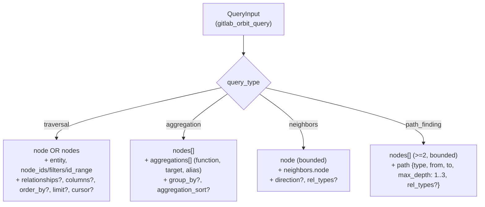
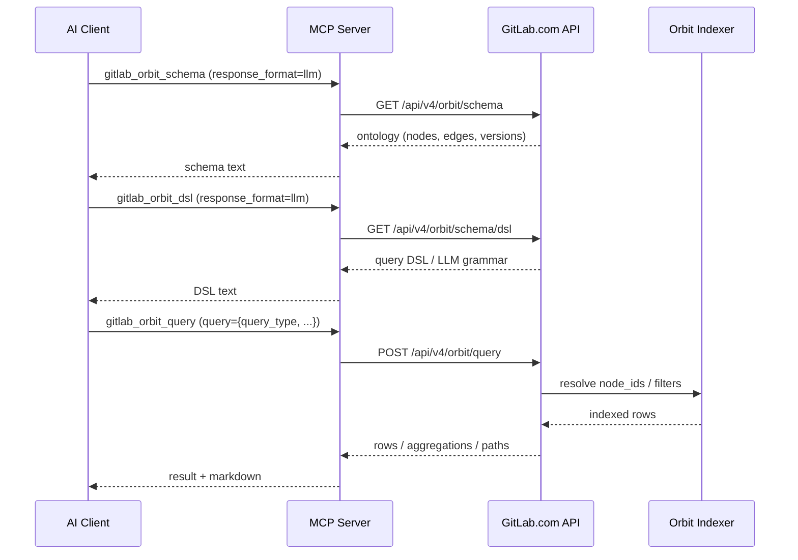

import FAQ from "../../../components/FAQ.astro";

Orbit exposes GitLab.com's experimental Knowledge Graph API through **six read-only MCP tools** — `status`, `schema`, `tools`, `dsl`, `query`, and `graph_status`. It is available **only** when the server connects to `https://gitlab.com` and the Enterprise/Premium catalog is enabled with Ultimate (`GITLAB_TIER=ultimate`, or `--tier=ultimate` in HTTP mode). The legacy `GITLAB_ENTERPRISE=true` environment variable still works in stdio mode as a fallback but is deprecated; HTTP mode reads `--tier` only. Orbit never writes: every tool inspects health, schema, or indexed data, or runs a read-only graph query.

:::note[Technical reference]
For the complete generated tool reference, see [`docs/tools/orbit.md`](https://github.com/jmrplens/gitlab-mcp-server/blob/main/docs/reference/tools/orbit.md) in the repository.
:::

## When is Orbit available?

Orbit registers only on GitLab.com Ultimate connections. It requires the `https://gitlab.com` host **and** the Enterprise/Premium catalog enabled with Ultimate. On the default dynamic surface its six actions are the `orbit.*` catalog entries reached through `gitlab_find_action` and `gitlab_execute_action`; with `TOOL_SURFACE=meta` it is the single `gitlab_orbit` tool with six actions; with `TOOL_SURFACE=individual` it is six `gitlab_orbit_*` tools. Every Orbit tool is read-only.

| Requirement               | Value                                         |
| ------------------------- | --------------------------------------------- |
| GitLab host               | `https://gitlab.com`                          |
| Catalog                   | Enterprise/Premium                            |
| Dynamic surface (default) | `orbit.*` actions via `gitlab_execute_action` |
| Meta-tool mode            | `gitlab_orbit` with six actions               |
| Individual mode           | Six `gitlab_orbit_*` tools                    |
| Write behavior            | Read-only                                     |

Self-managed GitLab instances do not register Orbit tools, even when the Enterprise/Premium catalog is enabled.

## Actions

| Action         | Canonical ID         | Individual tool             | Purpose                                                           |
| -------------- | -------------------- | --------------------------- | ----------------------------------------------------------------- |
| `status`       | `orbit.status`       | `gitlab_orbit_status`       | Check Orbit service health and component status                   |
| `schema`       | `orbit.schema`       | `gitlab_orbit_schema`       | Inspect the graph ontology and optionally expand node definitions |
| `tools`        | `orbit.tools`        | `gitlab_orbit_tools`        | Discover the live Orbit query manifest                            |
| `dsl`          | `orbit.dsl`          | `gitlab_orbit_dsl`          | Retrieve the Orbit query DSL schema or LLM grammar                |
| `query`        | `orbit.query`        | `gitlab_orbit_query`        | Execute a read-only Knowledge Graph query object                  |
| `graph_status` | `orbit.graph_status` | `gitlab_orbit_graph_status` | Inspect indexing status for a namespace, project, or full path    |

The action name is what the `gitlab_orbit` meta-tool takes in `action`; the canonical ID is what `gitlab_execute_action` takes on the default dynamic surface.

## What is the typical flow?

The typical Orbit flow discovers the live schema first, then runs a typed query — never the other way around, because the ontology and DSL served by GitLab.com can change. Confirm the service is up with `status`, inspect the graph with `schema`, fetch the live query manifest with `tools`, optionally retrieve the DSL grammar with `dsl`, then submit a query object to `query`.

1. Run the `status` action (`gitlab_execute_action` with `action: "orbit.status"` on the default surface; `gitlab_orbit` with `action: "status"` when `TOOL_SURFACE=meta`) to confirm the service is available.
2. Run `schema` to inspect graph domains, nodes, and relationships.
3. Run `tools` before `query` to obtain the live query schema served by GitLab.com.
4. (Optional) Run `dsl` to retrieve the Orbit query DSL schema or LLM grammar.
5. Pass a JSON query object to `query` with `response_format` set to `raw` or `llm`.

### Query DSL variants

The `query` parameter on the `query` action is a JSON object whose `query_type` selects one of four variants. The diagram below summarizes the smallest accepted shape for each variant. A Mermaid `graph TD` is the right tool because the four variants share a single `query_type` discriminator and only diverge on the sibling keys — a tree makes the discriminants and required fields legible at a glance.



### Discover → query workflow

The recommended pattern is to discover the live schema first (`schema`, then optionally `dsl`), then execute a typed query through `query`. A `sequenceDiagram` is the right tool because the steps involve four distinct actors (AI client, MCP server, GitLab.com, the Orbit indexer) and the response boundaries matter — the LLM should not assume the schema returned by `dsl` is stable.



The examples below use the default dynamic surface; with `TOOL_SURFACE=meta` call `gitlab_orbit` instead of `gitlab_execute_action` and drop the `orbit.` prefix from `action`.

### Example: Check Orbit status

```json
{
  "tool": "gitlab_execute_action",
  "arguments": {
    "action": "orbit.status",
    "params": {}
  }
}
```

### Example: Get graph schema

```json
{
  "tool": "gitlab_execute_action",
  "arguments": {
    "action": "orbit.schema",
    "params": {
      "expand": ["Project", "User"],
      "response_format": "llm"
    }
  }
}
```

### Example: Get Orbit tool manifest

```json
{
  "tool": "gitlab_execute_action",
  "arguments": {
    "action": "orbit.tools",
    "params": {}
  }
}
```

### Example: Get Orbit query DSL

```json
{
  "tool": "gitlab_execute_action",
  "arguments": {
    "action": "orbit.dsl",
    "params": {
      "response_format": "llm"
    }
  }
}
```

### Example: Run a Knowledge Graph query

```json
{
  "tool": "gitlab_execute_action",
  "arguments": {
    "action": "orbit.query",
    "params": {
      "query": {
        "query_type": "traversal",
        "node": {
          "id": "p",
          "entity": "Project",
          "filters": {
            "full_path": { "op": "starts_with", "value": "gitlab-org/" }
          },
          "columns": ["id", "full_path"]
        }
      },
      "response_format": "llm"
    }
  }
}
```

### Example: Check indexing status

```json
{
  "tool": "gitlab_execute_action",
  "arguments": {
    "action": "orbit.graph_status",
    "params": {
      "project_id": 278964,
      "response_format": "llm"
    }
  }
}
```

## Action details

### `status` — Check Orbit service health

Returns cluster health and backend component status. Use to verify Orbit is available for your token and project.

**Example:** See above.

### `schema` — Inspect the graph ontology

Returns the Orbit graph ontology, including schema version, domains, node summaries, and edges. Use `expand` to get detailed node definitions. Supports `response_format` (`raw` or `llm`).

**Example:** See above.

### `tools` — Discover the Orbit tool manifest

Returns the live Orbit MCP tool manifest. Use before `query` to discover supported query shapes and parameter schemas.

**Example:** See above.

### `dsl` — Retrieve the Orbit query DSL schema or LLM grammar

Returns the Orbit query DSL as a JSON Schema (`raw`) or LLM grammar (`llm`). Useful for advanced query construction and LLM integration.

**Example:** See above.

### `query` — Execute a Knowledge Graph query

Runs a read-only Knowledge Graph query. The `query` parameter must match the schema from `tools`. Supports `response_format` (`raw` or `llm`).

**Example:** See above.

### `graph_status` — Inspect indexing status

Returns graph indexing status for a namespace, project, or full path. Use to check if a project is indexed and ready for queries.

**Example:** See above.

## How do I discover query schemas?

On every surface, action parameter schemas are available through MCP resources, so you can learn the exact `params` shape of each Orbit action without expanding every schema in `tools/list`; on the dynamic surface `gitlab_find_action` returns the same schema inline. These resources remain available with `CAPABILITY_SURFACE=full` or `minimal`, regardless of `META_PARAM_SCHEMA` mode. The table lists the default-surface IDs; with `TOOL_SURFACE=meta` the entry is `gitlab://tools/gitlab_orbit.<action>`.

| Resource                            | Purpose                                 |
| ----------------------------------- | --------------------------------------- |
| `gitlab://tools/orbit.status`       | Parameters for service health checks    |
| `gitlab://tools/orbit.schema`       | Parameters for ontology inspection      |
| `gitlab://tools/orbit.tools`        | Parameters for query manifest discovery |
| `gitlab://tools/orbit.dsl`          | Parameters for DSL schema/grammar       |
| `gitlab://tools/orbit.query`        | Parameters for Knowledge Graph queries  |
| `gitlab://tools/orbit.graph_status` | Parameters for indexing status checks   |

## How do I run the live tests?

Orbit ships with a build-tag-gated live test suite at `test/e2e/orbit/live_test.go` that exercises each handler against the real `https://gitlab.com/api/v4/orbit/*` endpoints. The suite has four entry points and 41 subtests covering all six handlers, the canonical Query DSL shapes, fixture-based smoke tests, and the full DSL feature surface. The orchestrator `make test-e2e-gitlab-com` provisions `kg-fixtures` and `security-fixtures` projects in your namespace (idempotent), waits for the Orbit indexer to catch up, then runs the tests:

```bash
# Add a Personal Access Token (api scope) to .env first
echo 'GITLAB_COM_TOKEN=glpat-...' >> .env

# Default namespace is plens1; override with ORBIT_FIXTURES_NAMESPACE
make test-e2e-gitlab-com ORBIT_FIXTURES_NAMESPACE=acme-research

# When fixtures are already provisioned, run only the tests
GITLAB_COM_TOKEN=glpat-... \
  go test -tags orbitlive -count=1 -v -timeout 300s ./test/e2e/orbit/
```

See [Orbit live test fixtures](https://github.com/jmrplens/gitlab-mcp-server/blob/main/docs/development/orbit-fixtures.md) for the fixture layout, the `scripts/setup-orbit-fixtures.sh` reproducer, and the indexer caveat (transient `error` state is normal and the tests are informational, not strict equality).

<FAQ />
