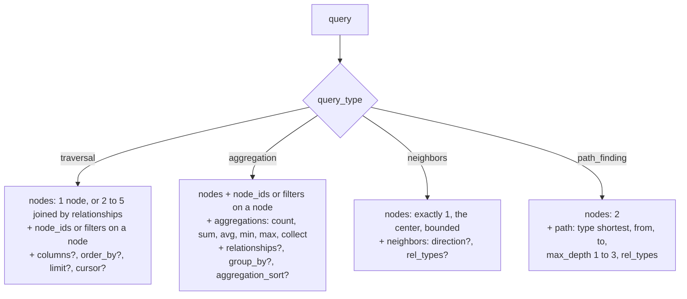
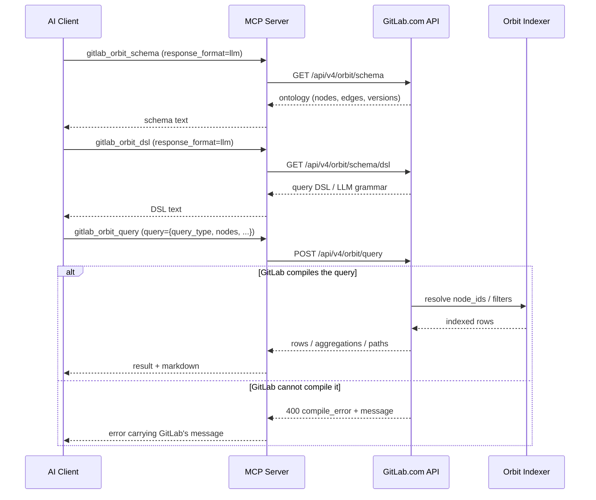

import FAQ from "../../../components/FAQ.astro";

Orbit exposes GitLab.com's experimental Knowledge Graph API through **six read-only MCP tools**: `status`, `schema`, `tools`, `dsl`, `query`, and `graph_status`. It is available **only** when the server connects to `https://gitlab.com` and the resolved tier is Premium or Ultimate (`GITLAB_MCP_TIER=premium` or `GITLAB_MCP_TIER=ultimate`, `--tier=premium` or `--tier=ultimate` in HTTP mode, or the tier detected from the instance license, then the namespace plans, then the top-level groups the token is a member of). The `GITLAB_ENTERPRISE` environment variable was removed in 3.0.0 and is ignored. Orbit never writes: every tool inspects health, schema, or indexed data, or runs a read-only graph query.

:::note[Technical reference]
For every action with its parameters, see the [Orbit knowledge graph](/gitlab-mcp-server/reference/tools/orbit/) page of the tool reference.
:::

## When is Orbit available?

Orbit registers only on GitLab.com connections with a Premium or Ultimate tier. It requires the `https://gitlab.com` host **and** a resolved tier of Premium or Ultimate. On the default dynamic surface its six actions are the `orbit.*` catalog entries reached through `gitlab_find_action` and `gitlab_execute_action`; with `GITLAB_MCP_TOOL_SURFACE=meta` it is the single `gitlab_orbit` tool with six actions; with `GITLAB_MCP_TOOL_SURFACE=individual` it is six `gitlab_orbit_*` tools. Every Orbit tool is read-only.

| Requirement               | Value                                         |
| ------------------------- | --------------------------------------------- |
| GitLab host               | `https://gitlab.com`                          |
| Tier                      | Premium or Ultimate                           |
| Dynamic surface (default) | `orbit.*` actions via `gitlab_execute_action` |
| Meta-tool mode            | `gitlab_orbit` with six actions               |
| Individual mode           | Six `gitlab_orbit_*` tools                    |
| Write behavior            | Read-only                                     |

Self-managed GitLab instances do not register Orbit tools, even on a Premium or Ultimate tier.

## Actions

| Action         | Canonical ID         | Individual tool             | Purpose                                                           |
| -------------- | -------------------- | --------------------------- | ----------------------------------------------------------------- |
| `status`       | `orbit.status`       | `gitlab_orbit_status`       | Check Orbit service health and component status                   |
| `schema`       | `orbit.schema`       | `gitlab_orbit_schema`       | Inspect the graph ontology and optionally expand node definitions |
| `tools`        | `orbit.tools`        | `gitlab_orbit_tools`        | List the MCP tool manifest Orbit serves                           |
| `dsl`          | `orbit.dsl`          | `gitlab_orbit_dsl`          | Retrieve the Orbit query DSL schema or LLM grammar                |
| `query`        | `orbit.query`        | `gitlab_orbit_query`        | Execute a read-only Knowledge Graph query object                  |
| `graph_status` | `orbit.graph_status` | `gitlab_orbit_graph_status` | Inspect indexing status for a namespace, project, or full path    |

The action name is what the `gitlab_orbit` meta-tool takes in `action`; the canonical ID is what `gitlab_execute_action` takes on the default dynamic surface.

## What is the typical flow?

The typical Orbit flow learns the query language and the graph first and queries second, because the DSL and the ontology GitLab.com serves change during the beta. Confirm the service is up with `status`, read the query language with `dsl` and the graph with `schema`, then submit a query object to `query`.

1. Run the `status` action (`gitlab_execute_action` with `action: "orbit.status"` on the default surface; `gitlab_orbit` with `action: "status"` when `GITLAB_MCP_TOOL_SURFACE=meta`) to confirm the service is available.
2. Run `dsl` for the query language, as a JSON Schema (`raw`) or a compact grammar (`llm`).
3. Run `schema` for the entities, their properties and the relationship types between them.
4. (Optional) Run `tools` for the MCP tool manifest Orbit serves, with the parameter schema of each of its own tools.
5. Pass a JSON query object to `query` with `response_format` set to `raw` or `llm`.

### Query DSL variants

The `query` parameter on the `query` action is a query in version 12 of the Orbit query DSL (`graph_query/v12`, the schema `dsl` returns). Every query carries a `query_type` and a `nodes` list, even a query with one node, and the `query_type` decides what else it needs. The diagram summarizes the smallest shape GitLab.com runs for each type. A Mermaid `graph TD` fits because the four types share one discriminator and differ only in the keys beside it.


```mermaid
graph TD
    Q["query"] --> QT{"query_type"}
    QT -->|"traversal"| TR["nodes: 1 node, or 2 to 5 joined by relationships<br/>+ node_ids or filters on a node<br/>+ columns?, order_by?, limit?, cursor?"]
    QT -->|"aggregation"| AG["nodes + node_ids or filters on a node<br/>+ aggregations: count, sum, avg, min, max, collect<br/>+ relationships?, group_by?, aggregation_sort?"]
    QT -->|"neighbors"| NB["nodes: exactly 1, the center, bounded<br/>+ neighbors: direction?, rel_types?"]
    QT -->|"path_finding"| PF["nodes: 2<br/>+ path: type shortest, from, to,<br/>max_depth 1 to 3, rel_types"]
```

The rules a model most often gets wrong. The first three refuse an older shape of the DSL, which this server also taught before it moved to version 12, and the aggregation keyed by its function is new in version 12:

- **No top-level `node`.** The node selectors go in `nodes`, which GitLab requires, and a top-level `node` is refused.
- **A filter is a bare value or an object keyed by operators.** `{"full_path": "gitlab-org/gitlab"}` matches one value, and `{"full_path": {"starts_with": "gitlab-org/"}}` or `{"star_count": {"gte": 1, "lt": 9}}` apply operators. The operators are `eq`, `ne`, `gt`, `lt`, `gte`, `lte`, `in`, `contains`, `starts_with`, `ends_with`, `is_null`, `is_not_null`, `token_match`, `all_tokens` and `any_tokens`. An `{"op": ..., "value": ...}` object is refused.
- **A neighbors query names no node inside `neighbors`.** Its center is its one node, and `neighbors` holds only `direction` and `rel_types`. The direction defaults to `outgoing`, so a query wanting every relationship of the center passes `"both"`: a project's group, creator and labels are reached by incoming relationships.
- **A path query names its relationship types.** `rel_types` is required, `["*"]` for any type, each relationship is followed only in its defined direction, and `shortest` is the only path type.
- **Aggregations, grouping and ordering are compact.** An aggregation is keyed by its function, `{"count": "mr", "as": "mr_count"}`. A `group_by` entry is a node id, or a node id and a property joined by a dot. `order_by` and `aggregation_sort` are strings, with a leading `-` for descending.
- **A traversal or aggregation is bounded.** At least one node carries `node_ids` or `filters`, and a neighbors query bounds its center the same way. GitLab refuses an unbounded query rather than scan every edge.

### When GitLab refuses a query

The server checks only that a query was given and that it encodes as JSON; GitLab judges the rest. A query it cannot compile is answered with `400` and a message naming the fault, which reaches the model in the error text with a suggestion to correct the query from `dsl` and `schema`:

```text
orbit_query: bad request: check your input parameters ({code: compile_error}, {message: schema violation: "nodes" is a required property at ; Additional properties are not allowed ('node' was unexpected) at }). Suggestion: correct the query where GitLab's message points. orbit.dsl serves the query language and orbit.schema the entities, properties and relationship types it accepts: POST https://gitlab.com/api/v4/orbit/query: 400 ...
```

A name GitLab does not know is answered with every name it does know, such as the full list of relationship types for a misspelled `IN_PROJECT`, so the correction is usually in the message itself.

### Discover → query workflow

The recommended pattern is to read the graph with `schema` and the query language with `dsl` first, then execute a query through `query`. A `sequenceDiagram` fits because the steps involve four distinct actors (AI client, MCP server, GitLab.com, the Orbit indexer) and the response boundaries matter: the LLM should not assume the DSL returned by `dsl` is stable, and a query GitLab cannot compile comes back with GitLab's own account of why.


```mermaid
sequenceDiagram
    participant LLM as AI Client
    participant MCP as MCP Server
    participant GL as GitLab.com API
    participant IDX as Orbit Indexer

    LLM->>MCP: gitlab_orbit_schema (response_format=llm)
    MCP->>GL: GET /api/v4/orbit/schema
    GL-->>MCP: ontology (nodes, edges, versions)
    MCP-->>LLM: schema text

    LLM->>MCP: gitlab_orbit_dsl (response_format=llm)
    MCP->>GL: GET /api/v4/orbit/schema/dsl
    GL-->>MCP: query DSL / LLM grammar
    MCP-->>LLM: DSL text

    LLM->>MCP: gitlab_orbit_query (query={query_type, nodes, ...})
    MCP->>GL: POST /api/v4/orbit/query
    alt GitLab compiles the query
        GL->>IDX: resolve node_ids / filters
        IDX-->>GL: indexed rows
        GL-->>MCP: rows / aggregations / paths
        MCP-->>LLM: result + markdown
    else GitLab cannot compile it
        GL-->>MCP: 400 compile_error + message
        MCP-->>LLM: error carrying GitLab's message
    end
```

The examples below use the default dynamic surface; with `GITLAB_MCP_TOOL_SURFACE=meta` call `gitlab_orbit` instead of `gitlab_execute_action` and drop the `orbit.` prefix from `action`.

### Example: Check Orbit status

```json
{
  "tool": "gitlab_execute_action",
  "arguments": {
    "action": "orbit.status",
    "params": {}
  }
}
```

### Example: Get graph schema

```json
{
  "tool": "gitlab_execute_action",
  "arguments": {
    "action": "orbit.schema",
    "params": {
      "expand": ["Project", "User"],
      "response_format": "llm"
    }
  }
}
```

### Example: Get Orbit tool manifest

```json
{
  "tool": "gitlab_execute_action",
  "arguments": {
    "action": "orbit.tools",
    "params": {}
  }
}
```

### Example: Get Orbit query DSL

```json
{
  "tool": "gitlab_execute_action",
  "arguments": {
    "action": "orbit.dsl",
    "params": {
      "response_format": "llm"
    }
  }
}
```

### Example: Run a Knowledge Graph query

```json
{
  "tool": "gitlab_execute_action",
  "arguments": {
    "action": "orbit.query",
    "params": {
      "query": {
        "query_type": "traversal",
        "nodes": [
          {
            "id": "p",
            "entity": "Project",
            "filters": {
              "full_path": { "starts_with": "gitlab-org/" }
            },
            "columns": ["id", "full_path"]
          }
        ],
        "limit": 20
      },
      "response_format": "llm"
    }
  }
}
```

### Example: Count merge requests per project

```json
{
  "tool": "gitlab_execute_action",
  "arguments": {
    "action": "orbit.query",
    "params": {
      "query": {
        "query_type": "aggregation",
        "nodes": [
          {
            "id": "p",
            "entity": "Project",
            "filters": { "full_path": { "starts_with": "gitlab-org/" } }
          },
          { "id": "mr", "entity": "MergeRequest" }
        ],
        "relationships": [{ "type": "IN_PROJECT", "from": "mr", "to": "p" }],
        "group_by": ["p"],
        "aggregations": [{ "count": "mr", "as": "mr_count" }],
        "aggregation_sort": "-mr_count"
      }
    }
  }
}
```

### Example: Everything a project is related to

```json
{
  "tool": "gitlab_execute_action",
  "arguments": {
    "action": "orbit.query",
    "params": {
      "query": {
        "query_type": "neighbors",
        "nodes": [
          {
            "id": "p",
            "entity": "Project",
            "filters": { "full_path": "gitlab-org/gitlab" }
          }
        ],
        "neighbors": { "direction": "both" },
        "limit": 50
      }
    }
  }
}
```

### Example: A path from a user to a project

```json
{
  "tool": "gitlab_execute_action",
  "arguments": {
    "action": "orbit.query",
    "params": {
      "query": {
        "query_type": "path_finding",
        "nodes": [
          { "id": "u", "entity": "User", "node_ids": [1] },
          { "id": "p", "entity": "Project", "node_ids": [278964] }
        ],
        "path": {
          "type": "shortest",
          "from": "u",
          "to": "p",
          "max_depth": 3,
          "rel_types": ["*"]
        }
      }
    }
  }
}
```

### Example: Check indexing status

```json
{
  "tool": "gitlab_execute_action",
  "arguments": {
    "action": "orbit.graph_status",
    "params": {
      "project_id": 278964,
      "response_format": "llm"
    }
  }
}
```

## Action details

### `status` — Check Orbit service health

Returns cluster health and backend component status. Use to verify Orbit is available for your token and project.

**Example:** See above.

### `schema` — Inspect the graph ontology

Returns the Orbit graph ontology, including schema version, domains, node summaries, and edges. Use `expand` to get detailed node definitions. Supports `response_format` (`raw` or `llm`).

**Example:** See above.

### `tools` — Discover the Orbit tool manifest

Returns the MCP tool manifest Orbit serves, with the parameter schema of each of its own tools. The query language itself is what `dsl` returns.

**Example:** See above.

### `dsl` — Retrieve the Orbit query DSL schema or LLM grammar

Returns the Orbit query DSL as a JSON Schema (`raw`) or LLM grammar (`llm`). Useful for advanced query construction and LLM integration.

**Example:** See above.

### `query` — Execute a Knowledge Graph query

Runs a read-only Knowledge Graph query. The `query` parameter is a query in the DSL `dsl` returns, version 12 today, naming entities, properties and relationship types `schema` lists. GitLab judges the query and answers one it cannot run with a message naming the fault, which the server passes on. Supports `response_format` (`raw` or `llm`).

**Example:** See above.

### `graph_status` — Inspect indexing status

Returns graph indexing status for a namespace, project, or full path. Use to check if a project is indexed and ready for queries.

**Example:** See above.

## How do I discover query schemas?

On every surface, action parameter schemas are available through MCP resources, so you can learn the exact `params` shape of each Orbit action without expanding every schema in `tools/list`; on the dynamic surface `gitlab_find_action` returns the same schema inline. These resources remain available with `GITLAB_MCP_CAPABILITY_SURFACE=full` or `minimal`, regardless of `GITLAB_MCP_META_PARAM_SCHEMA` mode. The table lists the default-surface IDs; with `GITLAB_MCP_TOOL_SURFACE=meta` the entry is `gitlab://tools/gitlab_orbit.<action>`.

| Resource                            | Purpose                                |
| ----------------------------------- | -------------------------------------- |
| `gitlab://tools/orbit.status`       | Parameters for service health checks   |
| `gitlab://tools/orbit.schema`       | Parameters for ontology inspection     |
| `gitlab://tools/orbit.tools`        | Parameters for tool manifest discovery |
| `gitlab://tools/orbit.dsl`          | Parameters for DSL schema/grammar      |
| `gitlab://tools/orbit.query`        | Parameters for Knowledge Graph queries |
| `gitlab://tools/orbit.graph_status` | Parameters for indexing status checks  |

<FAQ />
